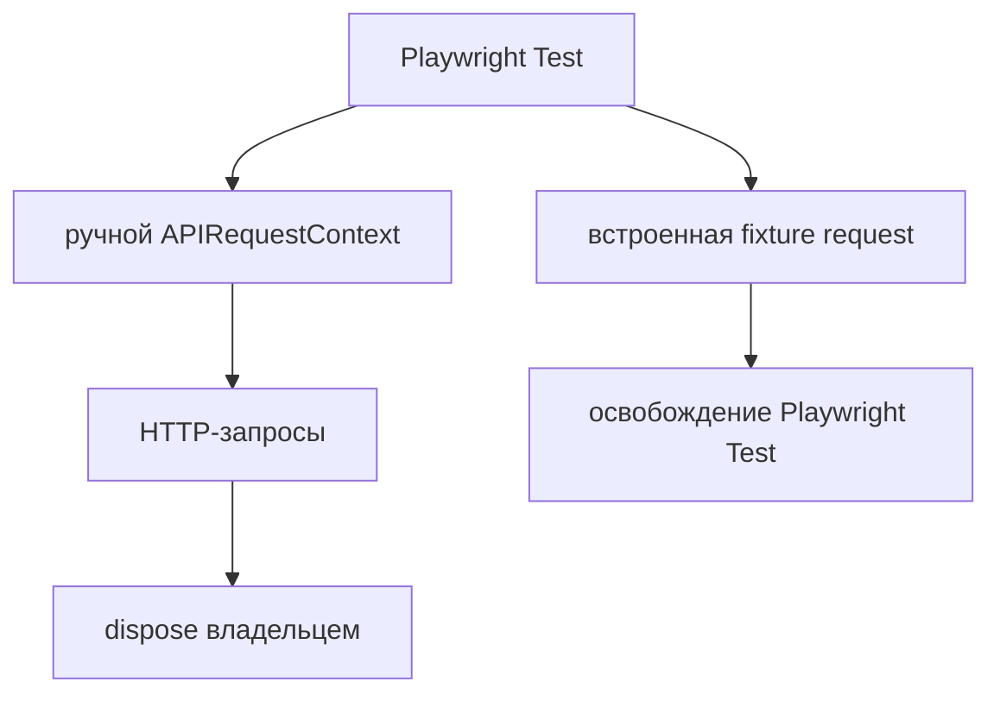

# APIRequestContext

## Связь с предыдущей главой

Главы 186–188 сформировали протокольную модель запроса и ответа. Теперь нужен клиент, который выполняет такие запросы в Playwright Test.

## Цель главы

Освоить встроенную fixture `request` и вручную созданный APIRequestContext, не смешивая их владельцев и состояние.

## Главный вопрос

Как выполнять независимые HTTP-запросы средствами Playwright Test?

## Мотивация

Использование одного HTTP-клиента с неявным глобальным состоянием связывает тесты cookies, заголовками и временем жизни. Playwright предоставляет управляемую fixture `request` и возможность создать отдельный контекст с явными настройками.

## Теория

Встроенная fixture `request` является APIRequestContext, которым владеет Playwright Test. Тест использует его, но не вызывает `dispose()` вручную. Он подходит для независимых HTTP-запросов и не требует Page.

`playwright.request.newContext()` создаёт новый APIRequestContext вручную. Создатель задаёт `baseURL`, общие заголовки или состояние хранилища и обязан вызвать `dispose()`.

Cookies принадлежат APIRequestContext. Новый контекст не очищает серверные ресурсы: он изолирует состояние HTTP-клиента, а не серверные данные.



## Внутренний механизм

`baseURL` разрешает относительные пути. `extraHTTPHeaders` добавляет общие заголовки к запросам контекста. Отдельные вызовы могут передавать собственные параметры. Ответ возвращается как APIResponse и не становится проверкой автоматически. По умолчанию 4xx и 5xx не выбрасывают ошибку; опция `failOnStatusCode` меняет это поведение, поэтому в негативных тестах её используют осознанно.

```text
examples/03-automation-qa/chapter-189/01-api-request-context.api.ts
```

Пример создаёт APIRequestContext с динамическим локальным `baseURL` и общим тестовым заголовком, выполняет запрос и освобождает контекст в `finally`.

Внешний `finally` закрывает сервер, даже если создание контекста завершится ошибкой. Внутренний `finally` появляется только после успешного создания контекста и отвечает за его `dispose()`.

## Главная ментальная модель

APIRequestContext — сессия HTTP-клиента со своими настройками и cookies; владелец создания определяет владельца освобождения.

## Практические примеры

```ts
const context = await requestFactory.newContext({
  baseURL,
  extraHTTPHeaders: { "x-test-role": "auditor" },
});

try {
  const response = await context.get("/health");
  expect(response.status()).toBe(200);
} finally {
  await context.dispose();
}
```

## Automation QA

Встроенная fixture удобна для обычных тестов. Отдельный контекст полезен, когда сценарию нужны изолированные cookies или собственная конфигурация клиента. Создавать его в каждом тесте без причины означает усложнять жизненный цикл.

## Концептуальные границы и компромиссы

APIRequestContext не является API Client бизнес-домена. Он знает транспорт, но не объясняет, что означает операция для тестируемой системы. Эту границу введёт следующая глава.

## Распространённые ошибки

- Вызывать `dispose()` для встроенной fixture `request`.
- Не освобождать вручную созданный контекст.
- Считать новый контекст очисткой серверных данных.
- Создавать один глобальный контекст для всех тестов.
- Хранить секретный заголовок в исходном коде.
- Ожидать, что 4xx сам завершит тест неуспешной проверкой.

## Краткие итоги

- Fixture `request` управляется Playwright Test.
- Ручной APIRequestContext принадлежит создавшему коду.
- `baseURL` и общие заголовки принадлежат контексту.
- Cookies клиента не равны серверным данным.
- APIResponse нужно проверять явно.

## Что нужно запомнить

- Не закрывайте fixture, которой владеет Playwright Test.
- Всегда освобождайте вручную созданный контекст.
- Клиентская изоляция не сбрасывает серверные данные.
- Относительные пути разрешаются через baseURL.
- Транспортный контекст ещё не является бизнес-абстракцией.

## Быстрая проверка

1. Кто владеет встроенной fixture `request`?
2. Когда нужен `newContext()`?
3. Кто вызывает `dispose()`?
4. Что изолируют cookies контекста?
5. Почему новый контекст не очищает серверные данные?

## Практика

```text
practice/03-automation-qa/189-api-request-context.md
```

## Переход к следующей главе

APIRequestContext выполняет HTTP-вызовы, но оставляет маршруты и тела данных в тесте. Глава 190 введёт API Client как границу деталей HTTP-транспорта.
