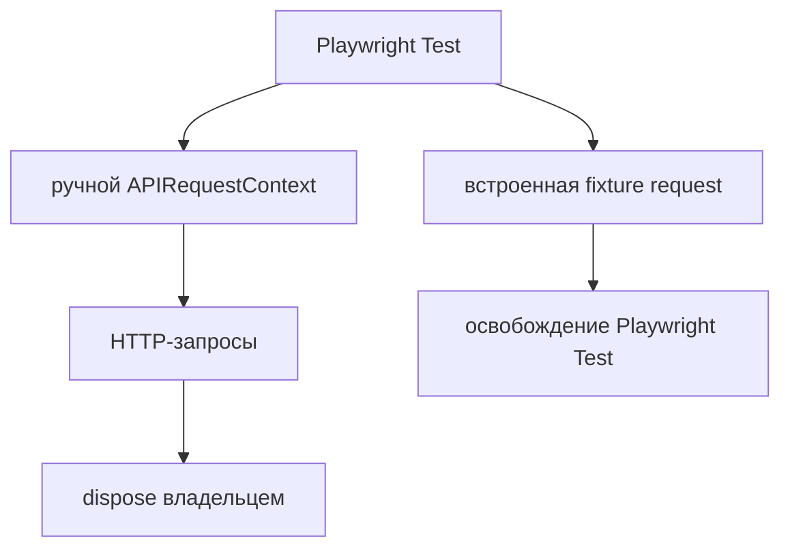

# APIRequestContext

## Связь с предыдущей главой

Главы 186–188 сформировали протокольную модель запроса и ответа. Теперь нужен клиент, который выполняет такие запросы в Playwright Test.

## Цель главы

Освоить встроенную fixture `request` и вручную созданный APIRequestContext, не смешивая их владельцев и состояние.

## Главный вопрос

Как выполнять независимые HTTP-запросы средствами Playwright Test?

## Мотивация

Использование одного HTTP-клиента с неявным глобальным состоянием связывает тесты cookies, заголовками и временем жизни. Playwright предоставляет управляемую fixture `request` и возможность создать отдельный контекст с явными настройками.

## Теория

### APIRequestContext — это сессия HTTP-клиента

APIRequestContext хранит настройки и cookies и выполняет запросы. Он не требует `Page` и не открывает браузер: это самостоятельный HTTP-клиент внутри Playwright.

Cookies принадлежат контексту. Запрос, получивший `Set-Cookie`, оставляет его в этом контексте, и следующий запрос того же контекста отправит cookie обратно. Новый контекст начинает с пустым набором — это и есть изоляция HTTP-клиента.

Важная оговорка: новый контекст не очищает серверные ресурсы. Он изолирует состояние клиента, а не данные системы.



### Три источника контекста и их cookies

Их легко перепутать, а различие принципиально:

| Источник | Кто владеет | Cookies |
| --- | --- | --- |
| fixture `request` | Playwright Test | собственные, с браузером не связаны |
| `context.request` | браузерный контекст теста | **общие с браузером** |
| `playwright.request.newContext()` | тот, кто создал | собственные, чистые |

Разница проверяется прямо. После авторизации через `page.goto` запрос через `context.request` отправляет полученный cookie, а тот же запрос через встроенную fixture `request` уходит без него.

Отсюда практическое правило. Если API-запрос должен выполняться **от имени того же пользователя**, что и браузерный сценарий, нужен `context.request`. Если API-запрос — независимая подготовка или проверка, подходит fixture `request`.

### Кто создал, тот и освобождает

Встроенная fixture `request` является APIRequestContext, которым владеет Playwright Test. Тест использует его, но не вызывает `dispose()` вручную.

`playwright.request.newContext()` создаёт новый APIRequestContext вручную. Создатель задаёт `baseURL`, общие заголовки или состояние хранилища и обязан вызвать `dispose()`.

Освобождение должно быть гарантировано при любом исходе:

```ts
const context = await requestFactory.newContext({
  baseURL,
  extraHTTPHeaders: { "x-test-role": "auditor" },
});

try {
  const response = await context.get("/health");
  expect(response.status()).toBe(200);
} finally {
  await context.dispose();
}
```

Обращение к освобождённому контексту даёт ошибку `Target page, context or browser has been closed` — по ней легко узнать забытое или преждевременное `dispose()`.

### Настройки контекста и их перекрытие

`baseURL` разрешает относительные пути: с ним запрос пишется как `context.get("/echo")`, и адрес стенда не размазывается по тестам.

`extraHTTPHeaders` добавляет общие заголовки ко всем запросам контекста. Отдельные вызовы могут передавать собственные параметры, и заголовок вызова **перекрывает** общий — проверено: контекст с `x-test-role: auditor` при вызове с `x-test-role: admin` отправляет `admin`.

Это даёт удобную схему: общее в контексте, частное в вызове.

### Ответ не становится проверкой сам

Ответ возвращается как APIResponse и не становится проверкой автоматически. Получить 500 и не проверить код состояния — вполне рабочий код, который ничего не обнаружит.

По умолчанию 4xx и 5xx не выбрасывают ошибку. Опция `failOnStatusCode` меняет это поведение, поэтому в негативных тестах её используют осознанно: с ней ожидаемый 404 превратится в падение ещё до проверки.

### Когда нужен отдельный контекст

Встроенная fixture удобна для обычных тестов и покрывает большинство случаев. Отдельный контекст оправдан, когда сценарию нужно что-то из этого списка:

- изолированные cookies — например, два пользователя в одном тесте;
- собственный `baseURL`, отличный от общего;
- общие заголовки только для части сценариев;
- заранее подготовленное состояние хранилища;
- другой режим обработки статусов.

Создавать его в каждом тесте без причины означает усложнять жизненный цикл: появляется ресурс, который нужно не забыть освободить, и ещё одно место, где тест может подвиснуть.

### Где проходит граница главы

APIRequestContext не является API Client бизнес-домена. Он знает транспорт — адреса, заголовки, коды, — но не объясняет, что означает операция для тестируемой системы.

`context.post("/api/v1/work-items", { data })` описывает HTTP-вызов. `tasks.create(title)` описывает действие предметной области. Эту границу введёт следующая глава.

## Внутренний механизм

`baseURL` разрешает относительные пути. `extraHTTPHeaders` добавляет общие заголовки к запросам контекста. Отдельные вызовы могут передавать собственные параметры. Ответ возвращается как APIResponse и не становится проверкой автоматически. По умолчанию 4xx и 5xx не выбрасывают ошибку; опция `failOnStatusCode` меняет это поведение, поэтому в негативных тестах её используют осознанно.

```text
examples/03-automation-qa/chapter-189/01-api-request-context.api.ts
```

Пример создаёт APIRequestContext с динамическим локальным `baseURL` и общим тестовым заголовком, выполняет запрос и освобождает контекст в `finally`.

Внешний `finally` закрывает сервер, даже если создание контекста завершится ошибкой. Внутренний `finally` появляется только после успешного создания контекста и отвечает за его `dispose()`.

## Главная ментальная модель

APIRequestContext — сессия HTTP-клиента со своими настройками и cookies; владелец создания определяет владельца освобождения.

## Практические примеры

```ts
const context = await requestFactory.newContext({
  baseURL,
  extraHTTPHeaders: { "x-test-role": "auditor" },
});

try {
  const response = await context.get("/health");
  expect(response.status()).toBe(200);
} finally {
  await context.dispose();
}
```

## Automation QA

Встроенная fixture удобна для обычных тестов. Отдельный контекст полезен, когда сценарию нужны изолированные cookies или собственная конфигурация клиента. Создавать его в каждом тесте без причины означает усложнять жизненный цикл.

## Концептуальные границы и компромиссы

APIRequestContext не является API Client бизнес-домена. Он знает транспорт, но не объясняет, что означает операция для тестируемой системы. Эту границу введёт следующая глава.

## Распространённые мифы

**Миф: fixture `request` делит cookies с браузером теста.**
Не делит. Общие cookies с браузером — у `context.request`.

**Миф: новый APIRequestContext сбрасывает состояние системы.**
Он изолирует только клиента: cookies и настройки. Серверные данные остаются.

**Миф: `dispose()` нужен любому контексту.**
Только созданному вручную. Встроенную fixture освобождает Playwright Test.

**Миф: получить ответ — значит проверить его.**
APIResponse сам по себе ничего не утверждает. Без `expect` тест пройдёт и на 500.

**Миф: `failOnStatusCode: true` — разумное значение по умолчанию.**
Для негативных сценариев оно мешает: ожидаемый 404 превращается в исключение.

## Частые вопросы

**Нужен ли браузер для API-тестов?**
Нет. APIRequestContext работает без `Page` и без запуска браузера.

**Как выполнить API-запрос от имени авторизованного в браузере пользователя?**
Через `context.request`: он использует cookies браузерного контекста.

**Где задавать адрес стенда?**
В `baseURL` контекста или в конфигурации. Тогда в тестах остаются относительные пути.

**Что означает ошибка «Target page, context or browser has been closed»?**
Обращение к уже освобождённому контексту. Проверьте, где вызван `dispose()`.

**Как совместить общий заголовок и частный?**
Общий задаётся в `extraHTTPHeaders` контекста, частный — в вызове; заголовок вызова перекрывает общий.

## Распространённые ошибки

- Вызывать `dispose()` для встроенной fixture `request`.
- Не освобождать вручную созданный контекст.
- Считать новый контекст очисткой серверных данных.
- Создавать один глобальный контекст для всех тестов.
- Хранить секретный заголовок в исходном коде.
- Ожидать, что 4xx сам завершит тест неуспешной проверкой.

## Краткие итоги

- Fixture `request` управляется Playwright Test.
- Ручной APIRequestContext принадлежит создавшему коду.
- `baseURL` и общие заголовки принадлежат контексту.
- Cookies клиента не равны серверным данным.
- APIResponse нужно проверять явно.

## Что нужно запомнить

- Не закрывайте fixture, которой владеет Playwright Test.
- Всегда освобождайте вручную созданный контекст.
- Клиентская изоляция не сбрасывает серверные данные.
- Относительные пути разрешаются через baseURL.
- Транспортный контекст ещё не является бизнес-абстракцией.

## Быстрая проверка

1. Кто владеет встроенной fixture `request`?
2. Когда нужен `newContext()`?
3. Кто вызывает `dispose()`?
4. Что изолируют cookies контекста?
5. Почему новый контекст не очищает серверные данные?

## Практика

```text
practice/03-automation-qa/189-api-request-context.md
```

## Переход к следующей главе

APIRequestContext выполняет HTTP-вызовы, но оставляет маршруты и тела данных в тесте. Глава 190 введёт API Client как границу деталей HTTP-транспорта.
