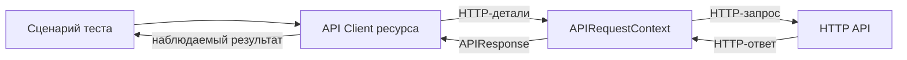

# API Client и граница HTTP-слоя

## Связь с предыдущей главой

Глава 189 дала управляемый HTTP-клиент. При росте набора прямые URL, тела данных и разбор ответов начинают повторяться и скрывать смысл операций.

## Цель главы

Спроектировать небольшой API Client для конкретного ресурса, который скрывает детали HTTP-транспорта, но сохраняет доступ к важным HTTP-результатам.

## Главный вопрос

Как скрыть детали HTTP-вызовов, не скрывая смысл API-операций?

## Мотивация

Тест, заполненный `request.post()`, URL и заголовками, трудно читать как бизнес-сценарий. Но гигантский универсальный клиент, который всегда выбрасывает ошибки и прячет APIResponse, мешает негативным проверкам.

## Теория

### Что скрывает клиент и что не должен скрывать

API Client инкапсулирует вызовы конкретного сервиса. Клиент ресурса группирует операции одного ресурса, например `TasksClient.create()` и `TasksClient.get()`.

Публичный API клиента должен выражать операции предметной области. Внутри остаются URL, метод и сериализация — то, что меняется при рефакторинге сервиса и не должно расходиться по тестам.

А вот код состояния и детали ответа нельзя скрывать безусловно. Клиент, который сам проверяет 200 и возвращает только тело, делает негативные сценарии невозможными: проверить 404 через него уже нельзя.



### Граница проходит по языку

Полезный признак: метод клиента называется на языке задачи, а не транспорта.

| Транспортный язык | Язык предметной области |
| --- | --- |
| `post("/api/v1/work-items", { data })` | `create(title, description)` |
| `get("/api/v1/work-items/" + id)` | `get(id)` |
| `delete("/api/v1/work-items/" + id)` | `remove(id)` |

`create(title, description)` выражает операцию лучше, чем общий `post(path, body)`. Если в тесте всё ещё видны пути и методы, граница не проведена — клиент просто переименовал транспорт.

### Что возвращать: данные или APIResponse

Решение зависит от того, нужен ли тесту доступ к уровню HTTP.

Возвращать **APIResponse** стоит, когда код состояния — часть проверяемого сценария: `get(id)` может вернуть APIResponse, если 404 является полезным сценарием, а `create()` — чтобы тест проверил 201 и достал идентификатор из `Location`.

Возвращать **данные** удобно в подготовке, где успех подразумевается: там важен созданный объект, а не его код состояния.

Смешанный вариант тоже рабочий: `create()` для сценария возвращает APIResponse, а `createOrFail()` для подготовки — сразу данные. Главное, чтобы из имени было ясно, что произойдёт при неуспехе.

### Владение контекстом

Клиент получает APIRequestContext через constructor и не владеет его жизненным циклом, если контекст передан извне.

Это правило избавляет от типичной ошибки — клиента, который сам создаёт контекст и никогда его не освобождает. Клиент не должен создавать глобальный APIRequestContext без явного владельца: у ресурса всегда есть тот, кто его закроет, и это тот, кто его открыл.

Метод клиента формирует запрос и возвращает данные или APIResponse согласно своей публичной договорённости.

### Модели запроса и ответа

Модель запроса описывает отправляемые данные, модель ответа — ожидаемое представление. Типы делают контракт видимым прямо в коде и ловят несоответствия до запуска.

Но у них есть предел, о котором стоит помнить: TypeScript проверяет использование моделей до запуска и не гарантирует форму внешнего JSON во время выполнения. Ответ, приведённый к типу через `as`, остаётся тем, что реально прислал сервер.

Поэтому модель — это документация ожидания, а проверка формы — работа теста. Если изменение контракта должно обнаруживаться, его проверяют явно, а не надеются на тип.

### Проверки остаются в тесте

Проверки остаются в тесте, если успешный код состояния и тело ответа являются частью проверяемого сценария.

Клиент может проверять то, без чего он не может работать — например, что ответ вообще разобрался. Но бизнес-проверки в клиенте делают тесты одинаково зелёными и одинаково бесполезными: из тела теста больше не видно, что именно утверждается.

Правило то же, что для Page Object: клиент скрывает **как** выполняется вызов, тест показывает **что** проверяется.

### Сколько клиентов заводить

Один клиент на весь сервер обычно превращается в перегруженный транспортный объект с десятками методов без внутренней логики. Деление по ресурсам даёт естественные границы: задачи, пользователи, отчёты.

При этом не всякий повтор требует класса. Для двух простых вызовов прямая fixture `request` может быть яснее, чем клиент с конструктором и моделями.

Уровень абстракции должен уменьшать реальную сложность и сохранять возможность негативного тестирования. Проверить это легко: если после введения клиента тест стал короче и понятнее, а проверить 404 по-прежнему можно — граница проведена верно.

## Внутренний механизм

Клиент получает APIRequestContext через constructor и не владеет его жизненным циклом, если контекст передан извне. Метод клиента формирует запрос и возвращает данные или APIResponse согласно своей публичной договорённости. Проверки остаются в тесте, если успешный код состояния и тело ответа являются частью проверяемого сценария.

```text
examples/03-automation-qa/chapter-190/01-api-client.api.ts
```

`TasksClient.create()` выражает создание ресурса и возвращает APIResponse. Тест проверяет `201` и получает идентификатор из `Location`. `get()` также возвращает APIResponse, чтобы вызывающий код мог проверить как найденный, так и отсутствующий ресурс.

## Главная ментальная модель

API Client — переводчик между языком сценария и HTTP; он скрывает повторяющиеся детали, но не должен скрывать проверяемый результат.

## Практические примеры

- `create(title, description)` выражает операцию лучше, чем общий `post(path, body)`.
- `get(id)` может возвращать APIResponse, если 404 является полезным сценарием.
- Клиент не должен создавать глобальный APIRequestContext без явного владельца.
- Один клиент на весь сервер обычно превращается в перегруженный транспортный объект.

## Automation QA

Клиенты ресурсов уменьшают дублирование при подготовке данных и в бизнес-сценариях. При изменении маршрута правится одна граница, а тесты сохраняют язык предметной области.

## Концептуальные границы и компромиссы

Не всякий повтор требует класса. Для двух простых вызовов прямая fixture `request` может быть яснее. Уровень абстракции должен уменьшать реальную сложность и сохранять возможность негативного тестирования.

## Распространённые мифы

**Миф: клиент должен сам проверять успешный статус.**
Тогда негативные сценарии станут невозможны. Код состояния скрывают только там, где он заведомо не нужен.

**Миф: типы моделей гарантируют форму ответа.**
Они проверяют использование в коде. Реальный JSON приходит во время выполнения, и его проверяет тест.

**Миф: один клиент на сервис удобнее нескольких.**
Он быстро превращается в транспортный объект без границ. Деление по ресурсам даёт осмысленные API.

**Миф: клиент должен создавать свой APIRequestContext.**
Тогда у ресурса нет явного владельца. Контекст передают извне.

**Миф: любой повтор вызова — повод завести клиент.**
Для двух простых вызовов прямой `request` понятнее. Абстракция оправдывается убранной сложностью.

## Частые вопросы

**Что возвращать из метода клиента?**
APIResponse, если код состояния — часть сценария; данные, если это подготовка и успех подразумевается.

**Как сохранить возможность негативных тестов?**
Не проверять статус внутри клиента по умолчанию либо дать отдельный метод с явным именем для «должно получиться».

**Где проверять форму ответа?**
В тесте или в отдельной проверке контракта. Тип модели этого не делает.

**Кто освобождает контекст, переданный клиенту?**
Тот, кто его создал: fixture или тест. Клиент им не владеет.

**Как понять, что граница проведена верно?**
Тест читается на языке предметной области, путей и методов в нём нет, а проверить неуспешный ответ по-прежнему возможно.

## Распространённые ошибки

- Создавать один универсальный клиент с десятками параметров.
- Скрывать все коды состояния за исключениями.
- Смешивать ответственность HTTP-слоя, UI и базы данных.
- Владеть переданным APIRequestContext без договора.
- Возвращать TypeScript-тип как доказательство контракта во время выполнения.
- Добавлять клиент до появления повторяющейся проблемы.

## Краткие итоги

- API Client скрывает повторяющиеся детали HTTP.
- Клиент ресурса группирует операции одного ресурса.
- Публичные методы выражают смысл сценария.
- Жизненный цикл контекста остаётся у явного владельца.
- Негативным тестам нужен доступ к HTTP-результату.

## Что нужно запомнить

- Абстракция начинается с проблемы, а не шаблона.
- Клиент переводит бизнес-операцию в HTTP.
- Не скрывайте результат, который должен проверить тест.
- TypeScript-модель не проверяет внешний JSON во время выполнения.
- Избегайте универсального клиента для всего сервиса.

## Быстрая проверка

1. Что скрывает API Client?
2. Чем клиент ресурса отличается от универсальной обёртки?
3. Кто владеет переданным APIRequestContext?
4. Почему иногда полезно вернуть APIResponse?
5. Когда API Client избыточен?

## Практика

```text
practice/03-automation-qa/190-api-client-and-http-boundary.md
```

## Переход к следующей главе

HTTP-граница сформирована. Глава 191 добавит аутентификацию и покажет, как передавать доступ отдельно от бизнес-запросов.
