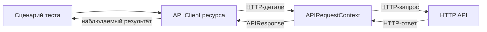

# API Client и граница HTTP-слоя

## Связь с предыдущей главой

Глава 189 дала управляемый HTTP-клиент. При росте набора прямые URL, тела данных и разбор ответов начинают повторяться и скрывать смысл операций.

## Цель главы

Спроектировать небольшой API Client для конкретного ресурса, который скрывает детали HTTP-транспорта, но сохраняет доступ к важным HTTP-результатам.

## Главный вопрос

Как скрыть детали HTTP-вызовов, не скрывая смысл API-операций?

## Мотивация

Тест, заполненный `request.post()`, URL и заголовками, трудно читать как бизнес-сценарий. Но гигантский универсальный клиент, который всегда выбрасывает ошибки и прячет APIResponse, мешает негативным проверкам.

## Теория

API Client инкапсулирует вызовы конкретного сервиса. Клиент ресурса группирует операции одного ресурса, например `TasksClient.create()` и `TasksClient.get()`.

Модель запроса описывает отправляемые данные, модель ответа — ожидаемое представление. TypeScript проверяет использование моделей до запуска, но не гарантирует форму внешнего JSON во время выполнения.

Публичный API клиента должен выражать операции предметной области. Внутри остаются URL, метод и сериализация. Код состояния и детали ответа нельзя скрывать безусловно, если тесту нужны негативные сценарии или диагностика.



## Внутренний механизм

Клиент получает APIRequestContext через constructor и не владеет его жизненным циклом, если контекст передан извне. Метод клиента формирует запрос и возвращает данные или APIResponse согласно своей публичной договорённости. Проверки остаются в тесте, если успешный код состояния и тело ответа являются частью проверяемого сценария.

```text
examples/03-automation-qa/chapter-190/01-api-client.api.ts
```

`TasksClient.create()` выражает создание ресурса и возвращает APIResponse. Тест проверяет `201` и получает идентификатор из `Location`. `get()` также возвращает APIResponse, чтобы вызывающий код мог проверить как найденный, так и отсутствующий ресурс.

## Главная ментальная модель

API Client — переводчик между языком сценария и HTTP; он скрывает повторяющиеся детали, но не должен скрывать проверяемый результат.

## Практические примеры

- `create(title, description)` выражает операцию лучше, чем общий `post(path, body)`.
- `get(id)` может возвращать APIResponse, если 404 является полезным сценарием.
- Клиент не должен создавать глобальный APIRequestContext без явного владельца.
- Один клиент на весь сервер обычно превращается в перегруженный транспортный объект.

## Automation QA

Клиенты ресурсов уменьшают дублирование при подготовке данных и в бизнес-сценариях. При изменении маршрута правится одна граница, а тесты сохраняют язык предметной области.

## Концептуальные границы и компромиссы

Не всякий повтор требует класса. Для двух простых вызовов прямая fixture `request` может быть яснее. Уровень абстракции должен уменьшать реальную сложность и сохранять возможность негативного тестирования.

## Распространённые ошибки

- Создавать один универсальный клиент с десятками параметров.
- Скрывать все коды состояния за исключениями.
- Смешивать ответственность HTTP-слоя, UI и базы данных.
- Владеть переданным APIRequestContext без договора.
- Возвращать TypeScript-тип как доказательство контракта во время выполнения.
- Добавлять клиент до появления повторяющейся проблемы.

## Краткие итоги

- API Client скрывает повторяющиеся детали HTTP.
- Клиент ресурса группирует операции одного ресурса.
- Публичные методы выражают смысл сценария.
- Жизненный цикл контекста остаётся у явного владельца.
- Негативным тестам нужен доступ к HTTP-результату.

## Что нужно запомнить

- Абстракция начинается с проблемы, а не шаблона.
- Клиент переводит бизнес-операцию в HTTP.
- Не скрывайте результат, который должен проверить тест.
- TypeScript-модель не проверяет внешний JSON во время выполнения.
- Избегайте универсального клиента для всего сервиса.

## Быстрая проверка

1. Что скрывает API Client?
2. Чем клиент ресурса отличается от универсальной обёртки?
3. Кто владеет переданным APIRequestContext?
4. Почему иногда полезно вернуть APIResponse?
5. Когда API Client избыточен?

## Практика

```text
practice/03-automation-qa/190-api-client-and-http-boundary.md
```

## Переход к следующей главе

HTTP-граница сформирована. Глава 191 добавит аутентификацию и покажет, как передавать доступ отдельно от бизнес-запросов.
