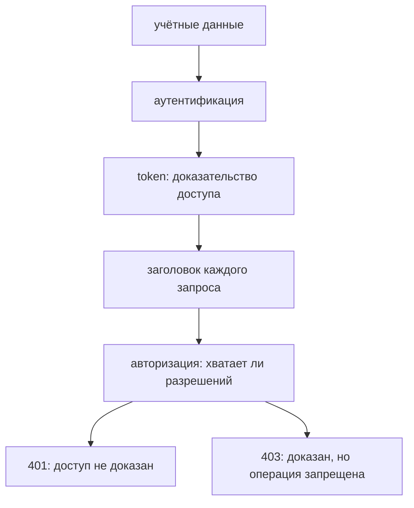

# Аутентификация API

## Связь с предыдущей главой

API Client из главы 190 умеет выражать операции ресурса. Защищённый маршрут дополнительно требует доказать, кто выполняет запрос и какие действия ему разрешены.

## Цель главы

Разделить аутентификацию, авторизацию и жизненный цикл тестового token, сохраняя секреты за границей исходного кода.

## Главный вопрос

Как безопасно передавать учётные данные и отделять получение доступа от бизнес-запросов?

## Мотивация

Копирование bearer token в каждый тест создаёт утечки, дублирование и зависимость от срока его жизни. При этом один бессрочный admin token маскирует реальные проверки разрешений.

## Теория

### Аутентификация и авторизация — два разных вопроса

Аутентификация отвечает на вопрос «кто обращается?». Авторизация отвечает «что этому субъекту разрешено?».

Разделение не теоретическое: сервер отвечает на эти вопросы по очереди, и по коду ответа видно, на каком шаге произошёл отказ.

| Ситуация | Обычный код | О чём говорит |
| --- | --- | --- |
| учётных данных нет или они недействительны | 401 | субъект не установлен |
| субъект установлен, но прав не хватает | 403 | вопрос авторизации |

Проверено на контролируемом сервисе: запрос без заголовка `Authorization` вернул 401, запрос с чужим token — 403. Разные коды означают разные дефекты, и путать их в тесте нельзя: 403 вместо 401 говорит, что система приняла неизвестного клиента за известного.

### Способы переноса доказательства доступа

**API key** идентифицирует клиента по заранее выданному ключу. Он передаётся только в заголовке или другом месте, определённом контрактом — в строке запроса ключ попадает в журналы прокси и истории браузера.

**Bearer token** передаётся в заголовке `Authorization` и предоставляет доступ тому, кто им владеет. Слово «bearer» здесь буквально: сервер не проверяет, кто предъявил token, — достаточно владения им. Поэтому утёкший token равносилен утёкшим учётным данным.

**OAuth** описывает семейство потоков делегированного доступа. На этом этапе важно понимать границу: тест получает token контролируемым способом и использует его, но не строит промышленную инфраструктуру управления идентификацией.

### Как token попадает в запросы

Клиент сначала отправляет учётные данные на маршрут сессии, получает token и добавляет `Authorization: Bearer <token>` к защищённому запросу.

Повторять заголовок в каждом вызове не нужно — его задают один раз на уровне контекста:

```ts
const context = await requestFactory.newContext({
  baseURL,
  extraHTTPHeaders: { authorization: `Bearer ${token}` },
});
```

Все запросы этого контекста уходят с заголовком, а отдельный вызов при необходимости перекрывает его — например, чтобы проверить поведение с недействительным token.

### Token имеет срок жизни и область разрешений

Две характеристики token определяют стратегию подготовки.

**Срок жизни.** Token, полученный в начале длинного запуска, может истечь к его середине. Признак — тесты, которые падают с 401 тем чаще, чем дольше идёт набор, и проходят при одиночном запуске.

**Область разрешений.** Token выдаётся с конкретным набором прав. Позитивный тест проверяет доступ с **минимально необходимой** ролью: если сценарий проходит только под администратором, он не доказывает, что обычному пользователю операция доступна.

### Общий token или свой на тест

Повторное использование уменьшает стоимость подготовки, но добавляет риск истечения и разделяемого состояния.

| | Общий token | Token на тест |
| --- | --- | --- |
| стоимость подготовки | низкая | выше на каждый тест |
| риск истечения | накапливается по ходу запуска | минимален |
| изоляция | тесты делят учётную запись | полная |
| параллельный запуск | конфликт при изменении данных субъекта | безопасен |

Общий token приемлем, пока тесты не меняют самого субъекта. Как только появляется сценарий смены пароля или прав, ему нужна собственная учётная запись. Жизненный цикл token принадлежит подготовке или fixture, которая его создаёт.

### Учётные данные и безопасность

Учётные данные поступают из безопасной конфигурации окружения. Тестовые учётные данные допустимы только для локального детерминированного сервера.

Три правила, которые нарушают чаще всего:

- **Token нельзя печатать в отчёт.** Отчёт хранится в CI, часто доступен шире, чем код, и живёт дольше самого token.
- **Учётные данные нельзя хранить в репозитории.** История git не забывает: удалённый в следующем коммите секрет остаётся в ней навсегда.
- **Негативный тест не должен раскрывать значения.** Проверять надо код отказа, а не печатать то, что отправили.

### Что проверять в тестах аутентификации

Позитивный тест проверяет доступ с минимально необходимой ролью. Негативные сценарии отдельно проверяют отсутствие учётных данных и недостаточные разрешения, не раскрывая чувствительные значения.

Минимальный полезный набор выглядит так:

1. доступ с валидным token и нужной ролью — 200;
2. запрос без учётных данных — 401;
3. запрос с валидным token, но недостаточными правами — 403;
4. запрос с недействительным или истёкшим token — 401.

Четвёртый пункт часто пропускают, а он ловит реальный дефект: сервис, который принимает просроченный token, выглядит работающим до первого инцидента.

Доступ и разрешения проверяются на разных шагах:



## Внутренний механизм

Клиент сначала отправляет учётные данные на маршрут сессии, получает token и добавляет `Authorization: Bearer <token>` к защищённому запросу. Token имеет срок жизни и область разрешений. Повторное использование уменьшает стоимость подготовки, но добавляет риск истечения и разделяемого состояния.

```text
examples/03-automation-qa/chapter-191/01-api-authentication.api.ts
```

Пример использует только локальные тестовые учётные данные, получает token, проверяет доступ к профилю и различает 401 и 403.

## Главная ментальная модель

Учётные данные позволяют получить доступ, token переносит доказательство доступа, а сервер отдельно решает, достаточно ли разрешений для операции.

## Практические примеры

- Отсутствующий или недействительный token обычно приводит к 401.
- Валидный субъект без нужного разрешения обычно получает 403.
- API key передаётся только в заголовке или другом месте, определённом контрактом.
- Жизненный цикл token принадлежит подготовке или fixture, которая его создаёт.

## Automation QA

Позитивный тест проверяет доступ с минимально необходимой ролью. Негативные сценарии отдельно проверяют отсутствие учётных данных и недостаточные разрешения, не раскрывая чувствительные значения.

## Концептуальные границы и компромиссы

Общий token может ускорить набор тестов, но связывает тесты сроком жизни и серверной учётной записью. Отдельный token повышает изоляцию, но увеличивает количество вызовов. Выбор зависит от контракта и стоимости аутентификации.

## Распространённые мифы

**Миф: 401 и 403 взаимозаменяемы.**
401 означает, что субъект не установлен, 403 — что установлен, но прав не хватает. Это разные дефекты.

**Миф: bearer token проверяет, кто его предъявил.**
Не проверяет — достаточно владения. Утёкший token равносилен утёкшим учётным данным.

**Миф: заголовок авторизации нужно повторять в каждом вызове.**
Он задаётся в `extraHTTPHeaders` контекста, а отдельный вызов при необходимости его перекрывает.

**Миф: один token на весь запуск — просто оптимизация.**
Он связывает тесты сроком жизни и общей учётной записью. Сценарии, меняющие субъекта, требуют своей.

**Миф: напечатать token в отчёт безопасно, он же временный.**
Отчёт в CI живёт дольше token и доступен шире, чем код.

## Частые вопросы

**Тесты падают с 401 ближе к концу запуска. Почему?**
Типичный признак истёкшего общего token. При одиночном запуске тот же тест проходит.

**Под какой ролью писать позитивный тест?**
Под минимально необходимой. Сценарий, проходящий только под администратором, не доказывает доступность операции обычному пользователю.

**Где хранить учётные данные для тестов?**
В конфигурации окружения. В репозитории — недопустимо: история git сохраняет удалённое.

**Нужно ли проверять просроченный token?**
Да. Сервис, принимающий просроченный token, выглядит работающим ровно до инцидента.

**Куда передавать API key?**
Только туда, где его ожидает контракт, и предпочтительно в заголовок: в строке запроса он попадает в журналы прокси.

## Распространённые ошибки

- Коммитить реальные учётные данные.
- Выводить bearer token в лог.
- Путать 401 и 403.
- Использовать admin token для всех тестов.
- Считать token бессрочным.
- Смешивать получение доступа с каждой бизнес-операцией клиента.

## Краткие итоги

- Аутентификация устанавливает субъект.
- Авторизация проверяет разрешение.
- API key и bearer token являются разными механизмами доступа.
- Token имеет жизненный цикл и границу хранения секретов.
- Негативные сценарии доступа проверяются отдельно.

## Что нужно запомнить

- Не храните реальные секреты в коде.
- Используйте минимально необходимые разрешения.
- 401 и 403 отвечают на разные вопросы.
- Не логируйте чувствительные заголовки.
- Повторное использование token усложняет его жизненный цикл.

## Быстрая проверка

1. Чем аутентификация отличается от авторизации?
2. Что означает bearer token?
3. Когда ожидается 401, а когда 403?
4. Кто должен владеть жизненным циклом token?
5. Почему общий admin token опасен?

## Практика

```text
practice/03-automation-qa/191-api-authentication.md
```

## Переход к следующей главе

После получения доступа тесту нужны качественные уникальные данные. Глава 192 покажет Request Builder и управляемую подготовку через API.
