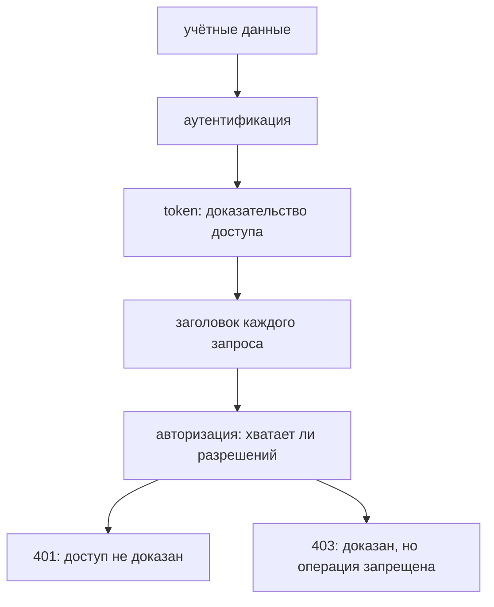

# Аутентификация API

## Связь с предыдущей главой

API Client из главы 190 умеет выражать операции ресурса. Защищённый маршрут дополнительно требует доказать, кто выполняет запрос и какие действия ему разрешены.

## Цель главы

Разделить аутентификацию, авторизацию и жизненный цикл тестового token, сохраняя секреты за границей исходного кода.

## Главный вопрос

Как безопасно передавать учётные данные и отделять получение доступа от бизнес-запросов?

## Мотивация

Копирование bearer token в каждый тест создаёт утечки, дублирование и зависимость от срока его жизни. При этом один бессрочный admin token маскирует реальные проверки разрешений.

## Теория

### Аутентификация и авторизация — два разных вопроса

Аутентификация отвечает на вопрос «кто обращается?». Авторизация отвечает «что этому субъекту разрешено?».

Разделение не теоретическое: сервер отвечает на эти вопросы по очереди, и по коду ответа видно, на каком шаге произошёл отказ.

| Ситуация | Обычный код | О чём говорит |
| --- | --- | --- |
| учётных данных нет или они недействительны | 401 | субъект не установлен |
| субъект установлен, но прав не хватает | 403 | вопрос авторизации |

Проверено на контролируемом сервисе: запрос без заголовка `Authorization` вернул 401, запрос с чужим токеном — 403. Разные коды означают разные дефекты, и путать их в тесте нельзя: 403 вместо 401 говорит, что система приняла неизвестного клиента за известного.

### Способы переноса доказательства доступа

**Ключ API** идентифицирует клиента по заранее выданному ключу. Он передаётся только в заголовке или другом месте, определённом контрактом — в строке запроса ключ попадает в журналы прокси и истории браузера.

**Токен предъявителя** передаётся в заголовке `Authorization` и предоставляет доступ тому, кто им владеет. Слово «предъявитель» здесь буквально: сервер не проверяет, кто предъявил токен, — достаточно владения им. Поэтому утёкший токен равносилен утёкшим учётным данным.

**OAuth** описывает семейство потоков делегированного доступа. На этом этапе важно понимать границу: тест получает токен контролируемым способом и использует его, но не строит промышленную инфраструктуру управления идентификацией.

### Как токен попадает в запросы

Клиент сначала отправляет учётные данные на маршрут сессии, получает токен и добавляет `Authorization: Bearer <token>` к защищённому запросу.

Повторять заголовок в каждом вызове не нужно — его задают один раз на уровне контекста:

```ts
const context = await requestFactory.newContext({
  baseURL,
  extraHTTPHeaders: { authorization: `Bearer ${token}` },
});
```

Все запросы этого контекста уходят с заголовком, а отдельный вызов при необходимости перекрывает его — например, чтобы проверить поведение с недействительным токеном.

### Токен имеет срок жизни и область разрешений

Две характеристики токена определяют стратегию подготовки.

**Срок жизни.** Токен, полученный в начале длинного запуска, может истечь к его середине. Признак — тесты, которые падают с 401 тем чаще, чем дольше идёт набор, и проходят при одиночном запуске.

**Область разрешений.** Токен выдаётся с конкретным набором прав. Позитивный тест проверяет доступ с **минимально необходимой** ролью: если сценарий проходит только под администратором, он не доказывает, что обычному пользователю операция доступна.

### Общий токен или свой на тест

Повторное использование уменьшает стоимость подготовки, но добавляет риск истечения и разделяемого состояния.

| | Общий токен | Токен на тест |
| --- | --- | --- |
| стоимость подготовки | низкая | выше на каждый тест |
| риск истечения | накапливается по ходу запуска | минимален |
| изоляция | тесты делят учётную запись | полная |
| параллельный запуск | конфликт при изменении данных субъекта | безопасен |

Общий токен приемлем, пока тесты не меняют самого субъекта. Как только появляется сценарий смены пароля или прав, ему нужна собственная учётная запись. Жизненный цикл токена принадлежит подготовке или фикстуре, которая его создаёт.

### Учётные данные и безопасность

Учётные данные поступают из безопасной конфигурации окружения. Тестовые учётные данные допустимы только для локального детерминированного сервера.

Три правила, которые нарушают чаще всего:

- **Токен нельзя печатать в отчёт.** Отчёт хранится в CI, часто доступен шире, чем код, и живёт дольше самого токена.
- **Учётные данные нельзя хранить в репозитории.** История git не забывает: удалённый в следующем коммите секрет остаётся в ней навсегда.
- **Негативный тест не должен раскрывать значения.** Проверять надо код отказа, а не печатать то, что отправили.

### Что проверять в тестах аутентификации

Позитивный тест проверяет доступ с минимально необходимой ролью. Негативные сценарии отдельно проверяют отсутствие учётных данных и недостаточные разрешения, не раскрывая чувствительные значения.

Минимальный полезный набор выглядит так:

1. доступ с действительным токеном и нужной ролью — 200;
2. запрос без учётных данных — 401;
3. запрос с действительным токеном, но недостаточными правами — 403;
4. запрос с недействительным или истёкшим токеном — 401.

Четвёртый пункт часто пропускают, а он ловит реальный дефект: сервис, который принимает просроченный токен, выглядит работающим до первого инцидента.

Доступ и разрешения проверяются на разных шагах:


```mermaid
flowchart TD
    A["учётные данные"] --> B["аутентификация"]
    B --> C["token: доказательство доступа"]
    C --> D["заголовок каждого запроса"]
    D --> E["авторизация: хватает ли разрешений"]
    E --> F["401: доступ не доказан"]
    E --> G["403: доказан, но операция запрещена"]
```

## Внутренний механизм

Клиент сначала отправляет учётные данные на маршрут сессии, получает токен и добавляет `Authorization: Bearer <token>` к защищённому запросу. Токен имеет срок жизни и область разрешений. Повторное использование уменьшает стоимость подготовки, но добавляет риск истечения и разделяемого состояния.

### Жизненный цикл токена и три способа его потерять

```text
вход → токен выдан (срок жизни T, набор прав R)
     ├─ T истёк              → 401 на КАЖДОМ запросе, набор падает целиком
     ├─ прав R не хватает    → 403 на конкретной операции
     └─ токена нет вовсе     → 401 на первом же защищённом запросе
```

Форма падения сразу говорит, где искать. Одновременное `401` во всех тестах —
это подготовка прогона, а одиночное `403` — проверка прав, то есть, возможно,
как раз то, что тест и должен был обнаружить.

### Где токен живёт в тестовом проекте

| Уровень | Что хранит | Чем рискует |
| --- | --- | --- |
| вход в каждом тесте | ничего | медленно, на стенде растёт число сеансов |
| фикстура рабочего процесса | один токен на процесс | истечение при долгом прогоне |
| подготовка прогона | один токен на всех | истечение и общая учётная запись |

Практический компромисс — фикстура: токен выпускается один раз на процесс и
живёт заметно меньше, чем срок его действия. Учебный стенд книги добавляет своё
условие: **каждый выпуск токена открывает новый прогон**, поэтому два клиента,
аутентифицировавшихся независимо, окажутся в разных прогонах и не увидят данные
друг друга.

Само значение токена при этом не печатается никогда: журнал и отчёт доступны
шире, чем стенд.
```text
examples/03-automation-qa/chapter-191/01-api-authentication.api.ts
```

Пример использует только локальные тестовые учётные данные, получает токен, проверяет доступ к профилю и различает 401 и 403.

## Главная ментальная модель

Учётные данные позволяют получить доступ, токен переносит доказательство доступа, а сервер отдельно решает, достаточно ли разрешений для операции.

## Практические примеры

- Отсутствующий или недействительный токен обычно приводит к 401.
- Валидный субъект без нужного разрешения обычно получает 403.
- Ключ API передаётся только в заголовке или другом месте, определённом контрактом.
- Жизненный цикл токена принадлежит подготовке или фикстуре, которая его создаёт.

## Automation QA

Позитивный тест проверяет доступ с минимально необходимой ролью. Негативные сценарии отдельно проверяют отсутствие учётных данных и недостаточные разрешения, не раскрывая чувствительные значения.

## Концептуальные границы и компромиссы

Общий токен может ускорить набор тестов, но связывает тесты сроком жизни и серверной учётной записью. Отдельный токен повышает изоляцию, но увеличивает количество вызовов. Выбор зависит от контракта и стоимости аутентификации.

## Распространённые мифы

**Миф: 401 и 403 взаимозаменяемы.**
401 означает, что субъект не установлен, 403 — что установлен, но прав не хватает. Это разные дефекты.

**Миф: токен предъявителя проверяет, кто его предъявил.**
Не проверяет — достаточно владения. Утёкший токен равносилен утёкшим учётным данным.

**Миф: заголовок авторизации нужно повторять в каждом вызове.**
Он задаётся в `extraHTTPHeaders` контекста, а отдельный вызов при необходимости его перекрывает.

**Миф: один токен на весь запуск — просто оптимизация.**
Он связывает тесты сроком жизни и общей учётной записью. Сценарии, меняющие субъекта, требуют своей.

**Миф: напечатать токен в отчёт безопасно, он же временный.**
Отчёт в CI живёт дольше токена и доступен шире, чем код.

## Частые вопросы

**Тесты падают с 401 ближе к концу запуска. Почему?**
Типичный признак истёкшего общего токена. При одиночном запуске тот же тест проходит.

**Под какой ролью писать позитивный тест?**
Под минимально необходимой. Сценарий, проходящий только под администратором, не доказывает доступность операции обычному пользователю.

**Где хранить учётные данные для тестов?**
В конфигурации окружения. В репозитории — недопустимо: история git сохраняет удалённое.

**Нужно ли проверять просроченный токен?**
Да. Сервис, принимающий просроченный токен, выглядит работающим ровно до инцидента.

**Куда передавать ключ API?**
Только туда, где его ожидает контракт, и предпочтительно в заголовок: в строке запроса он попадает в журналы прокси.

## Распространённые ошибки

- Коммитить реальные учётные данные — они остаются в истории репозитория навсегда, даже после удаления файла следующим коммитом.

- Выводить токен предъявителя в журнал — журнал попадает в артефакты CI и в отчёт. Значения секретных заголовков маскируют до записи.

- Путать 401 и 403 — 401 означает «не опознан» (нет или негоден токен), 403 — «опознан, но прав не хватает». Проверка «не 200» не различает их и пропускает дефект прав доступа.

- Использовать токен администратора для всех тестов — проверки доступа перестают что-либо значить: сценарий читателя выполняется с полными правами и проходит.

- Считать токен бессрочным — срок жизни короче, чем интервал между прогонами, поэтому набор начинает падать целиком на первом же запросе. Токен выпускают в подготовке прогона.

- Смешивать получение доступа с каждой бизнес-операцией клиента — повторный вход на каждый запрос замедляет прогон, а на стенде может открывать новый сеанс. Сессию получают один раз и передают дальше.

## Краткие итоги

- Аутентификация устанавливает субъект.
- Авторизация проверяет разрешение.
- Ключ API и токен предъявителя являются разными механизмами доступа.
- Токен имеет жизненный цикл и границу хранения секретов.
- Негативные сценарии доступа проверяются отдельно.

## Что нужно запомнить

- Не храните реальные секреты в коде.
- Используйте минимально необходимые разрешения.
- 401 и 403 отвечают на разные вопросы.
- Не логируйте чувствительные заголовки.
- Повторное использование токена усложняет его жизненный цикл.

## Быстрая проверка

1. Чем аутентификация отличается от авторизации?
2. Что означает токен предъявителя?
3. Когда ожидается 401, а когда 403?
4. Кто должен владеть жизненным циклом токена?
5. Почему общий токен администратора опасен?

### Ответы

1. Аутентификация отвечает, кто вы. Авторизация — что вам разрешено.
2. Предъявитель токена считается его владельцем: сервер не требует ничего, кроме самого токена. Поэтому его нельзя логировать и коммитить.
3. `401` — когда личность не подтверждена: токена нет, он неверен или истёк. `403` — когда личность известна, но прав на операцию нет.
4. Инфраструктурный слой, получающий и обновляющий токен. Тест не должен заниматься входом, если проверяет не вход.
5. Все тесты работают от одной учётной записи с максимальными правами, и ограничения доступа перестают проверяться. К тому же тесты начинают видеть изменения друг друга.

## Практика

```text
practice/03-automation-qa/191-api-authentication.md
```

## Переход к следующей главе

После получения доступа тесту нужны качественные уникальные данные. Глава 192 покажет построитель запросов и управляемую подготовку через API.
