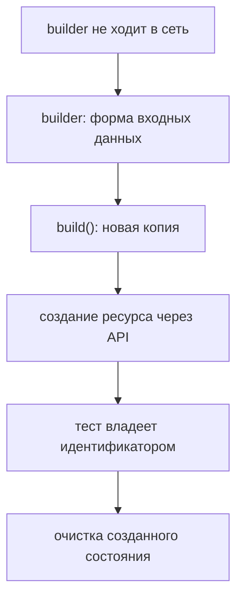

# Построители запросов и подготовка данных через API

## Связь с предыдущей главой

Глава 191 отделила доступ от бизнес-запросов. Следующая повторяющаяся проблема API-тестов — большие тела данных, в которых сценарий меняет только несколько полей.

## Цель главы

Использовать валидные значения по умолчанию, явные переопределения и уникальные данные без общего изменяемого состояния builder.

## Главный вопрос

Как создавать сложные тела запросов и тестовые данные без копирования деталей запроса?

## Мотивация

Копирование полного JSON в каждый тест скрывает важное отличие сценария. Один изменяемый глобальный объект, напротив, связывает тесты и делает результат зависимым от порядка.

## Теория

### Зачем нужен построитель

Построитель запроса создаёт валидное тело данных по умолчанию и позволяет явно изменить поля, важные для сценария.

Проблема, которую он решает, видна на объекте с десятью обязательными полями. Без построителя каждый тест копирует весь объект целиком, и отличие сценария тонет среди девяти неважных значений. С построителем в тесте остаётся ровно то, что отличает этот случай:

```ts
const payload = new TaskBuilder().withTitle("Регрессия").build();
```

Читатель сразу видит: всё остальное валидно и неважно, а важен здесь только `title`.

### Умолчания нейтральны, переопределения говорящие

Валидные значения по умолчанию должны быть нейтральными и понятными. Умолчание `title: "Задача"` нейтрально; умолчание `title: "ОШИБКА-ТЕСТ-123"` уже намекает на несуществующий смысл и путает читателя.

Переопределения, наоборот, показывают причину конкретного теста. `withTitle("")` в негативном сценарии объясняет, что проверяется пустое обязательное поле.

Полезная проверка на себе: если в тесте переопределено семь полей из десяти, умолчания подобраны неудачно — либо они не соответствуют типичному случаю, либо сценарию нужен другой построитель.

### `build()` обязан возвращать копию

Построитель хранит типизированную модель, методы возвращают `this` для последовательной настройки, а `build()` создаёт копию.

Последнее — не формальность. Если `build()` вернёт внутренний объект, все полученные значения окажутся одним и тем же объектом: изменение в одном тесте проявится в другом. Проверено на простом примере — метод, возвращающий внутреннее значение, отдаёт уже изменённый объект при следующем вызове.

Есть и вторая ловушка, менее очевидная. Поверхностная копия не защищает вложенные структуры:

```ts
const copy = { ...this.data };
copy.tags.push("b");     // this.data.tags тоже изменился
```

Проверено: после такой операции исходный массив содержит добавленный элемент. Если модель содержит массивы или вложенные объекты, копировать нужно и их.

### Уникальность данных

Уникальные данные предотвращают конфликт с параллельным или повторным запуском.

Источник уникальности должен быть контролируемым: идентификатор теста из `test.info()`, счётчик или генератор проекта. Случайное значение тоже работает, но хуже диагностируется — по названию `Задача-8f3a2c` невозможно понять, какой тест её создал.

Удобная форма — осмысленный префикс плюс уникальный суффикс: `Регрессия-<идентификатор теста>`. Тогда оставшиеся на стенде данные сами сообщают, откуда они взялись.

### Построитель не ходит в сеть

Это главная граница главы. Построитель не должен выполнять запросы HTTP: иначе создание данных и построение модели становятся одной скрытой операцией.

Последствия слияния заметны сразу: нельзя построить тело, не создав ресурс; нельзя проверить негативный сценарий, потому что построитель сам упадёт на неуспешном ответе; нельзя понять из теста, сколько запросов он выполняет.

Разделение простое: построитель отвечает за **форму входных данных**, клиент API — за **вызов**, тест — за владение результатом.

Он также не проверяет контракт ответа — это отдельная задача, и ей посвящены главы 193 и 195.

### Подготовка через API вместо UI

Подготовка через API создаёт ресурс быстрее, чем UI, если UI не является предметом проверки.

Выгода двойная. Скорость: создание заказа запросом занимает десятки миллисекунд вместо десятков секунд прохода по форме. И устойчивость: сломанная форма создания не должна ронять двадцать тестов, которые проверяют совсем другое.

Обратная сторона тоже есть — API-подготовка обходит валидацию интерфейса и может создать состояние, недостижимое для пользователя. Поэтому сам сценарий создания через UI должен быть покрыт отдельным тестом.

### Очистка и владение идентификатором

Договорённость об очистке определяет, кто и как удаляет созданные данные даже после падения проверки.

Тест отправляет данные через клиент API или фикстуру `request`, сохраняет идентификатор созданного ресурса и удаляет его в `finally`. Ключевые детали здесь две.

Очистка использует **идентификатор из ответа**, а не поиск по неуникальному имени: поиск может найти чужую запись, а при параллельном запуске — запись другого теста.

Очистка выполняется только если создание **действительно удалось**: попытка удалить несозданный ресурс маскирует исходную ошибку новым падением в блоке очистки.

### Когда построитель избыточен

Построители полезны для заказов, пользователей и конфигураций с большим количеством обязательных полей.

Для тела из двух полей обычная фабричная функция часто проще класса:

```ts
const task = (over = {}) => ({ title: "Задача", status: "NEW", ...over });
```

Она даёт те же умолчания и те же переопределения без конструктора, цепочки методов и отдельного файла. Класс оправдан, когда появляются условная логика построения, несколько вариантов сборки или валидация модели до отправки.

Форма данных и серверное состояние — разные обязанности:



## Внутренний механизм

Построитель хранит типизированную модель, методы возвращают `this` для последовательной настройки, а `build()` создаёт копию. Тест отправляет данные через клиент API или фикстуру `request`, сохраняет идентификатор созданного ресурса и удаляет его в `finally`.

### Почему `build()` обязан возвращать копию

```text
const base = workItem().withPriority("high");

const a = base.build();   // копия 1
const b = base.build();   // копия 2 — независимая

a.tags.push("smoke");     // копия 1 изменена
b.tags                    // ← если копия поверхностная, изменение видно и здесь
```

Возврат внутреннего объекта делит его между всеми вызывающими: правка в одном
тесте меняет подготовку другого. Но и `{ ...data }` защищает только верхний
уровень — вложенный массив остаётся общим, что видно в последней строке.

### Уникальность: время не годится, счётчик не переживает процессы

| Источник | Проблема |
| --- | --- |
| `Date.now()` | тысяча вызовов подряд возвращает одно значение |
| счётчик модуля | свой в каждом рабочем процессе, значения совпадают |
| случайное число | воспроизвести упавший прогон нечем |
| префикс прогона + счётчик | работает, но требует передать признак прогона |

Рабочая форма собирает идентификатор из признаков, различающих именно те
сущности, которые могут столкнуться: прогон, процесс, тест, порядковый номер.
Тогда конфликт по уникальному ключу становится невозможен, а по идентификатору
видно, чей это объект.

Вторая обязанность подготовки — запомнить идентификатор созданного ресурса
**сразу**, до первой проверки. Очистка, зарегистрированная после проверок, не
выполнится ровно в том случае, ради которого она нужна.
```text
examples/03-automation-qa/chapter-192/01-request-builder.api.ts
```

Пример создаёт данные задачи, запоминает полученный идентификатор и выполняет очистку только в том случае, если создание завершилось успешно.

## Главная ментальная модель

Построитель отвечает за форму входных данных, API создаёт серверный ресурс, а тест владеет идентификатором и очисткой созданного состояния.

## Практические примеры

- Значение `title` по умолчанию делает тело данных валидным.
- `withTitle()` показывает отличие сценария.
- Уникальный суффикс может происходить из сведений о тесте или контролируемого генератора.
- Очистка использует идентификатор из ответа, а не поиск по неуникальному имени.

## Automation QA

Построители полезны для заказов, пользователей и конфигураций с большим количеством обязательных полей. Для тела из двух полей обычная фабричная функция часто проще класса.

## Концептуальные границы и компромиссы

Построитель не должен выполнять запросы HTTP: иначе создание данных и построение модели становятся одной скрытой операцией. Он также не проверяет контракт ответа.

## Распространённые мифы

**Миф: `build()` может вернуть внутренний объект — так меньше кода.**
Тогда все тесты получат один объект, и изменение в одном проявится в другом.

**Миф: `{ ...data }` достаточно для копии.**
Поверхностная копия не защищает вложенные массивы и объекты: они остаются общими.

**Миф: построитель удобно научить самому создавать ресурс.**
Тогда построение модели и HTTP-вызов сливаются, и негативные сценарии становятся невозможны.

**Миф: случайные данные решают проблему уникальности.**
Уникальность — да, диагностируемость — нет. По случайному имени не видно, какой тест оставил запись.

**Миф: любой повторяющийся объект достоин построителя.**
Для тела из двух полей фабричная функция проще и понятнее класса.

## Частые вопросы

**Откуда брать уникальный суффикс?**
Из идентификатора теста в `test.info()` или контролируемого генератора проекта — так оставшиеся данные сообщают о своём происхождении.

**Что делать, если в тесте переопределено почти всё?**
Пересмотреть умолчания: они не отражают типичный случай, либо сценарию нужен отдельный построитель.

**Почему очистка ищет по идентификатору, а не по названию?**
Название не уникально. При параллельном запуске поиск может удалить запись другого теста.

**Нужно ли готовить данные через UI?**
Только если сам сценарий создания и есть предмет проверки. В остальных случаях API быстрее и устойчивее.

**Где размещать очистку?**
В `finally` или при освобождении фикстуры, и выполнять только при успешном создании — иначе исходная ошибка потеряется.

## Распространённые ошибки

- Возвращать один общий изменяемый объект — два теста получают ссылку на одни данные, и правка в одном меняет подготовку другого. Копия верхнего уровня (`{ ...data }`) при этом не защищает вложенный массив.

- Скрывать важное переопределение в значениях по умолчанию — если построитель сам подставляет статус, тест перестаёт сообщать, на каком состоянии он проверяется.

- Использовать временную метку как единственную стратегию уникальности без необходимости — подряд идущие вызовы `Date.now()` возвращают одно и то же значение, поэтому пять записей получат один идентификатор.

- Выполнять запрос внутри `build()` — построитель перестаёт быть чистым: его нельзя использовать для проверки, нельзя вызвать дважды и нельзя понять по имени, что он обращается к стенду.

- Не сохранять идентификатор созданного ресурса — удалить такую запись уже нечем, и стенд накапливает мусор от каждого прогона.

- Выполнять очистку только после успешной проверки — именно упавший тест оставляет данные. Очистку регистрируют сразу после создания записи.

## Краткие итоги

- Построитель уменьшает копирование сложных тел данных.
- Значения по умолчанию создают валидную основу.
- Переопределения показывают смысл сценария.
- Уникальные данные защищают независимые запуски.
- Очистка следует за владельцем созданного ресурса.

## Что нужно запомнить

- `build()` должен возвращать независимое значение.
- Построитель не является клиентом API.
- Идентификатор приходит из ответа сервера.
- Очистка размещается в `finally` или в управляемой фикстуре.
- Простым телам данных не всегда нужен построитель.

## Быстрая проверка

1. Зачем построителю валидные значения по умолчанию?
2. Что должно показывать переопределение сценария?
3. Почему глобальное тело данных опасно?
4. Кто владеет очисткой созданного ресурса?
5. Когда фабричная функция проще построителя?

### Ответы

1. Чтобы тест указывал только то, что важно для сценария. Остальные поля заполняются корректно и не отвлекают читателя.
2. Ровно то, что отличает этот сценарий от обычного. Всё, что переопределено, читается как условие теста.
3. Тесты начинают зависеть от одних и тех же данных: изменение в одном месте ломает другие, а параллельный запуск даёт конфликты.
4. Тест или фикстура, которая его создала, — в очистке, выполняющейся и при падении.
5. Когда полей мало и комбинаций немного. Сборщик оправдан там, где сочетаний много и нужно менять по одному полю.

## Практика

```text
practice/03-automation-qa/192-request-builders-and-api-data-setup.md
```

## Переход к следующей главе

Данные подготовлены и запрос выполнен. Глава 193 разделит проверки HTTP-контракта и бизнес-правила.
