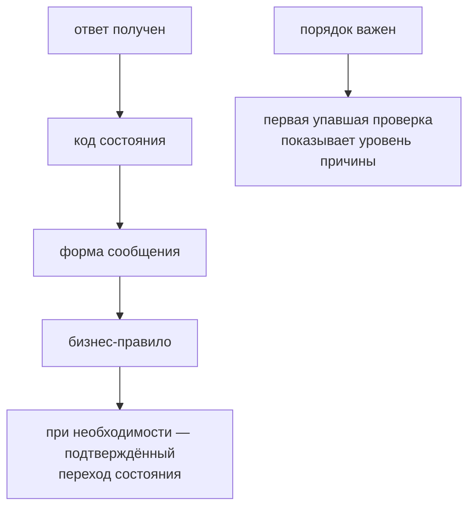

# Проверка API-ответов и бизнес-правил

## Связь с предыдущей главой

Глава 192 создала детерминированные входные данные. Теперь нужно проверить не только успешность вызова, но и сохранение ожидаемого смысла операции.

## Цель главы

Разделить проверки кода состояния и заголовков, формы ответа и бизнес-правил, сохранив полезные диагностические сообщения.

## Главный вопрос

Как разделить проверку HTTP-контракта и проверку ожидаемого поведения системы?

## Мотивация

Тест с одной проверкой на 201 может пропустить неверно сохранённые данные. Тест, сравнивающий весь JSON, может падать из-за нового необязательного поля, не нарушающего проверяемое правило.

## Теория

### Три уровня договорённости

Проверка API идёт от оболочки к смыслу, и каждый уровень отвечает на свой вопрос.

**HTTP-контракт** определяет код состояния, значимые заголовки и формат ответа. **Форма ответа** определяет обязательные поля и их типы во время выполнения. **Проверка бизнес-правила** сравнивает результат с ожиданием сценария: например, сохранено ли переданное название и осталось ли начальное состояние `completed` ложным.

Порядок не произволен. Читать тело имеет смысл только после того, как известно, что ответ вообще успешный и содержит JSON: иначе `json()` упадёт с невнятным сообщением о разборе, и настоящая причина — 500 вместо 201 — останется невидимой.

### Порядок проверок локализует причину

Тест сначала проверяет, что получил нужный класс результата и может безопасно читать тело. Затем проверяет связь заголовков с телом и только после этого бизнес-поля.

```ts
expect(response.status(), "ресурс должен быть создан").toBe(201);
expect(response.headers()["location"], "созданный ресурс должен быть адресуем").toBeTruthy();

const body = await response.json();
expect(body.title, "название должно сохраниться").toBe(expectedTitle);
expect(body.completed, "новая запись не может быть завершённой").toBe(false);
```

При падении сразу видно, какая граница нарушена: транспорт, форма сообщения или бизнес-правило. Тест, который сразу лезет в `body.title`, при любой проблеме сообщает одно и то же — что свойство неопределено.

### Ожидаемое значение выводится, а не подсматривается

Ожидаемое значение формируется из входных данных и правила системы. Фактическое значение извлекается из ответа или последующего чтения ресурса.

Это различие отделяет проверку от тавтологии. Сравнение `expect(body.status).toBe(body.status)` — очевидная ошибка, но её маскированная версия встречается часто: тест берёт значение из ответа, кладёт в переменную и «проверяет» его же. Такой тест проходит при любом поведении сервиса.

Ожидание должно приходить из двух источников: того, что тест отправил (`title`), и того, что обещает правило системы (новая запись создаётся в статусе `NEW`).

### Сообщение объясняет нарушенное ожидание

Диагностическое сообщение должно объяснять нарушенное ожидание, а не повторять синтаксис проверки.

Playwright принимает его вторым аргументом `expect`, и в отчёте оно идёт **первой строкой**, перед техническими подробностями:

```text
новая запись начинает жизненный цикл в NEW
expect(received).toBe(expected)
Expected: "DONE"
Received: "NEW"
```

Сообщение вида «статус должен совпадать» ничего не добавляет к тому, что и так видно. Полезное сообщение называет правило: «новая запись начинает жизненный цикл в NEW».

### Когда нужны все падения сразу

Обычный `expect` прерывает тест на первой ошибке. Иногда это неудобно: если в ответе разошлись три поля, хочется увидеть все три, а не чинить их по одному запуску.

Для этого есть `expect.soft`: проверка отмечает ошибку, но выполнение тела продолжается, а тест в итоге всё равно помечается неуспешным.

```ts
expect.soft(body.title, "название должно сохраниться").toBe(expectedTitle);
expect.soft(body.status, "новая запись начинает в NEW").toBe("NEW");
expect.soft(body.completed, "новая запись не завершена").toBe(false);
```

Проверено: после трёх мягких проверок тело продолжило выполняться, а накопленные ошибки попали в отчёт. Уместно это там, где проверки независимы. Если следующая проверка не имеет смысла после падения предыдущей — например, чтение поля у ненайденного ресурса, — нужен обычный `expect`.

### Подтверждение перехода состояния

Если операция должна изменить сохранённое состояние, последующее чтение подтверждает этот переход.

Ответ на запись говорит о том, что сервер **принял** операцию. Отдельный GET говорит, что он её **сохранил**. Это разные утверждения: сервис может вернуть корректное тело и не записать изменение.

Отдельный случай — асинхронная операция, принятая с кодом 202. Проверять её результат следующей строкой бессмысленно; нужно повторять чтение до ожидаемого состояния:

```ts
await expect.poll(async () => (await client.get(id)).status, {
  message: "обработка должна завершиться",
}).toBe("DONE");
```

`expect.poll` повторяет саму функцию, а не только сравнение — проверено на сервисе, отвечающем `PENDING` до третьего обращения.

### Сколько проверять

Не каждое поле ответа является контрактом текущего теста. Слишком слабая проверка даёт ложноположительный результат, слишком полная — хрупкость.

Ориентиры для отбора:

- поля, которые тест **отправил**, — они проверяют сохранение;
- поля, задаваемые **правилом системы**, — статус, вычисленные значения;
- поля, на которые опираются **следующие шаги** сценария.

Служебные заголовки, порядок свойств JSON, точные значения временных меток и внутренние идентификаторы в этот список не входят: они меняются по причинам, не связанным с проверяемым поведением.

Такая стратегия делает отчёт полезным без собственной библиотеки проверок: каждая проверка сообщает о своей границе, и по падению видно, где именно разошлись ожидание и реальность.

Проверка идёт от оболочки к смыслу:



## Внутренний механизм

Тест сначала проверяет, что получил нужный класс результата и может безопасно читать тело. Затем проверяет связь заголовков с телом и только после этого бизнес-поля. Если операция должна изменить сохранённое состояние, последующее чтение подтверждает этот переход. Такой порядок локализует причину падения.

```text
examples/03-automation-qa/chapter-193/01-response-validation.api.ts
```

Пример проверяет 201, `Location`, обязательную форму ответа и сохранённые значения, а затем читает созданный ресурс по ID. Он не фиксирует служебные заголовки и порядок свойств JSON.

## Главная ментальная модель

Проверка API идёт от оболочки к смыслу: HTTP-результат, форма сообщения, бизнес-правило, а при необходимости и подтверждённый переход состояния.

## Практические примеры

```ts
expect(response.status(), "ресурс должен быть создан").toBe(201);
expect(body.status, "новая запись начинает жизненный цикл в NEW").toBe("NEW");
expect(body.title, "название должно сохраниться").toBe(expectedTitle);
```

Проверки связаны, но каждая сообщает о своей границе.

## Automation QA

Такая стратегия делает отчёт полезным без собственной библиотеки проверок. Для критического перехода состояния можно выполнить второй GET и подтвердить серверный результат, если это входит в границы сценария.

## Концептуальные границы и компромиссы

Не каждое поле ответа является контрактом текущего теста. Слишком слабая проверка даёт ложноположительный результат, слишком полная — хрупкость. Выбор определяется проверяемым риском.

## Распространённые мифы

**Миф: проверять надо как можно больше полей.**
Избыточная проверка ломается от изменений, не связанных с поведением. Отбирают по риску и по роли поля в сценарии.

**Миф: успешный код состояния подтверждает бизнес-правило.**
201 говорит, что запрос обработан, а не что запись создана с нужным статусом.

**Миф: ответ на запись доказывает, что изменение сохранено.**
Он доказывает, что сервер принял операцию. Сохранение подтверждает отдельное чтение.

**Миф: `expect.soft` — просто более мягкий `expect`.**
Он уместен только для независимых проверок. После падения, делающего следующие проверки бессмысленными, нужен обычный.

**Миф: сообщение проверки — необязательное украшение.**
Оно идёт первой строкой отчёта и объясняет нарушенное правило вместо повторения синтаксиса.

## Частые вопросы

**В каком порядке проверять ответ?**
Код состояния, значимые заголовки, форма тела, бизнес-значения. Этот порядок локализует причину падения.

**Как отличить настоящую проверку от тавтологии?**
Ожидание должно выводиться из отправленных данных и правила системы, а не браться из того же ответа.

**Когда нужен второй GET?**
Когда сценарий утверждает сохранение или переход состояния, а не только приём операции.

**Что делать с ответом 202?**
Повторять чтение до ожидаемого состояния через `expect.poll`, а не проверять результат следующей строкой.

**Стоит ли проверять временные метки?**
Только факт их наличия или диапазон. Точное значение делает тест хрупким без пользы.

## Распространённые ошибки

- Проверять только `ok()`.
- Сравнивать весь динамический ответ.
- Игнорировать `Location` при создании ресурса.
- Проверять внутренние поля реализации.
- Писать сообщение «значения не равны» без бизнес-контекста.
- Смешивать проверку формы во время выполнения и бизнес-правило в одной неясной проверке.

## Краткие итоги

- HTTP-контракт и бизнес-правило требуют разных проверок.
- Проверка формы ответа предшествует безопасному использованию данных.
- Ожидаемое значение выводится из сценария.
- Диагностика называет нарушенное правило.
- Полнота проверки зависит от риска и контракта.

## Что нужно запомнить

- Начинайте с транспортного результата, заканчивайте бизнес-смыслом.
- Проверяйте только значимые заголовки.
- Не полагайтесь на порядок JSON properties.
- Избегайте как одной слабой, так и огромной хрупкой проверки.
- Делайте сообщения полезными для расследования.

## Быстрая проверка

1. Чем проверка HTTP-контракта отличается от проверки бизнес-правила?
2. Зачем проверять `Location`?
3. Почему сравнение всего ответа бывает хрупким?
4. Откуда берётся expected value?
5. Что должно сообщать описание проверки?

## Практика

```text
practice/03-automation-qa/193-api-response-and-business-rule-validation.md
```

## Переход к следующей главе

Позитивный результат проверен. Глава 194 покажет, как тестировать контролируемый отказ и отсутствие нежелательного побочного эффекта.
