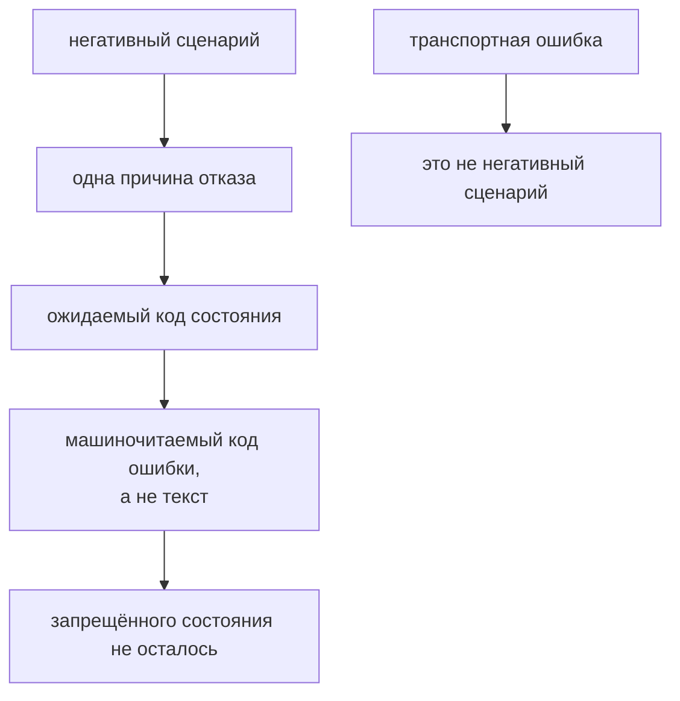

# Негативные API-сценарии и ошибки

## Связь с предыдущей главой

Глава 193 разделила уровни успешного ответа. Но устойчивый API-контракт также определяет, как система отклоняет недопустимую операцию.

## Цель главы

Проверять ожидаемый отказ по коду состояния, контракту ошибки и отсутствию нежелательных побочных эффектов.

## Главный вопрос

Как проверять контролируемый отказ, а не только успешный ответ?

## Мотивация

Тест, ожидающий лишь любой 4xx, может принять неправильную причину отказа. Проверка только тела ошибки может пропустить неверный код состояния или уже созданный ресурс.

## Теория

### Ожидаемый отказ — это успешный тест

Негативный сценарий отправляет контролируемо неверные данные или выполняет запрещённую операцию. Ожидаемый HTTP-ответ остаётся успешным результатом самого теста, если соответствует контракту отказа.

Это стоит проговорить, потому что путаница здесь мешает и коду, и отчётам. Тест «создание без обязательного поля отклоняется» проходит, когда сервер вернул 422. Он падает, когда сервер вернул 201 — то есть принял недопустимые данные.

Отсюда техническое следствие: в негативных тестах опция `failOnStatusCode` не нужна. С ней ожидаемый 422 превратится в исключение ещё до проверки.

### Классы отказов

| Код | Обычное значение |
| --- | --- |
| 400 | запрос нельзя корректно разобрать или принять на базовом уровне |
| 401 | аутентификация отсутствует или недействительна |
| 403 | субъект известен, но разрешений недостаточно |
| 404 | неизвестный ресурс |
| 405 | метод не поддерживается для этого маршрута |
| 409 | конфликт с текущим состоянием |
| 413 | тело запроса слишком велико |
| 415 | неподдерживаемый `Content-Type` |
| 422 | данные разобраны, но семантически недопустимы |

Особенно полезна пара 400 и 422. Первое означает «сообщение не разобрано» — сломанный JSON, отсутствующий заголовок. Второе — «сообщение понято, но содержимое недопустимо»: пустое обязательное поле, отрицательная сумма, дата в прошлом.

Эти значения являются распространёнными соглашениями, а не заменой документации API. Сервис вправе отвечать 400 там, где другой ответит 422, и проверять нужно его контракт.

### Одна причина на тест

Тест фиксирует **одну** причину отказа, отправляет запрос, проверяет точный код состояния и стабильный код ошибки.

Запрос с тремя дефектами сразу — пустым названием, неверным типом и отсутствующим token — вернёт один код, и какой именно, зависит от порядка проверок на сервере. Тест станет зависеть от деталей реализации и сломается при их изменении, ничего при этом не обнаружив.

### Проверять код ошибки, а не текст

Код состояния классифицирует отказ грубо: 422 может означать десяток разных нарушений. Поэтому контракт обычно содержит машиночитаемый код ошибки и, если это предусмотрено, указание на поле:

```ts
expect(response.status(), "пустое название недопустимо").toBe(422);
const body = await response.json();
expect(body.code, "сервис должен назвать причину отказа").toBe("TITLE_REQUIRED");
```

Текст сообщения для человека проверять не стоит: он меняется при переводе, редактуре и уточнении формулировок, а поведение при этом остаётся тем же. Проверка текста превращает работу редактора в падение тестов.

### Отказ не должен оставлять следов

После отказа полезно прочитать ресурс или коллекцию и убедиться, что сервер не применил часть операции.

Это третья и самая ценная часть негативного теста. Сервис может вернуть корректный 422 и при этом успеть создать запись, списать средства или отправить уведомление — особенно если валидация распределена по шагам обработки.

Негативный API-тест доказывает три вещи: отказ произошёл по правильной причине, описан правильным контрактом и не оставил запрещённого состояния. Без третьей проверки тест подтверждает только формат ответа.

### Транспортная ошибка — не негативный сценарий

Транспортная ошибка не считается ожидаемым негативным ответом: сервер должен вернуть контролируемое HTTP-сообщение.

Разорванное соединение, недоступный узел или истёкшее время ожидания не дают ни кода состояния, ни тела — проверять там нечего. Если негативный тест «проходит» из-за того, что стенд не поднялся, он не проверяет ничего.

Практический приём: негативный тест должен получать **ответ**. Если вызов выбросил исключение о соединении, это проблема окружения, а не подтверждённый контракт отказа.

### Что выбирать для проверки

Не нужно перебирать каждую случайную комбинацию полей. Выбирайте классы ошибок, связанные с контрактом и риском.

Рабочий минимум для операции создания или изменения:

- отсутствующее обязательное поле;
- значение неверного типа или вне допустимого диапазона;
- отсутствие учётных данных и недостаток прав;
- конфликт с существующим состоянием, если уникальность входит в контракт;
- неподдерживаемый формат тела, если сервис принимает несколько.

Негативные тесты особенно важны для операций создания и изменения: именно там неверно принятые данные оставляют долгоживущие последствия.

При этом негативный тест не должен становиться тестированием безопасности или нагрузки. Перебор инъекций, попытки обхода авторизации и поведение под нагрузкой — отдельные дисциплины со своими инструментами и своими границами ответственности.

Негативный тест доказывает три вещи сразу:



## Внутренний механизм

Тест фиксирует одну причину отказа, отправляет запрос, проверяет точный код состояния и стабильный код ошибки, затем подтверждает отсутствие побочного эффекта. Транспортная ошибка не считается ожидаемым негативным ответом: сервер должен вернуть контролируемое HTTP-сообщение.

```text
examples/03-automation-qa/chapter-194/01-negative-scenarios.api.ts
```

Пример отправляет пустое обязательное поле и слишком большое тело запроса, получает контролируемые 422 и 413, а для неподдерживаемого метода проверяет 405 вместе с заголовком `Allow`. После этого тест подтверждает, что коллекция задач осталась пустой.

## Главная ментальная модель

Негативный API-тест доказывает три вещи: отказ произошёл по правильной причине, описан правильным контрактом и не оставил запрещённого состояния.

## Практические примеры

- Невалидные данные: код состояния и код конкретного поля.
- Отсутствующий token: 401 без раскрытия чувствительных деталей.
- Недостаточные разрешения: 403.
- Неизвестный ID: 404.
- Дубликат уникального ресурса: 409.
- Неверный `Content-Type`: 415.

## Automation QA

Негативные тесты особенно важны для операций создания и изменения. После отказа полезно прочитать ресурс или коллекцию и убедиться, что сервер не применил часть операции.

## Концептуальные границы и компромиссы

Не нужно перебирать каждую случайную комбинацию полей. Выбирайте классы ошибок, связанные с контрактом и риском. Негативный тест не должен становиться тестированием безопасности или нагрузки.

## Распространённые мифы

**Миф: негативный тест — это тест, который падает.**
Он проходит, когда система отказала по контракту, и падает, когда она приняла недопустимое.

**Миф: достаточно проверить код состояния.**
422 покрывает десяток разных нарушений. Причину называет машиночитаемый код ошибки.

**Миф: текст сообщения об ошибке стоит проверять.**
Он меняется при переводе и редактуре, не меняя поведения. Проверяют код, а не формулировку.

**Миф: после отказа проверять нечего.**
Сервис мог применить часть операции. Отсутствие побочного эффекта — отдельная проверка.

**Миф: недоступный сервер — тоже негативный сценарий.**
Это проблема окружения. Негативный тест должен получить контролируемый HTTP-ответ.

## Частые вопросы

**Чем 400 отличается от 422?**
400 — сообщение не разобрано, 422 — разобрано, но содержимое недопустимо. Конкретику задаёт контракт сервиса.

**Можно ли проверить несколько дефектов одним запросом?**
Лучше нет: вернётся один код, зависящий от порядка проверок на сервере. Тест станет зависеть от реализации.

**Нужен ли `failOnStatusCode` в негативных тестах?**
Нет. С ним ожидаемый отказ превратится в исключение до проверки.

**Как убедиться, что отказ не оставил следов?**
Прочитать коллекцию или ресурс после отказа и проверить, что состояние не изменилось.

**Сколько негативных сценариев писать?**
По одному на класс ошибки из контракта, а не на каждую комбинацию значений.

## Распространённые ошибки

- Принимать любой 4xx как правильный отказ.
- Не проверять код ошибки или форму сообщения.
- Игнорировать побочный эффект после ошибки.
- Считать тайм-аут ожидаемым негативным ответом.
- Проверять секретные подробности error message.
- Делать негативные сценарии зависимыми от порядка.

## Краткие итоги

- Ожидаемый отказ является контролируемым HTTP-ответом.
- Код состояния и тело ошибки проверяются вместе.
- Причина отказа должна быть однозначной.
- Побочный эффект после ошибки проверяется отдельно.
- Набор негативных сценариев определяется рисками.

## Что нужно запомнить

- Негативный ответ не равен транспортной ошибке.
- Проверяйте точный класс ошибки.
- Не раскрывайте чувствительные детали.
- Подтверждайте отсутствие нежелательной мутации.
- Не превращайте главу в тестирование безопасности.

## Быстрая проверка

1. Почему любого 4xx недостаточно?
2. Чем 401 отличается от 403?
3. Когда полезен 409?
4. Что такое побочный эффект отказа?
5. Почему тайм-аут не является контрактом ошибки?

## Практика

```text
practice/03-automation-qa/194-negative-api-scenarios-and-errors.md
```

## Переход к следующей главе

Негативный ответ всё равно приходит как внешний JSON. Глава 195 покажет, почему TypeScript-типы не проверяют его автоматически и где нужна проверка во время выполнения.
