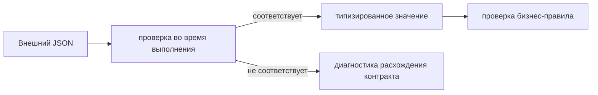

# Проверка контрактов во время выполнения

## Связь с предыдущей главой

Главы 193–194 проверяли поля успешных и ошибочных ответов. Но TypeScript-аннотация не меняет данные, пришедшие по сети, и не гарантирует их форму.

## Цель главы

Провести границу между типами на этапе компиляции, проверкой во время выполнения, проверкой контракта и проверкой бизнес-правила.

## Главный вопрос

Как проверить внешний ответ во время выполнения, если TypeScript не валидирует данные во время выполнения?

## Мотивация

Запись `const body = await response.json() as Profile` заставляет компилятор доверять программисту. Если сервер вернёт number вместо string, проверка или рабочий код может получить ошибку позднее.

## Теория

### Почему типов недостаточно

TypeScript проверяет код до запуска и удаляет типы при компиляции. Внешний JSON появляется только во время выполнения, поэтому должен пройти реальную проверку значений.

Опасность не в том, что тип «не сработает», а в том, что он создаёт ложную уверенность:

```ts
const profile = (await response.json()) as Profile;
console.log(profile.id.toUpperCase());
```

Этот код компилируется без единого замечания. Если сервер вернул `id: null`, падение случится на `toUpperCase()` — с сообщением о `null`, без единого слова о том, что нарушен контракт API. Утверждение типа ничего не проверяет, оно лишь отключает вопросы компилятора.



### Два уровня проверки отвечают на разные вопросы

Расхождение контракта — отличие фактического ответа от согласованной формы.

**Проверка контракта** сообщает о структуре и типах: есть ли обязательные поля, тех ли они типов. **Проверка бизнес-правила** подтверждает смысл конкретного сценария: сохранилось ли переданное название, верен ли начальный статус.

Оба уровня нужны, но отвечают на разные вопросы. Бизнес-проверка без проверки контракта даёт невнятные падения: «ожидалось NEW, получено undefined» вместо «в ответе нет поля status».

### Как устроен type guard

Type guard принимает `unknown`, проверяет границу объекта и тип каждого обязательного свойства:

```ts
const isProfile = (value: unknown): value is Profile => {
  if (typeof value !== "object" || value === null) return false;
  return "id" in value
    && typeof value.id === "string"
    && "active" in value
    && typeof value.active === "boolean";
};
```

Здесь важны две детали, проверенные компилятором проекта.

Проверка `typeof value !== "object" || value === null` обязательна: без неё `unknown` не сужается, и обратиться к свойству нельзя. А оператор `in` нужен, чтобы получить доступ к свойству у суженного `object`: прямое `value.id` после одной лишь проверки на объект компилятор отклонит.

После успешной проверки TypeScript сужает значение, и дальше `value.id` — это `string` без всяких утверждений.

### Что проверять, а что нет

Необязательное поле проверяется только при наличии, а вложенные объекты и массивы требуют последовательной проверки своей структуры.

Дополнительные поля разрешаются или запрещаются согласно контракту, а не по умолчанию. Это существенно: сервис, который добавил новое поле в ответ, обычно не сломал совместимость — а строгая проверка «никаких лишних полей» уронит тесты на безобидном изменении.

Слишком строгая проверка необязательных полей может мешать прямой совместимости, поэтому строгость должна соответствовать договорённости.

### Диагностика важнее факта несовпадения

При несовпадении тест должен показать, какое требование контракта нарушено.

Булев страж этого не делает: он возвращает `false`, и сообщение выглядит как «ожидалось true». Поэтому в тесте страж обычно сопровождают понятным сообщением, а при развитом контракте функцию проверки делают возвращающей список нарушений:

```ts
expect(isProfile(body), "ответ должен соответствовать контракту Profile").toBe(true);
```

Разница видна в отчёте: вместо загадочного падения на чтении поля появляется прямое указание на расхождение контракта — и это меняет адресата задачи с автора теста на владельца сервиса.

### Где проходит граница этой главы

OpenAPI и JSON Schema могут быть источниками контракта. Проверяющая функция сравнивает полученное значение с правилами во время выполнения.

В этой главе не строится платформа генерации: достаточно понять границу и использовать небольшой явный type guard для локального примера. Type guard удобен для маленькой модели, но плохо масштабируется на большой контракт — вручную описывать сорок полей с вложенностью бессмысленно.

OpenAPI или JSON Schema могут стать источником автоматизации позже, однако эта глава не вводит новую зависимость или платформу проверки контрактов.

### Где проверять контракт

Проверка контракта полезна на границах внешних сервисов и общих API — там, где форму данных определяет не ваша команда.

Практическое разделение по местам:

- **клиент API** — минимальная проверка, без которой он не может работать;
- **тест контракта** — полная проверка формы для ключевых ответов;
- **обычный тест** — бизнес-проверки, опирающиеся на уже подтверждённую форму.

Проверять полную форму в каждом тесте не нужно: это дублирование, которое придётся править при каждом изменении модели. Достаточно отдельных тестов контракта на ключевые ответы плюс проверки тех полей, на которые опирается конкретный сценарий.

## Внутренний механизм

Type guard принимает `unknown`, проверяет границу объекта и тип каждого обязательного свойства. Необязательное поле проверяется только при наличии, а вложенные объекты и массивы требуют последовательной проверки своей структуры. Дополнительные поля разрешаются или запрещаются согласно контракту, а не по умолчанию. После успешной проверки TypeScript сужает значение. При несовпадении тест должен показать, какое требование контракта нарушено.

```text
examples/03-automation-qa/chapter-195/01-runtime-contract.api.ts
```

Пример проверяет `id: string` и `active: boolean`, затем использует значение как `Profile` и отдельно подтверждает, что type guard отклоняет ответ с неверными типами. Type assertion для проверки внешнего значения не используется.

## Главная ментальная модель

TypeScript проверяет наше предположение о коде, проверка во время выполнения исследует фактические внешние данные, а проверка бизнес-правила подтверждает ожидаемое поведение.

## Практические примеры

```ts
const isProfile = (value: unknown): value is Profile => {
  if (typeof value !== "object" || value === null) return false;
  return "id" in value
    && typeof value.id === "string"
    && "active" in value
    && typeof value.active === "boolean";
};
```

## Automation QA

Проверка контракта полезна на границах внешних сервисов и общих API. Слишком строгая проверка необязательных полей может мешать прямой совместимости, поэтому строгость должна соответствовать договорённости.

## Концептуальные границы и компромиссы

Type guard удобен для маленькой модели, но плохо масштабируется на большой контракт. OpenAPI или JSON Schema могут стать источником автоматизации позже, однако эта глава не вводит новую зависимость или платформу проверки контрактов.

## Распространённые мифы

**Миф: типы проверяют ответ сервера.**
Они проверяют код до запуска. JSON приходит во время выполнения, когда типов уже нет.

**Миф: `as Profile` приводит значение к типу.**
Оно ничего не проверяет и не меняет. Падение случится позже и в другом месте.

**Миф: страж должен запрещать лишние поля.**
Только если так сказано в контракте. Иначе добавленное сервисом поле уронит тесты без причины.

**Миф: проверять контракт нужно в каждом тесте.**
Это дублирование. Полная проверка — в отдельных тестах контракта, в остальных — нужные сценарию поля.

**Миф: `typeof value === "object"` достаточно для доступа к свойствам.**
Нужна ещё проверка на `null` и оператор `in` — иначе компилятор не даст обратиться к полю.

## Частые вопросы

**Чем проверка контракта отличается от бизнес-проверки?**
Первая отвечает, та ли форма у ответа; вторая — верен ли смысл результата. Без первой падения второй невнятны.

**Почему страж принимает `unknown`, а не `any`?**
`any` отключает проверки и позволяет обратиться к чему угодно. `unknown` заставляет проверить значение перед использованием.

**Как сделать падение понятным?**
Сопроводить проверку сообщением о нарушенном контракте либо возвращать из функции список расхождений вместо булева значения.

**Что делать с большим контрактом?**
Ручной страж плохо масштабируется. Источником проверки становятся OpenAPI или JSON Schema — но это уже отдельная инфраструктура.

**Нужно ли проверять необязательные поля?**
Только при их наличии в ответе. Требовать их — значит нарушить собственный контракт.

## Распространённые ошибки

- Считать interface проверкой во время выполнения.
- Использовать `as Profile` сразу после `json()`.
- Проверять бизнес-значения вместо формы и называть это проверкой контракта.
- Требовать отсутствие всех неизвестных полей без договорённости.
- Показывать ошибку без пути к несовпавшему полю.
- Проектировать архитектуру валидатора до появления задачи.

## Краткие итоги

- TypeScript-типы исчезают до получения ответа.
- Внешние данные начинают путь как `unknown`.
- Проверка во время выполнения проверяет фактическую форму.
- Проверка контракта и проверка бизнес-правила различаются.
- Строгость влияет на прямую совместимость.

## Что нужно запомнить

- Type assertion не проверяет данные.
- Сначала валидируйте, затем используйте тип.
- Расхождение контракта должно давать диагностическое сообщение.
- Не смешивайте форму и бизнес-смысл.
- Выбирайте инструмент по размеру контракта.

## Быстрая проверка

1. Почему interface не проверяет JSON?
2. Зачем начинать с `unknown`?
3. Что проверяет type guard?
4. Чем проверка контракта отличается от проверки бизнес-правила?
5. Как строгость влияет на совместимость?

## Практика

```text
practice/03-automation-qa/195-runtime-contract-validation.md
```

## Переход к следующей главе

API-слой умеет создавать данные и проверять ответы. Глава 196 объединит его с UI так, чтобы предмет проверки и очистка оставались явными.
