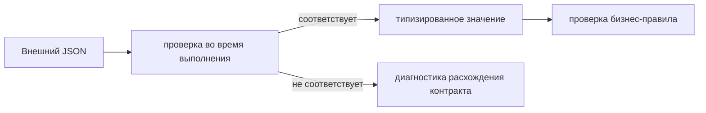

# Проверка контрактов во время выполнения

## Связь с предыдущей главой

Главы 193–194 проверяли поля успешных и ошибочных ответов. Но TypeScript-аннотация не меняет данные, пришедшие по сети, и не гарантирует их форму.

## Цель главы

Провести границу между типами на этапе компиляции, проверкой во время выполнения, проверкой контракта и проверкой бизнес-правила.

## Главный вопрос

Как проверить внешний ответ во время выполнения, если TypeScript не валидирует данные во время выполнения?

## Мотивация

Запись `const body = await response.json() as Profile` заставляет компилятор доверять программисту. Если сервер вернёт number вместо string, проверка или рабочий код может получить ошибку позднее.

## Теория

TypeScript проверяет код до запуска и удаляет типы при компиляции. Внешний JSON появляется только во время выполнения, поэтому должен пройти реальную проверку значений.

OpenAPI и JSON Schema могут быть источниками контракта. Проверяющая функция сравнивает полученное значение с правилами во время выполнения. В этой главе не строится платформа генерации: достаточно понять границу и использовать небольшой явный type guard для локального примера.

Расхождение контракта — отличие фактического ответа от согласованной формы. Проверка контракта сообщает о структуре и типах. Проверка бизнес-правила подтверждает смысл конкретного сценария. Оба уровня нужны, но отвечают на разные вопросы.



## Внутренний механизм

Type guard принимает `unknown`, проверяет границу объекта и тип каждого обязательного свойства. Необязательное поле проверяется только при наличии, а вложенные объекты и массивы требуют последовательной проверки своей структуры. Дополнительные поля разрешаются или запрещаются согласно контракту, а не по умолчанию. После успешной проверки TypeScript сужает значение. При несовпадении тест должен показать, какое требование контракта нарушено.

```text
examples/03-automation-qa/chapter-195/01-runtime-contract.api.ts
```

Пример проверяет `id: string` и `active: boolean`, затем использует значение как `Profile` и отдельно подтверждает, что type guard отклоняет ответ с неверными типами. Type assertion для проверки внешнего значения не используется.

## Главная ментальная модель

TypeScript проверяет наше предположение о коде, проверка во время выполнения исследует фактические внешние данные, а проверка бизнес-правила подтверждает ожидаемое поведение.

## Практические примеры

```ts
const isProfile = (value: unknown): value is Profile => {
  if (typeof value !== "object" || value === null) return false;
  return "id" in value
    && typeof value.id === "string"
    && "active" in value
    && typeof value.active === "boolean";
};
```

## Automation QA

Проверка контракта полезна на границах внешних сервисов и общих API. Слишком строгая проверка необязательных полей может мешать прямой совместимости, поэтому строгость должна соответствовать договорённости.

## Концептуальные границы и компромиссы

Type guard удобен для маленькой модели, но плохо масштабируется на большой контракт. OpenAPI или JSON Schema могут стать источником автоматизации позже, однако эта глава не вводит новую зависимость или платформу проверки контрактов.

## Распространённые ошибки

- Считать interface проверкой во время выполнения.
- Использовать `as Profile` сразу после `json()`.
- Проверять бизнес-значения вместо формы и называть это проверкой контракта.
- Требовать отсутствие всех неизвестных полей без договорённости.
- Показывать ошибку без пути к несовпавшему полю.
- Проектировать архитектуру валидатора до появления задачи.

## Краткие итоги

- TypeScript-типы исчезают до получения ответа.
- Внешние данные начинают путь как `unknown`.
- Проверка во время выполнения проверяет фактическую форму.
- Проверка контракта и проверка бизнес-правила различаются.
- Строгость влияет на прямую совместимость.

## Что нужно запомнить

- Type assertion не проверяет данные.
- Сначала валидируйте, затем используйте тип.
- Расхождение контракта должно давать диагностическое сообщение.
- Не смешивайте форму и бизнес-смысл.
- Выбирайте инструмент по размеру контракта.

## Быстрая проверка

1. Почему interface не проверяет JSON?
2. Зачем начинать с `unknown`?
3. Что проверяет type guard?
4. Чем проверка контракта отличается от проверки бизнес-правила?
5. Как строгость влияет на совместимость?

## Практика

```text
practice/03-automation-qa/195-runtime-contract-validation.md
```

## Переход к следующей главе

API-слой умеет создавать данные и проверять ответы. Глава 196 объединит его с UI так, чтобы предмет проверки и очистка оставались явными.
