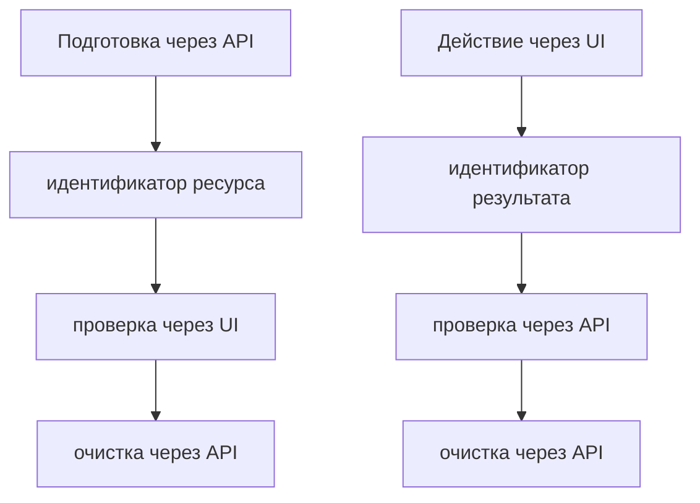

# Совместные UI и API-сценарии

## Связь с предыдущей главой

Главы 186–195 построили границу тестирования REST API. UI-модуль уже умеет проверять браузерное поведение. Теперь эти слои можно соединить в одном сценарии без смешения ответственности.

## Цель главы

Использовать API для подготовки, очистки и межслойной проверки, сохраняя UI предметом проверки там, где это требуется сценарием.

## Главный вопрос

Как использовать API для подготовки и очистки данных, сохраняя UI как предмет проверки?

## Мотивация

Создание всех данных через UI делает тест медленным и хрупким. Полная замена UI API-вызовами перестаёт проверять пользовательский путь. Совместный сценарий должен явно определить, какой слой создаёт действие и какой наблюдает результат.

## Теория

Подготовка через API создаёт необходимые данные до UI-действия. Проверка через UI подтверждает, что интерфейс показывает серверное состояние. Обратный сценарий выполняет действие через UI и читает результат через API.

Общий идентификатор связывает слои: ID из подготовки через API передаётся в URL или поиск через UI, а ID из результата UI используется для проверки через API. Поиск по неуникальному `title` делает тест зависимым от старых данных.

Очистка через API обычно быстрее и надёжнее UI-удаления. Владелец созданного ресурса сохраняет идентификатор и выполняет очистку в `finally`, даже если проверка падает.



## Внутренний механизм

Playwright Test может предоставить `page` и `request` одному тесту. Эти fixtures имеют разные клиентские состояния, но обращаются к одному стенду. Серверное состояние связывается только явным ID ресурса.

```text
examples/03-automation-qa/chapter-196/01-ui-api-scenario.api.ts
```

Пример открывает локальную страницу, создаёт задачу через UI, ожидает отображения ID, читает ресурс через API и удаляет его через API в `finally`.

## Главная ментальная модель

Слои взаимодействуют через идентификатор и наблюдаемый результат: API подготавливает или проверяет данные, UI остаётся владельцем пользовательского действия.

## Практические примеры

- Подготовка через API → открыть UI конкретного ресурса → проверить отображение.
- Действие через UI → получить ID → проверить серверное состояние через API.
- Очистка через API в `finally` независимо от результата UI-проверки.
- Единое каноническое тело данных помогает сравнить данные между слоями, но не создаёт окончательный framework.

## Automation QA

Межслойные сценарии уменьшают время подготовки и дают более точную диагностику. Их следует использовать для важной связи слоёв, а не превращать каждый UI-тест в повторную полную API-проверку.

## Концептуальные границы и компромиссы

Совместный тест затрагивает больше компонентов: падение может происходить в UI, API или данных. Поэтому действие, идентификатор и проверки должны быть видимы. Эта глава завершает модуль REST API, но не собирает окончательный framework.

## Распространённые ошибки

- Создавать необходимые данные через UI без причины.
- Проверять только API и называть сценарий UI-тестом.
- Связывать слои по неуникальному `title`.
- Терять ID до очистки.
- Считать новый APIRequestContext очисткой серверных данных.
- Скрывать все межслойные шаги внутри одной fixture.

## Краткие итоги

- API ускоряет подготовку и очистку UI-сценария.
- UI остаётся предметом проверки пользовательского поведения.
- Идентификатор связывает наблюдения разных слоёв.
- Очистка принадлежит владельцу созданного ресурса.
- Совместный тест требует ясной диагностики.

## Что нужно запомнить

- Сначала определите предмет проверки.
- Передавайте идентификатор явно.
- Не полагайтесь на старое серверное состояние.
- Выполняйте очистку даже после падения.
- Не превращайте интеграцию двух слоёв в окончательный framework.

## Быстрая проверка

1. Когда полезна подготовка через API для UI-теста?
2. Как идентификатор связывает слои?
3. Кто выполняет очистку?
4. Почему поиск по title опасен?
5. Как сохранить UI предметом проверки?

## Практика

```text
practice/03-automation-qa/196-combined-ui-and-api-scenarios.md
```

## Переход к следующей главе

Модуль REST API завершён. Глава 197 начнёт отдельный модуль и сравнит gRPC и REST в тестовой архитектуре без изменения уже построенных HTTP-границ.
