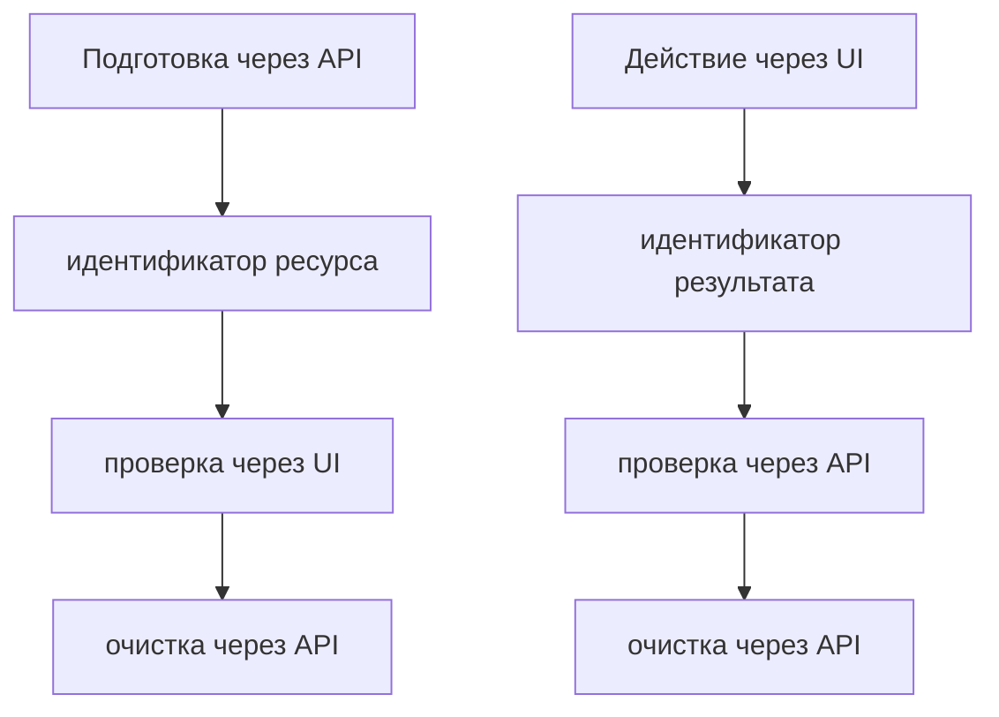

# Совместные UI и API-сценарии

## Связь с предыдущей главой

Главы 186–195 построили границу тестирования REST API. UI-модуль уже умеет проверять браузерное поведение. Теперь эти слои можно соединить в одном сценарии без смешения ответственности.

## Цель главы

Использовать API для подготовки, очистки и межслойной проверки, сохраняя UI предметом проверки там, где это требуется сценарием.

## Главный вопрос

Как использовать API для подготовки и очистки данных, сохраняя UI как предмет проверки?

## Мотивация

Создание всех данных через UI делает тест медленным и хрупким. Полная замена UI API-вызовами перестаёт проверять пользовательский путь. Совместный сценарий должен явно определить, какой слой создаёт действие и какой наблюдает результат.

## Теория

### Два направления межслойного сценария

Есть ровно два полезных способа соединить слои, и различаются они тем, где находится проверяемое действие.

**Подготовка через API → проверка через UI.** API создаёт необходимые данные до UI-действия, а интерфейс подтверждает, что показывает серверное состояние. Предмет проверки — отображение.

**Действие через UI → проверка через API.** Сценарий выполняет действие через интерфейс и читает результат через API. Предмет проверки — что интерфейс действительно изменил систему, а не просто нарисовал успех.



Оба направления оставляют владельцем пользовательского действия UI, а API используют там, где интерфейс не является предметом проверки.

### Идентификатор — единственная связь между слоями

Playwright Test может предоставить `page` и `request` одному тесту. Эти fixtures имеют разные клиентские состояния, но обращаются к одному стенду. Серверное состояние связывается только явным ID ресурса.

Это утверждение стоит понимать буквально. У `page` и `request` разные cookies; общая у них только система по ту сторону. Поэтому связать слои можно лишь через данные: ID из подготовки через API передаётся в URL или поиск через UI, а ID из результата UI используется для проверки через API.

Поиск по неуникальному `title` делает тест зависимым от старых данных: при параллельном запуске найдётся чужая запись, а при повторном — оставшаяся от прошлого прогона.

### Как получить идентификатор из UI-действия

В направлении «действие через UI» идентификатор нужно откуда-то взять, и это самое хрупкое место сценария.

Работающие источники, от надёжного к сомнительному:

- **интерфейс показывает ID** — сценарий просто читает его;
- **адрес страницы содержит ID** после перехода на созданный ресурс;
- **тест ищет запись по уникальному значению**, которое сам же задал при вводе.

Последний вариант приемлем именно потому, что уникальность обеспечил сам тест: `Регрессия-<идентификатор теста>` не совпадёт ни с чужими данными, ни с прошлым прогоном. Поиск по значению, которое тест не контролирует, работать не будет.

### Авторизация в двух слоях

Практическая деталь, о которую спотыкаются при первом же межслойном тесте: встроенная fixture `request` не делит cookies с браузером. Запрос через неё уходит анонимным, даже если в браузере пользователь авторизован.

Отсюда два варианта. Если API-запрос должен выполняться от имени того же пользователя — берут `context.request`. Если это независимая подготовка или проверка под своей учётной записью — подходит обычная fixture `request` с собственным token.

### Очистка через API

Очистка через API обычно быстрее и надёжнее UI-удаления: она не зависит от вёрстки, не требует навигации и работает, даже если интерфейс сломан именно в той части, которую проверял тест.

Владелец созданного ресурса сохраняет идентификатор и выполняет очистку в `finally`, даже если проверка падает. Причём очистка выполняется только при успешном создании — иначе падение в блоке очистки заслонит настоящую ошибку.

### Диагностика в обмен на охват

Совместный тест затрагивает больше компонентов: падение может происходить в UI, API или данных. Это осознанный обмен — быстрее подготовка и точнее проверка, но шире область расследования.

Компенсируется он видимостью. Действие, идентификатор и проверки должны быть видимы в теле теста:

```ts
const created = await tasks.create({ title });      // подготовка, слой виден
await page.goto(`/tasks/${created.id}`);            // идентификатор виден
await expect(page.getByText(title)).toBeVisible();  // проверка видна
```

Тест, в котором подготовка спрятана в fixture без имени, а идентификатор нигде не появляется, при падении не подсказывает даже, на каком слое искать.

### Где остановиться

Межслойные сценарии уменьшают время подготовки и дают более точную диагностику. Их следует использовать для важной связи слоёв, а не превращать каждый UI-тест в повторную полную API-проверку.

Практический ориентир: API в UI-тесте отвечает за **подготовку и очистку** всегда, а за **проверку** — только когда проверяемый факт нельзя увидеть в интерфейсе или когда важно подтвердить, что изменение действительно сохранено. Дублировать через API то, что уже проверено на экране, смысла нет.

Единое каноническое тело данных помогает сравнить данные между слоями, но не создаёт окончательный framework. Эта глава завершает модуль REST API — архитектура собирается постепенно, а не одним решением.

## Внутренний механизм

Playwright Test может предоставить `page` и `request` одному тесту. Эти fixtures имеют разные клиентские состояния, но обращаются к одному стенду. Серверное состояние связывается только явным ID ресурса.

```text
examples/03-automation-qa/chapter-196/01-ui-api-scenario.api.ts
```

Пример открывает локальную страницу, создаёт задачу через UI, ожидает отображения ID, читает ресурс через API и удаляет его через API в `finally`.

## Главная ментальная модель

Слои взаимодействуют через идентификатор и наблюдаемый результат: API подготавливает или проверяет данные, UI остаётся владельцем пользовательского действия.

## Практические примеры

- Подготовка через API → открыть UI конкретного ресурса → проверить отображение.
- Действие через UI → получить ID → проверить серверное состояние через API.
- Очистка через API в `finally` независимо от результата UI-проверки.
- Единое каноническое тело данных помогает сравнить данные между слоями, но не создаёт окончательный framework.

## Automation QA

Межслойные сценарии уменьшают время подготовки и дают более точную диагностику. Их следует использовать для важной связи слоёв, а не превращать каждый UI-тест в повторную полную API-проверку.

## Концептуальные границы и компромиссы

Совместный тест затрагивает больше компонентов: падение может происходить в UI, API или данных. Поэтому действие, идентификатор и проверки должны быть видимы. Эта глава завершает модуль REST API, но не собирает окончательный framework.

## Распространённые мифы

**Миф: `page` и `request` делят авторизацию.**
У них разные клиентские состояния. Cookies браузера доступны через `context.request`, а не через встроенную fixture.

**Миф: слои можно связать поиском по названию.**
Название неуникально. Связь даёт идентификатор ресурса, а поиск по значению допустим только если уникальность задал сам тест.

**Миф: очистку удобнее делать через UI — «как пользователь».**
Очистка не является предметом проверки. Через API она быстрее и не ломается вместе с интерфейсом.

**Миф: чем больше проверок через API в UI-тесте, тем надёжнее.**
Дублирование проверенного на экране только расширяет область падения. API проверяет то, чего в интерфейсе не видно.

**Миф: межслойный тест всегда лучше чистого UI-теста.**
Он затрагивает больше компонентов и требует более широкого расследования при падении. Это обмен, а не улучшение.

## Частые вопросы

**Как получить ID созданной через интерфейс записи?**
Из самого интерфейса, из адреса страницы или поиском по значению, уникальность которого обеспечил тест.

**Какую fixture использовать для API-запроса от имени вошедшего пользователя?**
`context.request` — она использует cookies браузерного контекста.

**Где размещать очистку?**
В `finally` или teardown, и только при успешном создании: иначе исходная ошибка потеряется.

**Стоит ли готовить данные через UI?**
Только если сам процесс создания и есть предмет проверки. В остальных случаях это медленно и хрупко.

**Тест упал — как понять, какой слой виноват?**
По видимым в теле теста шагам: если подготовка и идентификатор не скрыты, место падения указывает на слой.

## Распространённые ошибки

- Создавать необходимые данные через UI без причины.
- Проверять только API и называть сценарий UI-тестом.
- Связывать слои по неуникальному `title`.
- Терять ID до очистки.
- Считать новый APIRequestContext очисткой серверных данных.
- Скрывать все межслойные шаги внутри одной fixture.

## Краткие итоги

- API ускоряет подготовку и очистку UI-сценария.
- UI остаётся предметом проверки пользовательского поведения.
- Идентификатор связывает наблюдения разных слоёв.
- Очистка принадлежит владельцу созданного ресурса.
- Совместный тест требует ясной диагностики.

## Что нужно запомнить

- Сначала определите предмет проверки.
- Передавайте идентификатор явно.
- Не полагайтесь на старое серверное состояние.
- Выполняйте очистку даже после падения.
- Не превращайте интеграцию двух слоёв в окончательный framework.

## Быстрая проверка

1. Когда полезна подготовка через API для UI-теста?
2. Как идентификатор связывает слои?
3. Кто выполняет очистку?
4. Почему поиск по title опасен?
5. Как сохранить UI предметом проверки?

## Практика

```text
practice/03-automation-qa/196-combined-ui-and-api-scenarios.md
```

## Переход к следующей главе

Модуль REST API завершён. Глава 197 начнёт отдельный модуль и сравнит gRPC и REST в тестовой архитектуре без изменения уже построенных HTTP-границ.
