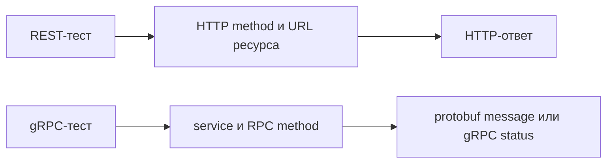

# gRPC и REST в тестовой архитектуре

## Связь с предыдущей главой

Главы 186–196 построили REST API-слой вокруг HTTP-запросов, ответов и ресурсов. gRPC решает похожую задачу обмена данными, но предлагает другую модель взаимодействия: клиент вызывает метод удалённого service.

## Цель главы

Различить REST и gRPC и выбрать уровень проверки, не скрывая особенности каждого транспорта.

## Главный вопрос

Чем gRPC-взаимодействие отличается от REST и что это меняет для теста?

## Мотивация

Если проверять gRPC как обычный JSON API, можно искать HTTP-коды там, где система возвращает gRPC status, или собирать URL там, где сгенерированный client предоставляет RPC method. Тест должен говорить на языке фактического контракта.

## Теория

REST организует взаимодействие вокруг ресурсов и их представлений. gRPC организует его вокруг service и RPC methods. Клиент отправляет protobuf message и получает ответное message либо ошибку gRPC.

Нативный gRPC использует HTTP/2 как транспортную границу, но прикладной тест обычно работает с RPC method, metadata, message и status. Это не превращает gRPC status в HTTP status.

Node gRPC client может обращаться к нативному gRPC endpoint. Браузер не предоставляет тот же низкоуровневый API напрямую; для браузерных сценариев обычно нужен grpc-web или gateway. Выбор зависит от реальной границы системы, а не от утверждения, что один подход всегда лучше другого.



## Внутренний механизм

Сгенерированный client знает endpoint и описание service. При вызове RPC method среда выполнения сериализует request message в protobuf, отправляет его по HTTP/2 и десериализует response message. Тест наблюдает типизированный результат, metadata и gRPC status.

```text
examples/03-automation-qa/chapter-197/01-grpc-rest-boundary.grpc.ts
```

Пример вызывает локальный RPC method и проверяет message, не подменяя результат HTTP-проверкой.

## Главная ментальная модель

REST-тест обращается к ресурсу через HTTP. gRPC-тест вызывает удалённый метод по protobuf-контракту.

## Практические примеры

- REST удобен, когда контракт выражен HTTP methods, URL и представлениями ресурсов.
- gRPC уместен, когда система публикует protobuf service и сгенерированный client.
- Один проект может использовать оба подхода на разных границах.
- Сравнение слоёв полезно только для одного бизнес-факта, а не ради дублирования каждого теста.

## Automation QA

Automation Framework сохраняет отдельные REST и gRPC clients. Общая бизнес-модель может помогать сравнивать данные, но универсальная транспортная обёртка не должна скрывать status, metadata или deadline.

## Концептуальные границы и компромиссы

Бинарная сериализация уменьшает размер некоторых сообщений, но сама по себе не гарантирует полезного выигрыша. Бинарное кодирование не шифрует данные и не делает канал безопасным. REST не всегда проще, gRPC не всегда быстрее, а подход с предварительным описанием схемы не отменяет проверку бизнес-правил.

## Распространённые ошибки

- Называть RPC method HTTP endpoint.
- Проверять ошибку gRPC как HTTP status.
- Считать REST и gRPC взаимоисключающими.
- Использовать публичный service для учебного теста.
- Скрывать оба транспорта за универсальным `call()`.

## Краткие итоги

- REST строится вокруг ресурсов, gRPC — вокруг RPC methods.
- Нативный gRPC использует HTTP/2, но имеет собственную модель status.
- Protobuf message отличается от JSON-представления.
- Node gRPC и grpc-web принадлежат разным средам выполнения.
- Уровень проверки определяется фактическим контрактом.

## Что нужно запомнить

- Сначала определите протокол и предмет проверки.
- Не переносите HTTP-проверки в gRPC механически.
- Сохраняйте диагностику конкретного протокола.
- Не объявляйте один транспорт универсально лучшим.

## Быстрая проверка

1. В чём различие ресурса и RPC method?
2. Почему gRPC status не является HTTP status?
3. Зачем нужен сгенерированный gRPC client?
4. Где появляется grpc-web?
5. Когда REST и gRPC могут сосуществовать?

## Практика

```text
practice/03-automation-qa/197-grpc-and-rest-in-test-architecture.md
```

## Переход к следующей главе

Чтобы вызвать RPC method корректно, нужно прочитать его контракт. Глава 198 разберёт, как `.proto` описывает service, messages и правила совместимости.
