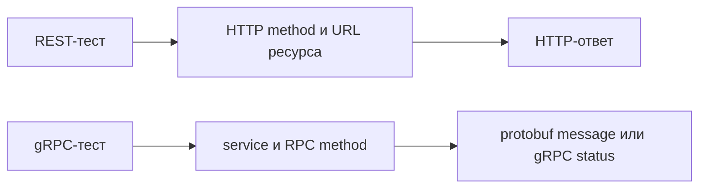

# gRPC и REST в тестовой архитектуре

## Связь с предыдущей главой

Главы 186–196 построили REST API-слой вокруг HTTP-запросов, ответов и ресурсов. gRPC решает похожую задачу обмена данными, но предлагает другую модель взаимодействия: клиент вызывает метод удалённого service.

## Цель главы

Различить REST и gRPC и выбрать уровень проверки, не скрывая особенности каждого транспорта.

## Главный вопрос

Чем gRPC-взаимодействие отличается от REST и что это меняет для теста?

## Мотивация

Если проверять gRPC как обычный JSON API, можно искать HTTP-коды там, где система возвращает gRPC status, или собирать URL там, где сгенерированный client предоставляет RPC method. Тест должен говорить на языке фактического контракта.

## Теория

### Разные единицы взаимодействия

REST организует взаимодействие вокруг ресурсов и их представлений: клиент выбирает метод и адрес, сервер возвращает представление.

gRPC организует его вокруг service и RPC methods: клиент вызывает именованный метод и отправляет protobuf message, а получает ответное message либо ошибку gRPC.



Разница в единице мышления. В REST вопрос звучит «какой ресурс и что с ним сделать», в gRPC — «какую операцию вызвать и с какими аргументами».

### gRPC status — не HTTP status

Нативный gRPC использует HTTP/2 как транспортную границу, но прикладной тест обычно работает с RPC method, metadata, message и status. Это не превращает gRPC status в HTTP status.

У gRPC собственная нумерация, и совпадений с HTTP у неё нет. Проверено на живом сервисе:

| gRPC status | Код | Близкий по смыслу HTTP |
| --- | --- | --- |
| `OK` | 0 | 200 |
| `INVALID_ARGUMENT` | 3 | 400 |
| `DEADLINE_EXCEEDED` | 4 | — |
| `NOT_FOUND` | 5 | 404 |
| `PERMISSION_DENIED` | 7 | 403 |
| `UNAUTHENTICATED` | 16 | 401 |

Отсутствующая задача даёт `code: 5`, а не 404. Проверка `expect(error.code).toBe(404)` в gRPC-тесте бессмысленна — 404 в этой нумерации не существует вовсе.

### Что тест наблюдает в gRPC

Сгенерированный client знает endpoint и описание service. При вызове RPC method среда выполнения сериализует request message в protobuf, отправляет его по HTTP/2 и десериализует response message.

Тест наблюдает три вещи: типизированный результат, metadata и gRPC status. Ошибка приходит как объект с полями `code`, `details` и `metadata` — и это настоящий `Error`, что удобно для стандартной обработки.

Важная деталь: metadata передаётся и вместе с ошибкой. Сервис может приложить к отказу диагностический заголовок, и тест его прочитает — это ближайший аналог кода ошибки в теле REST-ответа.

### Где проходит граница применимости

Node gRPC client может обращаться к нативному gRPC endpoint. Браузер не предоставляет тот же низкоуровневый API напрямую; для браузерных сценариев обычно нужен grpc-web или gateway.

Практический вывод для автотестов: gRPC-тесты живут в Node-слое тестового проекта рядом с API-тестами, а не внутри браузерного сценария. Если приложение обращается к gRPC через gateway, у теста есть выбор — проверять gateway по HTTP или сервис напрямую по gRPC, и это разные предметы проверки.

Выбор зависит от реальной границы системы, а не от утверждения, что один подход всегда лучше другого.

### Оба подхода в одном проекте

Automation Framework сохраняет отдельные REST и gRPC clients. Один проект может использовать оба подхода на разных границах — это нормальная ситуация, а не признак беспорядка.

Общая бизнес-модель может помогать сравнивать данные между слоями. Но универсальная транспортная обёртка не должна скрывать status, metadata или deadline: именно эти вещи отличают gRPC-вызов от HTTP-запроса, и спрятав их, вы теряете возможность проверять контракт отказа.

Сравнение слоёв полезно только для одного бизнес-факта — например, что REST и gRPC возвращают одинаковое представление одной задачи, — а не ради дублирования каждого теста.

### Чего бинарный формат не даёт

Здесь скапливается больше всего заблуждений, поэтому стоит перечислить явно.

**Бинарная сериализация уменьшает размер некоторых сообщений, но сама по себе не гарантирует полезного выигрыша.** На коротких сообщениях разница незначима, а узким местом чаще оказывается сеть или база.

**Бинарное кодирование не шифрует данные и не делает канал безопасным.** Отсутствие читаемого текста — не защита: сообщение декодируется тем же `.proto`. Безопасность даёт TLS, а не формат.

**REST не всегда проще, gRPC не всегда быстрее.** У gRPC есть цена: генерация кода, версии контракта, отдельная инфраструктура отладки.

**Подход с предварительным описанием схемы не отменяет проверку бизнес-правил.** Схема гарантирует форму сообщения, но не то, что задача создалась в правильном статусе.

## Внутренний механизм

Сгенерированный client знает endpoint и описание service. При вызове RPC method среда выполнения сериализует request message в protobuf, отправляет его по HTTP/2 и десериализует response message. Тест наблюдает типизированный результат, metadata и gRPC status.

```text
examples/03-automation-qa/chapter-197/01-grpc-rest-boundary.grpc.ts
```

Пример вызывает локальный RPC method и проверяет message, не подменяя результат HTTP-проверкой.

## Главная ментальная модель

REST-тест обращается к ресурсу через HTTP. gRPC-тест вызывает удалённый метод по protobuf-контракту.

## Практические примеры

- REST удобен, когда контракт выражен HTTP methods, URL и представлениями ресурсов.
- gRPC уместен, когда система публикует protobuf service и сгенерированный client.
- Один проект может использовать оба подхода на разных границах.
- Сравнение слоёв полезно только для одного бизнес-факта, а не ради дублирования каждого теста.

## Automation QA

Automation Framework сохраняет отдельные REST и gRPC clients. Общая бизнес-модель может помогать сравнивать данные, но универсальная транспортная обёртка не должна скрывать status, metadata или deadline.

## Концептуальные границы и компромиссы

Бинарная сериализация уменьшает размер некоторых сообщений, но сама по себе не гарантирует полезного выигрыша. Бинарное кодирование не шифрует данные и не делает канал безопасным. REST не всегда проще, gRPC не всегда быстрее, а подход с предварительным описанием схемы не отменяет проверку бизнес-правил.

## Распространённые мифы

**Миф: gRPC status — это HTTP status.**
У gRPC своя нумерация: `NOT_FOUND` это 5, а не 404. HTTP/2 здесь только транспорт.

**Миф: бинарный формат защищает данные.**
Он не шифрует. Сообщение читается тем же `.proto`. Защиту даёт TLS.

**Миф: gRPC всегда быстрее REST.**
Выигрыш зависит от размера сообщений и узкого места системы, а цена в виде генерации и версионирования есть всегда.

**Миф: gRPC-вызов можно сделать прямо из браузерного теста.**
Браузер не даёт нужного низкоуровневого API. Нужен grpc-web или gateway, а Node-клиент работает вне браузера.

**Миф: общая обёртка над REST и gRPC упрощает проект.**
Она скрывает status, metadata и deadline — именно то, что отличает gRPC и подлежит проверке.

## Частые вопросы

**Как проверить, что ресурс не найден, в gRPC-тесте?**
Сравнить `error.code` с `grpc.status.NOT_FOUND` — числом 5. Кода 404 в этой нумерации нет.

**Где хранить диагностику отказа в gRPC?**
В metadata ошибки: она доходит до клиента вместе с `code` и `details`.

**Проверять gateway или сервис напрямую?**
Это разные предметы. Gateway проверяют по HTTP, контракт сервиса — по gRPC; выбор зависит от того, чья граница важна.

**Можно ли держать REST и gRPC clients в одном проекте?**
Да, как отдельные клиенты. Объединять их транспортной обёрткой не стоит.

**Нужно ли дублировать REST-тесты в gRPC?**
Нет. Сравнение слоёв оправдано для одного бизнес-факта, а не для всего набора.

## Распространённые ошибки

- Называть RPC method HTTP endpoint.
- Проверять ошибку gRPC как HTTP status.
- Считать REST и gRPC взаимоисключающими.
- Использовать публичный service для учебного теста.
- Скрывать оба транспорта за универсальным `call()`.

## Краткие итоги

- REST строится вокруг ресурсов, gRPC — вокруг RPC methods.
- Нативный gRPC использует HTTP/2, но имеет собственную модель status.
- Protobuf message отличается от JSON-представления.
- Node gRPC и grpc-web принадлежат разным средам выполнения.
- Уровень проверки определяется фактическим контрактом.

## Что нужно запомнить

- Сначала определите протокол и предмет проверки.
- Не переносите HTTP-проверки в gRPC механически.
- Сохраняйте диагностику конкретного протокола.
- Не объявляйте один транспорт универсально лучшим.

## Быстрая проверка

1. В чём различие ресурса и RPC method?
2. Почему gRPC status не является HTTP status?
3. Зачем нужен сгенерированный gRPC client?
4. Где появляется grpc-web?
5. Когда REST и gRPC могут сосуществовать?

## Практика

```text
practice/03-automation-qa/197-grpc-and-rest-in-test-architecture.md
```

## Переход к следующей главе

Чтобы вызвать RPC method корректно, нужно прочитать его контракт. Глава 198 разберёт, как `.proto` описывает service, messages и правила совместимости.
