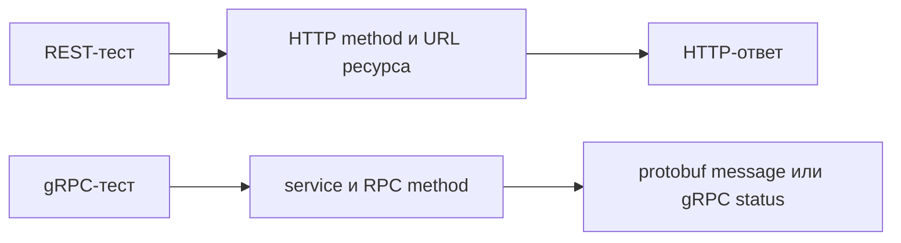

# gRPC и REST в тестовой архитектуре

## Связь с предыдущей главой

Главы 186–196 построили REST API-слой вокруг HTTP-запросов, ответов и ресурсов. gRPC решает похожую задачу обмена данными, но предлагает другую модель взаимодействия: клиент вызывает метод удалённого service.

## Цель главы

Различить REST и gRPC и выбрать уровень проверки, не скрывая особенности каждого транспорта.

## Главный вопрос

Чем gRPC-взаимодействие отличается от REST и что это меняет для теста?

## Мотивация

Если проверять gRPC как обычный JSON API, можно искать HTTP-коды там, где система возвращает gRPC status, или собирать URL там, где сгенерированный client предоставляет RPC method. Тест должен говорить на языке фактического контракта.

## Теория

### Разные единицы взаимодействия

REST организует взаимодействие вокруг ресурсов и их представлений: клиент выбирает метод и адрес, сервер возвращает представление.

gRPC организует его вокруг сервисов и методов RPC: клиент вызывает именованный метод и отправляет сообщение protobuf, а получает ответное сообщение либо ошибку gRPC.


```mermaid
flowchart LR
    A[REST-тест] --> B[HTTP method и URL ресурса]
    B --> C[HTTP-ответ]
    D[gRPC-тест] --> E[service и RPC method]
    E --> F[protobuf message или gRPC status]
```

Разница в единице мышления. В REST вопрос звучит «какой ресурс и что с ним сделать», в gRPC — «какую операцию вызвать и с какими аргументами».

### Код состояния gRPC — не код состояния HTTP

Нативный gRPC использует HTTP/2 как транспортную границу, но прикладной тест обычно работает с методом RPC, метаданными, сообщением и кодом состояния. Это не превращает код gRPC в код HTTP.

У gRPC собственная нумерация, и совпадений с HTTP у неё нет. Проверено на живом сервисе:

| Код состояния gRPC | Значение | Близкий по смыслу код HTTP |
| --- | --- | --- |
| `OK` | 0 | 200 |
| `INVALID_ARGUMENT` | 3 | 400 |
| `DEADLINE_EXCEEDED` | 4 | — |
| `NOT_FOUND` | 5 | 404 |
| `PERMISSION_DENIED` | 7 | 403 |
| `UNAUTHENTICATED` | 16 | 401 |

Отсутствующая задача даёт `code: 5`, а не 404. Проверка `expect(error.code).toBe(404)` в gRPC-тесте бессмысленна — 404 в этой нумерации не существует вовсе.

### Что тест наблюдает в gRPC

Сгенерированный клиент знает адрес и описание сервиса. При вызове метода RPC среда выполнения сериализует сообщение запроса в protobuf, отправляет его по HTTP/2 и разбирает сообщение ответа.

Тест наблюдает три вещи: типизированный результат, метаданные и код состояния gRPC. Ошибка приходит как объект с полями `code`, `details` и `metadata` — и это настоящий `Error`, что удобно для стандартной обработки.

Важная деталь: метаданные передаются и вместе с ошибкой. Сервис может приложить к отказу диагностический заголовок, и тест его прочитает — это ближайший аналог кода ошибки в теле ответа REST.

### Где проходит граница применимости

Клиент gRPC в Node.js может обращаться к нативному адресу gRPC. Браузер не предоставляет тот же низкоуровневый интерфейс напрямую; для браузерных сценариев обычно нужен grpc-web или шлюз.

Практический вывод для автотестов: тесты gRPC живут в слое Node.js тестового проекта рядом с тестами API, а не внутри браузерного сценария. Если приложение обращается к gRPC через шлюз, у теста есть выбор — проверять шлюз по HTTP или сервис напрямую по gRPC, и это разные предметы проверки.

Выбор зависит от реальной границы системы, а не от утверждения, что один подход всегда лучше другого.

### Оба подхода в одном проекте

Фреймворк автоматизации сохраняет отдельные клиенты REST и gRPC. Один проект может использовать оба подхода на разных границах — это нормальная ситуация, а не признак беспорядка.

Общая бизнес-модель может помогать сравнивать данные между слоями. Но универсальная транспортная обёртка не должна скрывать код состояния, метаданные или крайний срок: именно эти вещи отличают вызов gRPC от запроса HTTP, и спрятав их, вы теряете возможность проверять контракт отказа.

Сравнение слоёв полезно только для одного бизнес-факта — например, что REST и gRPC возвращают одинаковое представление одной задачи, — а не ради дублирования каждого теста.

### Чего бинарный формат не даёт

Здесь скапливается больше всего заблуждений, поэтому стоит перечислить явно.

**Бинарная сериализация уменьшает размер некоторых сообщений, но сама по себе не гарантирует полезного выигрыша.** На коротких сообщениях разница незначима, а узким местом чаще оказывается сеть или база.

**Бинарное кодирование не шифрует данные и не делает канал безопасным.** Отсутствие читаемого текста — не защита: сообщение декодируется тем же `.proto`. Безопасность даёт TLS, а не формат.

**REST не всегда проще, gRPC не всегда быстрее.** У gRPC есть цена: генерация кода, версии контракта, отдельная инфраструктура отладки.

**Подход с предварительным описанием схемы не отменяет проверку бизнес-правил.** Схема гарантирует форму сообщения, но не то, что задача создалась в правильном статусе.

## Внутренний механизм

Сгенерированный клиент знает адрес и описание сервиса. При вызове метода RPC среда выполнения сериализует сообщение запроса в protobuf, отправляет его по HTTP/2 и разбирает сообщение ответа. Тест наблюдает типизированный результат, метаданные и код состояния gRPC.

### Один путь запроса, разные границы

```text
REST:  метод + адрес  → JSON по HTTP/1.1 или HTTP/2 → код состояния HTTP
gRPC:  метод сервиса  → protobuf по HTTP/2          → код состояния gRPC
```

Транспорт у обоих — HTTP, и на этом сходство заканчивается. Адресация в gRPC
идёт по имени метода из `.proto`, а не по маршруту; тело двоичное, а не
текстовое; результат приходит кодом из собственной нумерации.

Практическое следствие: тест gRPC нельзя написать «как REST, только другой
клиент». Отличаются проверка отказа, задание срока и передача учётных данных.

### Что тест видит на каждом слое

| Слой | Что доступно тесту |
| --- | --- |
| договор `.proto` | имена методов, форма сообщений, номера полей |
| среда выполнения | код состояния, `details`, метаданные, срок |
| сообщение ответа | типизированные поля со значениями по умолчанию |

Средняя строка — то, чего нет в REST-тесте, и именно она несёт диагностику:
`UNAVAILABLE` отличает неподнятый стенд от отказа сервиса, а метаданные доходят
до клиента **вместе с ошибкой**, не теряясь при отказе.
```text
examples/03-automation-qa/chapter-197/01-grpc-rest-boundary.grpc.ts
```

Пример вызывает локальный метод RPC и проверяет сообщение, не подменяя результат проверкой по HTTP.

## Главная ментальная модель

REST-тест обращается к ресурсу через HTTP. gRPC-тест вызывает удалённый метод по protobuf-контракту.

## Практические примеры

- REST удобен, когда контракт выражен методами HTTP, адресами и представлениями ресурсов.
- gRPC уместен, когда система публикует сервис protobuf и сгенерированный клиент.
- Один проект может использовать оба подхода на разных границах.
- Сравнение слоёв полезно только для одного бизнес-факта, а не ради дублирования каждого теста.

## Automation QA

Фреймворк автоматизации сохраняет отдельные клиенты REST и gRPC. Общая бизнес-модель может помогать сравнивать данные, но универсальная транспортная обёртка не должна скрывать код состояния, метаданные или крайний срок.

## Концептуальные границы и компромиссы

Бинарная сериализация уменьшает размер некоторых сообщений, но сама по себе не гарантирует полезного выигрыша. Бинарное кодирование не шифрует данные и не делает канал безопасным. REST не всегда проще, gRPC не всегда быстрее, а подход с предварительным описанием схемы не отменяет проверку бизнес-правил.

## Распространённые мифы

**Миф: код состояния gRPC — это код состояния HTTP.**
У gRPC своя нумерация: `NOT_FOUND` это 5, а не 404. HTTP/2 здесь только транспорт.

**Миф: бинарный формат защищает данные.**
Он не шифрует. Сообщение читается тем же `.proto`. Защиту даёт TLS.

**Миф: gRPC всегда быстрее REST.**
Выигрыш зависит от размера сообщений и узкого места системы, а цена в виде генерации и версионирования есть всегда.

**Миф: gRPC-вызов можно сделать прямо из браузерного теста.**
Браузер не даёт нужного низкоуровневого интерфейса. Нужен grpc-web или шлюз, а клиент Node.js работает вне браузера.

**Миф: общая обёртка над REST и gRPC упрощает проект.**
Она скрывает код состояния, метаданные и крайний срок — именно то, что отличает gRPC и подлежит проверке.

## Частые вопросы

**Как проверить, что ресурс не найден, в gRPC-тесте?**
Сравнить `error.code` с `grpc.status.NOT_FOUND` — числом 5. Кода 404 в этой нумерации нет.

**Где хранить диагностику отказа в gRPC?**
В метаданных ошибки: они доходят до клиента вместе с `code` и `details`.

**Проверять шлюз или сервис напрямую?**
Это разные предметы. Шлюз проверяют по HTTP, контракт сервиса — по gRPC; выбор зависит от того, чья граница важна.

**Можно ли держать клиенты REST и gRPC в одном проекте?**
Да, как отдельные клиенты. Объединять их транспортной обёрткой не стоит.

**Нужно ли дублировать REST-тесты в gRPC?**
Нет. Сравнение слоёв оправдано для одного бизнес-факта, а не для всего набора.

## Распространённые ошибки

- Называть метод RPC адресом HTTP — у gRPC нет маршрутов и методов HTTP: вызывается именованный метод сервиса из `.proto`. Транспорт при этом действительно HTTP/2, но адресация другая.

- Проверять ошибку gRPC как код состояния HTTP — у gRPC собственная нумерация: `NOT_FOUND` равен 5, `INVALID_ARGUMENT` — 3, `DEADLINE_EXCEEDED` — 4. Сравнение с 404 или 400 не сработает никогда.

- Считать REST и gRPC взаимоисключающими — один продукт обычно предоставляет оба: внешний REST для клиентов и gRPC между службами. Тестовый проект работает с обоими.

- Использовать публичный сервис для учебного теста — он недоступен из CI, меняется без предупреждения и не позволяет готовить данные. Для проверок поднимают локальный стенд.

- Скрывать оба транспорта за универсальным `call()` — различия в статусах, сроках и метаданных существенны, и общая обёртка прячет именно их. Слои держат раздельными, а сравнивают уже нормализованные данные.

## Краткие итоги

- REST строится вокруг ресурсов, gRPC — вокруг методов RPC.
- Нативный gRPC использует HTTP/2, но имеет собственную модель кодов состояния.
- Сообщение protobuf отличается от представления в JSON.
- gRPC в Node.js и grpc-web принадлежат разным средам выполнения.
- Уровень проверки определяется фактическим контрактом.

## Что нужно запомнить

- Сначала определите протокол и предмет проверки.
- Не переносите HTTP-проверки в gRPC механически.
- Сохраняйте диагностику конкретного протокола.
- Не объявляйте один транспорт универсально лучшим.

## Быстрая проверка

1. В чём различие ресурса и метода RPC?
2. Почему код состояния gRPC не является кодом состояния HTTP?
3. Зачем нужен сгенерированный клиент gRPC?
4. Где появляется grpc-web?
5. Когда REST и gRPC могут сосуществовать?

### Ответы

1. REST описывает ресурсы с адресами и операции над ними. gRPC описывает вызовы методов с заданными сообщениями запроса и ответа.
2. gRPC передаёт собственный код состояния в метаданных ответа. Транспорт может вернуть успешный HTTP-статус, тогда как вызов завершился отказом.
3. Он строится по контракту и гарантирует, что запрос и ответ соответствуют описанию. Ручная сборка сообщений расходится с контрактом при первом же его изменении.
4. Когда gRPC нужно вызывать из браузера: браузер не даёт нужного уровня управления соединением, и требуется промежуточный слой.
5. Когда у них разные потребители: gRPC для внутреннего взаимодействия сервисов, REST для внешних клиентов. Проверять нужно оба контракта.

## Практика

```text
practice/03-automation-qa/197-grpc-and-rest-in-test-architecture.md
```

## Переход к следующей главе

Чтобы вызвать метод RPC корректно, нужно прочитать его контракт. Глава 198 разберёт, как `.proto` описывает сервис, сообщения и правила совместимости.
