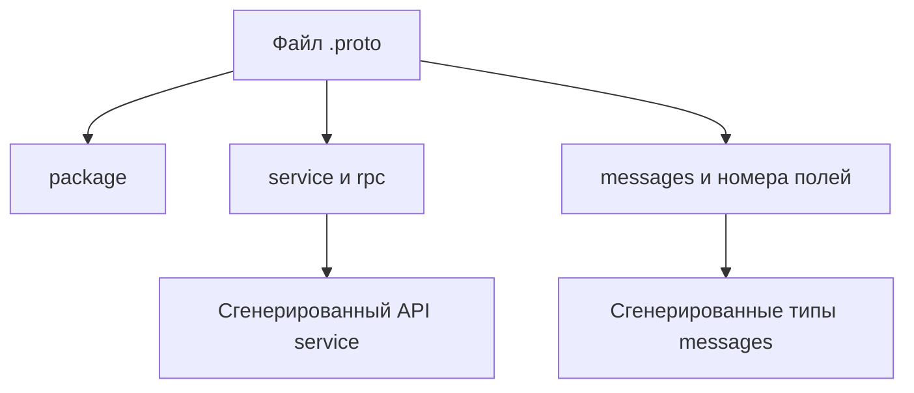

# Protocol Buffers: сервисы и сообщения

## Связь с предыдущей главой

Глава 197 отделила RPC method от REST-ресурса. Теперь нужен источник истины, который описывает доступные методы и форму передаваемых messages.

## Цель главы

Научиться читать `.proto`-контракт и оценивать изменения service, messages и номеров полей.

## Главный вопрос

Как `.proto`-контракт описывает доступные вызовы и данные?

## Мотивация

Название свойства TypeScript не объясняет protobuf-контракт. Для protobuf номер поля важнее его расположения в файле, а необдуманное повторное использование удалённого номера может заставить старый client прочитать новое значение как прежнее поле.

## Теория

### Что объявляет файл контракта

Файл `.proto` объявляет `package`, messages и services. `service` объединяет RPC methods, а запись `rpc CreateTask(CreateTaskRequest) returns (Task)` связывает request и response messages.



Message состоит из полей. У каждого поля есть имя, тип и уникальный номер внутри message.

### Номер поля — настоящее имя в бинарном формате

Это центральное утверждение главы, и его стоит увидеть в действии. Кодировщик protobuf записывает номер поля вместе с типом представления и значением. Декодер сопоставляет **номер** с локальным описанием message. Имя поля в бинарные данные не попадает вовсе.

Отсюда следствия, которые проверяются экспериментом. Сообщение с полем `string title = 2` закодировано одной версией контракта и прочитано другими:

| Изменение во второй версии | Результат чтения |
| --- | --- |
| поле переименовано в `name`, номер 2 сохранён | значение прочитано как `name` — данные целы |
| номер изменён с 2 на 7 | поле **молча исчезло** из результата |
| добавлено новое поле с номером 4 | старые сообщения читаются без проблем |
| тип изменён на `int32`, номер 2 | **ошибка разбора** повреждённых данных |

Вторая строка — самая опасная. Никакой ошибки не возникает: декодер просто не находит поле с номером 7 и оставляет значение по умолчанию. Тест, который проверяет бизнес-поле, увидит пустую строку и сообщит о неверных данных, а настоящая причина — рассинхронизация номеров.

### Что безопасно менять, а что нет

Изменение порядка строк или переименование поля без смены номера не равно изменению его типа или номера. Порядок объявления в файле вообще не влияет на бинарное представление.

Добавление нового совместимого поля обычно безопаснее изменения существующего: старый получатель просто пропустит неизвестный номер. Проверено — сообщение, отправленное новой версией с дополнительным полем, читается старым описанием без ошибок и без потери остальных значений.

Неизвестные поля могут быть пропущены новым или старым участником, что поддерживает часть сценариев одновременной работы разных версий.

### `reserved` защищает от повторного использования

Удалённые номера и имена следует помечать `reserved`, прежде чем контракт продолжит развиваться:

```protobuf
message Task {
  reserved 4, 7;
  reserved "assignee";
  string id = 1;
  string title = 2;
}
```

Смысл в том, чтобы номер удалённого поля никогда не достался новому полю с другим типом. Иначе старый клиент, всё ещё отправляющий значение под этим номером, будет молча понят неправильно — а это худший вид расхождения контракта, потому что ошибки не возникает нигде.

### Компиляция не равна совместимости

Не всякое изменение `.proto` нарушает совместимость, но успешная компиляция сгенерированного TypeScript-кода не доказывает совместимость protobuf-контракта.

Это разные проверки на разных уровнях. Компилятор TypeScript проверяет, что ваш код согласован со сгенерированными типами **новой** версии. Совместимость же касается того, поймут ли друг друга участники с **разными** версиями контракта — а это свойство бинарного формата, о котором компилятор не знает ничего.

Переименование поля пройдёт обе проверки. Смена номера пройдёт компиляцию и сломает совместимость.

### Как читать `.proto` перед написанием теста

QA-инженер читает `.proto` до написания теста: определяет обязательный request, ожидаемый response, негативные условия и риски совместимости между версиями client и server.

Порядок чтения, который экономит время:

1. **service и rpc** — какие операции вообще есть и как они называются;
2. **request message** — какие поля обязательны и какие значения допустимы;
3. **response message** — что вернётся при успехе;
4. **номера полей** — не было ли недавних изменений и есть ли `reserved`;
5. **package с версией** — с какой версией контракта работает стенд.

В `proto3` все поля имеют значения по умолчанию, поэтому «отсутствующее» и «пустое» поле в сообщении выглядят одинаково. Если контракт различает эти случаи, он делает это явно — через `optional` или отдельное поле-признак, и в тесте это надо учитывать.

### Чего схема не гарантирует

Контракт с предварительно описанной схемой улучшает согласованность, но не доказывает правильность бизнес-значений. Схема обещает, что `status` будет строкой, и ничего не говорит о том, что новая задача создаётся в статусе `NEW`.

Глава не охватывает полный процесс управления схемами и расширения protobuf — реестры схем, автоматические проверки совместимости и эволюцию контракта в больших организациях остаются за её границей.

## Внутренний механизм

Кодировщик protobuf записывает номер поля вместе с типом представления и значением. Декодер сопоставляет номер с локальным описанием message. Неизвестные поля могут быть пропущены новым или старым участником, что поддерживает часть сценариев одновременной работы разных версий.

```text
sut/contracts/proto/work_items.proto
```

```text
examples/03-automation-qa/chapter-198/01-protobuf-contract.grpc.ts
```

Пример читает контракт учебного стенда и проверяет пакет с версией, service, RPC signature и ключевые field numbers.

## Главная ментальная модель

`.proto` — это договор: service определяет доступные вызовы, message определяет данные, а номер поля связывает их с бинарным представлением.

## Практические примеры

- Добавить новое `optional`-поле с новым номером.
- Зарезервировать номер удалённого поля.
- Не менять `string id = 1` на несовместимый тип без миграции.
- Проверять имена service и RPC methods при обновлении клиента.

## Automation QA

QA-инженер читает `.proto` до написания теста: определяет обязательный request, ожидаемый response, негативные условия и риски совместимости между версиями client и server.

## Концептуальные границы и компромиссы

Контракт с предварительно описанной схемой улучшает согласованность, но не доказывает правильность бизнес-значений. Глава не охватывает полный процесс управления схемами и расширения protobuf.

## Распространённые мифы

**Миф: имя поля передаётся в сообщении.**
Передаётся номер. Переименование поля с сохранением номера данные не ломает.

**Миф: смена номера поля вызовет ошибку.**
Ошибки не будет: поле молча исчезнет из результата, а тест сообщит о неверных данных.

**Миф: порядок полей в файле важен.**
На бинарное представление он не влияет. Важны номера и типы.

**Миф: если сгенерированный код компилируется, контракт совместим.**
Компилятор проверяет согласованность с новой версией. Совместимость версий между собой — свойство формата.

**Миф: `reserved` — формальность для аккуратности.**
Он не даёт номеру удалённого поля достаться новому полю с другим типом — то есть предотвращает молчаливое непонимание.

## Частые вопросы

**Можно ли переименовать поле?**
Да, если номер сохранён. Данные придут под новым именем.

**Как удалить поле безопасно?**
Убрать его и пометить номер и имя как `reserved`, чтобы они не были переиспользованы.

**Почему поле пришло пустым, хотя сервер его отправил?**
Частая причина — расхождение номеров между версиями контракта. Ошибки при этом не возникает.

**Как отличить отсутствующее поле от пустого в proto3?**
Никак, если контракт не выразил это явно — через `optional` или отдельный признак. Значения по умолчанию выглядят одинаково.

**С чего начинать чтение `.proto`?**
С service и rpc, затем request, response, номера полей и версия пакета.

## Распространённые ошибки

- Считать номер поля косметической нумерацией.
- Повторно использовать номер удалённого поля.
- Редактировать сгенерированные файлы вместо `.proto`.
- Считать любое добавление поля нарушением совместимости.
- Проверять только компиляцию TypeScript.

## Краткие итоги

- `.proto` описывает service, RPC methods и messages.
- Номера полей принадлежат protobuf-контракту.
- Совместимость зависит от характера изменения.
- Сгенерированный код создаётся из контракта.
- Проверки бизнес-правил остаются обязанностью теста.

## Что нужно запомнить

- Изменяйте исходный `.proto`, а не сгенерированный код.
- Не переиспользуйте удалённые номера полей.
- Разделяйте статические типы и совместимость protobuf-контракта.
- Учитывайте одновременную работу разных версий.

## Быстрая проверка

1. Что описывает `service`?
2. Что связывает request и response messages?
3. Почему важен field number?
4. Когда добавление поля совместимо?
5. Зачем использовать `reserved`?

## Практика

```text
practice/03-automation-qa/198-protocol-buffers-services-and-messages.md
```

## Переход к следующей главе

Контракт уже читаем, но сам файл `.proto` нельзя вызвать. Глава 199 покажет границу генерации и создание типизированного gRPC Client.
