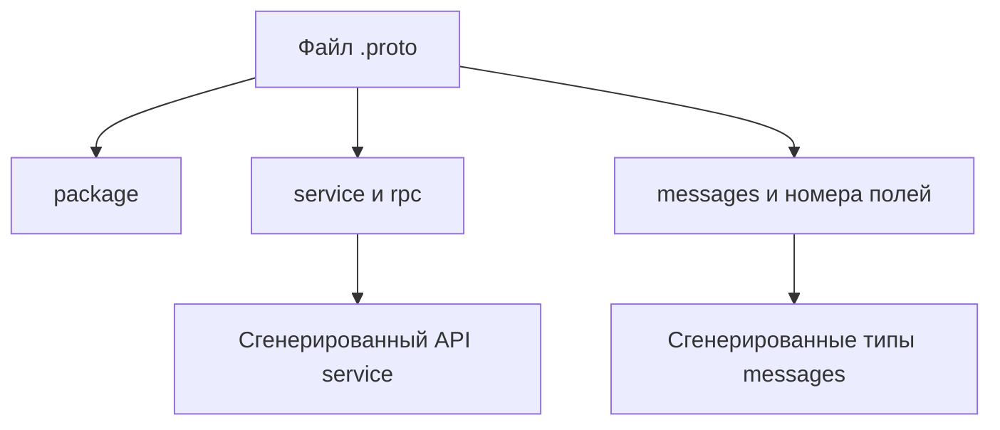

# Protocol Buffers: сервисы и сообщения

## Связь с предыдущей главой

Глава 197 отделила RPC method от REST-ресурса. Теперь нужен источник истины, который описывает доступные методы и форму передаваемых messages.

## Цель главы

Научиться читать `.proto`-контракт и оценивать изменения service, messages и номеров полей.

## Главный вопрос

Как `.proto`-контракт описывает доступные вызовы и данные?

## Мотивация

Название свойства TypeScript не объясняет protobuf-контракт. Для protobuf номер поля важнее его расположения в файле, а необдуманное повторное использование удалённого номера может заставить старый client прочитать новое значение как прежнее поле.

## Теория

Файл `.proto` объявляет `package`, messages и services. `service` объединяет RPC methods. Запись `rpc CreateTask(CreateTaskRequest) returns (Task)` связывает request и response messages.

Message состоит из полей. У каждого поля есть имя, тип и уникальный номер внутри message. Номер участвует в бинарном формате передачи и является частью совместимости. Изменение порядка строк или переименование поля без смены номера не равно изменению его типа или номера.

Удалённые номера и имена следует помечать `reserved`, прежде чем контракт продолжит развиваться. Добавление нового совместимого поля обычно безопаснее изменения существующего. Не всякое изменение `.proto` нарушает совместимость, но успешная компиляция сгенерированного TypeScript-кода не доказывает совместимость protobuf-контракта.



## Внутренний механизм

Кодировщик protobuf записывает номер поля вместе с типом представления и значением. Декодер сопоставляет номер с локальным описанием message. Неизвестные поля могут быть пропущены новым или старым участником, что поддерживает часть сценариев одновременной работы разных версий.

```text
examples/03-automation-qa/proto/tasks.proto
examples/03-automation-qa/chapter-198/01-protobuf-contract.grpc.ts
```

Пример читает локальный контракт и проверяет service, RPC signature и ключевые field numbers.

## Главная ментальная модель

`.proto` — это договор: service определяет доступные вызовы, message определяет данные, а номер поля связывает их с бинарным представлением.

## Практические примеры

- Добавить новое `optional`-поле с новым номером.
- Зарезервировать номер удалённого поля.
- Не менять `string id = 1` на несовместимый тип без миграции.
- Проверять имена service и RPC methods при обновлении клиента.

## Automation QA

QA-инженер читает `.proto` до написания теста: определяет обязательный request, ожидаемый response, негативные условия и риски совместимости между версиями client и server.

## Концептуальные границы и компромиссы

Контракт с предварительно описанной схемой улучшает согласованность, но не доказывает правильность бизнес-значений. Глава не охватывает полный процесс управления схемами и расширения protobuf.

## Распространённые ошибки

- Считать номер поля косметической нумерацией.
- Повторно использовать номер удалённого поля.
- Редактировать сгенерированные файлы вместо `.proto`.
- Считать любое добавление поля нарушением совместимости.
- Проверять только компиляцию TypeScript.

## Краткие итоги

- `.proto` описывает service, RPC methods и messages.
- Номера полей принадлежат protobuf-контракту.
- Совместимость зависит от характера изменения.
- Сгенерированный код создаётся из контракта.
- Проверки бизнес-правил остаются обязанностью теста.

## Что нужно запомнить

- Изменяйте исходный `.proto`, а не сгенерированный код.
- Не переиспользуйте удалённые номера полей.
- Разделяйте статические типы и совместимость protobuf-контракта.
- Учитывайте одновременную работу разных версий.

## Быстрая проверка

1. Что описывает `service`?
2. Что связывает request и response messages?
3. Почему важен field number?
4. Когда добавление поля совместимо?
5. Зачем использовать `reserved`?

## Практика

```text
practice/03-automation-qa/198-protocol-buffers-services-and-messages.md
```

## Переход к следующей главе

Контракт уже читаем, но сам файл `.proto` нельзя вызвать. Глава 199 покажет границу генерации и создание типизированного gRPC Client.
