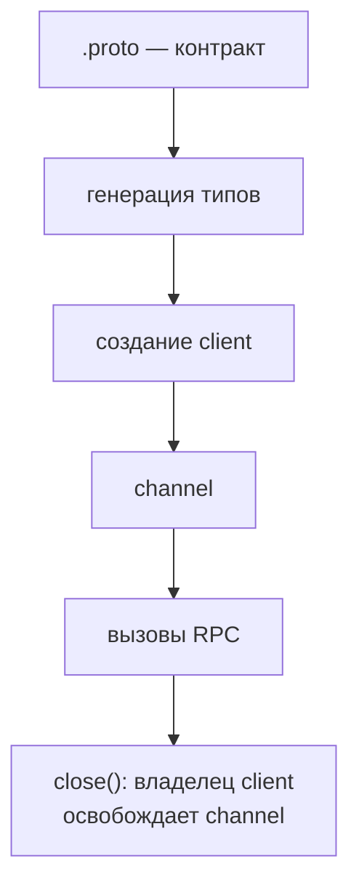

# Сгенерированный код и создание gRPC Client

## Связь с предыдущей главой

Глава 198 определила `.proto` как источник контракта. Теперь этот контракт нужно превратить в API, который TypeScript-код может вызвать без ручного кодирования protobuf messages.

## Цель главы

Понять границу сгенерированного и написанного вручную кода, создать client и явно управлять временем жизни channel.

## Главный вопрос

Как protobuf-контракт превращается в вызываемый и типизированный client API?

## Мотивация

Ручное описание имён методов и структуры messages дублирует `.proto` и расходится с ним. Генерация кода или типов переносит контракт в client API, но сгенерированные файлы нельзя превращать в место бизнес-логики.

## Теория

### Три инструмента и роль каждого

Генератор читает `.proto` и создаёт типы messages и определения service client. В этом модуле роли разделены так:

| Инструмент | Когда работает | Что даёт |
| --- | --- | --- |
| `proto-loader-gen-types` | до запуска, при генерации | объявления TypeScript |
| `@grpc/proto-loader` | во время выполнения | загружает тот же контракт |
| `@grpc/grpc-js` | во время выполнения | создаёт нативный Node client |

Важно, что первый инструмент не участвует в работе теста: он нужен только для типов. Фактический контракт во время выполнения загружает `@grpc/proto-loader` — из того же `.proto`.

### Сгенерированные типы и реальные данные

Сгенерированный входной тип message используется для подготовки request. Выходной тип описывает десериализованный response. Service client предоставляет методы контракта — `GetWorkItem()`, `SearchWorkItems()`, `TransitionWorkItem()` и другие.

Но здесь действует то же правило, что и для JSON: типы проверяют ваш код до запуска и ничего не проверяют в пришедших данных. Разница лишь в том, что protobuf-декодер сам отвергнет сообщение неверной формы, — а вот расхождение номеров полей он не заметит и вернёт значение по умолчанию.

### Границы приведения типа

Единственное приведение типа находится на проверяемой границе динамического загрузчика и сгенерированного `ProtoGrpcType`.

Это осознанное исключение, а не небрежность. Динамический загрузчик по своей природе возвращает нетипизированную структуру: он читает файл во время выполнения и не может знать, что в нём. Приведение здесь переводит результат загрузки в описанный генератором тип — и оправдано только потому, что оба берутся из одного `.proto`.

Из этого следует правило: приведение допустимо ровно в одном месте — в helper, создающем client. Если `as` появляется в тестах, граница проведена неверно.

### Воспроизводимая генерация

Команда `npm run grpc:generate` воспроизводимо создаёт объявления в директории модуля.

Два правила, которые делают эту схему работающей:

- **Перегенерировать после каждого изменения `.proto`.** Расхождение между контрактом и типами даёт ошибки компиляции в лучшем случае и молчаливо неверные данные в худшем.
- **Не редактировать сгенерированные файлы вручную.** Любая правка исчезнет при следующей генерации, и потерю заметят не сразу.

Сгенерированный client уменьшает расхождение с контрактом. Написанный вручную слой добавляет осмысленные операции и встраивает управление ресурсами, но не копирует сгенерированные объявления.

### Client владеет channel

Client открывает channel к endpoint. Создатель client отвечает за его закрытие: `client.close()` освобождает channel.

Незакрытый client оставляет открытое соединение, и процесс тестового раннера может не завершиться. Поэтому закрытие пишется в `finally` — как и для любого ресурса, взятого во владение.

Обратная сторона тоже стоит внимания. Обращение к закрытому client не даёт gRPC-ошибку со статусом, а **выбрасывает исключение сразу**:

```text
Error: Channel has been shut down
```

По этому сообщению легко узнать преждевременное `close()` — например, закрытие внутри цикла, который ещё выполняет вызовы.

Жизненный цикл самого стенда тестом не управляется: client закрывает своё соединение, а не останавливает сервис.

### Один client на несколько вызовов

Channel рассчитан на многократное использование. Один client спокойно обслуживает несколько вызовов, в том числе одновременных — проверено на параллельных запросах, каждый из которых получил свой ответ.

Отсюда практическая схема: client создаётся один раз на сценарий или, при необходимости, на worker, а не на каждый вызов. Создание client под каждый запрос — лишние соединения и лишние точки утечки.

Endpoint при этом передаётся через границу конфигурации, а не пишется в тесте: адрес стенда меняется между локальным запуском и CI.

### Динамическая загрузка против статической генерации

Динамическая загрузка `.proto` упрощает клиент, но требует наличия файла контракта во время выполнения. Файл должен попасть в тестовое окружение, и путь к нему становится частью конфигурации.

Полная статическая генерация может убрать эту зависимость ценой более сложной цепочки инструментов: контракт целиком превращается в код на этапе сборки.

Выбор не меняет правило: исходный контракт и генерация должны быть воспроизводимыми. Любой участник команды и любая сборка в CI должны получать одинаковый результат из одного и того же `.proto`.

Путь от контракта до вызова и обратно:



## Внутренний механизм

Команда `npm run grpc:generate` воспроизводимо создаёт объявления в директории модуля. Написанный вручную helper загружает описание package и возвращает типизированный client. Единственное приведение типа находится на проверяемой границе динамического загрузчика и сгенерированного `ProtoGrpcType`.

```text
examples/03-automation-qa/chapter-199/01-generated-client.grpc.ts
```

Пример ожидает готовность channel, выполняет сгенерированный метод и закрывает client в `finally`.

## Главная ментальная модель

Из `.proto` создаётся сгенерированный API; на его основе создаётся client; создатель client отвечает за channel до явного `close()`.

## Практические примеры

- Перегенерировать объявления после изменения `.proto`.
- Не редактировать сгенерированный `TaskService.ts` вручную.
- Передавать endpoint через границу конфигурации.
- Закрывать client после завершения сценария.

## Automation QA

Сгенерированный client уменьшает расхождение с контрактом. Написанный вручную слой добавляет осмысленные операции и встраивает управление ресурсами, но не копирует сгенерированные объявления.

## Концептуальные границы и компромиссы

Динамическая загрузка `.proto` упрощает клиент, но требует наличия файла контракта во время выполнения. Полная статическая генерация может убрать эту зависимость ценой более сложной цепочки инструментов. Выбор не меняет правило: исходный контракт и генерация должны быть воспроизводимыми.

## Распространённые мифы

**Миф: сгенерированные типы проверяют пришедшие данные.**
Они проверяют ваш код до запуска. Расхождение номеров полей даст значение по умолчанию без ошибки.

**Миф: сгенерированный файл можно немного поправить.**
Правка исчезнет при следующей генерации, и заметят это не сразу.

**Миф: `as` в gRPC-коде — признак плохого стиля везде.**
Одно приведение на границе динамического загрузчика оправдано. В тестах его быть не должно.

**Миф: client надо создавать на каждый вызов.**
Channel рассчитан на многократное использование, в том числе для одновременных вызовов.

**Миф: после `close()` вызов вернёт ошибку со статусом.**
Он выбрасывает исключение `Channel has been shut down` — это признак преждевременного закрытия.

## Частые вопросы

**Что делать после изменения `.proto`?**
Перегенерировать объявления и перезапустить проверку типов: расхождение контракта и типов даёт молчаливо неверные данные.

**Где задавать адрес стенда?**
В конфигурации. Локальный запуск и CI используют разные адреса.

**Сколько clients заводить?**
Один на сценарий или на worker. Отдельный client на каждый вызов — лишние соединения.

**Почему процесс тестов не завершается?**
Частая причина — незакрытый client: channel держит соединение.

**Нужен ли `.proto` во время выполнения?**
При динамической загрузке — да, файл должен быть в тестовом окружении. Статическая генерация убирает эту зависимость ценой более сложной сборки.

## Распространённые ошибки

- Редактировать сгенерированный код.
- Создавать singleton client без явного владельца.
- Не закрывать channel.
- Генерировать файлы разными незафиксированными командами.
- Считать сгенерированные типы проверкой данных во время выполнения.

## Краткие итоги

- Генерация связывает `.proto` и TypeScript API.
- Загрузчик контракта и сгенерированные типы решают разные задачи.
- Client использует endpoint и credentials.
- За время жизни channel отвечает создатель client.
- Написанный вручную код не должен дублировать контракт.

## Что нужно запомнить

- Храните воспроизводимую команду генерации.
- Не меняйте сгенерированные файлы вручную.
- Закрывайте client явно.
- Не смешивайте ответственность за channel с проверками.

## Быстрая проверка

1. Что создаёт generator?
2. Зачем нужен загрузчик контракта во время выполнения?
3. Кто владеет channel?
4. Почему сгенерированный код не редактируют?
5. Что остаётся в написанном вручную слое?

## Практика

```text
practice/03-automation-qa/199-generated-code-and-grpc-client.md
```

## Переход к следующей главе

Client готов и знает service API. Глава 200 разберёт жизненный цикл одного unary RPC-вызова.
