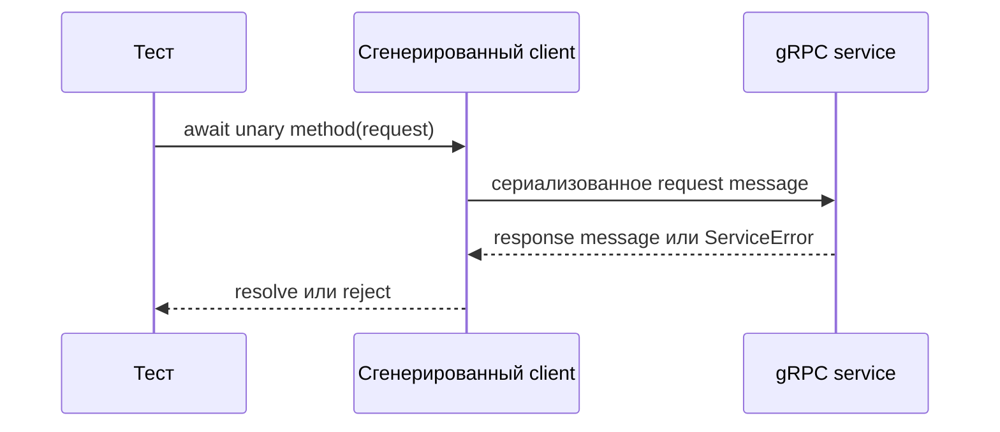

# Unary gRPC-вызовы

## Связь с предыдущей главой

Глава 199 создала типизированный client и channel. Теперь можно выполнить простейшую модель RPC: один request message и один response message.

## Цель главы

Выполнить unary call, корректно преобразовать callback API в Promise и интерпретировать жизненный цикл вызова.

## Главный вопрос

Как выполнить unary call и получить его результат в тесте?

## Мотивация

Если тест завершится до callback или обёртка Promise потеряет ошибку, RPC-вызов станет источником ложного успеха и утечки. Тест должен дождаться одного наблюдаемого результата.

## Теория

Unary call принимает один request и завершается одним response либо ошибкой. Сгенерированный client в `grpc-js` использует callback API и возвращает `ClientUnaryCall`, через который доступны cancellation и события metadata.

Небольшая обёртка Promise переводит callback в `resolve` или `reject`. Она не должна преобразовывать `ServiceError` в обычный пустой результат. Тест ожидает Promise через `await` и проверяет response.

Потоковые RPC имеют три формы: server streaming, client streaming и bidirectional streaming. В этом модуле они остаются обзором без реализации; их жизненный цикл существенно отличается от unary call.



## Внутренний механизм

Client сериализует request, связывает вызов с channel и ожидает завершения обработчика server. Callback вызывается один раз. Обёртка Promise проверяет наличие ошибки и response, не оставляя неопределённого завершения.

```text
examples/03-automation-qa/chapter-200/01-unary-call.grpc.ts
```

Пример создаёт ресурс одним unary method, затем читает его другим unary method и сравнивает response messages.

## Главная ментальная модель

Unary call — один завершённый обмен: request приводит к response или ошибке.

## Практические примеры

- Create RPC возвращает созданное message.
- Get RPC возвращает message или `NOT_FOUND`.
- Обёртка Promise сохраняет `ServiceError`.
- `finally` закрывает client.

## Automation QA

Unary methods подходят большинству command/query сценариев: подготовке данных, чтению состояния и проверке контролируемого отказа.

## Концептуальные границы и компромиссы

Обёртка Promise упрощает ход теста, но не должна скрывать metadata, deadline или cancellation. Для таких сценариев обёртку расширяют осознанно либо используют `ClientUnaryCall` напрямую.

## Распространённые ошибки

- Не вернуть или не `await`-ить Promise.
- Потерять `ServiceError` внутри callback.
- Закрыть client до завершения call.
- Считать unary call потоковым.
- Использовать произвольную задержку вместо завершения callback.

## Краткие итоги

- Unary call имеет один request и один response.
- Ошибка является альтернативным завершением call.
- Обёртка Promise должна сохранять обе ветви.
- `ClientUnaryCall` управляет конкретным вызовом.
- Потоковый RPC требует отдельного жизненного цикла и здесь не реализуется.

## Что нужно запомнить

- Всегда ожидайте завершение RPC.
- Не подавляйте ServiceError.
- Разделяйте жизненный цикл call и время жизни channel.
- Не подменяйте сигнал завершения произвольной задержкой.

## Быстрая проверка

1. Что делает call unary?
2. Зачем callback оборачивать в Promise?
3. Что возвращает сгенерированный метод кроме результата callback?
4. Когда нужен прямой доступ к `ClientUnaryCall`?
5. Почему потоковый RPC не равен нескольким unary calls?

## Практика

```text
practice/03-automation-qa/200-unary-grpc-calls.md
```

## Переход к следующей главе

Жизненный цикл unary call понятен. Глава 201 разберёт, как поля protobuf влияют на подготовку request и проверку response.
