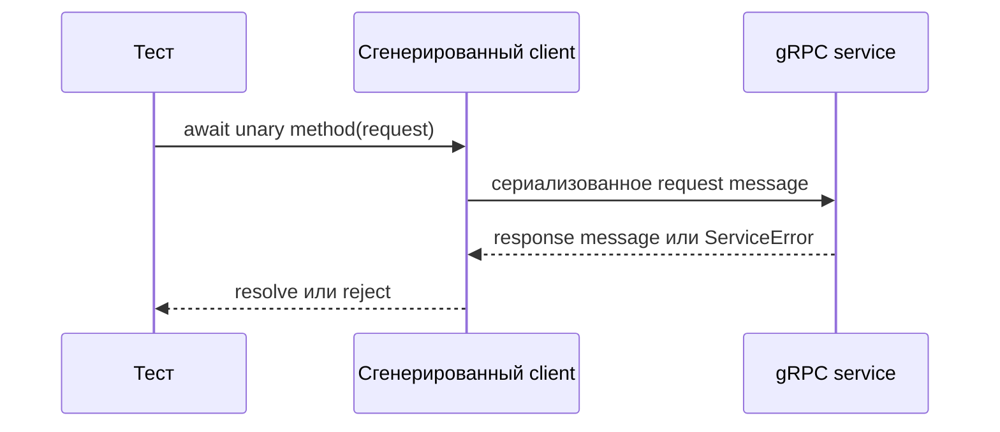

# Unary gRPC-вызовы

## Связь с предыдущей главой

Глава 199 создала типизированный client и channel. Теперь можно выполнить простейшую модель RPC: один request message и один response message.

## Цель главы

Выполнить unary call, корректно преобразовать callback API в Promise и интерпретировать жизненный цикл вызова.

## Главный вопрос

Как выполнить unary call и получить его результат в тесте?

## Мотивация

Если тест завершится до callback или обёртка Promise потеряет ошибку, RPC-вызов станет источником ложного успеха и утечки. Тест должен дождаться одного наблюдаемого результата.

## Теория

### Один запрос — одно завершение

Unary call принимает один request и завершается одним response либо ошибкой. Это простейшая из четырёх форм RPC и та, на которой строится большинство тестовых сценариев.



Client сериализует request, связывает вызов с channel и ожидает завершения обработчика server. Callback вызывается **ровно один раз** — и при успехе, и при ошибке. Это проверяемое свойство, и именно оно делает безопасным перевод вызова в Promise.

### Callback API и обёртка Promise

Сгенерированный client в `grpc-js` использует callback API и возвращает `ClientUnaryCall`, через который доступны cancellation и события metadata.

Небольшая обёртка переводит callback в `resolve` или `reject`:

```ts
const getTask = (id: string) =>
  new Promise<Task>((resolve, reject) => {
    client.GetTask({ id }, (error, response) => {
      if (error) return reject(error);
      if (!response) return reject(new Error("пустой ответ без ошибки"));
      resolve(response);
    });
  });
```

Вторая проверка не лишняя: обёртка не должна оставлять неопределённого завершения. Promise, который при неожиданном сочетании аргументов не вызовет ни `resolve`, ни `reject`, повиснет до таймаута теста и даст падение без причины.

### Обёртка обязана сохранять ошибку

Она не должна преобразовывать `ServiceError` в обычный пустой результат.

Соблазн понятен: вернуть `null` вместо ошибки и проверять «пришло или нет». Но при этом теряется всё, ради чего существует контракт отказа. `ServiceError` — настоящий `Error` с тремя полезными полями:

| Поле | Что содержит |
| --- | --- |
| `code` | gRPC status — число из собственной нумерации |
| `details` | сообщение об ошибке |
| `metadata` | заголовки, приложенные сервисом к отказу |

Проверено: отсутствующая задача даёт `code: 5` (`NOT_FOUND`), пустой обязательный аргумент — `code: 3` (`INVALID_ARGUMENT`), а приложенный сервисом заголовок доходит до клиента вместе с ошибкой. Превратив всё это в `null`, тест теряет возможность отличить «не найдено» от «неверный запрос».

Сравнивать код следует с именованной константой, а не с числом: `expect(error.code).toBe(status.NOT_FOUND)` читается и не зависит от памяти читателя.

### Deadline — точка во времени, а не длительность

Deadline указывается абсолютным моментом, а не интервалом:

```ts
client.SlowTask({ id }, { deadline: Date.now() + 2000 }, callback);
```

При истечении вызов завершается ошибкой с `code: 4` (`DEADLINE_EXCEEDED`) и понятными подробностями вида `Deadline exceeded after 0.301s`.

Это отдельный класс отказа, и путать его с ошибкой сервиса нельзя: `DEADLINE_EXCEEDED` означает, что ответ не пришёл вовремя, а не что операция не выполнена. Сервер мог успешно её завершить уже после того, как клиент перестал ждать.

### Что проверять в unary-тесте

Unary methods подходят большинству command/query сценариев: подготовке данных, чтению состояния и проверке контролируемого отказа.

Полезный набор проверок повторяет логику REST-главы, но на своих единицах:

1. вызов завершился без ошибки — или с ожидаемым `code`;
2. response содержит обязательные поля контракта;
3. бизнес-значения соответствуют правилу сценария;
4. при негативном сценарии отказ не оставил изменений.

Create RPC возвращает созданное message, Get RPC возвращает message или `NOT_FOUND` — и оба случая являются нормальными предметами проверки.

### Что обёртка не должна скрывать

Обёртка Promise упрощает ход теста, но не должна скрывать metadata, deadline или cancellation.

Практическое следствие: у обёртки должна быть возможность передать опции вызова, а при необходимости — вернуть и сам `ClientUnaryCall`. Для сценариев с отменой или чтением metadata обёртку расширяют осознанно либо используют `ClientUnaryCall` напрямую.

Ресурсом по-прежнему владеет тот, кто его создал: `finally` закрывает client после завершения сценария.

### Потоковые вызовы — за границей главы

Потоковые RPC имеют три формы: server streaming, client streaming и bidirectional streaming.

В этом модуле они остаются обзором без реализации. Причина не в сложности синтаксиса, а в том, что их жизненный цикл существенно отличается от unary call: поток может завершиться ошибкой в середине, требует обработки событий и отдельного решения о том, что считать завершением. Проверка такого сценария строится иначе и заслуживает отдельного разбора.

## Внутренний механизм

Client сериализует request, связывает вызов с channel и ожидает завершения обработчика server. Callback вызывается один раз. Обёртка Promise проверяет наличие ошибки и response, не оставляя неопределённого завершения.

```text
examples/03-automation-qa/chapter-200/01-unary-call.grpc.ts
```

Пример создаёт ресурс одним unary method, затем читает его другим unary method и сравнивает response messages.

## Главная ментальная модель

Unary call — один завершённый обмен: request приводит к response или ошибке.

## Практические примеры

- Create RPC возвращает созданное message.
- Get RPC возвращает message или `NOT_FOUND`.
- Обёртка Promise сохраняет `ServiceError`.
- `finally` закрывает client.

## Automation QA

Unary methods подходят большинству command/query сценариев: подготовке данных, чтению состояния и проверке контролируемого отказа.

## Концептуальные границы и компромиссы

Обёртка Promise упрощает ход теста, но не должна скрывать metadata, deadline или cancellation. Для таких сценариев обёртку расширяют осознанно либо используют `ClientUnaryCall` напрямую.

## Распространённые мифы

**Миф: callback может сработать дважды.**
Unary call завершается ровно один раз — этим и безопасен перевод в Promise.

**Миф: удобно вернуть `null` вместо ошибки.**
Так теряются `code`, `details` и `metadata`, и «не найдено» становится неотличимо от «неверный запрос».

**Миф: deadline задаётся длительностью.**
Это абсолютный момент времени: `Date.now() + 2000`, а не `2000`.

**Миф: `DEADLINE_EXCEEDED` означает, что операция не выполнена.**
Он означает, что ответ не пришёл вовремя. Сервер мог завершить работу позже.

**Миф: обёртка Promise делает `ClientUnaryCall` ненужным.**
Через него доступны отмена и события metadata. Обёртка не должна закрывать этот путь.

## Частые вопросы

**Как проверить ожидаемый отказ?**
Сравнить `error.code` с именованной константой статуса, а при необходимости — прочитать `details` и `metadata`.

**Что делать, если пришёл и пустой ответ, и пустая ошибка?**
Отклонять Promise с понятным сообщением. Иначе тест повиснет до таймаута без объяснимой причины.

**Чем отличается `DEADLINE_EXCEEDED` от ошибки сервиса?**
Первый относится к клиентскому ожиданию, второй — к результату обработки. После истечения срока операция может всё же завершиться.

**Нужно ли проверять форму response?**
Да, для ключевых ответов: protobuf гарантирует типы, но не наличие бизнес-значений.

**Когда понадобится потоковый RPC?**
Когда контракт публикует поток. Его жизненный цикл устроен иначе и разбирается отдельно.

## Распространённые ошибки

- Не вернуть или не `await`-ить Promise.
- Потерять `ServiceError` внутри callback.
- Закрыть client до завершения call.
- Считать unary call потоковым.
- Использовать произвольную задержку вместо завершения callback.

## Краткие итоги

- Unary call имеет один request и один response.
- Ошибка является альтернативным завершением call.
- Обёртка Promise должна сохранять обе ветви.
- `ClientUnaryCall` управляет конкретным вызовом.
- Потоковый RPC требует отдельного жизненного цикла и здесь не реализуется.

## Что нужно запомнить

- Всегда ожидайте завершение RPC.
- Не подавляйте ServiceError.
- Разделяйте жизненный цикл call и время жизни channel.
- Не подменяйте сигнал завершения произвольной задержкой.

## Быстрая проверка

1. Что делает call unary?
2. Зачем callback оборачивать в Promise?
3. Что возвращает сгенерированный метод кроме результата callback?
4. Когда нужен прямой доступ к `ClientUnaryCall`?
5. Почему потоковый RPC не равен нескольким unary calls?

## Практика

```text
practice/03-automation-qa/200-unary-grpc-calls.md
```

## Переход к следующей главе

Жизненный цикл unary call понятен. Глава 201 разберёт, как поля protobuf влияют на подготовку request и проверку response.
