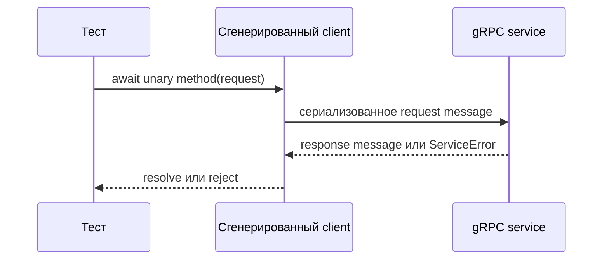

# Унарные вызовы gRPC

## Связь с предыдущей главой

Глава 199 создала типизированный client и channel. Теперь можно выполнить простейшую модель RPC: один request message и один response message.

## Цель главы

Выполнить unary call, корректно преобразовать callback API в Promise и интерпретировать жизненный цикл вызова.

## Главный вопрос

Как выполнить унарный вызов и получить его результат в тесте?

## Мотивация

Если тест завершится до callback или обёртка Promise потеряет ошибку, RPC-вызов станет источником ложного успеха и утечки. Тест должен дождаться одного наблюдаемого результата.

## Теория

### Один запрос — одно завершение

Унарный вызов принимает один запрос и завершается одним ответом либо ошибкой. Это простейшая из четырёх форм RPC и та, на которой строится большинство тестовых сценариев.


```mermaid
sequenceDiagram
    participant T as Тест
    participant C as Сгенерированный client
    participant S as gRPC service
    T->>C: await unary method(request)
    C->>S: сериализованное request message
    S-->>C: response message или ServiceError
    C-->>T: resolve или reject
```

Клиент сериализует запрос, связывает вызов с каналом и ожидает завершения обработчика на сервере. Обратный вызов происходит **ровно один раз** — и при успехе, и при ошибке. Это проверяемое свойство, и именно оно делает безопасным перевод вызова в промис.

### Обратный вызов и обёртка в промис

Сгенерированный клиент в `grpc-js` использует обратные вызовы и возвращает `ClientUnaryCall`, через который доступны отмена и события метаданных.

Небольшая обёртка переводит обратный вызов в `resolve` или `reject`:

```ts
const getTask = (id: string) =>
  new Promise<Task>((resolve, reject) => {
    client.GetTask({ id }, (error, response) => {
      if (error) return reject(error);
      if (!response) return reject(new Error("пустой ответ без ошибки"));
      resolve(response);
    });
  });
```

Вторая проверка не лишняя: обёртка не должна оставлять неопределённого завершения. Промис, который при неожиданном сочетании аргументов не вызовет ни `resolve`, ни `reject`, повиснет до истечения срока теста и даст падение без причины.

### Обёртка обязана сохранять ошибку

Она не должна преобразовывать `ServiceError` в обычный пустой результат.

Соблазн понятен: вернуть `null` вместо ошибки и проверять «пришло или нет». Но при этом теряется всё, ради чего существует контракт отказа. `ServiceError` — настоящий `Error` с тремя полезными полями:

| Поле | Что содержит |
| --- | --- |
| `code` | код состояния gRPC — число из собственной нумерации |
| `details` | сообщение об ошибке |
| `metadata` | заголовки, приложенные сервисом к отказу |

Проверено: отсутствующая задача даёт `code: 5` (`NOT_FOUND`), пустой обязательный аргумент — `code: 3` (`INVALID_ARGUMENT`), а приложенный сервисом заголовок доходит до клиента вместе с ошибкой. Превратив всё это в `null`, тест теряет возможность отличить «не найдено» от «неверный запрос».

Сравнивать код следует с именованной константой, а не с числом: `expect(error.code).toBe(status.NOT_FOUND)` читается и не зависит от памяти читателя.

### Крайний срок — точка во времени, а не длительность

Крайний срок указывается абсолютным моментом, а не интервалом:

```ts
client.SlowTask({ id }, { deadline: Date.now() + 2000 }, callback);
```

При истечении вызов завершается ошибкой с `code: 4` (`DEADLINE_EXCEEDED`) и понятными подробностями вида `Deadline exceeded after 0.301s`.

Это отдельный класс отказа, и путать его с ошибкой сервиса нельзя: `DEADLINE_EXCEEDED` означает, что ответ не пришёл вовремя, а не что операция не выполнена. Сервер мог успешно её завершить уже после того, как клиент перестал ждать.

### Что проверять в унарном тесте

Унарные методы подходят большинству сценариев «команда — запрос»: подготовке данных, чтению состояния и проверке контролируемого отказа.

Полезный набор проверок повторяет логику REST-главы, но на своих единицах:

1. вызов завершился без ошибки — или с ожидаемым `code`;
2. ответ содержит обязательные поля контракта;
3. бизнес-значения соответствуют правилу сценария;
4. при негативном сценарии отказ не оставил изменений.

Метод создания возвращает созданное сообщение, метод чтения возвращает сообщение или `NOT_FOUND` — и оба случая являются нормальными предметами проверки.

### Что обёртка не должна скрывать

Обёртка в промис упрощает ход теста, но не должна скрывать метаданные, крайний срок или отмену.

Практическое следствие: у обёртки должна быть возможность передать параметры вызова, а при необходимости — вернуть и сам `ClientUnaryCall`. Для сценариев с отменой или чтением метаданных обёртку расширяют осознанно либо используют `ClientUnaryCall` напрямую.

Ресурсом по-прежнему владеет тот, кто его создал: `finally` закрывает клиент после завершения сценария.

### Потоковые вызовы — за границей главы

Потоковые вызовы RPC имеют три формы: поток от сервера, поток от клиента и двунаправленный поток.

В этом модуле они остаются обзором без реализации. Причина не в сложности синтаксиса, а в том, что их жизненный цикл существенно отличается от унарного вызова: поток может завершиться ошибкой в середине, требует обработки событий и отдельного решения о том, что считать завершением. Проверка такого сценария строится иначе и заслуживает отдельного разбора.

## Внутренний механизм

Клиент сериализует запрос, связывает вызов с каналом и ожидает завершения обработчика на сервере. Обратный вызов происходит один раз. Обёртка в промис проверяет наличие ошибки и ответа, не оставляя неопределённого завершения.

### От вызова до результата

```text
client.create(запрос, метаданные, { deadline }, обратный вызов)
   │
   ├─ сериализация сообщения в protobuf
   ├─ отправка по каналу, ожидание обработчика на сервере
   ▼
обратный вызов(ошибка, ответ)   ← срабатывает РОВНО один раз
   ├─ ошибка есть  → это ServiceError с code, details, metadata
   └─ ошибки нет   → ответ разобран в типизированный объект
```

Гарантия «ровно один раз» и делает возможной обёртку в промис: одна ветвь
разрешает его, другая отклоняет, третьего состояния не бывает. Забытая ветвь
даёт не ошибку, а зависание до срока.

### Почему обёртка в промис обязательна

| Форма | Что будет при отказе сервиса |
| --- | --- |
| обратный вызов без обёртки | ошибка придёт после завершения теста |
| обёртка без `await` в тесте | необработанное отклонение роняет процесс |
| `await` обёртки | обычное падение теста с кодом состояния |

Средняя строка — самый дорогой случай: падает весь прогон, а не один тест, и
сообщение не указывает на виновный тест.

`ServiceError` при этом — настоящий `Error`: у него есть `message` и стек, а
рядом — `code`, `details` и `metadata`. Проверять нужно `code`: он стабилен, а
текст `details` меняется между версиями среды.
```text
examples/03-automation-qa/chapter-200/01-unary-call.grpc.ts
```

Пример создаёт ресурс одним унарным методом, затем читает его другим унарным методом и сравнивает сообщения ответов.

## Главная ментальная модель

Унарный вызов — один завершённый обмен: запрос приводит к ответу или ошибке.

## Практические примеры

- Метод создания возвращает созданное сообщение.
- Метод чтения возвращает сообщение или `NOT_FOUND`.
- Обёртка Promise сохраняет `ServiceError`.
- `finally` закрывает клиент.

## Automation QA

Унарные методы подходят большинству сценариев «команда — запрос»: подготовке данных, чтению состояния и проверке контролируемого отказа.

## Концептуальные границы и компромиссы

Обёртка в промис упрощает ход теста, но не должна скрывать метаданные, крайний срок или отмену. Для таких сценариев обёртку расширяют осознанно либо используют `ClientUnaryCall` напрямую.

## Распространённые мифы

**Миф: обратный вызов может сработать дважды.**
Унарный вызов завершается ровно один раз — этим и безопасен перевод в промис.

**Миф: удобно вернуть `null` вместо ошибки.**
Так теряются `code`, `details` и `metadata`, и «не найдено» становится неотличимо от «неверный запрос».

**Миф: крайний срок задаётся длительностью.**
Это абсолютный момент времени: `Date.now() + 2000`, а не `2000`.

**Миф: `DEADLINE_EXCEEDED` означает, что операция не выполнена.**
Он означает, что ответ не пришёл вовремя. Сервер мог завершить работу позже.

**Миф: обёртка Promise делает `ClientUnaryCall` ненужным.**
Через него доступны отмена и события метаданных. Обёртка не должна закрывать этот путь.

## Частые вопросы

**Как проверить ожидаемый отказ?**
Сравнить `error.code` с именованной константой статуса, а при необходимости — прочитать `details` и `metadata`.

**Что делать, если пришёл и пустой ответ, и пустая ошибка?**
Отклонять промис с понятным сообщением. Иначе тест повиснет до истечения срока без объяснимой причины.

**Чем отличается `DEADLINE_EXCEEDED` от ошибки сервиса?**
Первый относится к клиентскому ожиданию, второй — к результату обработки. После истечения срока операция может всё же завершиться.

**Нужно ли проверять форму ответа?**
Да, для ключевых ответов: protobuf гарантирует типы, но не наличие бизнес-значений.

**Когда понадобится потоковый RPC?**
Когда контракт публикует поток. Его жизненный цикл устроен иначе и разбирается отдельно.

## Распространённые ошибки

- Не вернуть или не `await`-ить Promise — тест завершится раньше ответа, а ошибка вызова придёт уже после теста и станет необработанным отклонением.

- Потерять `ServiceError` внутри обратного вызова — обратный вызов срабатывает ровно один раз и получает либо ошибку, либо ответ. Если ошибку не передать в отклонение промиса, вызов останется висеть до таймаута.

- Закрыть клиент до завершения вызова — обращение после `close()` синхронно бросает `Channel has been shut down`, и причина выглядит как дефект инфраструктуры.

- Считать унарный вызов потоковым — у унарного метода один запрос и один ответ; подписка на события потока здесь не нужна и ничего не даст.

- Использовать произвольную задержку вместо завершения обратного вызова — пауза не связана с ответом: на медленной машине она короче ответа, на быстрой — лишняя.

## Краткие итоги

- Унарный вызов имеет один запрос и один ответ.
- Ошибка является альтернативным завершением вызова.
- Обёртка Promise должна сохранять обе ветви.
- `ClientUnaryCall` управляет конкретным вызовом.
- Потоковый RPC требует отдельного жизненного цикла и здесь не реализуется.

## Что нужно запомнить

- Всегда ожидайте завершение RPC.
- Не подавляйте `ServiceError`.
- Разделяйте жизненный цикл вызова и время жизни канала.
- Не подменяйте сигнал завершения произвольной задержкой.

## Быстрая проверка

1. Что делает вызов унарным?
2. Зачем обратный вызов оборачивать в промис?
3. Что возвращает сгенерированный метод кроме результата обратного вызова?
4. Когда нужен прямой доступ к `ClientUnaryCall`?
5. Почему потоковый вызов RPC не равен нескольким унарным?

### Ответы

1. Отправляет одно сообщение запроса и получает одно сообщение ответа.
2. Чтобы вызов можно было ожидать через `await` и чтобы отказ приходил как отклонённый промис, а не как первый аргумент обратного вызова.
3. Объект самого вызова: через него доступны отмена и метаданные.
4. Когда нужно отменить вызов или прочитать метаданные ответа — например, идентификатор запроса для диагностики.
5. Потоковый вызов держит одно соединение и сохраняет порядок сообщений в его пределах. Несколько отдельных вызовов такого порядка не гарантируют.

## Практика

```text
practice/03-automation-qa/200-unary-grpc-calls.md
```

## Переход к следующей главе

Жизненный цикл унарного вызова понятен. Глава 201 разберёт, как поля protobuf влияют на подготовку запроса и проверку ответа.
