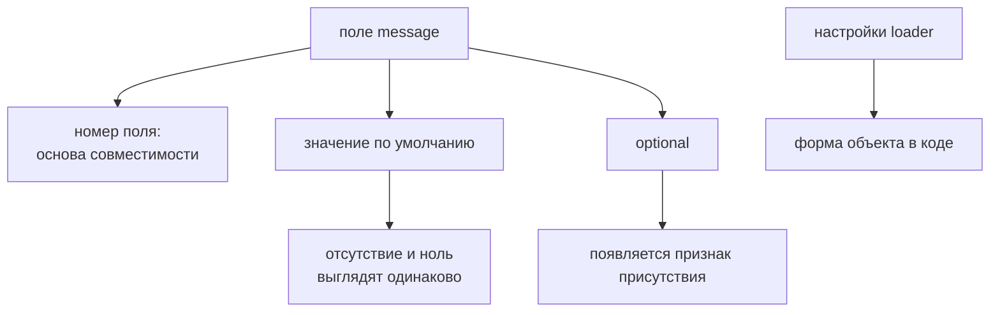

# Поля protobuf-сообщений

## Связь с предыдущей главой

Глава 200 выполнила unary call как единое действие. Теперь нужно понимать значения внутри request и response messages, включая значения по умолчанию и признак присутствия поля.

## Цель главы

Корректно подготовить и проверить скалярные, repeated, enum, `optional` и вложенные поля.

## Главный вопрос

Как особенности полей protobuf влияют на подготовку запроса и проверку ответа?

## Мотивация

Отсутствующее скалярное поле в proto3 часто декодируется в значение по умолчанию. Поэтому `false`, `0` или пустая строка не всегда доказывают, что отправитель явно передал поле. Присутствие `optional`-поля и обычное значение по умолчанию отвечают на разные вопросы.

## Теория

### Виды полей и что они означают

Скалярные поля хранят простые значения: строки, числа и логические значения. Повторяемое поле представляет последовательность значений. Вложенное сообщение имеет собственный набор полей и отдельное представление отсутствия в сгенерированном интерфейсе.

Перечисление ограничивает набор именованных вариантов, но его нулевое значение обычно обозначает неопределённое состояние. По соглашению его называют `*_UNSPECIFIED`, и это не бизнес-выбор, а признак «значение не задано».

### Значения по умолчанию скрывают отсутствие

Это главная особенность proto3, с которой сталкивается каждый тест. Обычное скалярное поле без признака присутствия при чтении получает значение по умолчанию — и отличить «не передали» от «передали пустое» невозможно.

Проверено на реальном ответе при настройках загрузчика этого модуля. Запрос отправил только `title`, а разобранный объект выглядит так:

```json
{
  "id": "t-1",
  "title": "Минимум",
  "labels": [],
  "priority": "PRIORITY_UNSPECIFIED",
  "owner": null,
  "completed": false,
  "estimate": 0
}
```

Ни одно из этих полей сервер не отправлял. `labels` стал пустым массивом, число — нулём, логическое поле — `false`, перечисление — нулевым вариантом.

### Настройки загрузчика определяют форму объекта

Загрузчик этого модуля включает `defaults`, `arrays`, `objects`, `oneofs` и строковое представление перечислений. Именно поэтому выходной объект содержит пустые повторяемые коллекции и значения скалярных полей по умолчанию.

| Настройка | Что даёт | Видно в примере выше |
| --- | --- | --- |
| `defaults` | значения по умолчанию у скалярных полей | `estimate: 0`, `completed: false` |
| `arrays` | пустой массив вместо отсутствия | `labels: []` |
| `objects` | предсказуемое представление вложенных | `owner: null` |
| `enums: String` | имя варианта вместо числа | `"PRIORITY_UNSPECIFIED"` |
| `oneofs` | признак присутствия `optional` | поле `_description` |

Эти настройки — часть контракта тестового кода. Тест, написанный в расчёте на `labels: []`, сломается, если загрузчик настроят иначе и отсутствующая коллекция станет `undefined`.

Обратите внимание на асимметрию: вложенное сообщение при отсутствии даёт `null`, а не пустой объект. Проверка `expect(response.owner.id)` на такой ответ упадёт с ошибкой обращения к `null`, а не с внятным сообщением о контракте.

### Как `optional` возвращает признак присутствия

`optional` в современном proto3 сохраняет признак присутствия: декодер может различить отсутствие поля и переданное значение. В сгенерированном API он выражается служебным `oneof`.

Механика видна на двух вызовах:

```ts
// поле не передано
response._description   // undefined
response.description    // undefined

// передана пустая строка
response._description   // "description"  ← имя присутствующего поля
response.description    // ""
```

Служебное поле `_description` содержит **имя** присутствующего поля, а не булево значение. Проверять присутствие следует именно по нему: `description === ""` не отличит переданную пустую строку от отсутствия.

### Развитие контракта на уровне полей

Изменение типа поля или значения перечисления требует анализа совместимости.

Добавление нового значения перечисления может быть совместимо на уровне protobuf: старый декодер примет неизвестное число. Но старый прикладной код должен корректно обработать неизвестный вариант — иначе `switch` без ветви по умолчанию молча провалится, а при строковом представлении тест сравнит имя, которого не знает.

Практический вывод для теста: проверяя перечисление, сравнивайте с ожидаемым именем варианта, а не полагайтесь на то, что список исчерпывающий.

### Что проверять в сообщении

Тест выбирает поля, важные для сценария, и учитывает параметры загрузчика. Снимок всего сообщения часто хрупок: он включает значения по умолчанию, которые сервис не задавал, и ломается при добавлении любого нового поля.

Точечные проверки лучше показывают нарушенное правило:

- **повторяемое поле** — проверить состав и, если порядок является контрактом, порядок;
- **перечисление** — сравнить с именем ожидаемого варианта, не считая нулевое значение бизнес-выбором;
- **необязательное поле** — отличить присутствие от значения по умолчанию через признак;
- **вложенное сообщение** — проверять его поля отдельно, предварительно убедившись, что оно не `null`.

### Чего сгенерированные типы не гарантируют

Сгенерированные типы помогают использовать поля, но не доказывают допустимость бизнес-значений. Тип `string` для `title` не мешает сервису вернуть пустую строку там, где контракт обещает непустую.

Полная проверка совместимости protobuf требует сравнения версий контрактов и не сводится к одной проверке ответа: одиночный ответ говорит о текущем поведении стенда, а не о том, поймут ли друг друга участники с разными версиями `.proto`.

У поля есть не только тип, но и семантика protobuf:



## Внутренний механизм

Загрузчик этого модуля включает `defaults`, `arrays`, `objects`, `oneofs` и строковое представление перечислений. Поэтому выходной объект содержит пустые повторяемые коллекции и значения скалярных полей по умолчанию. Необязательное поле дополнительно имеет признак присутствия, сгенерированный из служебного `oneof`.

### Отсутствующее поле приходит заполненным

| Что в договоре | Чего не прислали | Что увидит тест |
| --- | --- | --- |
| `string title` | `title` | `""` |
| `int32 priority` | `priority` | `0` |
| `bool archived` | `archived` | `false` |
| `repeated string tags` | `tags` | `[]` |
| `enum Status status` | `status` | имя **нулевого** варианта |
| `Owner owner` | `owner` | `null`, а не пустой объект |

Настройки загрузчика (`defaults`, `arrays`, `objects`) делают форму ответа
предсказуемой, но платой становится неразличимость «не прислали» и «прислали
значение по умолчанию».

Строка про перечисление — источник тихих ошибок: «статус `NEW`» может означать,
что поле не заполнено вовсе. Строка про вложенное сообщение — источник падений:
`owner.name` на `null` даёт `TypeError`, а не `undefined`.

### Как различить отсутствие и значение по умолчанию

```text
optional string description = 5;

прислали "":        _description: "description",  description: ""
не прислали:        _description: undefined,      description: ""
```

Модификатор `optional` добавляет служебное поле присутствия. Важная деталь: оно
содержит **имя** присутствующего поля, а не булево значение — проверка
`if (message._description)` работает, но по причине, отличной от ожидаемой.

Когда различие существенно (сбросили описание или не трогали), `optional` в
договоре обязателен: другого способа увидеть это на стороне клиента нет.
```text
examples/03-automation-qa/chapter-201/01-protobuf-fields.grpc.ts
```

Пример отправляет метки, приоритет, необязательное описание и вложенного владельца, затем проверяет разобранный ответ.

## Главная ментальная модель

Поле имеет не только тип TypeScript, но и семантику protobuf: номер, значение по умолчанию, признак присутствия и правила развития контракта.

## Практические примеры

- Проверить порядок и состав повторяемого поля `labels`.
- Не считать нулевое значение перечисления бизнес-выбором без контракта.
- Отличить отсутствующее `optional`-поле `description` от пустой строки.
- Проверить поля вложенного `owner` отдельно.

## Automation QA

Тест выбирает поля, важные для сценария, и учитывает параметры загрузчика. Снимок всего сообщения часто хрупок; точечные проверки лучше показывают нарушенное правило.

## Концептуальные границы и компромиссы

Сгенерированные типы помогают использовать поля, но не доказывают допустимость бизнес-значений. Полная проверка совместимости protobuf требует сравнения версий контрактов и не сводится к одной проверке ответа.

## Распространённые мифы

**Миф: пустое поле в ответе означает, что сервер его не отправлял.**
В proto3 обычное поле получает значение по умолчанию. Отличить отсутствие можно только через признак присутствия у `optional`.

**Миф: отсутствующее вложенное сообщение придёт пустым объектом.**
Оно приходит как `null`. Обращение к его полю даст ошибку `null`, а не понятное сообщение о контракте.

**Миф: `_description` — булев признак.**
Оно содержит имя присутствующего поля. Проверяется на наличие, а не на `true`.

**Миф: нулевое значение перечисления — обычный вариант выбора.**
По соглашению это «не задано». Считать его бизнес-значением можно только если так сказано в контракте.

**Миф: снимок всего сообщения — надёжная проверка.**
Он включает значения по умолчанию и ломается от любого нового поля. Точечные проверки диагностичнее.

## Частые вопросы

**Как отличить пустую строку от отсутствия поля?**
Только через `optional` и его признак присутствия. Обычное поле такой информации не несёт.

**Почему `labels` пришёл пустым массивом, а не `undefined`?**
Так настроен загрузчик: параметр `arrays` подставляет пустую коллекцию. При другой настройке поле будет отсутствовать.

**Как проверять перечисление?**
Сравнением с именем ожидаемого варианта. При `enums: String` в объект приходит имя, а не число.

**Безопасно ли добавить новое значение перечисления?**
На уровне protobuf обычно да. Опасность в прикладном коде, который не обработает неизвестный вариант.

**Доказывает ли успешный тест совместимость контракта?**
Нет. Он подтверждает поведение текущего стенда, а не согласие разных версий `.proto`.

## Распространённые ошибки

- Путать отсутствие поля и значение по умолчанию — при обычных настройках загрузчика пропущенный скаляр приходит как `""` или `0`, `repeated` — как `[]`, а вложенное сообщение — как `null`. Различить «не задано» и «задано нулём» позволяет только `optional`.

- Автоматически считать нулевое значение перечисления допустимым бизнес-значением — отсутствующее перечисление приходит именем нулевого варианта, поэтому «статус `NEW`» может означать «поле не прислали».

- Игнорировать порядок повторяемого поля, если он входит в контракт — в protobuf порядок элементов сохраняется, и если сервис обещает сортировку, её нужно проверять явно.

- Проверять вложенное сообщение как непрозрачный объект — сравнение целиком падает от любого нового поля. Проверяют значимые поля по отдельности.

- Менять тип поля без анализа совместимости protobuf — при том же номере получатель не сможет разобрать данные и упадёт с ошибкой чтения, а не с понятным сообщением о несовместимости.

## Краткие итоги

- Скалярные поля имеют значения protobuf по умолчанию.
- Повторяемые поля представляют коллекции.
- Нулевое значение перечисления требует осознанной семантики.
- `Optional`-поля сохраняют признак присутствия.
- Вложенные сообщения проверяются по собственной структуре.

## Что нужно запомнить

- Читайте параметры загрузчика вместе с проверками.
- Не смешивайте отсутствие поля и пустое значение.
- Проверяйте важные вложенные поля явно.
- Учитывайте неизвестные значения перечисления при развитии контракта.

## Быстрая проверка

1. Какое значение по умолчанию имеет `bool`?
2. Чем повторяемое поле отличается от необязательного?
3. Зачем перечислению нулевое значение?
4. Что даёт признак присутствия `optional`-поля?
5. Как проверять вложенное сообщение?

### Ответы

1. `false`. Значения по умолчанию не передаются по сети, поэтому отсутствие поля и `false` неразличимы.
2. Повторяемое поле — это список, и его отсутствие выглядит как пустой список. `optional` относится к одиночному полю и даёт признак присутствия.
3. Он нужен как значение по умолчанию: поле, которого нет в сообщении, получит именно его. Обычно это вариант «не задано».
4. Позволяет отличить «значение не передали» от «передали значение по умолчанию» — например, ноль или пустую строку.
5. Сначала убедиться, что вложенное сообщение присутствует, и только потом проверять его поля: у отсутствующего вложенного сообщения все поля равны значениям по умолчанию.

## Практика

```text
practice/03-automation-qa/201-protobuf-message-fields.md
```

## Переход к следующей главе

Бизнес-данные находятся в сообщении. Глава 202 отделит от них служебные метаданные и данные доступа.
