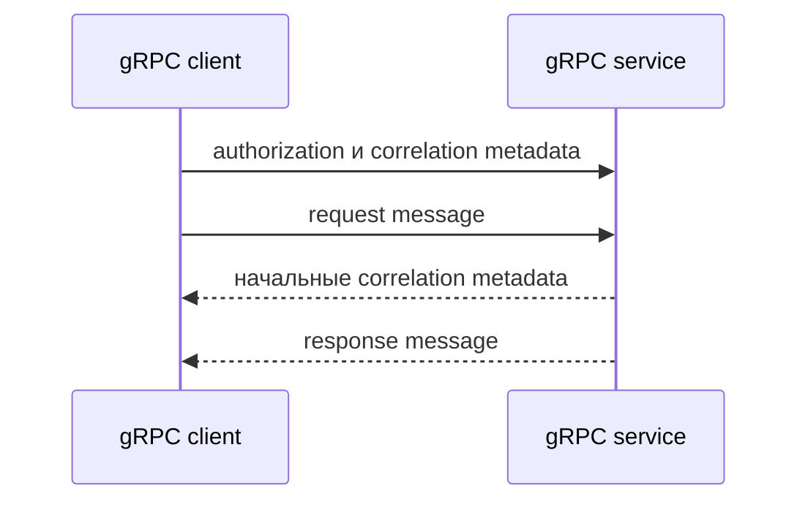

# Metadata и аутентификация gRPC

## Связь с предыдущей главой

Глава 201 разобрала бизнес-поля protobuf message. Correlation ID, данные доступа и другой служебный контекст не должны становиться частью каждого бизнес-message.

## Цель главы

Передавать служебные данные через metadata, различать аутентификацию и авторизацию и не раскрывать секреты.

## Главный вопрос

Как передавать служебные данные отдельно от request message?

## Мотивация

Если bearer token встроен в protobuf message, бизнес-контракт смешивается с механизмом доступа. Metadata создаёт отдельный канал для служебного контекста конкретного RPC-вызова.

## Теория

Metadata представляет набор пар «ключ — значение», сопровождающих call. Client передаёт metadata server, а server может вернуть начальные или завершающие metadata. Бизнес-request при этом сохраняет собственную форму.

Текстовые metadata используют обычные строковые ключи. Бинарные metadata имеют ключ с суффиксом `-bin` и отдельные правила значений; они не нужны текущему примеру. `authorization` переносит учебный bearer token, а `x-correlation-id` связывает диагностические данные вызова.

Аутентификация отвечает, кто вызывает service. Авторизация определяет, разрешён ли этому субъекту RPC method. Отсутствующий или недействительный token приводит к `UNAUTHENTICATED`; известный субъект без требуемого права — к `PERMISSION_DENIED`.



## Внутренний механизм

`Metadata` создаётся для вызова и передаётся отдельным аргументом сгенерированного метода. Server читает `call.metadata`, может отправить начальные metadata через `sendMetadata()` и завершает call через response или status.

```text
examples/03-automation-qa/chapter-202/01-metadata-authentication.grpc.ts
```

Пример проверяет допустимый token, отсутствующие и недействительные данные доступа, недостаточные права и возврат correlation ID без вывода token в лог.

## Главная ментальная модель

Message несёт бизнес-данные. Metadata несёт служебный контекст вызова.

## Практические примеры

- Добавить учебный bearer token к защищённому RPC method.
- Передать correlation ID для диагностики.
- Проверить `UNAUTHENTICATED` без token.
- Проверить `UNAUTHENTICATED` с недействительным token.
- Проверить `PERMISSION_DENIED` для read-only субъекта.

## Automation QA

Общие metadata можно добавлять через helper или interceptor, если это уменьшает повторение. Metadata конкретного сценария остаются видимыми в тесте. Interceptor не должен создавать глобальный изменяемый `Metadata` и скрывать права доступа.

## Концептуальные границы и компромиссы

Общая функция подготовки metadata упрощает client, но усложняет изоляцию при изменении общего объекта. Управление секретами в production и инфраструктура TLS не входят в эту главу.

## Распространённые ошибки

- Помещать token в request message.
- Выводить metadata с credentials в лог.
- Путать `UNAUTHENTICATED` и `PERMISSION_DENIED`.
- Повторно использовать изменяемый `Metadata` между тестами.
- Скрывать correlation ID конкретного сценария.

## Краткие итоги

- Metadata отделена от protobuf message.
- Client и server могут обмениваться metadata.
- Аутентификация и авторизация решают разные задачи.
- Учебных данных доступа достаточно для локального примера.
- Metadata каждого вызова должны быть изолированы.

## Что нужно запомнить

- Не храните реальные секреты в коде.
- Не записывайте authorization metadata в лог.
- Создавайте metadata на контролируемой границе.
- Проверяйте status вместе с details.

## Быстрая проверка

1. Чем metadata отличается от message?
2. Где передаётся bearer token?
3. Когда ожидается `UNAUTHENTICATED`?
4. Когда ожидается `PERMISSION_DENIED`?
5. Зачем correlation ID?

## Практика

```text
practice/03-automation-qa/202-grpc-metadata-and-authentication.md
```

## Переход к следующей главе

Доступ к RPC method настроен, но call может отвечать слишком долго. Глава 203 введёт deadline и явную cancellation.
