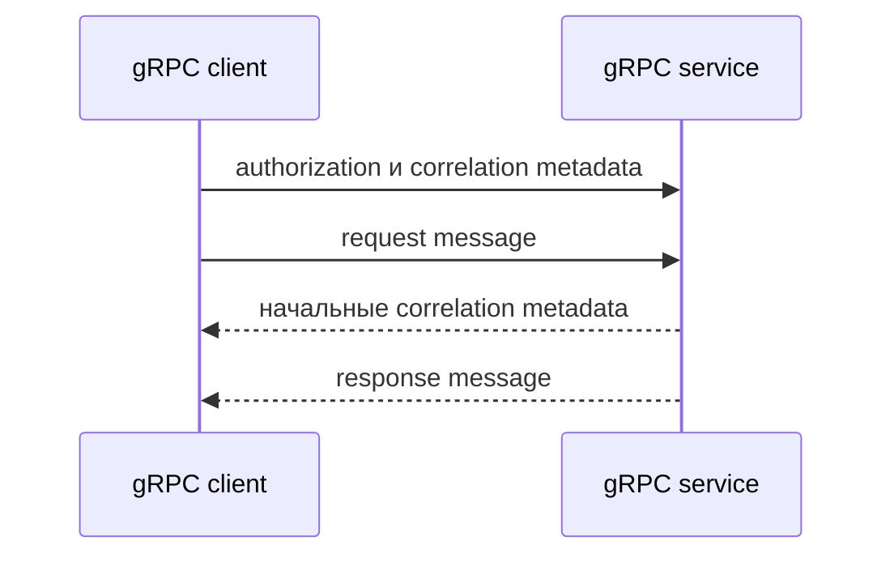

# Metadata и аутентификация gRPC

## Связь с предыдущей главой

Глава 201 разобрала бизнес-поля protobuf message. Correlation ID, данные доступа и другой служебный контекст не должны становиться частью каждого бизнес-message.

## Цель главы

Передавать служебные данные через metadata, различать аутентификацию и авторизацию и не раскрывать секреты.

## Главный вопрос

Как передавать служебные данные отдельно от request message?

## Мотивация

Если bearer token встроен в protobuf message, бизнес-контракт смешивается с механизмом доступа. Metadata создаёт отдельный канал для служебного контекста конкретного RPC-вызова.

## Теория

### Message несёт данные, metadata — контекст

Metadata представляет набор пар «ключ — значение», сопровождающих call. Client передаёт metadata server, а server может вернуть начальные или завершающие metadata. Бизнес-request при этом сохраняет собственную форму.

Разделение простое и его стоит держать в голове при проектировании теста: если значение относится к предметной области — оно поле message; если к самому вызову (кто вызывает, какой запрос в трассировке, какая версия клиента) — оно metadata.



### Ключи приводятся к нижнему регистру

Практическая деталь, которая экономит время при отладке. Заголовок, записанный как `Authorization`, приходит на сервер как `authorization`:

```ts
md.set("Authorization", "Bearer good");
md.set("X-Correlation-Id", "req-42");
// сервер видит: authorization, x-correlation-id, user-agent
```

Среда выполнения добавляет и собственные ключи — `user-agent` присутствует всегда, даже если тест ничего не задавал. Поэтому проверка «в metadata ровно два ключа» окажется неверной.

Чтение на стороне сервера возвращает **массив** значений: `call.metadata.get("authorization")` даёт `["Bearer good"]`, а для отсутствующего ключа — пустой массив. Один и тот же ключ может быть задан несколько раз.

### Текстовые и бинарные metadata

Текстовые metadata используют обычные строковые ключи. Бинарные metadata имеют ключ с суффиксом `-bin` и отдельные правила значений.

Разница видна при чтении: значение ключа `x-trace-bin` приходит на сервер как `Buffer`, а не как строка. Поэтому `-bin` — не соглашение об именовании, а переключатель обработки: среда выполнения кодирует такое значение иначе.

Для учебных сценариев бинарные metadata не нужны; знать о них стоит, чтобы не удивиться `Buffer` там, где ожидалась строка.

### Начальные и завершающие metadata

Server может отправить начальные metadata через `sendMetadata()` до отправки ответа. Client получает их отдельным событием:

```ts
const call = client.Secure(request, metadata, callback);
call.on("metadata", (received) => {
  received.get("x-correlation-id");   // ["req-42"]
});
```

Это тот же приём «сначала наблюдение, затем результат», что и в браузерных сценариях: подписка должна существовать к моменту события.

Завершающие metadata приходят вместе со статусом — в том числе с ошибкой. Именно поэтому в gRPC у отказа есть место для диагностики, а `ServiceError` содержит поле `metadata`.

### Аутентификация и авторизация в gRPC

Аутентификация отвечает, кто вызывает service. Авторизация определяет, разрешён ли этому субъекту RPC method.

Коды отличаются и их номера стоит знать: отсутствующий или недействительный token приводит к `UNAUTHENTICATED` (16); известный субъект без требуемого права — к `PERMISSION_DENIED` (7).

| Ситуация | Статус | Код |
| --- | --- | --- |
| metadata без `authorization` | `UNAUTHENTICATED` | 16 |
| token не распознан | `UNAUTHENTICATED` | 16 |
| субъект известен, прав нет | `PERMISSION_DENIED` | 7 |

Проверено на контролируемом сервисе: вызов без token дал 16, вызов валидным token от read-only субъекта — 7.

### Минимальный набор проверок доступа

Как и в REST, полезный набор состоит из позитивного сценария и трёх негативных:

1. допустимый token и достаточные права — успех;
2. отсутствующие учётные данные — `UNAUTHENTICATED`;
3. недействительный token — `UNAUTHENTICATED`;
4. валидный token без нужного права — `PERMISSION_DENIED`.

Третий пункт отделён от второго не зря: сервис, который принимает произвольную строку вместо token, проходит проверку «без token отказ» и при этом полностью открыт.

`authorization` переносит учебный bearer token, а `x-correlation-id` связывает диагностические данные вызова. Token при этом не должен попадать в вывод теста — отчёт живёт дольше и доступен шире, чем код.

### Общие metadata и граница читаемости

Общие metadata можно добавлять через helper или interceptor, если это уменьшает повторение. Metadata конкретного сценария остаются видимыми в тесте.

Interceptor не должен создавать глобальный изменяемый `Metadata` и скрывать права доступа. Причина та же, что у общего изменяемого состояния вообще: объект, который меняют несколько тестов, связывает их между собой, а при параллельном запуске даёт гонку.

Общая функция подготовки metadata упрощает client, но усложняет изоляцию при изменении общего объекта. Безопасная форма — функция, **создающая новый** `Metadata` на каждый вызов, а не возвращающая общий экземпляр.

Управление секретами в production и инфраструктура TLS не входят в эту главу: здесь важно, как тест передаёт доказательство доступа и как проверяет контракт отказа.

## Внутренний механизм

`Metadata` создаётся для вызова и передаётся отдельным аргументом сгенерированного метода. Server читает `call.metadata`, может отправить начальные metadata через `sendMetadata()` и завершает call через response или status.

```text
examples/03-automation-qa/chapter-202/01-metadata-authentication.grpc.ts
```

Пример проверяет допустимый token, отсутствующие и недействительные данные доступа, недостаточные права и возврат correlation ID без вывода token в лог.

## Главная ментальная модель

Message несёт бизнес-данные. Metadata несёт служебный контекст вызова.

## Практические примеры

- Добавить учебный bearer token к защищённому RPC method.
- Передать correlation ID для диагностики.
- Проверить `UNAUTHENTICATED` без token.
- Проверить `UNAUTHENTICATED` с недействительным token.
- Проверить `PERMISSION_DENIED` для read-only субъекта.

## Automation QA

Общие metadata можно добавлять через helper или interceptor, если это уменьшает повторение. Metadata конкретного сценария остаются видимыми в тесте. Interceptor не должен создавать глобальный изменяемый `Metadata` и скрывать права доступа.

## Концептуальные границы и компромиссы

Общая функция подготовки metadata упрощает client, но усложняет изоляцию при изменении общего объекта. Управление секретами в production и инфраструктура TLS не входят в эту главу.

## Распространённые мифы

**Миф: ключи metadata сохраняют регистр.**
Они приводятся к нижнему. `Authorization` придёт как `authorization`.

**Миф: в metadata только то, что задал тест.**
Среда выполнения добавляет свои ключи — `user-agent` есть всегда.

**Миф: `get()` возвращает строку.**
Он возвращает массив значений: один ключ может быть задан несколько раз, а для отсутствующего массив пуст.

**Миф: суффикс `-bin` — просто соглашение об именовании.**
Он переключает обработку: значение приходит как `Buffer`, а не строка.

**Миф: общий объект `Metadata` на весь набор удобен.**
Он становится общим изменяемым состоянием и даёт гонку при параллельном запуске. Создавайте новый на каждый вызов.

## Частые вопросы

**Что класть в metadata, а что в message?**
Предметные данные — в message, служебный контекст вызова (доступ, трассировка, версия клиента) — в metadata.

**Чем `UNAUTHENTICATED` отличается от `PERMISSION_DENIED`?**
Первый означает, что личность не установлена (16), второй — что установлена, но прав не хватает (7).

**Зачем отдельно проверять недействительный token?**
Сервис может принимать произвольную строку. Проверка «без token отказ» такой дефект не поймает.

**Как получить metadata, отправленные сервером?**
Подпиской на событие `metadata` у объекта вызова — до получения результата.

**Где хранится диагностика отказа?**
В metadata ошибки: она доходит вместе со статусом и `details`.

## Распространённые ошибки

- Помещать token в request message.
- Выводить metadata с credentials в лог.
- Путать `UNAUTHENTICATED` и `PERMISSION_DENIED`.
- Повторно использовать изменяемый `Metadata` между тестами.
- Скрывать correlation ID конкретного сценария.

## Краткие итоги

- Metadata отделена от protobuf message.
- Client и server могут обмениваться metadata.
- Аутентификация и авторизация решают разные задачи.
- Учебных данных доступа достаточно для локального примера.
- Metadata каждого вызова должны быть изолированы.

## Что нужно запомнить

- Не храните реальные секреты в коде.
- Не записывайте authorization metadata в лог.
- Создавайте metadata на контролируемой границе.
- Проверяйте status вместе с details.

## Быстрая проверка

1. Чем metadata отличается от message?
2. Где передаётся bearer token?
3. Когда ожидается `UNAUTHENTICATED`?
4. Когда ожидается `PERMISSION_DENIED`?
5. Зачем correlation ID?

## Практика

```text
practice/03-automation-qa/202-grpc-metadata-and-authentication.md
```

## Переход к следующей главе

Доступ к RPC method настроен, но call может отвечать слишком долго. Глава 203 введёт deadline и явную cancellation.
