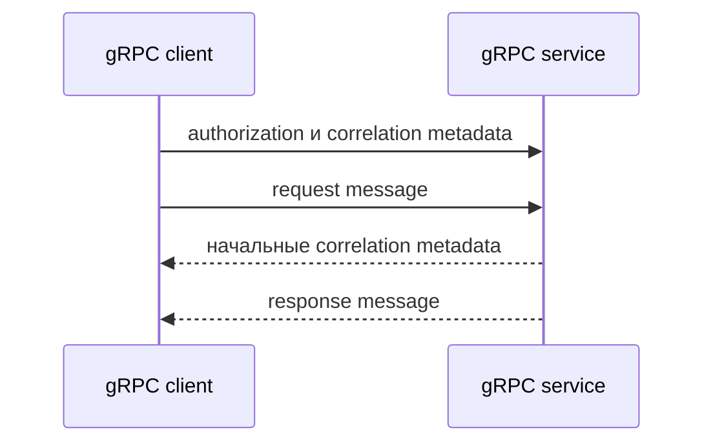

# Метаданные и аутентификация gRPC

## Связь с предыдущей главой

Глава 201 разобрала бизнес-поля protobuf message. Correlation ID, данные доступа и другой служебный контекст не должны становиться частью каждого бизнес-message.

## Цель главы

Передавать служебные данные через metadata, различать аутентификацию и авторизацию и не раскрывать секреты.

## Главный вопрос

Как передавать служебные данные отдельно от сообщения запроса?

## Мотивация

Если bearer token встроен в protobuf message, бизнес-контракт смешивается с механизмом доступа. Metadata создаёт отдельный канал для служебного контекста конкретного RPC-вызова.

## Теория

### Сообщение несёт данные, метаданные — контекст

Метаданные представляют набор пар «ключ — значение», сопровождающих вызов. Клиент передаёт метаданные серверу, а сервер может вернуть начальные или завершающие метаданные. Бизнес-запрос при этом сохраняет собственную форму.

Разделение простое и его стоит держать в голове при проектировании теста: если значение относится к предметной области — оно поле сообщения; если к самому вызову (кто вызывает, какой запрос в трассировке, какая версия клиента) — оно метаданные.


```mermaid
sequenceDiagram
    participant C as gRPC client
    participant S as gRPC service
    C->>S: authorization и correlation metadata
    C->>S: request message
    S-->>C: начальные correlation metadata
    S-->>C: response message
```

### Ключи приводятся к нижнему регистру

Практическая деталь, которая экономит время при отладке. Заголовок, записанный как `Authorization`, приходит на сервер как `authorization`:

```ts
md.set("Authorization", "Bearer good");
md.set("X-Correlation-Id", "req-42");
// сервер видит: authorization, x-correlation-id, user-agent
```

Среда выполнения добавляет и собственные ключи — `user-agent` присутствует всегда, даже если тест ничего не задавал. Поэтому проверка «в метаданных ровно два ключа» окажется неверной.

Чтение на стороне сервера возвращает **массив** значений: `call.metadata.get("authorization")` даёт `["Bearer good"]`, а для отсутствующего ключа — пустой массив. Один и тот же ключ может быть задан несколько раз.

### Текстовые и двоичные метаданные

Текстовые метаданные используют обычные строковые ключи. Двоичные метаданные имеют ключ с суффиксом `-bin` и отдельные правила значений.

Разница видна при чтении: значение ключа `x-trace-bin` приходит на сервер как `Buffer`, а не как строка. Поэтому `-bin` — не соглашение об именовании, а переключатель обработки: среда выполнения кодирует такое значение иначе.

Для учебных сценариев двоичные метаданные не нужны; знать о них стоит, чтобы не удивиться `Buffer` там, где ожидалась строка.

### Начальные и завершающие метаданные

Сервер может отправить начальные метаданные через `sendMetadata()` до отправки ответа. Клиент получает их отдельным событием:

```ts
const call = client.Secure(request, metadata, callback);
call.on("metadata", (received) => {
  received.get("x-correlation-id");   // ["req-42"]
});
```

Это тот же приём «сначала наблюдение, затем результат», что и в браузерных сценариях: подписка должна существовать к моменту события.

Завершающие метаданные приходят вместе с кодом состояния — в том числе с ошибкой. Именно поэтому в gRPC у отказа есть место для диагностики, а `ServiceError` содержит поле `metadata`.

### Аутентификация и авторизация в gRPC

Аутентификация отвечает, кто вызывает сервис. Авторизация определяет, разрешён ли этому субъекту метод RPC.

Коды отличаются и их номера стоит знать: отсутствующий или недействительный токен приводит к `UNAUTHENTICATED` (16); известный субъект без требуемого права — к `PERMISSION_DENIED` (7).

| Ситуация | Статус | Код |
| --- | --- | --- |
| метаданные без `authorization` | `UNAUTHENTICATED` | 16 |
| токен не распознан | `UNAUTHENTICATED` | 16 |
| субъект известен, прав нет | `PERMISSION_DENIED` | 7 |

Проверено на контролируемом сервисе: вызов без токена дал 16, вызов с действительным токеном субъекта, имеющего только право чтения, — 7.

### Минимальный набор проверок доступа

Как и в REST, полезный набор состоит из позитивного сценария и трёх негативных:

1. допустимый токен и достаточные права — успех;
2. отсутствующие учётные данные — `UNAUTHENTICATED`;
3. недействительный токен — `UNAUTHENTICATED`;
4. действительный токен без нужного права — `PERMISSION_DENIED`.

Третий пункт отделён от второго не зря: сервис, который принимает произвольную строку вместо токена, проходит проверку «без токена отказ» и при этом полностью открыт.

`authorization` переносит учебный токен предъявителя, а `x-correlation-id` связывает диагностические данные вызова. Токен при этом не должен попадать в вывод теста — отчёт живёт дольше и доступен шире, чем код.

### Общие метаданные и граница читаемости

Общие метаданные можно добавлять через вспомогательную функцию или перехватчик, если это уменьшает повторение. Метаданные конкретного сценария остаются видимыми в тесте.

Перехватчик не должен создавать глобальный изменяемый `Metadata` и скрывать права доступа. Причина та же, что у общего изменяемого состояния вообще: объект, который меняют несколько тестов, связывает их между собой, а при параллельном запуске даёт гонку.

Общая функция подготовки метаданных упрощает клиент, но усложняет изоляцию при изменении общего объекта. Безопасная форма — функция, **создающая новый** `Metadata` на каждый вызов, а не возвращающая общий экземпляр.

Управление секретами в промышленной среде и инфраструктура TLS не входят в эту главу: здесь важно, как тест передаёт доказательство доступа и как проверяет контракт отказа.

## Внутренний механизм

`Metadata` создаётся для вызова и передаётся отдельным аргументом сгенерированного метода. Сервер читает `call.metadata`, может отправить начальные метаданные через `sendMetadata()` и завершает вызов ответом или кодом состояния.

### Что происходит с ключами и значениями

```text
metadata.set("Authorization", "Bearer …")
   → на проводе ключ приходит как "authorization" (нижний регистр)

metadata.get("authorization")
   → ВСЕГДА массив: ["Bearer …"], даже для одного значения

ключ с суффиксом "-bin"
   → значение приходит как Buffer, а не строка
```

Приведение к нижнему регистру объясняет, почему проверка по ключу с заглавной
буквой не находит ничего. Возврат массива — почему сравнение `get(...) === "…"`
ложно всегда.

Среда добавляет свои ключи сама (например, `user-agent`), поэтому проверка
«метаданных ровно столько, сколько отправили» не выполняется никогда.

### Метаданные переживают отказ

```text
вызов → сервер отклоняет → ServiceError { code, details, metadata }
                                                          └ доходит до клиента
```

Это их ключевое свойство для тестов: сквозной идентификатор сценария,
отправленный в метаданных, возвращается вместе с ошибкой. По нему упавший тест
сопоставляется с записью в журнале сервиса — ровно тогда, когда это нужнее
всего.

Объект `Metadata` при этом изменяемый и накапливает ключи. Один экземпляр,
переиспользованный между тестами, уносит в следующий вызов заголовки
предыдущего — поэтому его собирают на каждый вызов.
```text
examples/03-automation-qa/chapter-202/01-metadata-authentication.grpc.ts
```

Пример проверяет допустимый токен, отсутствующие и недействительные данные доступа, недостаточные права и возврат сквозного идентификатора без вывода токена в журнал.

## Главная ментальная модель

Сообщение несёт бизнес-данные. Метаданные несут служебный контекст вызова.

## Практические примеры

- Добавить учебный токен предъявителя к защищённому методу RPC.
- Передать сквозной идентификатор для диагностики.
- Проверить `UNAUTHENTICATED` без токена.
- Проверить `UNAUTHENTICATED` с недействительным токеном.
- Проверить `PERMISSION_DENIED` для субъекта с правом только на чтение.

## Automation QA

Общие метаданные можно добавлять через вспомогательную функцию или перехватчик, если это уменьшает повторение. Метаданные конкретного сценария остаются видимыми в тесте. Перехватчик не должен создавать глобальный изменяемый `Metadata` и скрывать права доступа.

## Концептуальные границы и компромиссы

Общая функция подготовки метаданных упрощает клиент, но усложняет изоляцию при изменении общего объекта. Управление секретами в промышленной среде и инфраструктура TLS не входят в эту главу.

## Распространённые мифы

**Миф: ключи метаданных сохраняют регистр.**
Они приводятся к нижнему. `Authorization` придёт как `authorization`.

**Миф: в метаданных только то, что задал тест.**
Среда выполнения добавляет свои ключи — `user-agent` есть всегда.

**Миф: `get()` возвращает строку.**
Он возвращает массив значений: один ключ может быть задан несколько раз, а для отсутствующего массив пуст.

**Миф: суффикс `-bin` — просто соглашение об именовании.**
Он переключает обработку: значение приходит как `Buffer`, а не строка.

**Миф: общий объект `Metadata` на весь набор удобен.**
Он становится общим изменяемым состоянием и даёт гонку при параллельном запуске. Создавайте новый на каждый вызов.

## Частые вопросы

**Что класть в метаданные, а что в сообщение?**
Предметные данные — в сообщение, служебный контекст вызова (доступ, трассировка, версия клиента) — в метаданные.

**Чем `UNAUTHENTICATED` отличается от `PERMISSION_DENIED`?**
Первый означает, что личность не установлена (16), второй — что установлена, но прав не хватает (7).

**Зачем отдельно проверять недействительный токен?**
Сервис может принимать произвольную строку. Проверка «без токена отказ» такой дефект не поймает.

**Как получить метаданные, отправленные сервером?**
Подпиской на событие `metadata` у объекта вызова — до получения результата.

**Где хранится диагностика отказа?**
В метаданных ошибки: они доходят вместе с кодом состояния и `details`.

## Распространённые ошибки

- Помещать токен в сообщение запроса — учётные данные относятся к вызову, а не к бизнес-данным, и в теле сообщения они попадут в журналы и в сохранённые запросы. Место токена — метаданные.

- Выводить метаданные с учётными данными в журнал — метаданные целиком уходят в отчёт вместе с вызовом. Значения секретных ключей маскируют перед записью.

- Путать `UNAUTHENTICATED` и `PERMISSION_DENIED` — первый означает отсутствие или негодность учётных данных, второй — нехватку прав у опознанного вызывающего. Это разные дефекты.

- Повторно использовать изменяемый `Metadata` между тестами — объект накапливает ключи, и второй тест уходит с заголовками первого. Метаданные собирают на каждый вызов.

- Скрывать сквозной идентификатор конкретного сценария — без него журнал сервиса невозможно сопоставить с упавшим тестом. Идентификатор передают метаданными и печатают в отчёте.

## Краткие итоги

- Метаданные отделены от сообщения protobuf.
- Клиент и сервер могут обмениваться метаданными.
- Аутентификация и авторизация решают разные задачи.
- Учебных данных доступа достаточно для локального примера.
- Метаданные каждого вызова должны быть изолированы.

## Что нужно запомнить

- Не храните реальные секреты в коде.
- Не записывайте метаданные доступа в журнал.
- Создавайте метаданные на контролируемой границе.
- Проверяйте код состояния вместе с подробностями.

## Быстрая проверка

1. Чем метаданные отличаются от сообщения?
2. Где передаётся токен предъявителя?
3. Когда ожидается `UNAUTHENTICATED`?
4. Когда ожидается `PERMISSION_DENIED`?
5. Зачем нужен сквозной идентификатор?

### Ответы

1. Метаданные — это пары ключ-значение рядом с вызовом, вне самого сообщения. Сообщение описано контрактом, метаданные — нет.
2. В метаданных запроса, в заголовке `authorization` со значением вида `Bearer <токен>`.
3. Когда личность не подтверждена: токена нет, он неверен или истёк.
4. Когда личность известна, но прав на операцию нет.
5. Чтобы связать запрос теста с записями сервиса в логах. Без него при разборе падения непонятно, какая из записей относится к вашему вызову.

## Практика

```text
practice/03-automation-qa/202-grpc-metadata-and-authentication.md
```

## Переход к следующей главе

Доступ к методу RPC настроен, но вызов может отвечать слишком долго. Глава 203 введёт крайний срок и явную отмену.
