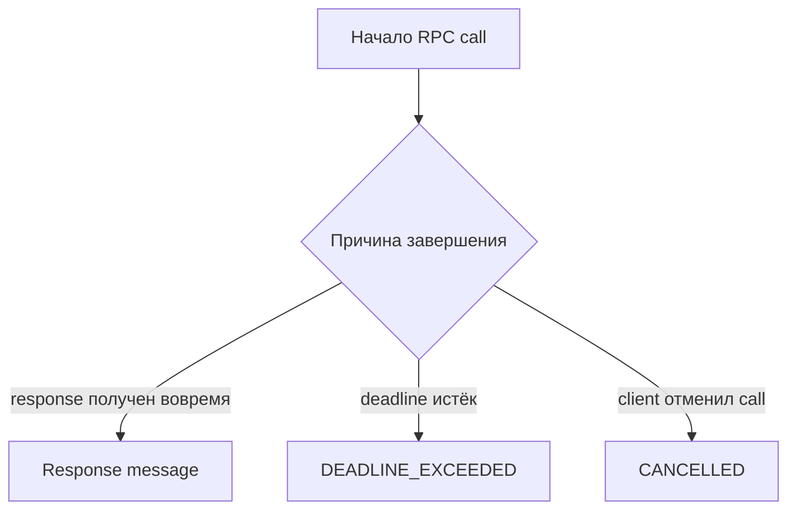

# Deadlines и timeouts gRPC

## Связь с предыдущей главой

Глава 202 передала контекст вызова через metadata. Ещё одна характеристика конкретного call — временная граница, после которой результат больше не полезен клиенту.

## Цель главы

Задать deadline, отличить его от timeout теста и корректно обработать cancellation.

## Главный вопрос

Как ограничить время gRPC-вызова и отличить медленный ответ от зависшего запроса?

## Мотивация

Ожидание только общего timeout Playwright делает диагностику неточной: тест сообщает об истечении времени всего сценария, но не показывает, какой RPC превысил допустимую границу. Deadline принадлежит самому call.

## Теория

Deadline задаёт абсолютный момент завершения RPC. Client timeout обычно выражается относительной длительностью, из которой код вычисляет deadline. В `grpc-js` параметр `deadline` внутри `CallOptions` принимает `Date` или абсолютное числовое значение времени.

Если server не завершил call до deadline, client получает `DEADLINE_EXCEEDED`. Это отличается от timeout тестового раннера: первый является наблюдаемым результатом gRPC, второй останавливает весь ход теста.

Cancellation инициируется client явно через `ClientUnaryCall.cancel()`. Она завершает вызов на стороне client со status `CANCELLED`. Обработчик server должен прекращать ненужную работу и освобождать timer или другой ресурс.



## Внутренний механизм

Client передаёт deadline внутри `CallOptions`. Среда выполнения отслеживает оставшееся время и завершает call соответствующим status. Локальный server слушает событие cancellation и очищает управляемый timer.

```text
examples/03-automation-qa/chapter-203/01-deadline-and-cancellation.grpc.ts
```

Пример показывает успешный ответ до deadline, отдельно получает `DEADLINE_EXCEEDED` и `CANCELLED`, а затем закрывает channel и server.

## Главная ментальная модель

Deadline отвечает «до какого момента результат нужен?», cancellation — «кто прекратил ожидание сейчас?», timeout теста — «сколько может выполняться весь тест?».

## Практические примеры

- Короткий deadline для локально контролируемого медленного метода.
- Отдельный timeout теста с запасом на освобождение ресурсов.
- Явная cancellation вызова, который больше не нужен.
- Проверка точного gRPC status вместо измерения по секундомеру.

## Automation QA

Deadline помогает отличить медленную зависимость от зависшего тестового раннера. Значение выбирают с учётом контракта service и SLO, а не копируют одно число во все RPC methods.

## Концептуальные границы и компромиссы

Слишком короткий deadline создаёт нестабильные тесты, слишком длинный замедляет диагностику. Управляемая локальная задержка нужна для демонстрации механизма, а не для имитации задержек production.

## Распространённые ошибки

- Путать deadline и Playwright timeout.
- Использовать произвольную задержку для ожидания результата.
- Не обрабатывать отклонённый Promise.
- Отменять call, не прекращая работу server.
- Назначать одинаковый deadline всем RPC methods без контекста.

## Краткие итоги

- Deadline принадлежит RPC call.
- Timeout тестового раннера принадлежит всему тесту.
- `DEADLINE_EXCEEDED` является gRPC status.
- Cancellation инициируется владельцем call.
- Освобождение ресурсов выполняется и после временного отказа.

## Что нужно запомнить

- Вычисляйте deadline рядом с вызовом.
- Проверяйте точный status.
- Сохраняйте запас для `finally`.
- Не оставляйте timers server после cancellation.

## Быстрая проверка

1. Что ограничивает deadline?
2. Чем он отличается от timeout теста?
3. Кто инициирует cancellation?
4. Какой status возвращает истёкший deadline?
5. Почему произвольная задержка не заменяет сигнал завершения?

## Практика

```text
practice/03-automation-qa/203-grpc-deadlines-and-timeouts.md
```

## Переход к следующей главе

Deadline дал один конкретный status. Глава 204 систематизирует ошибки gRPC и покажет, какие свойства отказа должен проверять тест.
