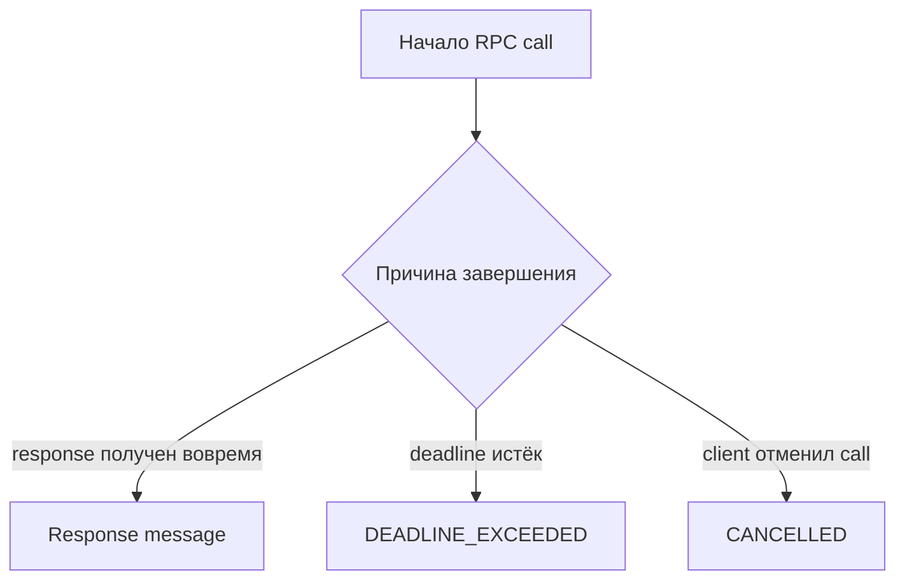

# Deadlines и timeouts gRPC

## Связь с предыдущей главой

Глава 202 передала контекст вызова через metadata. Ещё одна характеристика конкретного call — временная граница, после которой результат больше не полезен клиенту.

## Цель главы

Задать deadline, отличить его от timeout теста и корректно обработать cancellation.

## Главный вопрос

Как ограничить время gRPC-вызова и отличить медленный ответ от зависшего запроса?

## Мотивация

Ожидание только общего timeout Playwright делает диагностику неточной: тест сообщает об истечении времени всего сценария, но не показывает, какой RPC превысил допустимую границу. Deadline принадлежит самому call.

## Теория

### Три разных ограничения времени

В gRPC-тесте одновременно действуют три механизма, и путать их нельзя.

| Механизм | Вопрос, на который отвечает | Результат при срабатывании |
| --- | --- | --- |
| deadline | до какого момента нужен результат? | `DEADLINE_EXCEEDED` (4) |
| cancellation | кто прекратил ожидание сейчас? | `CANCELLED` (1) |
| timeout теста | сколько может выполняться весь тест? | падение теста |

Первые два — наблюдаемые результаты gRPC: вызов завершается ошибкой, которую тест может проверить. Третий останавливает весь ход теста, и проверять в нём нечего.



### Deadline — момент, а не длительность

Deadline задаёт абсолютный момент завершения RPC. Client timeout обычно выражается относительной длительностью, из которой код вычисляет deadline.

В `grpc-js` параметр `deadline` внутри `CallOptions` принимает `Date` или абсолютное числовое значение времени:

```ts
client.SlowTask(request, { deadline: Date.now() + 2000 }, callback);
```

Запись `{ deadline: 2000 }` синтаксически допустима и семантически катастрофична: это момент времени в 1970 году, то есть срок, истёкший полвека назад. Вызов завершится немедленно, и падение будет выглядеть как мгновенная недоступность сервиса.

Причина такого выбора не в удобстве клиента, а в распределённых вызовах: абсолютный момент можно передать дальше по цепочке сервисов, и каждый участник поймёт его одинаково. Длительность пришлось бы пересчитывать на каждом шаге.

### Как выглядит истечение deadline

Если server не завершил call до deadline, client получает `DEADLINE_EXCEEDED` с понятными подробностями:

```text
code: 4
details: Deadline exceeded after 0.301s
```

Важный смысловой момент: `DEADLINE_EXCEEDED` означает, что **ответ не пришёл вовремя**, а не что операция не выполнена. Сервер мог успешно её завершить уже после того, как клиент перестал ждать. Поэтому после такого отказа нельзя утверждать, что изменений нет — если это важно, состояние проверяют отдельным чтением.

### Cancellation инициирует клиент

Cancellation инициируется client явно через `ClientUnaryCall.cancel()`. Она завершает вызов на стороне client со status `CANCELLED` (1) и подробностями `Cancelled on client`.

Обработчик server при этом получает событие и должен прекращать ненужную работу и освобождать timer или другой ресурс:

```ts
server.addService(Tasks.service, {
  Slow: (call, callback) => {
    const timer = setTimeout(() => callback(null, response), 2000);
    call.on("cancelled", () => clearTimeout(timer));
  },
});
```

Проверено: после `cancel()` на клиенте серверный обработчик действительно получает событие `cancelled` и успевает очистить таймер. Без такой обработки сервис продолжит выполнять работу, результат которой уже никому не нужен.

### Почему не измерять время секундомером

Соблазнительный, но неверный способ проверить ограничение — замерить длительность вызова и сравнить с числом. Такой тест нестабилен: измеренное время зависит от загрузки машины, а граница срабатывания — от планировщика.

Правильная проверка сравнивает **точный gRPC status**:

```ts
expect(error.code).toBe(status.DEADLINE_EXCEEDED);
```

Это утверждение о контракте, а не об окружении, и потому воспроизводимо.

### Как выбирать значения

Deadline помогает отличить медленную зависимость от зависшего тестового раннера. Значение выбирают с учётом контракта service и SLO, а не копируют одно число во все RPC methods.

Ориентиры:

- deadline вызова должен быть **меньше** timeout теста, иначе первым сработает раннер и наблюдаемого статуса не будет;
- timeout теста нужен с запасом на освобождение ресурсов — закрытие client, очистку данных;
- быстрая операция чтения и длительная бизнес-обработка относятся к разным классам и не делят одно значение.

Слишком короткий deadline создаёт нестабильные тесты, слишком длинный замедляет диагностику. Управляемая локальная задержка нужна для демонстрации механизма, а не для имитации задержек production.

### Что делать при `DEADLINE_EXCEEDED` в отчёте

Появление этого статуса в результатах — повод для расследования, а не для увеличения числа.

Проверяют по порядку: не деградировал ли стенд, не стал ли сервис медленнее, не выбран ли deadline меньше нормальной длительности операции. Только подтверждённая измерением нормальная длительность оправдывает изменение границы — то же правило, что и для таймаутов тестового раннера.

## Внутренний механизм

Client передаёт deadline внутри `CallOptions`. Среда выполнения отслеживает оставшееся время и завершает call соответствующим status. Локальный server слушает событие cancellation и очищает управляемый timer.

```text
examples/03-automation-qa/chapter-203/01-deadline-and-cancellation.grpc.ts
```

Пример показывает успешный ответ до deadline, отдельно получает `DEADLINE_EXCEEDED` и `CANCELLED`, а затем закрывает channel и server.

## Главная ментальная модель

Deadline отвечает «до какого момента результат нужен?», cancellation — «кто прекратил ожидание сейчас?», timeout теста — «сколько может выполняться весь тест?».

## Практические примеры

- Короткий deadline для локально контролируемого медленного метода.
- Отдельный timeout теста с запасом на освобождение ресурсов.
- Явная cancellation вызова, который больше не нужен.
- Проверка точного gRPC status вместо измерения по секундомеру.

## Automation QA

Deadline помогает отличить медленную зависимость от зависшего тестового раннера. Значение выбирают с учётом контракта service и SLO, а не копируют одно число во все RPC methods.

## Концептуальные границы и компромиссы

Слишком короткий deadline создаёт нестабильные тесты, слишком длинный замедляет диагностику. Управляемая локальная задержка нужна для демонстрации механизма, а не для имитации задержек production.

## Распространённые мифы

**Миф: `deadline` принимает длительность.**
Это абсолютный момент времени. `{ deadline: 2000 }` означает срок в 1970 году и завершает вызов немедленно.

**Миф: `DEADLINE_EXCEEDED` означает, что операция не выполнена.**
Он означает, что ответ не пришёл вовремя. Сервер мог завершить работу позже.

**Миф: отмена на клиенте останавливает сервер сама.**
Сервер получает событие `cancelled`, но прекратить работу и освободить ресурсы должен его обработчик.

**Миф: ограничение времени проверяется замером длительности.**
Замер зависит от загрузки машины. Проверять нужно точный gRPC status.

**Миф: timeout теста заменяет deadline.**
Он останавливает тест целиком, не давая наблюдаемого статуса для проверки.

## Частые вопросы

**Что должно быть больше — deadline или timeout теста?**
Timeout теста. Иначе первым сработает раннер, и проверять будет нечего.

**Чем `CANCELLED` отличается от `DEADLINE_EXCEEDED`?**
Первый инициирован клиентом явно, второй наступил по истечении срока.

**Можно ли считать, что после `DEADLINE_EXCEEDED` изменений нет?**
Нет. Если это важно для сценария, состояние проверяют отдельным чтением.

**Зачем deadline вообще нужен в тестах?**
Он отличает медленную зависимость от зависшего раннера и даёт проверяемый статус вместо безликого падения по времени.

**Как выбрать значение?**
По контракту сервиса и измеренной нормальной длительности класса операций, а не одним числом на все методы.

## Распространённые ошибки

- Путать deadline и Playwright timeout.
- Использовать произвольную задержку для ожидания результата.
- Не обрабатывать отклонённый Promise.
- Отменять call, не прекращая работу server.
- Назначать одинаковый deadline всем RPC methods без контекста.

## Краткие итоги

- Deadline принадлежит RPC call.
- Timeout тестового раннера принадлежит всему тесту.
- `DEADLINE_EXCEEDED` является gRPC status.
- Cancellation инициируется владельцем call.
- Освобождение ресурсов выполняется и после временного отказа.

## Что нужно запомнить

- Вычисляйте deadline рядом с вызовом.
- Проверяйте точный status.
- Сохраняйте запас для `finally`.
- Не оставляйте timers server после cancellation.

## Быстрая проверка

1. Что ограничивает deadline?
2. Чем он отличается от timeout теста?
3. Кто инициирует cancellation?
4. Какой status возвращает истёкший deadline?
5. Почему произвольная задержка не заменяет сигнал завершения?

## Практика

```text
practice/03-automation-qa/203-grpc-deadlines-and-timeouts.md
```

## Переход к следующей главе

Deadline дал один конкретный status. Глава 204 систематизирует ошибки gRPC и покажет, какие свойства отказа должен проверять тест.
