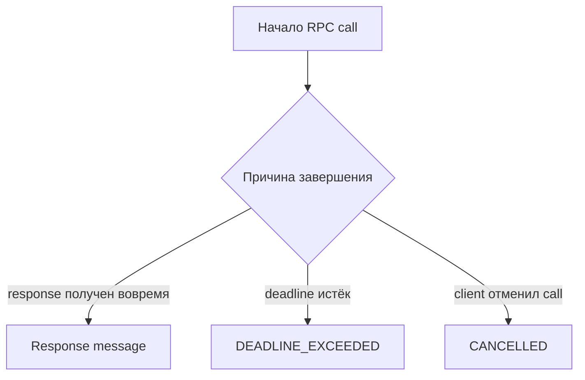

# Крайние сроки и сроки ожидания gRPC

## Связь с предыдущей главой

Глава 202 передала контекст вызова через metadata. Ещё одна характеристика конкретного call — временная граница, после которой результат больше не полезен клиенту.

## Цель главы

Задать deadline, отличить его от timeout теста и корректно обработать cancellation.

## Главный вопрос

Как ограничить время gRPC-вызова и отличить медленный ответ от зависшего запроса?

## Мотивация

Ожидание только общего timeout Playwright делает диагностику неточной: тест сообщает об истечении времени всего сценария, но не показывает, какой RPC превысил допустимую границу. Deadline принадлежит самому call.

## Теория

### Три разных ограничения времени

В gRPC-тесте одновременно действуют три механизма, и путать их нельзя.

| Механизм | Вопрос, на который отвечает | Результат при срабатывании |
| --- | --- | --- |
| крайний срок | до какого момента нужен результат? | `DEADLINE_EXCEEDED` (4) |
| отмена | кто прекратил ожидание сейчас? | `CANCELLED` (1) |
| срок теста | сколько может выполняться весь тест? | падение теста |

Первые два — наблюдаемые результаты gRPC: вызов завершается ошибкой, которую тест может проверить. Третий останавливает весь ход теста, и проверять в нём нечего.


```mermaid
flowchart TD
    A[Начало RPC call] --> B{Причина завершения}
    B -->|response получен вовремя| C[Response message]
    B -->|deadline истёк| D[DEADLINE_EXCEEDED]
    B -->|client отменил call| E[CANCELLED]
```

### Крайний срок — момент, а не длительность

Крайний срок задаёт абсолютный момент завершения вызова RPC. Срок ожидания на стороне клиента обычно выражается относительной длительностью, из которой код вычисляет крайний срок.

В `grpc-js` параметр `deadline` внутри `CallOptions` принимает `Date` или абсолютное числовое значение времени:

```ts
client.SlowTask(request, { deadline: Date.now() + 2000 }, callback);
```

Запись `{ deadline: 2000 }` синтаксически допустима и семантически катастрофична: это момент времени в 1970 году, то есть срок, истёкший полвека назад. Вызов завершится немедленно, и падение будет выглядеть как мгновенная недоступность сервиса.

Причина такого выбора не в удобстве клиента, а в распределённых вызовах: абсолютный момент можно передать дальше по цепочке сервисов, и каждый участник поймёт его одинаково. Длительность пришлось бы пересчитывать на каждом шаге.

### Как выглядит истечение крайнего срока

Если сервер не завершил вызов до крайнего срока, клиент получает `DEADLINE_EXCEEDED` с понятными подробностями:

```text
code: 4
details: Deadline exceeded after 0.301s
```

Важный смысловой момент: `DEADLINE_EXCEEDED` означает, что **ответ не пришёл вовремя**, а не что операция не выполнена. Сервер мог успешно её завершить уже после того, как клиент перестал ждать. Поэтому после такого отказа нельзя утверждать, что изменений нет — если это важно, состояние проверяют отдельным чтением.

### Отмену инициирует клиент

Отмена инициируется клиентом явно через `ClientUnaryCall.cancel()`. Она завершает вызов на стороне клиента с кодом `CANCELLED` (1) и подробностями `Cancelled on client`.

Обработчик на сервере при этом получает событие и должен прекращать ненужную работу и освобождать таймер или другой ресурс:

```ts
server.addService(Tasks.service, {
  Slow: (call, callback) => {
    const timer = setTimeout(() => callback(null, response), 2000);
    call.on("cancelled", () => clearTimeout(timer));
  },
});
```

Проверено: после `cancel()` на клиенте серверный обработчик действительно получает событие `cancelled` и успевает очистить таймер. Без такой обработки сервис продолжит выполнять работу, результат которой уже никому не нужен.

### Почему не измерять время секундомером

Соблазнительный, но неверный способ проверить ограничение — замерить длительность вызова и сравнить с числом. Такой тест нестабилен: измеренное время зависит от загрузки машины, а граница срабатывания — от планировщика.

Правильная проверка сравнивает **точный код состояния gRPC**:

```ts
expect(error.code).toBe(status.DEADLINE_EXCEEDED);
```

Это утверждение о контракте, а не об окружении, и потому воспроизводимо.

### Как выбирать значения

Крайний срок помогает отличить медленную зависимость от зависшего раннера. Значение выбирают с учётом контракта сервиса и целевого уровня обслуживания, а не копируют одно число во все методы RPC.

Ориентиры:

- крайний срок вызова должен быть **меньше** срока теста, иначе первым сработает раннер и наблюдаемого кода состояния не будет;
- срок теста нужен с запасом на освобождение ресурсов — закрытие клиента, очистку данных;
- быстрая операция чтения и длительная бизнес-обработка относятся к разным классам и не делят одно значение.

Слишком короткий крайний срок создаёт нестабильные тесты, слишком длинный замедляет диагностику. Управляемая локальная задержка нужна для демонстрации механизма, а не для имитации задержек промышленной среды.

### Что делать при `DEADLINE_EXCEEDED` в отчёте

Появление этого статуса в результатах — повод для расследования, а не для увеличения числа.

Проверяют по порядку: не деградировал ли стенд, не стал ли сервис медленнее, не выбран ли крайний срок меньше нормальной длительности операции. Только подтверждённая измерением нормальная длительность оправдывает изменение границы — то же правило, что и для сроков ожидания раннера.

## Внутренний механизм

Клиент передаёт крайний срок внутри `CallOptions`. Среда выполнения отслеживает оставшееся время и завершает вызов соответствующим кодом состояния. Локальный сервер слушает событие отмены и очищает управляемый таймер.

### Срок задаётся моментом, а не длительностью

```text
{ deadline: Date.now() + 2000 }   → абсолютный момент времени
{ deadline: 2000 }                 → 2000 мс от начала эпохи, то есть в прошлом
```

Вторая строка — не ошибка компиляции: вызов просто завершится
`DEADLINE_EXCEEDED` мгновенно. Симптом выглядит как недоступный сервис, а
причина — в единице измерения.

Срок передаётся по каналу дальше: служба, вызывающая другую службу, наследует
остаток времени. Поэтому у цепочки вызовов общий бюджет, а не сумма бюджетов.

### Отмена: клиент узнаёт сразу, сервер — событием

```text
клиент: call.cancel() → CANCELLED, details "Cancelled on client"
сервер: обработчик ПРОДОЛЖАЕТ работу, пока не обработает событие "cancelled"
```

Отмена освобождает клиента, но не останавливает обработчик сама по себе.
Учебный стенд слушает это событие и снимает свой таймер — именно так и должен
вести себя сервис, иначе отменённые вызовы продолжают занимать его ресурсы.

Для теста отсюда следует практическое: после отмены нельзя сразу утверждать, что
на сервере ничего не произошло. Это проверяется чтением состояния.
```text
examples/03-automation-qa/chapter-203/01-deadline-and-cancellation.grpc.ts
```

Пример показывает успешный ответ до крайнего срока, отдельно получает `DEADLINE_EXCEEDED` и `CANCELLED`, а затем закрывает канал и сервер.

## Главная ментальная модель

Крайний срок отвечает «до какого момента результат нужен?», отмена — «кто прекратил ожидание сейчас?», срок теста — «сколько может выполняться весь тест?».

## Практические примеры

- Короткий крайний срок для локально контролируемого медленного метода.
- Отдельный срок теста с запасом на освобождение ресурсов.
- Явная отмена вызова, который больше не нужен.
- Проверка точного кода состояния gRPC вместо измерения по секундомеру.

## Automation QA

Крайний срок помогает отличить медленную зависимость от зависшего раннера. Значение выбирают с учётом контракта сервиса и целевого уровня обслуживания, а не копируют одно число во все методы RPC.

## Концептуальные границы и компромиссы

Слишком короткий крайний срок создаёт нестабильные тесты, слишком длинный замедляет диагностику. Управляемая локальная задержка нужна для демонстрации механизма, а не для имитации задержек промышленной среды.

## Распространённые мифы

**Миф: `deadline` принимает длительность.**
Это абсолютный момент времени. `{ deadline: 2000 }` означает срок в 1970 году и завершает вызов немедленно.

**Миф: `DEADLINE_EXCEEDED` означает, что операция не выполнена.**
Он означает, что ответ не пришёл вовремя. Сервер мог завершить работу позже.

**Миф: отмена на клиенте останавливает сервер сама.**
Сервер получает событие `cancelled`, но прекратить работу и освободить ресурсы должен его обработчик.

**Миф: ограничение времени проверяется замером длительности.**
Замер зависит от загрузки машины. Проверять нужно точный код состояния gRPC.

**Миф: срок теста заменяет крайний срок вызова.**
Он останавливает тест целиком, не давая наблюдаемого статуса для проверки.

## Частые вопросы

**Что должно быть больше — крайний срок или срок теста?**
Срок теста. Иначе первым сработает раннер, и проверять будет нечего.

**Чем `CANCELLED` отличается от `DEADLINE_EXCEEDED`?**
Первый инициирован клиентом явно, второй наступил по истечении срока.

**Можно ли считать, что после `DEADLINE_EXCEEDED` изменений нет?**
Нет. Если это важно для сценария, состояние проверяют отдельным чтением.

**Зачем крайний срок вообще нужен в тестах?**
Он отличает медленную зависимость от зависшего раннера и даёт проверяемый статус вместо безликого падения по времени.

**Как выбрать значение?**
По контракту сервиса и измеренной нормальной длительности класса операций, а не одним числом на все методы.

## Распространённые ошибки

- Путать крайний срок вызова и срок ожидания Playwright — это разные границы: первая обрывает вызов на стороне gRPC кодом `DEADLINE_EXCEEDED`, вторая завершает тест. Срабатывает та, что короче, и по сообщению видно, какая именно.

- Использовать произвольную задержку для ожидания результата — пауза не связана с готовностью и не даёт кода состояния. Крайний срок задаёт границу и сообщает причину сам.

- Не обрабатывать отклонённый Promise — отклонение без обработчика завершает процесс Node с ненулевым кодом, и падает весь прогон, а не один тест.

- Отменять вызов, не прекращая работу сервера — клиент получает `CANCELLED` сразу, но обработчик на сервере продолжает выполняться. Серверная сторона слушает событие отмены и освобождает ресурсы.

- Назначать одинаковый крайний срок всем методам RPC без контекста — чтение и длительная операция требуют разного времени, и единое значение либо завышено, либо даёт ложные отказы.

## Краткие итоги

- Крайний срок принадлежит вызову RPC.
- Срок ожидания раннера принадлежит всему тесту.
- `DEADLINE_EXCEEDED` является кодом состояния gRPC.
- Отмена инициируется владельцем вызова.
- Освобождение ресурсов выполняется и после временного отказа.

## Что нужно запомнить

- Вычисляйте крайний срок рядом с вызовом.
- Проверяйте точный код состояния.
- Сохраняйте запас для `finally`.
- Не оставляйте таймеры сервера после отмены.

## Быстрая проверка

1. Что ограничивает крайний срок?
2. Чем он отличается от срока теста?
3. Кто инициирует отмену?
4. Какой код состояния возвращает истёкший крайний срок?
5. Почему произвольная задержка не заменяет сигнал завершения?

### Ответы

1. Время, в течение которого клиент готов ждать ответа на конкретный вызов. Срок передаётся серверу и может учитываться им.
2. Срок теста ограничивает весь тест целиком. Крайний срок относится к одному вызову и даёт понятный код отказа вместо обрыва теста.
3. Клиент: он перестаёт ждать и сообщает серверу об отмене.
4. `DEADLINE_EXCEEDED`.
5. Задержка ждёт время, а не событие. Сигнал завершения говорит, что операция действительно закончилась, и не зависит от скорости окружения.

## Практика

```text
practice/03-automation-qa/203-grpc-deadlines-and-timeouts.md
```

## Переход к следующей главе

Крайний срок дал один конкретный код состояния. Глава 204 систематизирует ошибки gRPC и покажет, какие свойства отказа должен проверять тест.
