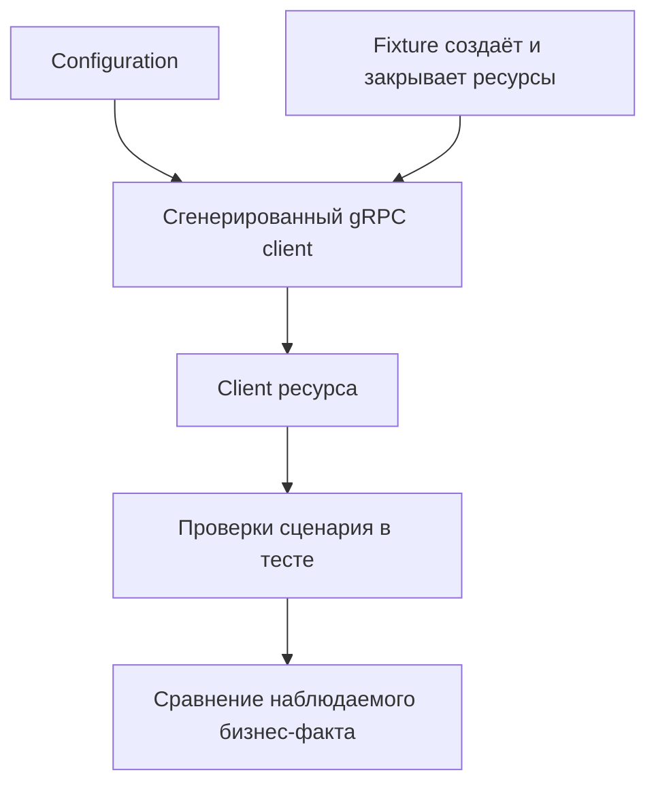

# gRPC Client в Automation Framework

## Связь с предыдущей главой

Главы 197–205 прошли путь от `.proto` до детерминированного RPC-теста. Осталось встроить client в framework, не превращая его в универсальный слой всех транспортов.

## Цель главы

Разделить сгенерированный client, написанную вручную обёртку, configuration, ответственность fixture за ресурсы и проверки сценария.

## Главный вопрос

Как встроить generated client в framework и сравнивать gRPC-данные с другими слоями?

## Мотивация

Копирование endpoint, данных доступа и обёрток Promise в каждый тест создаёт шум. Но один универсальный `TransportClient`, скрывающий REST, gRPC и будущую границу database, стирает важные различия status, metadata и управления ресурсами.

## Теория

Сгенерированный client отвечает за service API и контракт сериализации. Написанный вручную client ресурса добавляет осмысленные операции, но сохраняет доступ к metadata, deadline и `ServiceError`. Configuration предоставляет endpoint и данные доступа, но сама не создаёт client.

Fixture создаёт channel и client, передаёт обёртку тесту и закрывает ресурсы после `use()`. Проверки сценария остаются в тесте. Singleton client допустим только при явном жизненном цикле worker и доказанной изоляции; в учебном модуле client создаётся отдельно для каждого теста.

REST и gRPC clients могут сравнивать один бизнес-факт через каноническую модель, если система действительно публикует оба интерфейса. Сравнение с database принадлежит следующему модулю и здесь остаётся только архитектурной границей.



## Внутренний механизм

Fixture создаёт client к gRPC-границе стенда, оборачивает его в клиент предметной области и вызывает `use()`. После теста соединение закрывается. Обёртка не скрывает `ServiceError` при отклонении Promise: отказ остаётся наблюдаемым.

```text
examples/03-automation-qa/chapter-206/01-framework-client.grpc.ts
```

Пример предоставляет `WorkItemsGrpcClient` через fixture и сохраняет проверки в теле теста.

## Главная ментальная модель

Сгенерированный код знает протокол, обёртка знает операции, fixture управляет ресурсами, тест знает ожидаемое поведение.

## Практические примеры

- Configuration задаёт endpoint.
- Fixture создаёт и закрывает channel.
- Обёртка выражает `create()` и `get()`.
- Тест сравнивает response и ожидаемый бизнес-результат.
- Сравнение REST/gRPC сохраняет диагностику обоих протоколов.

## Automation QA

Эта граница масштабируется без преждевременной сборки итогового framework: новые clients ресурсов добавляются при реальной необходимости, подготовка metadata остаётся отдельной функцией, а директория сгенерированного кода не получает ручных изменений.

## Концептуальные границы и компромиссы

Client на уровне теста повышает изоляцию, а client на уровне worker уменьшает стоимость создания channel. Выбор требует анализа состояния server и metadata. Database client, reporting, CI и итоговая архитектура принадлежат будущим разделам.

## Распространённые ошибки

- Создать универсальный транспортный client, скрывающий ошибки протокола.
- Закрывать channel внутри каждого метода обёртки.
- Делать обёртку владельцем переданного client.
- Скрывать проверки внутри fixture.
- Смешивать операции REST, gRPC и database в одном классе.

## Краткие итоги

- Сгенерированный и написанный вручную код имеют разные роли.
- Configuration не владеет ресурсами времени выполнения.
- Fixture управляет жизненным циклом ресурсов.
- Обёртка выражает предметные операции.
- Тест сохраняет проверки и диагностику протокола.

## Что нужно запомнить

- Делайте ответственность за ресурсы явной.
- Не скрывайте metadata, deadlines и ошибки.
- Не редактируйте сгенерированный код.
- Сравнивайте слои через бизнес-факт, а не через общий транспортный API.

## Быстрая проверка

1. За что отвечает сгенерированный client?
2. Что добавляет написанная вручную обёртка?
3. Кто закрывает channel?
4. Где остаются проверки?
5. Почему database comparison отложено?

## Практика

```text
practice/03-automation-qa/206-grpc-client-in-automation-framework.md
```

## Переход к следующей главе

Модуль gRPC завершён. Глава 207 начнёт отдельный модуль PostgreSQL и определит, когда прямой доступ к database является оправданной границей теста.
