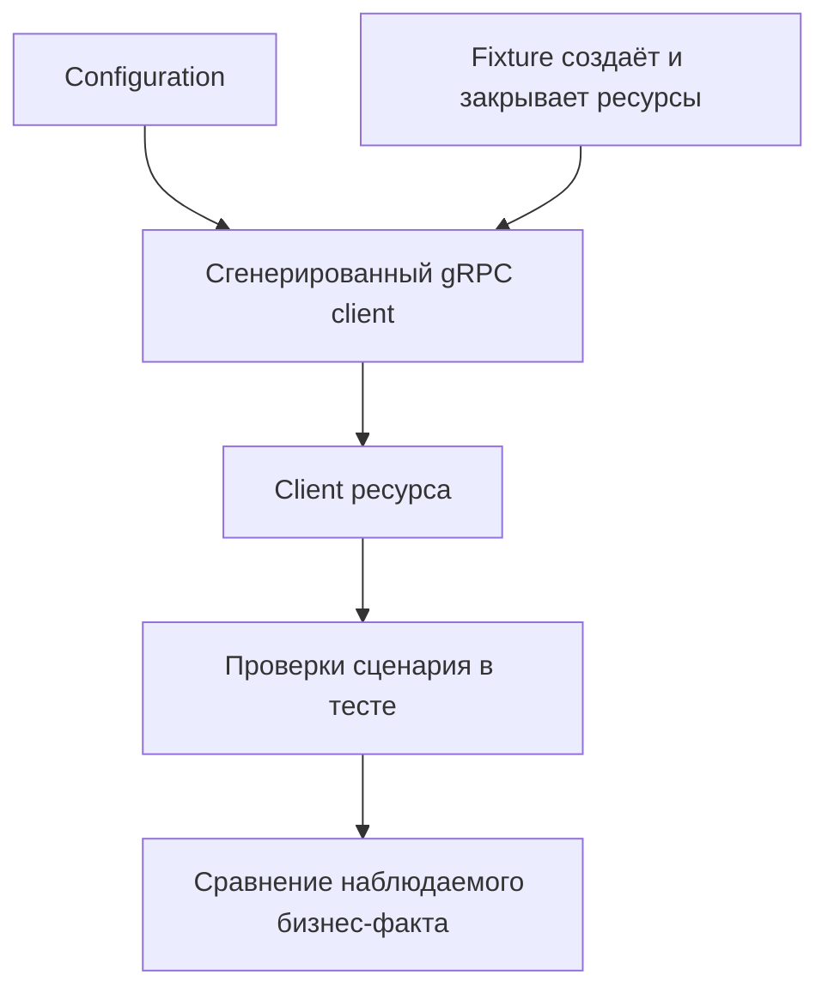

# gRPC Client в Automation Framework

## Связь с предыдущей главой

Главы 197–205 прошли путь от `.proto` до детерминированного RPC-теста. Осталось встроить client в framework, не превращая его в универсальный слой всех транспортов.

## Цель главы

Разделить сгенерированный client, написанную вручную обёртку, configuration, ответственность fixture за ресурсы и проверки сценария.

## Главный вопрос

Как встроить generated client в framework и сравнивать gRPC-данные с другими слоями?

## Мотивация

Копирование endpoint, данных доступа и обёрток Promise в каждый тест создаёт шум. Но один универсальный `TransportClient`, скрывающий REST, gRPC и будущую границу database, стирает важные различия status, metadata и управления ресурсами.

## Теория

### Четыре слоя и обязанность каждого

gRPC-клиент в фреймворке — не один объект, а цепочка с чёткими ролями.

| Слой | За что отвечает | Чего не делает |
| --- | --- | --- |
| Сгенерированный client | service API и контракт сериализации | не знает предметной области |
| Client ресурса | осмысленные операции домена | не владеет соединением |
| Fixture | создание и закрытие ресурсов | не проверяет результат |
| Configuration | endpoint и данные доступа | не создаёт client |

Последняя строка часто нарушается. Configuration предоставляет endpoint и данные доступа, но сама не создаёт client: иначе модуль конфигурации начинает владеть сетевым ресурсом, и закрыть его становится некому.



### Обёртка не должна глушить контракт отказа

Написанный вручную client ресурса добавляет осмысленные операции, но сохраняет доступ к metadata, deadline и `ServiceError`.

Это главное ограничение на дизайн обёртки. Метод `create(title)` читается лучше, чем `Create({ task: { title } })`, — но если при отказе он вернёт `null`, тест потеряет `code`, `details` и metadata разом. Вместе с ними исчезнет возможность отличить `INVALID_ARGUMENT` от `PERMISSION_DENIED` и от `UNAVAILABLE` упавшего стенда.

Рабочая форма: обёртка отклоняет Promise той же ошибкой, а опции вызова умеет пробрасывать:

```ts
create(task: TaskInput, options?: CallOptions): Promise<Task>;
```

Отказ остаётся наблюдаемым, deadline — настраиваемым, а тест читается на языке предметной области.

### Fixture владеет соединением

Fixture создаёт channel и client, передаёт обёртку тесту и закрывает ресурсы после `use()`. Это тот же принцип владения, что и для браузерного контекста: создал — закрываешь, и обязательно при любом исходе.

Забытое закрытие в gRPC заметно сильнее, чем в HTTP: открытый channel держит соединение, и процесс тестового раннера может не завершиться после прохождения всех тестов. Симптом — зелёный отчёт и зависший процесс в CI.

Проверки сценария остаются в тесте. Fixture готовит инструмент, а не решает, что считать успехом.

### Client на тест или на worker

Client на уровне теста повышает изоляцию, а client на уровне worker уменьшает стоимость создания channel.

| | На тест | На worker |
| --- | --- | --- |
| стоимость создания | на каждый тест | один раз |
| изоляция metadata | полная | общая, если не пересоздавать |
| риск общего состояния | нет | есть |
| сложность завершения | минимальная | нужен teardown worker-области |

Singleton client допустим только при явном жизненном цикле worker и доказанной изоляции; в учебном модуле client создаётся отдельно для каждого теста.

Выбор требует анализа состояния server и metadata: если тесты используют разные учётные данные, общий client с общими metadata связывает их между собой, и это хуже, чем сэкономленные миллисекунды.

### Подготовка metadata — отдельная функция

Общая подготовка metadata остаётся отдельной функцией, а не частью обёртки. Причина та же, что и в главе 202: функция должна **создавать новый** `Metadata` на каждый вызов, иначе объект становится общим изменяемым состоянием.

Метаданные конкретного сценария при этом остаются видимыми в тесте — по ним читается, под какой ролью выполняется проверка.

### Сравнение протоколов и его границы

REST и gRPC clients могут сравнивать один бизнес-факт через каноническую модель, если система действительно публикует оба интерфейса.

Оговорка существенна: сравнивать имеет смысл только то, что обещано обоими контрактами. Если gRPC отдаёт поле, которого нет в REST, расхождение не является дефектом.

И сравнение полезно для **одного** факта — например, что оба интерфейса показывают одну задачу одинаково, — а не как способ продублировать весь набор тестов на втором протоколе. Диагностика обоих протоколов при этом сохраняется: общая каноническая модель не должна прятать ни HTTP-код, ни gRPC-статус.

Сравнение с database принадлежит следующему модулю и здесь остаётся только архитектурной границей.

### Как это масштабируется

Эта граница растёт без преждевременной сборки итогового framework:

- новые clients ресурсов добавляются при реальной необходимости, а не заранее «под все сервисы»;
- директория сгенерированного кода не получает ручных изменений;
- endpoint и учётные данные приходят из конфигурации, а не из тела теста;
- владение ресурсом всегда прослеживается до fixture, которая его создала.

Database client, reporting, CI и итоговая архитектура принадлежат будущим разделам — архитектура собирается по мере появления задач, а не одним решением в начале.

## Внутренний механизм

Fixture создаёт client к gRPC-границе стенда, оборачивает его в клиент предметной области и вызывает `use()`. После теста соединение закрывается. Обёртка не скрывает `ServiceError` при отклонении Promise: отказ остаётся наблюдаемым.

```text
examples/03-automation-qa/chapter-206/01-framework-client.grpc.ts
```

Пример предоставляет `WorkItemsGrpcClient` через fixture и сохраняет проверки в теле теста.

## Главная ментальная модель

Сгенерированный код знает протокол, обёртка знает операции, fixture управляет ресурсами, тест знает ожидаемое поведение.

## Практические примеры

- Configuration задаёт endpoint.
- Fixture создаёт и закрывает channel.
- Обёртка выражает `create()` и `get()`.
- Тест сравнивает response и ожидаемый бизнес-результат.
- Сравнение REST/gRPC сохраняет диагностику обоих протоколов.

## Automation QA

Эта граница масштабируется без преждевременной сборки итогового framework: новые clients ресурсов добавляются при реальной необходимости, подготовка metadata остаётся отдельной функцией, а директория сгенерированного кода не получает ручных изменений.

## Концептуальные границы и компромиссы

Client на уровне теста повышает изоляцию, а client на уровне worker уменьшает стоимость создания channel. Выбор требует анализа состояния server и metadata. Database client, reporting, CI и итоговая архитектура принадлежат будущим разделам.

## Распространённые мифы

**Миф: обёртка должна возвращать `null` при отказе — так проще.**
Тогда исчезают `code`, `details` и metadata, и бизнес-отказ становится неотличим от упавшего стенда.

**Миф: конфигурация может сама создавать client.**
Тогда модуль конфигурации начинает владеть сетевым ресурсом, и закрывать его некому.

**Миф: один client на весь запуск — очевидная оптимизация.**
Он делает metadata общими и связывает тесты. Экономия миллисекунд не окупает потерю изоляции.

**Миф: если все тесты прошли, ресурсы освобождены.**
Незакрытый channel держит соединение: отчёт зелёный, процесс в CI висит.

**Миф: сравнение REST и gRPC стоит делать для всех сценариев.**
Оно оправдано для одного бизнес-факта. Дублирование набора на втором протоколе ничего не добавляет.

## Частые вопросы

**Где создавать client?**
В fixture. Она же его и закрывает — при любом исходе теста.

**Как сохранить возможность проверять отказ?**
Отклонять Promise исходной ошибкой и давать пробросить опции вызова, включая deadline.

**Почему процесс тестов не завершается?**
Частая причина — незакрытый channel. Ресурс держит соединение после прохождения всех тестов.

**Можно ли держать client на уровне worker?**
Да, при явном teardown и доказанной независимости metadata и состояния. В учебном модуле выбран client на тест.

**Что сравнивать между REST и gRPC?**
Только то, что обещано обоими контрактами, и только как отдельную проверку одного факта.

## Проверьте себя

1. Какие четыре слоя участвуют в gRPC-клиенте фреймворка и за что отвечает каждый?
2. Почему обёртка не должна превращать `ServiceError` в пустой результат?
3. Кто создаёт и кто закрывает channel?
4. Какой симптом указывает на незакрытый client?
5. При каком условии допустим client на уровне worker?

## Распространённые ошибки

- Создать универсальный транспортный client, скрывающий ошибки протокола.
- Закрывать channel внутри каждого метода обёртки.
- Делать обёртку владельцем переданного client.
- Скрывать проверки внутри fixture.
- Смешивать операции REST, gRPC и database в одном классе.

## Краткие итоги

- Сгенерированный и написанный вручную код имеют разные роли.
- Configuration не владеет ресурсами времени выполнения.
- Fixture управляет жизненным циклом ресурсов.
- Обёртка выражает предметные операции.
- Тест сохраняет проверки и диагностику протокола.

## Что нужно запомнить

- Делайте ответственность за ресурсы явной.
- Не скрывайте metadata, deadlines и ошибки.
- Не редактируйте сгенерированный код.
- Сравнивайте слои через бизнес-факт, а не через общий транспортный API.

## Быстрая проверка

1. За что отвечает сгенерированный client?
2. Что добавляет написанная вручную обёртка?
3. Кто закрывает channel?
4. Где остаются проверки?
5. Почему database comparison отложено?

## Практика

```text
practice/03-automation-qa/206-grpc-client-in-automation-framework.md
```

## Переход к следующей главе

Модуль gRPC завершён. Глава 207 начнёт отдельный модуль PostgreSQL и определит, когда прямой доступ к database является оправданной границей теста.
