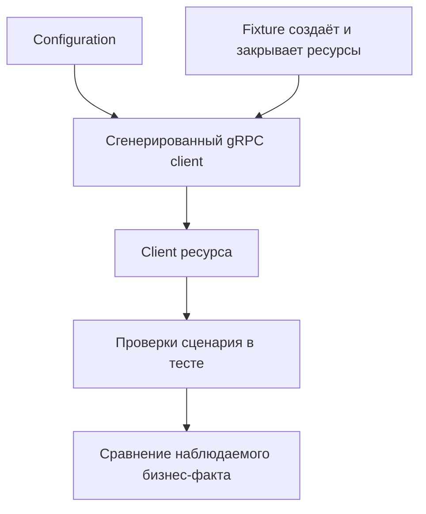

# Клиент gRPC во фреймворке автоматизации

## Связь с предыдущей главой

Главы 197–205 прошли путь от `.proto` до детерминированного RPC-теста. Осталось встроить client в framework, не превращая его в универсальный слой всех транспортов.

## Цель главы

Разделить сгенерированный client, написанную вручную обёртку, configuration, ответственность fixture за ресурсы и проверки сценария.

## Главный вопрос

Как встроить сгенерированный клиент во фреймворк и сравнивать данные gRPC с другими слоями?

## Мотивация

Копирование endpoint, данных доступа и обёрток Promise в каждый тест создаёт шум. Но один универсальный `TransportClient`, скрывающий REST, gRPC и будущую границу database, стирает важные различия status, metadata и управления ресурсами.

## Теория

### Четыре слоя и обязанность каждого

gRPC-клиент в фреймворке — не один объект, а цепочка с чёткими ролями.

| Слой | За что отвечает | Чего не делает |
| --- | --- | --- |
| Сгенерированный клиент | интерфейс сервиса и контракт сериализации | не знает предметной области |
| Клиент ресурса | осмысленные операции домена | не владеет соединением |
| Фикстура | создание и закрытие ресурсов | не проверяет результат |
| Конфигурация | адрес сервиса и данные доступа | не создаёт клиент |

Последняя строка часто нарушается. Конфигурация предоставляет адрес сервиса и данные доступа, но сама не создаёт клиент: иначе модуль конфигурации начинает владеть сетевым ресурсом, и закрыть его становится некому.


```mermaid
flowchart TD
    A[Configuration] --> B[Сгенерированный gRPC client]
    D[Fixture создаёт и закрывает ресурсы] --> B
    B --> C[Client ресурса]
    C --> E[Проверки сценария в тесте]
    E --> F[Сравнение наблюдаемого бизнес-факта]
```

### Обёртка не должна глушить контракт отказа

Написанный вручную клиент ресурса добавляет осмысленные операции, но сохраняет доступ к метаданным, крайнему сроку и `ServiceError`.

Это главное ограничение на устройство обёртки. Метод `create(title)` читается лучше, чем `Create({ task: { title } })`, — но если при отказе он вернёт `null`, тест потеряет `code`, `details` и метаданные разом. Вместе с ними исчезнет возможность отличить `INVALID_ARGUMENT` от `PERMISSION_DENIED` и от `UNAVAILABLE` упавшего стенда.

Рабочая форма: обёртка отклоняет Promise той же ошибкой, а опции вызова умеет пробрасывать:

```ts
create(task: TaskInput, options?: CallOptions): Promise<Task>;
```

Отказ остаётся наблюдаемым, крайний срок — настраиваемым, а тест читается на языке предметной области.

### Фикстура владеет соединением

Фикстура создаёт канал и клиент, передаёт обёртку тесту и закрывает ресурсы после `use()`. Это тот же принцип владения, что и для браузерного контекста: создал — закрываешь, и обязательно при любом исходе.

Забытое закрытие в gRPC заметно сильнее, чем в HTTP: открытый канал держит соединение, и процесс раннера может не завершиться после прохождения всех тестов. Симптом — зелёный отчёт и зависший процесс в CI.

Проверки сценария остаются в тесте. Фикстура готовит инструмент, а не решает, что считать успехом.

### Клиент на тест или на рабочий процесс

Клиент на уровне теста повышает изоляцию, а клиент на уровне рабочего процесса уменьшает стоимость создания канала.

| | На тест | На рабочий процесс |
| --- | --- | --- |
| стоимость создания | на каждый тест | один раз |
| изоляция метаданных | полная | общая, если не пересоздавать |
| риск общего состояния | нет | есть |
| сложность завершения | минимальная | нужно освобождение в области рабочего процесса |

Единственный общий клиент допустим только при явном жизненном цикле рабочего процесса и доказанной изоляции; в учебном модуле клиент создаётся отдельно для каждого теста.

Выбор требует анализа состояния сервера и метаданных: если тесты используют разные учётные данные, общий клиент с общими метаданными связывает их между собой, и это хуже, чем сэкономленные миллисекунды.

### Подготовка метаданных — отдельная функция

Общая подготовка метаданных остаётся отдельной функцией, а не частью обёртки. Причина та же, что и в главе 202: функция должна **создавать новый** `Metadata` на каждый вызов, иначе объект становится общим изменяемым состоянием.

Метаданные конкретного сценария при этом остаются видимыми в тесте — по ним читается, под какой ролью выполняется проверка.

### Сравнение протоколов и его границы

Клиенты REST и gRPC могут сравнивать один бизнес-факт через каноническую модель, если система действительно публикует оба интерфейса.

Оговорка существенна: сравнивать имеет смысл только то, что обещано обоими контрактами. Если gRPC отдаёт поле, которого нет в REST, расхождение не является дефектом.

И сравнение полезно для **одного** факта — например, что оба интерфейса показывают одну задачу одинаково, — а не как способ продублировать весь набор тестов на втором протоколе. Диагностика обоих протоколов при этом сохраняется: общая каноническая модель не должна прятать ни HTTP-код, ни gRPC-статус.

Сравнение с базой данных принадлежит следующему модулю и здесь остаётся только архитектурной границей.

### Как это масштабируется

Эта граница растёт без преждевременной сборки итогового фреймворка:

- новые клиенты ресурсов добавляются при реальной необходимости, а не заранее «под все сервисы»;
- директория сгенерированного кода не получает ручных изменений;
- адрес сервиса и учётные данные приходят из конфигурации, а не из тела теста;
- владение ресурсом всегда прослеживается до фикстуры, которая его создала.

Клиент базы данных, отчётность, CI и итоговая архитектура принадлежат будущим разделам — архитектура собирается по мере появления задач, а не одним решением в начале.

## Внутренний механизм

Фикстура создаёт клиент к границе gRPC стенда, оборачивает его в клиент предметной области и вызывает `use()`. После теста соединение закрывается. Обёртка не скрывает `ServiceError` при отклонении промиса: отказ остаётся наблюдаемым.

### Слои клиента и что на каком уровне живёт

```text
фикстура            │ канал: создание, ожидание готовности, close() в конце
клиент предметной   │ методы на языке задачи, Promise, нормализация ответа
области             │
тест                │ вызовы и проверки
```

Разделение решает два вопроса сразу. Канал переживает все тесты, использующие
фикстуру, — значит, соединение не устанавливается заново на каждый вызов. И
владение однозначно: закрывает тот, кто создал, в освобождении фикстуры.

### Что обёртка обязана пропустить наружу

| Скрывает | Пропускает |
| --- | --- |
| загрузку описания и приведение типа | `code` отказа |
| сборку метаданных и срока | `details` и метаданные ошибки |
| преобразование обратного вызова в промис | само сообщение ответа |

Правый столбец — причина, по которой универсальная обёртка «перехватить всё и
вернуть пустое значение» непригодна: вместе с исключением исчезает код
состояния, и негативный сценарий проверить нечем.

Проверки при этом остаются в тесте. Обёртка, содержащая `expect`, переносит
падение в свой файл, и отчёт перестаёт указывать на проверяемое поведение.
```text
examples/03-automation-qa/chapter-206/01-framework-client.grpc.ts
```

Пример предоставляет `WorkItemsGrpcClient` через фикстуру и сохраняет проверки в теле теста.

## Главная ментальная модель

Сгенерированный код знает протокол, обёртка знает операции, фикстура управляет ресурсами, тест знает ожидаемое поведение.

## Практические примеры

- Конфигурация задаёт адрес сервиса.
- Фикстура создаёт и закрывает канал.
- Обёртка выражает `create()` и `get()`.
- Тест сравнивает ответ и ожидаемый бизнес-результат.
- Сравнение REST/gRPC сохраняет диагностику обоих протоколов.

## Automation QA

Эта граница масштабируется без преждевременной сборки итогового фреймворка: новые клиенты ресурсов добавляются при реальной необходимости, подготовка метаданных остаётся отдельной функцией, а директория сгенерированного кода не получает ручных изменений.

## Концептуальные границы и компромиссы

Клиент на уровне теста повышает изоляцию, а клиент на уровне рабочего процесса уменьшает стоимость создания канала. Выбор требует анализа состояния сервера и метаданных. Клиент базы данных, отчётность, CI и итоговая архитектура принадлежат будущим разделам.

## Распространённые мифы

**Миф: обёртка должна возвращать `null` при отказе — так проще.**
Тогда исчезают `code`, `details` и метаданные, и бизнес-отказ становится неотличим от упавшего стенда.

**Миф: конфигурация может сама создавать клиент.**
Тогда модуль конфигурации начинает владеть сетевым ресурсом, и закрывать его некому.

**Миф: один клиент на весь запуск — очевидная оптимизация.**
Он делает метаданные общими и связывает тесты. Экономия миллисекунд не окупает потерю изоляции.

**Миф: если все тесты прошли, ресурсы освобождены.**
Незакрытый канал держит соединение: отчёт зелёный, процесс в CI висит.

**Миф: сравнение REST и gRPC стоит делать для всех сценариев.**
Оно оправдано для одного бизнес-факта. Дублирование набора на втором протоколе ничего не добавляет.

## Частые вопросы

**Где создавать клиент?**
В фикстуре. Она же его и закрывает — при любом исходе теста.

**Как сохранить возможность проверять отказ?**
Отклонять промис исходной ошибкой и давать пробросить параметры вызова, включая крайний срок.

**Почему процесс тестов не завершается?**
Частая причина — незакрытый канал. Ресурс держит соединение после прохождения всех тестов.

**Можно ли держать клиент на уровне рабочего процесса?**
Да, при явном освобождении и доказанной независимости метаданных и состояния. В учебном модуле выбран клиент на тест.

**Что сравнивать между REST и gRPC?**
Только то, что обещано обоими контрактами, и только как отдельную проверку одного факта.

## Проверьте себя

1. Какие четыре слоя участвуют в gRPC-клиенте фреймворка и за что отвечает каждый?
2. Почему обёртка не должна превращать `ServiceError` в пустой результат?
3. Кто создаёт и кто закрывает канал?
4. Какой симптом указывает на незакрытый клиент?
5. При каком условии допустим клиент на уровне рабочего процесса?

### Ответы

1. Контракт задаёт описание сервиса, сгенерированный или загруженный клиент — типы и вызовы, обёртка — соединение, метаданные и преобразование отказов, слой предметной области — методы на языке сценария.
2. Тест перестаёт отличать «операция не выполнена» от «результат пуст». Отказ должен оставаться отказом с сохранённым кодом.
3. Тот слой, который им владеет, — обычно фикстура. Она же обязана его закрыть после прогона.
4. Процесс не завершается после окончания тестов: открытое соединение удерживает событийный цикл.
5. Когда клиент не хранит состояние конкретного теста: одно соединение переиспользуется, а данные и токены остаются в области теста.

## Распространённые ошибки

- Создать универсальный транспортный клиент, скрывающий ошибки протокола — вместе с ними исчезает код состояния, а негативный сценарий проверить нечем. Отказ возвращают результатом, сохраняя код и метаданные.

- Закрывать канал внутри каждого метода обёртки — следующий вызов получит `Channel has been shut down`. Канал живёт столько же, сколько фикстура, которая его создала.

- Делать обёртку владельцем переданного клиента — освободив чужой ресурс, обёртка ломает того, кто его создал. Владеет тот, кто создал.

- Скрывать проверки внутри фикстуры — падение приходит из подготовки, и отчёт указывает не на проверяемое поведение.

- Смешивать операции REST, gRPC и базы данных в одном классе — такой класс нельзя использовать там, где доступен только один слой, и нельзя понять по имени, куда он обращается.

## Краткие итоги

- Сгенерированный и написанный вручную код имеют разные роли.
- Конфигурация не владеет ресурсами времени выполнения.
- Фикстура управляет жизненным циклом ресурсов.
- Обёртка выражает предметные операции.
- Тест сохраняет проверки и диагностику протокола.

## Что нужно запомнить

- Делайте ответственность за ресурсы явной.
- Не скрывайте метаданные, крайние сроки и ошибки.
- Не редактируйте сгенерированный код.
- Сравнивайте слои через бизнес-факт, а не через общий транспортный API.

## Быстрая проверка

1. За что отвечает сгенерированный клиент?
2. Что добавляет написанная вручную обёртка?
3. Кто закрывает канал?
4. Где остаются проверки?
5. Почему сравнение с базой данных отложено?

## Практика

```text
practice/03-automation-qa/206-grpc-client-in-automation-framework.md
```

## Переход к следующей главе

Модуль gRPC завершён. Глава 207 начнёт отдельный модуль PostgreSQL и определит, когда прямой доступ к базе данных является оправданной границей теста.
