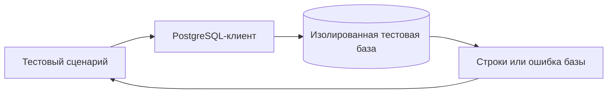

# PostgreSQL в Automation QA

## Связь с предыдущей главой

Глава 206 завершила gRPC-слой: тест наблюдал сервис через публичный RPC-контракт. PostgreSQL открывает другую границу — внутреннее сохранённое состояние системы. Такая граница нужна не всегда и требует явного владельца тестовых данных.

## Цель главы

Понять, когда база данных является оправданной границей теста, что такая проверка доказывает и почему она повышает связанность теста с реализацией.

## Главный вопрос

> Когда тесту нужен прямой доступ к PostgreSQL и где проходит граница такой проверки?

## Мотивация

API может вернуть успешный ответ, хотя запись сохранена неполностью. Обратная ситуация тоже возможна: строка базы данных корректна, но пользовательский контракт нарушен. Прямая проверка PostgreSQL отвечает только на вопрос о сохранённом состоянии и не заменяет проверку UI-, REST- или gRPC-контракта.

## Теория

### Четыре законных повода заглянуть в базу

PostgreSQL уместен как граница теста в ограниченном наборе случаев:

1. **подготовка контролируемых данных** — создать состояние, которого трудно добиться через интерфейс;
2. **проверка сохранения** — убедиться, что операция действительно записана, а не только принята;
3. **диагностика интеграции** — понять, на каком слое потерялись данные;
4. **подтверждение отсутствия побочного эффекта** — отклонённая операция не оставила записи.

Остальные обращения к базе обычно означают, что тест проверяет реализацию вместо поведения.



### База — не автоматически источник истины

Источник истины определяется архитектурой системы, а не самим фактом наличия таблицы.

Это важнее, чем кажется. В системе с кэшем, очередью или событийной моделью запись в таблице может появиться позже ответа API — и тест, читающий базу сразу после вызова, увидит пустоту, хотя всё работает правильно. В системе с несколькими хранилищами «та самая» таблица может вообще не быть тем местом, где живёт бизнес-факт.

Практический вопрос перед написанием такой проверки: **эта таблица действительно определяет поведение системы или лишь отражает его?**

### Цена близости к схеме

Чем ближе тест к схеме базы данных, тем точнее он видит хранение и тем сильнее зависит от деталей реализации.

| Уровень проверки | Что ловит | Чем платит |
| --- | --- | --- |
| UI | пользовательское поведение | медленно, не видит причину |
| API / gRPC | контракт сервиса | не видит хранение |
| База | факт записи и её форму | ломается при изменении схемы |

Проверять следует устойчивые бизнес-поля и идентификаторы, а не каждую техническую колонку. Служебные метки времени, внутренние счётчики версий и колонки аудита меняются по причинам, не связанным с проверяемым поведением.

Чем меньше внутренних полей участвует в проверке, тем устойчивее сценарий.

### Состояние базы переживает подключение

Тест открывает подключение через клиент базы данных, отправляет SQL и получает строки результата либо ошибку базы данных.

PostgreSQL выполняет запрос над общим долговечным состоянием, поэтому новое подключение не сбрасывает состояние базы данных. Это прямая аналогия с браузерным контекстом из главы 168: свежее подключение изолирует клиента, а не данные.

Отсюда следует главное требование к работе с базой в тестах — владение данными.

### Владелец данных отвечает за весь цикл

Владелец тестовых данных обязан создать уникальные данные, проверить нужный факт и гарантированно очистить их.

Три части этого правила решают три разные проблемы:

- **уникальность** убирает пересечение между параллельными тестами и повторными запусками;
- **точечная проверка** не даёт тесту зависеть от чужих данных в тех же таблицах;
- **гарантированная очистка** не даёт стенду наполняться мусором, который через месяц начнёт ронять чужие тесты.

Учебный стенд усиливает это изоляцией на уровне схемы: тест работает внутри собственной схемы, и его данные физически не смешиваются с чужими.

### Когда проверка базы не нужна

Проверка базы данных полезна, когда сохранение данных входит в цель теста. Если цель — пользовательское поведение, основная проверка остаётся на уровне UI, API или gRPC, а база данных используется как дополнительная диагностика.

Типичная ошибка выглядит так: UI-тест создаёт заказ, проверяет сообщение на экране, а затем «для надёжности» читает три колонки из таблицы. Вторая проверка ничего не добавляет — интерфейс уже показал результат, — но добавляет зависимость от схемы и повод для падения при рефакторинге.

Обратный случай — законный: сервис отвечает 202, интерфейс показывает «принято», и единственный способ убедиться, что запись появилась, — посмотреть в хранилище.

### Права доступа теста

Отдельный вопрос, который решается на уровне стенда, а не теста: с какими правами тест обращается к базе.

Чтение для проверок и запись в собственную область — разные полномочия. Учётная запись, которая может изменить любые данные приложения, превращает случайную ошибку в SQL в повреждение стенда. Ограниченные права делают опечатку безобидной: запрос просто не выполнится.

Это не паранойя, а то же правило наименьших привилегий, что и для токенов в главе 191.

## Внутренний механизм

Тест открывает подключение через клиент базы данных, отправляет SQL и получает строки результата либо ошибку базы данных. PostgreSQL выполняет запрос над общим долговечным состоянием, поэтому новое подключение не сбрасывает состояние базы данных.


## Главная ментальная модель

Проверка базы данных — это взгляд на один внутренний факт. Владелец тестовых данных обязан создать уникальные данные, проверить нужный факт и гарантированно очистить их.

## Практический пример

```text
examples/03-automation-qa/chapter-207/01-database-boundary.postgresql.ts
```

Пример вставляет строку параметризованным `INSERT`, читает конкретные поля через `SELECT` и работает только внутри уникальной тестовой схемы.

## Automation QA

Проверка базы данных полезна, когда сохранение данных входит в цель теста. Если цель — пользовательское поведение, основная проверка остаётся на уровне UI, API или gRPC, а база данных используется как дополнительная диагностика.

## Компромиссы

Прямая проверка быстрее локализует дефект хранения, но делает тест чувствительным к переименованию колонок и изменению схемы. Чем меньше внутренних полей участвует в проверке, тем устойчивее сценарий.

## Распространённые мифы

**Миф: база данных — источник истины по определению.**
Источник истины задаёт архитектура. В системе с кэшем или очередью запись может появиться позже ответа сервиса.

**Миф: новое подключение даёт чистое состояние.**
Оно изолирует клиента, а не данные. Состояние базы долговечно и переживает подключения.

**Миф: чем больше колонок проверено, тем надёжнее тест.**
Служебные поля меняются без изменения поведения. Проверяют устойчивые бизнес-поля и идентификаторы.

**Миф: проверка в базе «для надёжности» лишней не бывает.**
Если результат уже виден в интерфейсе или ответе, дополнительная проверка добавляет только зависимость от схемы.

**Миф: тесту нужны широкие права, иначе ничего не проверить.**
Чтение и запись в собственную область достаточно. Широкие права превращают опечатку в повреждение стенда.

## Частые вопросы

**Когда проверка базы оправдана?**
Когда сохранение и есть цель теста: асинхронная операция, ответ 202, подтверждение отсутствия побочного эффекта.

**Почему запись не появилась сразу после успешного ответа API?**
Возможна асинхронная обработка. Проверка сохранения требует ожидания, а не немедленного чтения.

**Какие поля проверять?**
Идентификатор и бизнес-значения. Метки времени, версии и колонки аудита — нет.

**Кто удаляет созданные тестом данные?**
Тот, кто их создал, и делает это гарантированно — независимо от результата проверок.

**Зачем ограничивать права тестовой учётной записи?**
Чтобы ошибка в запросе приводила к отказу, а не к изменению чужих данных на стенде.

## Проверьте себя

1. Назовите четыре случая, когда обращение к базе в тесте оправдано.
2. Почему наличие таблицы не делает её источником истины?
3. Чем платит тест за близость к схеме?
4. Что именно изолирует новое подключение, а что нет?
5. Из каких трёх частей состоит владение тестовыми данными?

## Распространённые ошибки

- Считать базу данных единственным источником истины без архитектурного основания.
- Заменять проверку наблюдаемого поведения чтением таблицы.
- Использовать общую постоянную строку между тестами.
- Подключаться к базе данных production-окружения.

## Краткие итоги

- PostgreSQL является отдельной границей теста.
- Строка базы данных доказывает сохранение данных, но не корректность транспортного или UI-контракта.
- Владение тестовыми данными включает подготовку, проверку и очистку.
- Новое подключение не сбрасывает состояние базы данных.

## Практика

Практика встроена из соответствующего файла главы.

## Переход к следующей главе

Чтобы безопасно читать и изменять базу данных, нужно явно управлять подключением и пулом. Этому посвящена глава 208.
