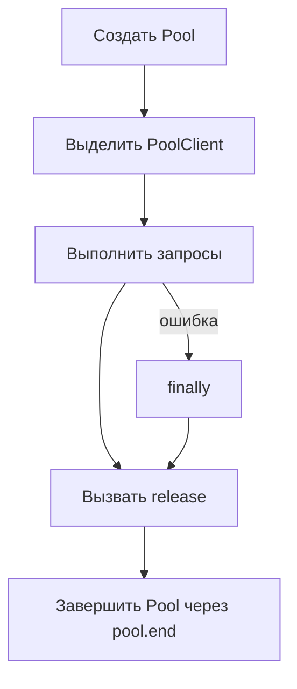

# Connections, pools и lifecycle

## Связь с предыдущей главой

Глава 207 определила границу проверки базы данных. Теперь нужно получить подключение и освободить его так, чтобы завершённый тест не оставлял процесс, пул или серверный сеанс открытыми.

## Цель главы

Различать подключение, `Client`, `Pool` и `PoolClient`, выбирать область их жизни и гарантировать освобождение ресурсов при успехе и ошибке.

## Главный вопрос

> Как управлять подключениями к базе данных без утечек и взаимного влияния тестов?

## Мотивация

Незавершённый пул удерживает Node.js-процесс. `PoolClient`, полученный из пула и не возвращённый через `release()`, уменьшает доступную ёмкость. Ошибка теста не должна прерывать очистку.

## Теория

### Client, Pool и PoolClient

Подключение — это активный сетевой сеанс с PostgreSQL, ресурс ограниченный и на сервере, и по времени установки.

`Client` владеет одним подключением. `Pool` управляет ограниченным множеством подключений и временно выдаёт `PoolClient` вызывающему коду.

| Объект | Что это | Как завершается |
| --- | --- | --- |
| `Client` | одно собственное подключение | `client.end()` |
| `Pool` | набор подключений | `pool.end()` |
| `PoolClient` | временно арендованное подключение | `client.release()` |

Путаница между `release()` и `end()` — источник самых неприятных ошибок этой главы. `client.release()` возвращает подключение в пул, но не завершает сам пул.



### `pool.query()` — не транзакция

Это утверждение стоит понимать буквально, и оно проверяется по исходному коду клиента: `pool.query()` внутри себя вызывает `connect()`, выполняет один запрос и возвращает подключение обратно.

Значит, два последовательных вызова могут попасть на **разные** подключения:

```ts
await pool.query("BEGIN");                    // подключение A
await pool.query("INSERT INTO ...");          // может быть подключение B
await pool.query("COMMIT");                   // может быть подключение C
```

Такой код не образует транзакции: `BEGIN` останется висеть на одном подключении, вставка выполнится вне транзакции на другом. Для нескольких связанных операторов нужно явно взять `PoolClient` через `pool.connect()` и выполнять всё на нём.

Одиночный самостоятельный запрос через `pool.query()` при этом совершенно нормален — он и создан для этого случая.

### Правила завершения

Три ошибки жизненного цикла, каждая со своим сообщением.

**Двойной `release()`** — клиент уже возвращён в пул, и повторный вызов даёт ошибку `Release called on client which has already been released to the pool.` Такое случается, когда `release()` стоит и в теле, и в `finally`.

**Двойной `pool.end()`** — `Called end on pool more than once`.

**`pool.end()` при активных клиентах** — завершать пул, пока выделенные клиенты ещё используются, нельзя: сначала `release()`, потом `end()`. Пул не может корректно закрыть подключение, которое кто-то держит.

После `release()` вызывающий код больше не использует `PoolClient` — арендованный объект больше ему не принадлежит.

Отдельный `Client` после использования закрывается через `client.end()`.

### Настройки пула и их значения по умолчанию

У пула есть параметры, которые в тестах имеют практический смысл. В используемой версии клиента значения по умолчанию такие:

| Параметр | Значение по умолчанию | Смысл |
| --- | --- | --- |
| `max` | 10 | сколько подключений пул откроет максимум |
| `idleTimeoutMillis` | 30000 | через сколько закрывается простаивающее подключение |
| `connectionTimeoutMillis` | не задан | ожидание свободного подключения не ограничено |

Последняя строка объясняет характерный симптом: тест, забывший `release()`, не падает с внятной ошибкой, а **висит** — пул ждёт освобождения подключения бесконечно. При `max: 10` первые девять тестов пройдут, а десятый зависнет, и связь с исходной причиной будет уже неочевидна.

Явный `connectionTimeoutMillis` превращает зависание в понятное падение — и в тестовом проекте это обычно правильный выбор.

### Область жизни ресурса

Ресурс на уровне теста повышает изоляцию. Пул на уровне worker уменьшает стоимость создания подключений, но требует доказанной независимости данных и обязательного завершения fixture. Универсального выбора нет.

Область жизни должна совпадать с владельцем ресурса: тестом, worker или процессом. Крайности одинаково плохи: пул на каждый запрос создаёт лишние затраты, один глобальный экземпляр усложняет завершение и изоляцию.

Практический ориентир для тестового проекта: пул на worker с обязательным teardown, а внутри теста — арендованный `PoolClient`, возвращаемый в `finally`.

### Ошибка подключения и ошибка данных

При ошибке подключения важно отделять недоступную инфраструктуру от ожидаемого нарушения ограничения базы данных.

Это две разные ситуации с разной реакцией:

- **инфраструктурная** — база недоступна, неверные учётные данные, исчерпан пул. Тест не проверил ничего;
- **доменная** — нарушено ограничение уникальности, проверка целостности, тип значения. Это может быть именно то, что тест и проверял.

Повтор теста не исправляет неверные учётные данные или неосвобождённый клиент. Retry на инфраструктурной ошибке лишь скрывает её и делает отчёт менее честным — как и в случае с `UNAVAILABLE` в gRPC.

## Внутренний механизм

`pool.connect()` выделяет `PoolClient`. `client.release()` возвращает подключение в пул, но не завершает сам пул. `pool.end()` завершает свободные подключения и не должен вызываться, пока выделенные клиенты ещё используются.

`pool.query()` самостоятельно получает и возвращает подключение для одного запроса. Несколько таких вызовов нельзя считать одной транзакцией: каждый вызов может попасть на другое подключение. Отдельный `Client` после использования закрывается через `client.end()`, а после `release()` вызывающий код больше не использует `PoolClient`.


## Главная ментальная модель

`Pool` — владелец подключений, а тест временно арендует `PoolClient`. Арендованный ресурс возвращается до завершения пула.

## Практический пример

```text
examples/03-automation-qa/chapter-208/01-pool-lifecycle.postgresql.ts
```

Вспомогательная функция создаёт пул, выделяет клиент, инициализирует уникальную схему, а после вызова функции обратного вызова удаляет схему, вызывает `release()` и `pool.end()`. Отдельная управляемая ошибка подтверждает, что сбой не прерывает завершение ресурсов.

## Automation QA

При ошибке подключения важно отделять недоступную инфраструктуру от ожидаемого нарушения ограничения базы данных. Повтор теста не исправляет неверные учётные данные или неосвобождённый клиент.

## Компромиссы

Пул на каждый запрос создаёт лишние затраты. Один глобальный экземпляр усложняет завершение и изоляцию. Область жизни должна совпадать с владельцем ресурса: тестом, worker или процессом.

## Распространённые мифы

**Миф: несколько `pool.query()` подряд — одна транзакция.**
Каждый вызов берёт подключение заново и может попасть на другое. Для транзакции нужен явно выделенный `PoolClient`.

**Миф: `release()` завершает пул.**
Он возвращает подключение в пул. Пул завершается через `pool.end()`.

**Миф: забытый `release()` даст понятную ошибку.**
Без `connectionTimeoutMillis` пул ждёт бесконечно, и тест просто виснет — обычно не первый, а десятый.

**Миф: `pool.end()` можно вызвать в любой момент.**
Пока выделенные клиенты используются — нельзя. Сначала `release()`, потом `end()`.

**Миф: повтор теста лечит ошибку подключения.**
Неверные учётные данные и неосвобождённый клиент повтором не исправляются.

## Частые вопросы

**Когда достаточно `pool.query()`?**
Для одиночного самостоятельного запроса. Для нескольких связанных операторов нужен выделенный клиент.

**Почему тест зависает, а не падает?**
Пул ждёт свободного подключения без ограничения времени. Помогает явный `connectionTimeoutMillis`.

**Где размещать `release()`?**
В `finally` — и только там, чтобы не получить двойной вызов.

**Какую область жизни выбрать для пула?**
Обычно worker с обязательным teardown. Пул на запрос расточителен, глобальный — плохо завершается.

**Как отличить инфраструктурную ошибку от доменной?**
По тому, дошёл ли запрос до выполнения: нарушение ограничения — результат работы базы, отказ подключения — её недоступность.

## Проверьте себя

1. Чем `release()` отличается от `end()`?
2. Почему три `pool.query()` не образуют транзакцию?
3. Что произойдёт при забытом `release()` и почему падает не первый тест?
4. В каком порядке завершаются арендованный клиент и пул?
5. Почему повтор не помогает при инфраструктурной ошибке?

## Распространённые ошибки

- Считать `release()` эквивалентом `pool.end()`.
- Завершать пул до освобождения клиента.
- Пропускать очистку после ошибки запроса.
- Полагать, что новое подключение очищает строки.

## Краткие итоги

- `Client` владеет одним подключением, `Pool` — набором подключений.
- Выделенный `PoolClient` требует `release()`.
- Отдельный клиент и пул требуют `client.end()` и `pool.end()` соответственно.
- `try/finally` сохраняет правильную область жизни ресурсов при ошибках.

## Практика

Практика встроена из соответствующего файла главы.

## Переход к следующей главе

Подключение готово передавать SQL. Глава 209 покажет, почему значения должны идти отдельно от текста SQL.
