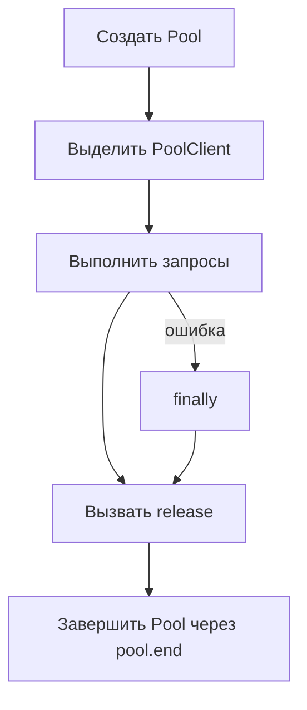

# Connections, pools и lifecycle

## Связь с предыдущей главой

Глава 207 определила границу проверки базы данных. Теперь нужно получить подключение и освободить его так, чтобы завершённый тест не оставлял процесс, пул или серверный сеанс открытыми.

## Цель главы

Различать подключение, `Client`, `Pool` и `PoolClient`, выбирать область их жизни и гарантировать освобождение ресурсов при успехе и ошибке.

## Главный вопрос

> Как управлять подключениями к базе данных без утечек и взаимного влияния тестов?

## Мотивация

Незавершённый пул удерживает Node.js-процесс. `PoolClient`, полученный из пула и не возвращённый через `release()`, уменьшает доступную ёмкость. Ошибка теста не должна прерывать очистку.

## Теория

Подключение — это активный сетевой сеанс с PostgreSQL. `Client` владеет одним подключением. `Pool` управляет ограниченным множеством подключений и временно выдаёт `PoolClient` вызывающему коду.

Ресурс на уровне теста повышает изоляцию. Пул на уровне worker уменьшает стоимость создания подключений, но требует доказанной независимости данных и обязательного завершения fixture. Универсального выбора нет.

## Внутренний механизм

`pool.connect()` выделяет `PoolClient`. `client.release()` возвращает подключение в пул, но не завершает сам пул. `pool.end()` завершает свободные подключения и не должен вызываться, пока выделенные клиенты ещё используются.

`pool.query()` самостоятельно получает и возвращает подключение для одного запроса. Несколько таких вызовов нельзя считать одной транзакцией: каждый вызов может попасть на другое подключение. Отдельный `Client` после использования закрывается через `client.end()`, а после `release()` вызывающий код больше не использует `PoolClient`.



## Главная ментальная модель

`Pool` — владелец подключений, а тест временно арендует `PoolClient`. Арендованный ресурс возвращается до завершения пула.

## Практический пример

```text
examples/03-automation-qa/chapter-208/01-pool-lifecycle.postgresql.ts
```

Вспомогательная функция создаёт пул, выделяет клиент, инициализирует уникальную схему, а после вызова функции обратного вызова удаляет схему, вызывает `release()` и `pool.end()`. Отдельная управляемая ошибка подтверждает, что сбой не прерывает завершение ресурсов.

## Automation QA

При ошибке подключения важно отделять недоступную инфраструктуру от ожидаемого нарушения ограничения базы данных. Повтор теста не исправляет неверные учётные данные или неосвобождённый клиент.

## Компромиссы

Пул на каждый запрос создаёт лишние затраты. Один глобальный экземпляр усложняет завершение и изоляцию. Область жизни должна совпадать с владельцем ресурса: тестом, worker или процессом.

## Распространённые ошибки

- Считать `release()` эквивалентом `pool.end()`.
- Завершать пул до освобождения клиента.
- Пропускать очистку после ошибки запроса.
- Полагать, что новое подключение очищает строки.

## Краткие итоги

- `Client` владеет одним подключением, `Pool` — набором подключений.
- Выделенный `PoolClient` требует `release()`.
- Отдельный клиент и пул требуют `client.end()` и `pool.end()` соответственно.
- `try/finally` сохраняет правильную область жизни ресурсов при ошибках.

## Практика

Практика встроена из соответствующего файла главы.

## Переход к следующей главе

Подключение готово передавать SQL. Глава 209 покажет, почему значения должны идти отдельно от текста SQL.
