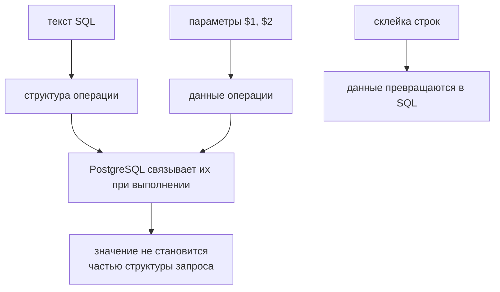

# Parameterized queries

## Связь с предыдущей главой

Глава 208 дала управляемое подключение. Следующая граница — содержание запроса: SQL-структура должна оставаться стабильной, а данные не должны превращаться в часть команды.

## Цель главы

Безопасно передавать значения через позиционные параметры, читать `rows` и `rowCount`, различать `NULL`, ошибки базы данных и результат без строк.

## Главный вопрос

> Как передавать данные в SQL безопасно и предсказуемо?

## Мотивация

Конкатенация заголовка в SQL ломается на апострофе и создаёт границу SQL-инъекции. Экранирование вручную не даёт надёжной модели. PostgreSQL должен получить текст SQL и значения раздельно.

## Теория

### Текст запроса и данные идут раздельно

В `pg` позиционные параметры записываются как `$1`, `$2` и далее. Второй аргумент `query()` содержит значения в том же порядке:

```ts
await client.query(
  "INSERT INTO tasks (title, estimate) VALUES ($1, $2) RETURNING id",
  [title, estimate],
);
```

Это не подстановка в строку перед отправкой. Клиент видит, что значения переданы, и переключается на расширенный протокол: текст SQL уходит одним сообщением, значения — отдельным. Сервер разбирает структуру запроса **до** того, как узнаёт данные.

Отсюда и защита от инъекции — не из «экранирования кавычек», а из того, что значение физически не может стать частью SQL-структуры. Строка `'; DROP TABLE tasks; --` сохранится как обычный заголовок задачи.

### Почему склейка строк опасна даже «для чисел»

Соблазн выглядит безобидно: `` `WHERE id = ${id}` `` — тут ведь число. Но `id` приходит из данных теста, ответа API или параметра функции, и однажды окажется строкой.

PostgreSQL анализирует SQL-структуру независимо от значений только тогда, когда значения переданы как значения. В склеенной строке различить данные и структуру уже невозможно — ни серверу, ни читателю кода.

Практическое правило без исключений: любое значение идёт через параметр, даже если «оно точно число» и «это же тестовые данные».

### Что можно и чего нельзя передать параметром

Параметр заменяет **значение**, а не любую часть запроса.

| Можно передать через `$1` | Нельзя |
| --- | --- |
| значение в `WHERE`, `VALUES`, `SET` | имя таблицы или схемы |
| шаблон для `LIKE`, включая `%` и `_` | имя колонки |
| массив при явном приведении типа | ключевое слово (`ASC`, `DESC`) |
| `null` | список колонок в `SELECT` |

Шаблон для `LIKE` передаётся как обычное значение — символы `%` и `_` внутри него не требуют особого обращения на стороне клиента.

Массив JavaScript также можно передать как значение, если SQL явно задаёт ожидаемый тип PostgreSQL:

```ts
await client.query("SELECT * FROM tasks WHERE status = ANY($1::text[])", [["NEW", "IN_PROGRESS"]]);
```

Динамические имена схем, таблиц или колонок нельзя передавать через `$1`. Их следует избегать, а если без них никак — выбирать из строго разрешённого набора с безопасным цитированием. Список допустимых имён в коде теста лучше любой попытки «очистить» пришедшую строку.

### Что возвращает результат

`result.rows` содержит выбранные или возвращённые строки. `rowCount` показывает число затронутых строк для изменяющего запроса.

Две детали, о которые спотыкаются:

**`NULL` приходит как `null`**, а не как отсутствующее свойство. Проверка `"description" in row` вернёт `true` и для записи без описания — различать нужно по значению.

**Порядок строк гарантируется только явным `ORDER BY`.** И даже с ним есть деталь: при сортировке по возрастанию PostgreSQL помещает `NULL` **в конец** — проверено, строки со значением идут первыми, а `NULL` замыкают выборку. Если нужен другой порядок, его задают явно через `NULLS FIRST`.

Без `ORDER BY` порядок — следствие плана выполнения и физического расположения данных; он может измениться после обновления таблицы или накопления записей. Тест, сравнивающий `rows[0]` без сортировки, работает случайно.

### `RETURNING` вместо второго запроса

Изменяющий запрос может сразу вернуть результат:

```ts
const result = await client.query(
  "INSERT INTO tasks (title) VALUES ($1) RETURNING id, created_at",
  [title],
);
const id = result.rows[0].id;
```

Это удобнее и надёжнее, чем вставка с последующим `SELECT` по неуникальному признаку: идентификатор приходит из самой операции, а не из поиска, который при параллельном запуске может найти чужую запись.

### Ошибка внутри транзакции

После ошибки оператора внутри транзакции следующие операторы потребуют `ROLLBACK`. PostgreSQL переводит транзакцию в состояние отказа, и до отката любой запрос будет отклонён.

Практическое следствие для теста: обработка ошибки внутри транзакции не может состоять из «поймали и продолжили». Нужен явный `ROLLBACK`, после которого подключение снова пригодно к работе — и только потом можно выполнять следующие запросы.

### Чего параметризация не делает

Параметризация защищает значения, но не исправляет слишком широкий `DELETE`, отсутствие `ORDER BY` или неправильную бизнес-проверку.

Запрос `DELETE FROM tasks WHERE title = $1` безопасен с точки зрения инъекции и разрушителен по смыслу, если `title` неуникален. Параметр отвечает за то, что значение останется значением, — и ни за что больше.

Параметризованный запрос нужен и для подготовки, и для проверки данных: в проверке он ровно так же защищает от того, что данные теста случайно изменят смысл запроса.

Структура и данные попадают в базу по разным путям:



## Внутренний механизм

Клиент отправляет текст SQL и параметры по протоколу. Сервер связывает значения с позиционными параметрами и возвращает строки либо ошибку. После ошибки оператора внутри транзакции следующие операторы потребуют `ROLLBACK`.

## Главная ментальная модель

Текст SQL описывает операцию. Параметры являются данными операции. PostgreSQL связывает их, не превращая значения в часть SQL-структуры.

## Практический пример

```text
examples/03-automation-qa/chapter-209/01-parameterized-query.postgresql.ts
```

Заголовок, похожий на SQL-инъекцию, и `null` передаются как значения. `INSERT ... RETURNING` подтверждает строку и `rowCount`, а последующий запрос доказывает, что заголовок сохранился именно как данные.

## Automation QA

Параметризованный запрос нужен и для подготовки, и для проверки данных. Динамические имена схем, таблиц или колонок нельзя передавать через `$1`; их следует избегать или выбирать из строго разрешённого набора с безопасным цитированием.

## Компромиссы

Параметризация защищает значения, но не исправляет слишком широкий `DELETE`, отсутствие `ORDER BY` или неправильную бизнес-проверку.

## Распространённые мифы

**Миф: параметризация — это автоматическое экранирование кавычек.**
Значение вообще не попадает в текст SQL: оно уходит отдельным сообщением протокола.

**Миф: для чисел склейка строк безопасна.**
Значение приходит из данных и однажды окажется не числом. Правило без исключений: значение — через параметр.

**Миф: имя таблицы можно передать через `$1`.**
Параметр заменяет значение, а не часть структуры запроса. Имена выбирают из разрешённого списка.

**Миф: `%` в шаблоне `LIKE` требует особой обработки.**
Шаблон передаётся как обычное значение целиком.

**Миф: порядок строк стабилен и без `ORDER BY`.**
Он зависит от плана выполнения и меняется со временем. Сравнение `rows[0]` без сортировки работает случайно.

## Частые вопросы

**Как передать список значений в `IN`?**
Через массив с явным приведением типа: `ANY($1::text[])`.

**Как отличить `NULL` от отсутствующего поля?**
`NULL` приходит как `null`, и свойство в строке присутствует. Проверять нужно значение, а не наличие ключа.

**Как получить идентификатор вставленной записи?**
Через `RETURNING` в том же запросе — надёжнее, чем последующий поиск по неуникальному признаку.

**Что делать после ошибки внутри транзакции?**
Выполнить `ROLLBACK`. До отката PostgreSQL отклонит любые следующие операторы.

**Защищает ли параметризация от опасного запроса?**
Нет. Она отвечает только за то, что значение останется значением.

## Проверьте себя

1. Почему значение не может стать частью SQL-структуры при параметризованном запросе?
2. Что нельзя передать через `$1` и как поступать в таких случаях?
3. Как приходит `NULL` и почему это важно для проверки?
4. Зачем нужен `ORDER BY`, если строк всего три?
5. Что произойдёт со следующими операторами после ошибки внутри транзакции?

## Распространённые ошибки

- Конкатенировать полученное от пользователя значение с SQL.
- Сравнивать `NULL` через `= NULL` вместо `IS NULL`.
- Полагаться на неявный порядок строк.
- Проверять изменяющий запрос без `rowCount` или последующего чтения.

## Краткие итоги

- Значения передаются отдельно от текста SQL.
- `$1` относится к значению, а не к имени схемы, таблицы или колонки.
- `rows` и `rowCount` отвечают на разные вопросы.
- `null` отличается от отсутствующего JavaScript-свойства.

## Практика

Практика встроена из соответствующего файла главы.

## Переход к следующей главе

Безопасный SQL всё ещё перегружает тестовый сценарий деталями схемы. Глава 210 введёт узкий Database Access Layer.
