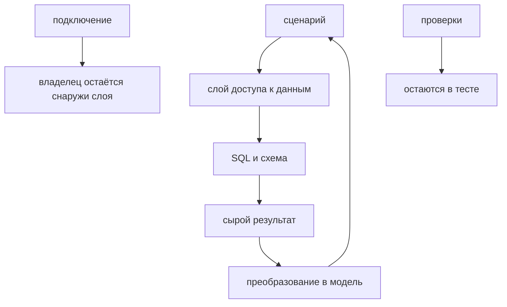

# Database Access Layer

## Связь с предыдущей главой

Глава 209 научила выполнять отдельный параметризованный запрос. В большом наборе тестов повторение SQL, преобразований и названий колонок делает сценарии хрупкими.

## Цель главы

Отделить намерение сценария от SQL и схемы через узкий публичный API, оставив видимыми область жизни ресурсов, ошибки и владение транзакцией.

## Главный вопрос

> Как отделить тестовый сценарий от SQL и схемы базы данных?

## Мотивация

Тесту важно выразить «создать задачу» или «найти задачу», а не повторять список колонок. Но универсальный `execute(sql, params)` лишь переносит SQL и не создаёт границу предметной области.

## Теория

### Что скрывает слой доступа

Database Access Layer может состоять из модулей запросов или небольших репозиториев. Repository Pattern является вариантом, а не обязательной архитектурой.

Задача у слоя ровно одна: не дать SQL и знанию о схеме расползтись по тестам. Переименование колонки должно править одно место, а не двадцать.

Публичный API должен отражать устойчивые операции и возвращать данные, нужные для проверок:

```ts
tasks.findById(id);          // операция предметной области
tasks.countByStatus("NEW");  // факт, нужный проверке
```

Метод `query(sql, values)` таким API не является — он просто переименовывает клиент базы.

### Преобразование результата — основная работа слоя

Строка из PostgreSQL и модель приложения устроены по-разному, и слой переводит одно в другое. Преобразование переводит строки с `snake_case` в модель приложения, нормализует `numeric`, время и `NULL`.

| Что приходит из базы | Во что превращается | Почему |
| --- | --- | --- |
| `estimated_hours` | `estimatedHours` | соглашение об именовании кода |
| `numeric` как строка | `number` | драйвер отдаёт строкой, чтобы не терять точность |
| `bigint` как строка | `number` или `bigint` | значение может выйти за безопасный диапазон |
| `timestamptz` как `Date` | ISO-строка UTC | сравнение не зависит от часового пояса |
| `NULL` | `null` | отличается от отсутствия поля |

Вторая и третья строки удивляют чаще всего. Проверено на живой базе: `numeric(10,2)` со значением `2.50` приходит как строка `'2.50'`, `bigint` — тоже строкой, а `timestamptz` — уже объектом `Date`, а не строкой. Поэтому сравнение `expect(row.estimated_hours).toBe(2.5)` не пройдёт, а сравнение даты со строкой ISO не пройдёт тем более. Драйвер поступает так намеренно, потому что не всякое значение `numeric` представимо числом JavaScript без потери точности. Решение о преобразовании принимает слой — осознанно и в одном месте.

### Типы описывают ожидание, а не проверяют данные

Обобщённый тип TypeScript у `query<Row>()` описывает ожидание компилятора, но не проверяет строку во время выполнения.

То же правило, что для JSON в главе 195: `query<TaskRow>(...)` не гарантирует, что в строке будет `title`. Если колонку переименовали, тип продолжит утверждать своё, а в значении окажется `undefined` — и падение произойдёт позже, на бизнес-проверке.

Слой может это заметить: он и есть то место, где уместна минимальная проверка формы строки перед преобразованием.

### Владение подключением остаётся снаружи

Подключение передаётся снаружи, поэтому слой не скрывает владение ресурсом и границу транзакции.

Репозиторий, который сам создаёт пул, ломает две вещи сразу. Во-первых, его некому закрыть — возвращаемся к проблеме из главы 208. Во-вторых, становится невозможной транзакция: несколько вызовов репозитория должны выполняться на **одном** подключении, а это решение принимает вызывающий код.

Рабочая форма — клиент в конструкторе:

```ts
const tasks = new TasksRepository(client);   // client принадлежит тесту или fixture
```

Тогда тот же репозиторий одинаково работает и на обычном подключении, и на клиенте внутри транзакции.

### Проверки остаются в тесте

Проверки остаются в тесте. Репозиторий возвращает факты и не решает, считается ли сценарий успешным.

Ошибки базы данных также не должны превращаться в один безликий `boolean`. Метод, возвращающий `false` и при отсутствии записи, и при нарушении ограничения, и при недоступной базе, лишает тест возможности отличить эти случаи — ровно как обёртка gRPC, глушащая `ServiceError`.

Полезное разделение: репозиторий отвечает на вопрос «что в базе», тест — на вопрос «правильно ли это».

### Что возвращать: модель или сырой результат

Для проверок обычно нужна модель, но `rowCount` иногда важнее содержимого.

- **модель** — когда проверяются значения полей;
- **`rowCount`** — когда проверяется факт изменения: «удалилась ровно одна строка»;
- **`null` вместо исключения** — когда отсутствие записи является нормальным исходом операции.

Последний случай требует аккуратности: `findById`, возвращающий `null` для отсутствующей записи, — разумно; `create`, молча возвращающий `null` при ошибке, — нет.

### Где граница разумной абстракции

Слишком узкий слой дублирует SQL: пять методов, отличающихся одним условием, — это признак, что нужен один метод с параметром.

Слишком универсальный скрывает схему, `rowCount` и ошибки: за фасадом `execute(operation, params)` не видно ни того, что происходит, ни того, что пошло не так.

Абстракция оправдана повторением и устойчивой терминологией предметной области. Если в проекте два запроса к таблице и они встречаются по одному разу, репозиторий не нужен — достаточно параметризованного запроса рядом с тестом.

Слой переводит, но не владеет и не проверяет:



## Внутренний механизм

Сценарий вызывает метод слоя. Метод выполняет параметризованный SQL, получает строку и явно преобразует представление базы данных. Подключение передаётся снаружи, поэтому слой не скрывает владение ресурсом и границу транзакции.

## Главная ментальная модель

Database Access Layer — переводчик между языком сценария и языком схемы, а не универсальный контейнер для любого SQL.

## Практический пример

```text
examples/03-automation-qa/chapter-210/01-database-access-layer.postgresql.ts
```

`TasksRepository` создаётся над уже принадлежащим тесту клиентом. Он преобразует `estimated_hours` из строки `numeric` в `number`, время — в ISO-строку UTC, а `NULL` сохраняет как `null`.

## Automation QA

Проверки остаются в тесте. Репозиторий возвращает факты и не решает, считается ли сценарий успешным. Ошибки базы данных также не должны превращаться в один безликий `boolean`.

## Компромиссы

Слишком узкий слой дублирует SQL. Слишком универсальный скрывает схему, `rowCount` и ошибки. Абстракция оправдана повторением и устойчивой терминологией предметной области.

## Распространённые мифы

**Миф: слой доступа — это метод `query(sql, values)`.**
Такой метод лишь переименовывает клиент базы. Слой выражает операции предметной области.

**Миф: `numeric` приходит числом.**
Драйвер отдаёт его строкой, чтобы не терять точность. Преобразование — работа слоя.

**Миф: обобщённый тип у `query<Row>()` проверяет строку.**
Он описывает ожидание компилятора. Переименованная колонка даст `undefined` без единого замечания.

**Миф: репозиторий должен сам управлять подключением.**
Тогда его некому закрыть и невозможно выполнить транзакцию из нескольких вызовов.

**Миф: удобно возвращать `boolean` «получилось или нет».**
Так отсутствие записи, нарушение ограничения и недоступная база становятся неразличимы.

## Частые вопросы

**Нужен ли репозиторий для двух запросов?**
Нет. Абстракция оправдана повторением и устойчивой терминологией, а не самим фактом обращения к базе.

**Почему сравнение с числом не проходит для `numeric`?**
Значение пришло строкой. Преобразовывать нужно в слое, в одном месте.

**Как выполнить транзакцию через репозиторий?**
Передать ему клиент, уже находящийся в транзакции. Подключение приходит снаружи.

**Что возвращать при отсутствии записи?**
`null`, если это нормальный исход операции. Для ошибок — исключение с сохранённой диагностикой.

**Где проверять форму строки?**
В слое, перед преобразованием: это единственное место, знающее схему.

## Проверьте себя

1. Чем метод слоя отличается от обёртки над `query(sql, values)`?
2. Почему `numeric` приходит строкой и кто должен это преобразовывать?
3. Что гарантирует обобщённый тип у `query<Row>()`, а что нет?
4. Почему подключение передаётся снаружи, а не создаётся репозиторием?
5. Когда возвращать `rowCount` вместо модели?

## Распространённые ошибки

- Создавать одно глобальное подключение внутри репозитория.
- Скрывать `BEGIN`, `COMMIT` и `ROLLBACK`.
- Считать TypeScript-интерфейс проверкой данных во время выполнения.
- Возвращать `any` вместо явного преобразования.

## Краткие итоги

- DAL отделяет намерение сценария от деталей схемы.
- Модули запросов и Repository Pattern являются вариантами.
- Преобразование строк должно быть явным.
- Владение ресурсами и проверки остаются у вызывающего кода.

## Практика

Практика встроена из соответствующего файла главы.

## Переход к следующей главе

Получив узкие операции, тест должен управлять созданными данными. Глава 211 определит владение их подготовкой и очисткой.
