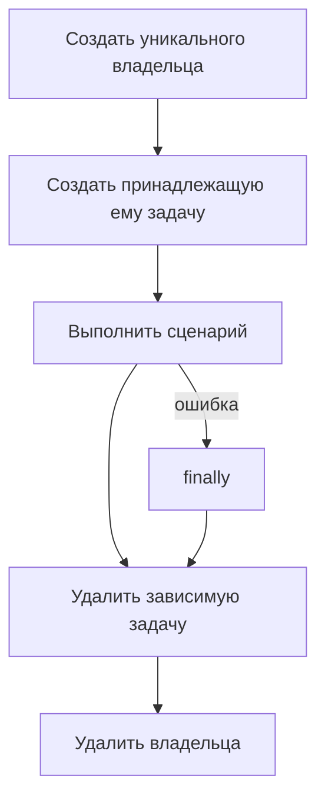

# Подготовка и очистка данных в database

## Связь с предыдущей главой

Глава 210 дала API для операций с базой данных. Теперь каждая созданная строка должна получить явного владельца и предсказуемую область жизни.

## Цель главы

Организовать подготовку и очистку тестовых данных с уникальными идентификаторами, учётом внешних ключей, идемпотентности и гарантированным выполнением после падения теста.

## Главный вопрос

> Как создавать и удалять тестовые данные с явным владельцем и предсказуемым жизненным циклом?

## Мотивация

Общая строка вроде `test-user` связывает сценарии. Один тест изменяет её, другой удаляет, третий ожидает исходное состояние. Повторный запуск перестаёт быть детерминированным.

## Теория

Тест создаёт уникальное пространство имён: идентификатор содержит признак worker или сценария либо UUID. Владение означает, что только владелец изменяет и удаляет эти данные.

Внешний ключ задаёт порядок очистки: сначала удаляются зависимые строки, затем родительская. Идемпотентная очистка допускает отсутствие строки и проверяет, что не удалены чужие данные. Очистка выполняется в `finally`.

Если основной сценарий и очистка завершаются ошибками одновременно, диагностика должна сохранить обе причины, например через `AggregateError`. Ошибка очистки не должна бесследно заменить исходное падение теста или прервать закрытие подключения.

## Внутренний механизм

`INSERT ... RETURNING` подтверждает созданный идентификатор. Точный `DELETE ... WHERE id = $1` возвращает `rowCount`. Повторное удаление той же строки возвращает 0 и не является причиной удалить более широкий набор.



## Главная ментальная модель

Создатель данных является их уборщиком. Очистка удаляет только известные идентификаторы в обратном порядке зависимостей.

## Практический пример

```text
examples/03-automation-qa/chapter-211/01-data-lifecycle.postgresql.ts
```

Пример создаёт владельца и задачу, удаляет дочернюю строку до родительской и проверяет идемпотентную повторную очистку через `rowCount`.

## Automation QA

Прямая подготовка через базу данных оправданна, когда она не является предметом проверки. Если тест проверяет создание через API, прямой `INSERT` подменит важную часть сценария.

## Компромиссы

Уникальные данные увеличивают объём подготовки, но устраняют скрытые зависимости. `TRUNCATE` быстрее массовой очистки, однако допустим только в полностью изолированном тестовом хранилище.

## Распространённые ошибки

- Удалять родительскую строку раньше зависимых строк.
- Выполнять неограниченный `DELETE`.
- Использовать постоянный общий идентификатор.
- Запускать очистку только после успешной проверки.

## Краткие итоги

- Тестовые данные требуют явного владельца.
- Уникальные идентификаторы уменьшают конфликты.
- Внешние ключи определяют порядок очистки.
- Идемпотентная очистка остаётся точной и безопасной.

## Практика

Практика встроена из соответствующего файла главы.

## Переход к следующей главе

Иногда очистку можно выразить через `ROLLBACK`. Глава 212 покажет возможности и границы транзакционной изоляции.
