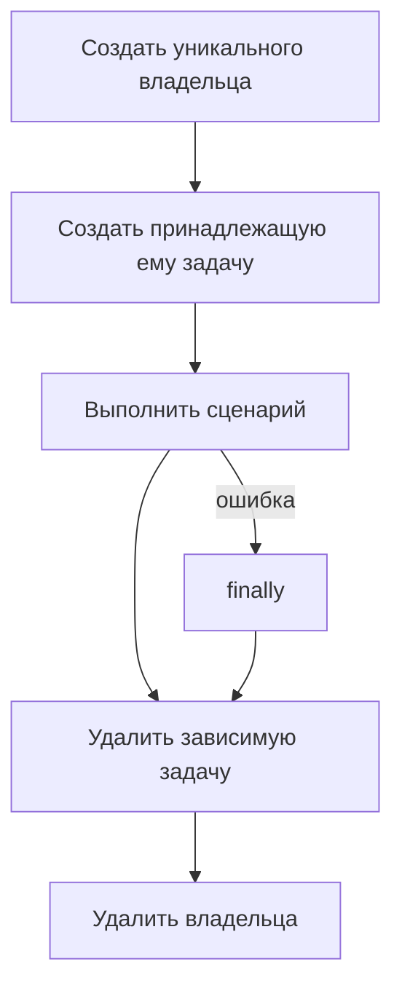

# Подготовка и очистка данных в database

## Связь с предыдущей главой

Глава 210 дала API для операций с базой данных. Теперь каждая созданная строка должна получить явного владельца и предсказуемую область жизни.

## Цель главы

Организовать подготовку и очистку тестовых данных с уникальными идентификаторами, учётом внешних ключей, идемпотентности и гарантированным выполнением после падения теста.

## Главный вопрос

> Как создавать и удалять тестовые данные с явным владельцем и предсказуемым жизненным циклом?

## Мотивация

Общая строка вроде `test-user` связывает сценарии. Один тест изменяет её, другой удаляет, третий ожидает исходное состояние. Повторный запуск перестаёт быть детерминированным.

## Теория

### Уникальное пространство имён

Тест создаёт уникальное пространство имён: идентификатор содержит признак worker или сценария либо UUID.

Уникальность решает две задачи сразу — пересечение параллельных тестов и наследство от прошлого прогона. Но у идентификатора есть и третья задача, о которой забывают: он должен оставаться **пригодным для диагностики**. По строке `task-8f3a2c` невозможно понять, какой тест её оставил; по `task-w2-создание-заказа-8f3a` — можно.

Владение означает, что только владелец изменяет и удаляет эти данные. Чужие строки для теста доступны на чтение и неприкосновенны на запись.

### Порядок очистки задаёт схема

Внешний ключ задаёт порядок очистки: сначала удаляются зависимые строки, затем родительская.



Нарушение порядка даёт отказ по внешнему ключу — SQLSTATE `23503` с сообщением вида `update or delete on table "..." violates foreign key constraint`. Это не «странная ошибка базы», а прямое сообщение: у удаляемой строки остались зависимые записи. Правило простое — удалять в порядке, обратном созданию.

### Идемпотентная очистка

Идемпотентная очистка допускает отсутствие строки и проверяет, что не удалены чужие данные.

Механика опирается на `rowCount` точного удаления:

```ts
const first = await client.query("DELETE FROM tasks WHERE id = $1", [id]);
first.rowCount;   // 1 — строка была и удалена

const again = await client.query("DELETE FROM tasks WHERE id = $1", [id]);
again.rowCount;   // 0 — строки уже нет, и это нормально
```

Повторное удаление той же строки возвращает 0 и не является причиной удалить более широкий набор. Соблазн «раз не нашлось по id, удалю по названию» приводит ровно к тому, от чего очистка должна защищать: удалению чужих данных.

`INSERT ... RETURNING` подтверждает созданный идентификатор — и именно этот идентификатор, а не поиск по признаку, используется потом в `DELETE ... WHERE id = $1`.

### Очистка выполняется при любом исходе

Очистка выполняется в `finally`. Последняя строка тела теста для неё не годится: при падении проверки выполнение до неё не дойдёт — то же правило, что и для браузерных ресурсов.

Ещё одно требование — очистка не должна зависеть от успеха подготовки. Если владелец создан, а задача нет, попытка удалить несуществующую задачу не должна ломать удаление владельца.

### Две ошибки одновременно

Если основной сценарий и очистка завершаются ошибками одновременно, диагностика должна сохранить обе причины.

Наивный `try/finally` теряет исходную ошибку: исключение из `finally` заменяет её собой, и в отчёте остаётся «не удалось удалить строку» вместо настоящей причины падения. Решение — объединить обе:

```ts
throw new AggregateError([scenarioError, cleanupError], "сценарий и очистка завершились ошибкой");
```

`AggregateError` доступен в современном Node и сохраняет обе причины в поле `errors`.

Ошибка очистки не должна бесследно заменить исходное падение теста или прервать закрытие подключения: ресурс освобождается в любом случае, иначе за одним дефектом потянется зависший пул.

### Когда прямой `INSERT` уместен

Прямая подготовка через базу данных оправданна, когда она не является предметом проверки.

Если тест проверяет создание через API, прямой `INSERT` подменит важную часть сценария: запись появится, минуя валидацию, вычисляемые поля и побочные эффекты сервиса. Тест будет зелёным при сломанном создании.

Практическое разделение:

| Что проверяет тест | Как готовить данные |
| --- | --- |
| создание через API или UI | тем же путём, который проверяется |
| поведение над существующими данными | прямым `INSERT` — быстрее и устойчивее |
| редкое состояние, недостижимое через интерфейс | прямым `INSERT` |

### `TRUNCATE` и его цена

`TRUNCATE` быстрее массовой очистки, однако допустим только в полностью изолированном тестовом хранилище.

Причина очевидна, но про неё забывают в спешке: он удаляет **всё**, включая данные, которые тест не создавал. В общей базе это уничтожит работу параллельных тестов и справочные данные стенда.

Уникальные данные увеличивают объём подготовки, но устраняют скрытые зависимости — и этот обмен почти всегда выгоден.

## Внутренний механизм

`INSERT ... RETURNING` подтверждает созданный идентификатор. Точный `DELETE ... WHERE id = $1` возвращает `rowCount`. Повторное удаление той же строки возвращает 0 и не является причиной удалить более широкий набор.


## Главная ментальная модель

Создатель данных является их уборщиком. Очистка удаляет только известные идентификаторы в обратном порядке зависимостей.

## Практический пример

```text
examples/03-automation-qa/chapter-211/01-data-lifecycle.postgresql.ts
```

Пример создаёт владельца и задачу, удаляет дочернюю строку до родительской и проверяет идемпотентную повторную очистку через `rowCount`.

## Automation QA

Прямая подготовка через базу данных оправданна, когда она не является предметом проверки. Если тест проверяет создание через API, прямой `INSERT` подменит важную часть сценария.

## Компромиссы

Уникальные данные увеличивают объём подготовки, но устраняют скрытые зависимости. `TRUNCATE` быстрее массовой очистки, однако допустим только в полностью изолированном тестовом хранилище.

## Распространённые мифы

**Миф: уникальность идентификатора — это про случайность.**
Она ещё и про диагностику. По случайной строке не видно, какой тест оставил данные.

**Миф: если строка не нашлась по id, можно удалить по названию.**
Так удаляются чужие данные. Очистка работает только по известным идентификаторам.

**Миф: повторное удаление с `rowCount: 0` — признак ошибки.**
Это нормальный результат идемпотентной очистки: строки уже нет.

**Миф: ошибка в очистке не важна, тест ведь уже упал.**
Она подменяет исходную причину в отчёте. Обе ошибки нужно сохранить, например через `AggregateError`.

**Миф: `TRUNCATE` — быстрый способ прибраться.**
Он удаляет всё, включая чужие и справочные данные. Допустим только в полностью изолированном хранилище.

## Частые вопросы

**В каком порядке удалять связанные строки?**
Обратном порядку создания: сначала зависимые, потом родительские. Иначе будет отказ по внешнему ключу.

**Можно ли готовить данные прямым `INSERT`?**
Да, если создание не является предметом проверки. Для теста на создание через API это подменит сценарий.

**Что делать, если подготовка упала на середине?**
Очищать то, что успело создаться. Очистка не должна зависеть от полного успеха подготовки.

**Как не потерять исходную ошибку из-за падения очистки?**
Собрать обе в `AggregateError` и не мешать закрытию подключения.

**Где размещать очистку?**
В `finally` или teardown fixture — только так она выполнится при падении проверки.

## Проверьте себя

1. Какие три задачи решает уникальный идентификатор тестовых данных?
2. Почему `rowCount: 0` при повторном удалении — нормальный результат?
3. Что произойдёт при удалении родительской строки раньше зависимой?
4. Как сохранить обе причины, если упали и сценарий, и очистка?
5. При каком условии допустим `TRUNCATE`?

## Распространённые ошибки

- Удалять родительскую строку раньше зависимых строк.
- Выполнять неограниченный `DELETE`.
- Использовать постоянный общий идентификатор.
- Запускать очистку только после успешной проверки.

## Краткие итоги

- Тестовые данные требуют явного владельца.
- Уникальные идентификаторы уменьшают конфликты.
- Внешние ключи определяют порядок очистки.
- Идемпотентная очистка остаётся точной и безопасной.

## Практика

Практика встроена из соответствующего файла главы.

## Переход к следующей главе

Иногда очистку можно выразить через `ROLLBACK`. Глава 212 покажет возможности и границы транзакционной изоляции.
