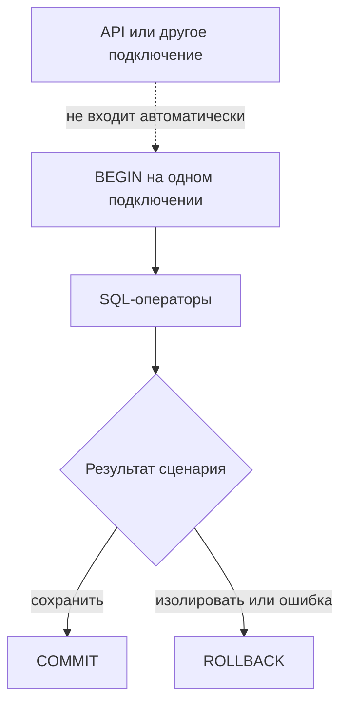

# Transactions, rollback и test isolation

## Связь с предыдущей главой

Глава 211 очищала строки явными операциями. Транзакция позволяет объединить SQL-операторы в одну границу и отменить их вместе, но только внутри того же сеанса базы данных.

## Цель главы

Понимать `BEGIN`, `COMMIT`, `ROLLBACK`, видимость данных и ограничения транзакции на один тест при внешних подключениях и фоновой обработке.

## Главный вопрос

> Когда транзакция помогает изолировать тест и когда откат не покрывает внешние процессы?

## Мотивация

`ROLLBACK` удобен для теста на уровне репозитория: изменения не переживают сценарий. Но API-сервер обычно использует другое подключение, не входит в транзакцию теста и может не видеть незафиксированную подготовку данных.

## Теория

`BEGIN` открывает границу транзакции. `COMMIT` делает изменения постоянными, `ROLLBACK` отменяет изменения этой транзакции. Атомарность означает совместное применение SQL-операторов, но не отменяет HTTP-вызовы, сообщения или работу другого подключения.

Уровни изоляции определяют видимость конкурентных изменений. В этой главе достаточно понимать, что подключение и транзакция связаны: SQL-операторы другого подключения не становятся частью транзакции автоматически. Точное поведение уровней изоляции зависит от выбранного режима и не сводится к одному универсальному правилу.

## Внутренний механизм

После ошибки базы данных транзакция может перейти в прерванное состояние. До `ROLLBACK` последующие SQL-операторы завершаются SQLSTATE `25P02`. Поэтому откат должен находиться в `finally` или обработчике ошибки. Точки сохранения не возникают автоматически: для них нужны явные `SAVEPOINT`.



## Главная ментальная модель

Транзакция — временная область одного подключения. `ROLLBACK` отменяет её изменения базы данных, но не перематывает внешний мир.

## Практический пример

```text
examples/03-automation-qa/chapter-212/01-transaction-rollback.postgresql.ts
```

Тест создаёт конфликт уникального ключа с SQLSTATE `23505` внутри транзакции, подтверждает прерванное состояние с SQLSTATE `25P02` до `ROLLBACK`, а после отката проверяет отсутствие строки и пригодность клиента для следующего запроса.

## Automation QA

Транзакция на тест особенно полезна для тестов DAL и репозитория. Для сквозного сценария чаще нужны уникальные закоммиченные данные и явная очистка, доступные подключениям приложения.

## Компромиссы

Откат ускоряет очистку, но может скрыть поведение обработчиков фиксации и фоновых задач. DDL и внешние побочные эффекты требуют отдельного анализа.

## Распространённые ошибки

- Выполнять операторы одной транзакции через разные подключения.
- Считать откат универсальной очисткой.
- Продолжать транзакцию после ошибки оператора без отката.
- Ожидать, что API увидит незакоммиченные исходные данные теста.

## Краткие итоги

- Транзакция принадлежит подключению.
- `COMMIT` сохраняет, а `ROLLBACK` отменяет изменения этой транзакции в базе данных.
- Откат не отменяет внешние побочные эффекты.
- Стратегия изоляции зависит от уровня теста.

## Практика

Практика встроена из соответствующего файла главы.

## Переход к следующей главе

Даже зафиксированная строка иногда появляется не сразу из-за асинхронной обработки. Глава 213 заменит произвольную паузу ограниченным polling.
