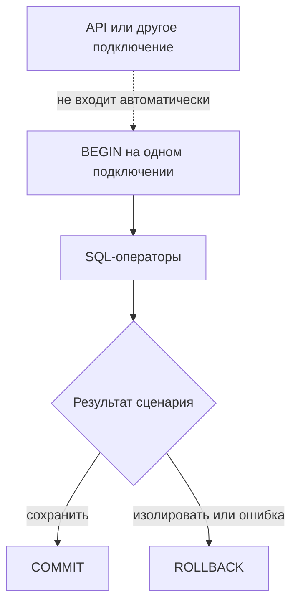

# Transactions, rollback и test isolation

## Связь с предыдущей главой

Глава 211 очищала строки явными операциями. Транзакция позволяет объединить SQL-операторы в одну границу и отменить их вместе, но только внутри того же сеанса базы данных.

## Цель главы

Понимать `BEGIN`, `COMMIT`, `ROLLBACK`, видимость данных и ограничения транзакции на один тест при внешних подключениях и фоновой обработке.

## Главный вопрос

> Когда транзакция помогает изолировать тест и когда откат не покрывает внешние процессы?

## Мотивация

`ROLLBACK` удобен для теста на уровне репозитория: изменения не переживают сценарий. Но API-сервер обычно использует другое подключение, не входит в транзакцию теста и может не видеть незафиксированную подготовку данных.

## Теория

### Граница транзакции принадлежит подключению

`BEGIN` открывает границу транзакции. `COMMIT` делает изменения постоянными, `ROLLBACK` отменяет изменения этой транзакции.

Ключевое слово здесь — **этой**. Транзакция живёт на конкретном подключении, и SQL-операторы другого подключения не становятся её частью автоматически.



Отсюда прямая связь с главой 208: несколько `pool.query()` подряд транзакции не образуют, потому что каждый вызов берёт подключение заново. Транзакция требует явно выделенного клиента.

### Что атомарность не покрывает

Атомарность означает совместное применение SQL-операторов, но не отменяет HTTP-вызовы, сообщения или работу другого подключения.

Список того, что `ROLLBACK` не перематывает:

- уже отправленный HTTP-запрос и его последствия на другой стороне;
- сообщение, попавшее в очередь;
- файл, записанный приложением;
- изменения, сделанные другим подключением;
- отправленное уведомление.

`ROLLBACK` отменяет изменения базы данных, но не перематывает внешний мир. Тест, который «откатит всё», на деле откатывает только свою часть.

### Прерванное состояние транзакции

Это то место, где тест обычно спотыкается первый раз. После ошибки базы данных транзакция может перейти в прерванное состояние, и до `ROLLBACK` последующие SQL-операторы завершаются SQLSTATE `25P02`.

Сценарий выглядит так:

```ts
await client.query("BEGIN");
await client.query("INSERT ...");          // ошибка 23505: нарушено ограничение уникальности
await client.query("SELECT 1");            // ошибка 25P02: транзакция прервана
await client.query("ROLLBACK");            // теперь клиент снова пригоден
```

Проверено на живой базе: вторая ошибка приходит с текстом `current transaction is aborted, commands ignored until end of transaction block`, а у первой в поле `constraint` указано имя нарушенного ограничения — этого обычно достаточно, чтобы понять причину без обращения к логам сервера.

Поймать первую ошибку и продолжить работу нельзя — база отклонит всё до отката. Поэтому откат должен находиться в `finally` или обработчике ошибки, а не где-то в ветке успеха.

Оба кода стоит узнавать в лицо: `23505` — нарушение уникальности, `23503` — нарушение внешнего ключа, `25P02` — операторы после ошибки в транзакции. В клиенте они приходят в поле `code` объекта ошибки, рядом с `constraint`, `table` и `detail` — этого обычно достаточно, чтобы понять причину без обращения к логам сервера.

### Точки сохранения не появляются сами

Точки сохранения не возникают автоматически: для них нужны явные `SAVEPOINT`.

Если сценарию нужно попробовать операцию, допуская её неудачу, и продолжить транзакцию — единственный способ это сделать в PostgreSQL:

```sql
SAVEPOINT try_insert;
-- операция, которая может нарушить ограничение
ROLLBACK TO SAVEPOINT try_insert;   -- транзакция снова пригодна
```

Без точки сохранения после ошибки остаётся только полный откат.

### Транзакция на тест: когда работает

Приём «открыть транзакцию перед тестом и откатить после» даёт очень дешёвую очистку. Но у него есть строгое условие применимости — **весь тест должен работать на том же подключении**.

| Тип теста | Подходит ли откат вместо очистки |
| --- | --- |
| тест репозитория или DAL | да — все запросы идут через один клиент |
| тест SQL-запроса | да |
| сквозной сценарий через API | нет — приложение работает своим подключением |
| сценарий через UI | нет |

Транзакция на тест особенно полезна для тестов DAL и репозитория. Для сквозного сценария чаще нужны уникальные закоммиченные данные и явная очистка, доступные подключениям приложения: незакоммиченные данные приложение просто не увидит.

### Чего откат может не показать

Откат ускоряет очистку, но может скрыть поведение обработчиков фиксации и фоновых задач.

Логика, привязанная к моменту `COMMIT` — триггеры, отложенные ограничения, обработчики событий, материализация, — в откаченном тесте не сработает. Тест пройдёт, а в жизни именно на фиксации всё и сломается.

DDL и внешние побочные эффекты требуют отдельного анализа: часть операций изменения схемы ведёт себя внутри транзакции иначе, а внешние эффекты откат вообще не затрагивает.

### Изоляция транзакций — отдельная тема

Уровни изоляции определяют видимость конкурентных изменений. В этой главе достаточно понимать, что подключение и транзакция связаны.

Точное поведение уровней изоляции зависит от выбранного режима и не сводится к одному универсальному правилу. Для тестов важно другое следствие, о котором речь пойдёт в главе 215: изоляция транзакций управляет видимостью, а разделение данных между тестами обеспечивается уникальными пространствами имён — это разные механизмы, и один не заменяет другой.

## Внутренний механизм

После ошибки базы данных транзакция может перейти в прерванное состояние. До `ROLLBACK` последующие SQL-операторы завершаются SQLSTATE `25P02`. Поэтому откат должен находиться в `finally` или обработчике ошибки. Точки сохранения не возникают автоматически: для них нужны явные `SAVEPOINT`.


## Главная ментальная модель

Транзакция — временная область одного подключения. `ROLLBACK` отменяет её изменения базы данных, но не перематывает внешний мир.

## Практический пример

```text
examples/03-automation-qa/chapter-212/01-transaction-rollback.postgresql.ts
```

Тест создаёт конфликт уникального ключа с SQLSTATE `23505` внутри транзакции, подтверждает прерванное состояние с SQLSTATE `25P02` до `ROLLBACK`, а после отката проверяет отсутствие строки и пригодность клиента для следующего запроса.

## Automation QA

Транзакция на тест особенно полезна для тестов DAL и репозитория. Для сквозного сценария чаще нужны уникальные закоммиченные данные и явная очистка, доступные подключениям приложения.

## Компромиссы

Откат ускоряет очистку, но может скрыть поведение обработчиков фиксации и фоновых задач. DDL и внешние побочные эффекты требуют отдельного анализа.

## Распространённые мифы

**Миф: `ROLLBACK` отменяет всё, что сделал тест.**
Он отменяет изменения базы на своём подключении. HTTP-вызовы, сообщения и файлы остаются.

**Миф: после ошибки в транзакции можно продолжить работу.**
До отката база отклоняет любые операторы с SQLSTATE `25P02`.

**Миф: несколько `pool.query()` внутри `BEGIN` образуют транзакцию.**
Каждый вызов берёт подключение заново. Нужен явно выделенный клиент.

**Миф: транзакция на тест подходит любому сценарию.**
Только тем, где весь тест работает на одном подключении. Приложение незакоммиченных данных не увидит.

**Миф: откат полностью заменяет очистку.**
Логика, привязанная к `COMMIT`, в откаченном тесте не сработает — и дефект останется незамеченным.

## Частые вопросы

**Что означает ошибка `25P02`?**
Транзакция прервана предыдущей ошибкой. Нужен `ROLLBACK`, после него клиент снова пригоден.

**Как попробовать операцию и продолжить транзакцию при неудаче?**
Через явный `SAVEPOINT` и `ROLLBACK TO SAVEPOINT`. Сами точки сохранения не создаются.

**Почему API-тест не видит подготовленных в транзакции данных?**
Приложение работает своим подключением и незакоммиченные изменения не видит.

**Где размещать `ROLLBACK`?**
В `finally` или обработчике ошибки — иначе до него не дойдёт выполнение.

**Какие коды ошибок стоит знать?**
`23505` — уникальность, `23503` — внешний ключ, `25P02` — операторы после ошибки в транзакции.

## Проверьте себя

1. Почему транзакция привязана к подключению и что из этого следует для `pool.query()`?
2. Что `ROLLBACK` не отменяет?
3. Что произойдёт со следующим запросом после ошибки внутри транзакции?
4. Для каких тестов откат заменяет очистку, а для каких нет?
5. Какое поведение системы откат может скрыть?

## Распространённые ошибки

- Выполнять операторы одной транзакции через разные подключения.
- Считать откат универсальной очисткой.
- Продолжать транзакцию после ошибки оператора без отката.
- Ожидать, что API увидит незакоммиченные исходные данные теста.

## Краткие итоги

- Транзакция принадлежит подключению.
- `COMMIT` сохраняет, а `ROLLBACK` отменяет изменения этой транзакции в базе данных.
- Откат не отменяет внешние побочные эффекты.
- Стратегия изоляции зависит от уровня теста.

## Практика

Практика встроена из соответствующего файла главы.

## Переход к следующей главе

Даже зафиксированная строка иногда появляется не сразу из-за асинхронной обработки. Глава 213 заменит произвольную паузу ограниченным polling.
