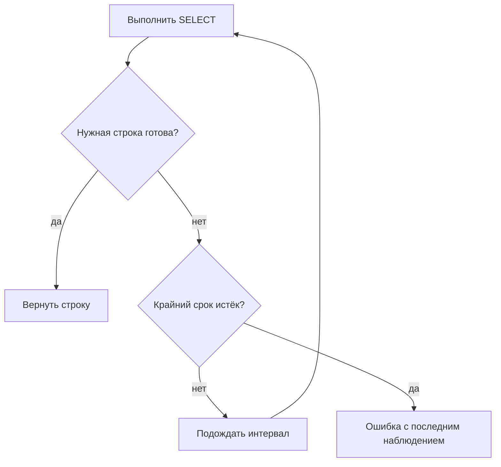

# Eventual consistency и polling

## Связь с предыдущей главой

Глава 212 объяснила видимость данных в транзакции. После завершения внешнего процесса нужная строка может появиться позже, чем API-ответ, поэтому однократный `SELECT` способен увидеть промежуточное состояние.

## Цель главы

Проверять eventual consistency через ограниченный polling с явным условием, интервалом проверки, крайним сроком и полезной диагностикой тайм-аута.

## Главный вопрос

> Как проверять данные, которые появляются асинхронно, без произвольных пауз?

## Мотивация

Фиксированная пауза не адаптируется к реальному моменту готовности: она может оказаться слишком короткой или избыточной. Она не завершает ожидание раньше и плохо объясняет, какое состояние наблюдалось последним.

## Теория

### Polling ждёт условие, а не время

Polling повторяет конкретное чтение до выполнения условия или крайнего срока.

Это тот же принцип, что и в браузерных ожиданиях из главы 172, только условие проверяется запросом к базе. Разница с паузой принципиальна: `setTimeout` на две секунды синхронизирует тест с часами, а polling — с состоянием системы.



Первое чтение выполняется сразу, без начальной паузы. Это мелочь, которая заметно экономит время набора: если данные уже на месте — а так бывает чаще всего, — тест не платит за ожидание ни миллисекунды.

### Условие должно быть содержательным

Условие `isReady` проверяет нужную строку и бизнес-поля, а не просто ненулевое количество строк.

Разница на примере. «В таблице есть хотя бы одна строка» выполнится от чужой записи или от строки, созданной в промежуточном статусе. «Строка с известным идентификатором имеет статус `DONE`» — утверждение о том, чего тест действительно ждёт.

Слабое условие даёт худший вид нестабильности: тест иногда проходит слишком рано, подхватывая промежуточное состояние, и падает потом — на проверке, которая к причине отношения не имеет.

### Крайний срок и интервал отвечают за разное

Крайний срок ограничивает ожидание, интервал ограничивает нагрузку.

Каждая итерация выполняет `SELECT`, проверяет результат и при невыполненном условии ждёт не дольше меньшего из интервала и оставшегося времени. Последнее важно: пауза не должна выходить за крайний срок, иначе ожидание превысит заявленную границу.

| Параметр | Слишком мало | Слишком много |
| --- | --- | --- |
| интервал | лишняя нагрузка на базу | позднее обнаружение готовности |
| крайний срок | нестабильные падения | медленная диагностика |

Крайний срок и интервал должны быть положительными — это стоит проверять явно, потому что нулевой интервал превращает ожидание в непрерывный поток запросов.

Крайний срок должен учитывать ожидаемую систему, но не превращаться в общий тайм-аут всего теста: как и в главе 203, внутренняя граница должна быть меньше внешней, иначе первым сработает раннер и диагностики не будет.

### Последнее наблюдение — главная часть диагностики

Последнее наблюдаемое значение включается в ошибку таймаута. Это помогает отличить ожидаемую задержку сохранения от ошибки подключения или неправильного идентификатора.

Сравните два сообщения:

```text
Таймаут ожидания 5000 мс
Таймаут ожидания 5000 мс; последнее наблюдение: строка найдена, status = "PENDING"
```

Первое не говорит ничего. Второе сразу отвечает: строка появилась, идентификатор верный, обработка не завершилась — искать нужно в обработчике, а не в тесте.

А если последнее наблюдение — «строк не найдено», подозрение падает на идентификатор или на то, что запись вообще не создавалась.

### Инфраструктурная ошибка не равна «ещё не готово»

Ошибку подключения не следует молча превращать в «данные ещё не появились».

Ошибка `read()` распространяется немедленно: polling не скрывает сбой инфраструктуры. Цикл, который ловит любое исключение и повторяет попытку, при недоступной базе будет честно опрашивать её до самого крайнего срока, а потом сообщит о таймауте — и настоящая причина потеряется.

Правило: неготовность данных — это успешный запрос с невыполненным условием. Всё остальное — ошибка, которую нужно показать сразу.

### Что крайний срок не отменяет

Крайний срок ограничивает новые попытки, но сам по себе не отменяет уже выполняющийся SQL-запрос.

Если запрос повис, цикл не прервёт его: он дождётся завершения, обнаружит истёкший срок и вернёт ошибку. Ограничение времени самого запроса — отдельная настройка на уровне подключения, и путать её с крайним сроком опроса не стоит.

Отсюда же практическое требование к фоновым процессам в тестах: если сценарий сам создаёт данные с задержкой, его таймер и Promise должны гарантированно завершаться до очистки — иначе фоновая запись появится уже после удаления данных.

### Когда polling не нужен

Polling оправдан только для процесса с реальной eventual consistency. Немедленную операцию не следует маскировать повторными запросами.

Признак неоправданного ожидания: условие выполняется с первой попытки всегда. Такое ожидание ничего не даёт, но создаёт иллюзию, что в системе есть асинхронность, и провоцирует добавлять его везде.

Обратный признак — ожидание, добавленное «чтобы тест перестал мигать», без понимания, чего именно оно ждёт. Оно прячет настоящую причину нестабильности до первого изменения нагрузки.

## Внутренний механизм

Каждая итерация выполняет `SELECT`, проверяет результат и при невыполненном условии ждёт не дольше меньшего из интервала и оставшегося времени. Крайний срок ограничивает весь цикл. Ошибку подключения не следует молча превращать в «данные ещё не появились».

Крайний срок и интервал должны быть положительными. Ошибка `read()` распространяется немедленно: polling не скрывает сбой инфраструктуры. Крайний срок ограничивает новые попытки, но сам по себе не отменяет уже выполняющийся SQL-запрос.


## Главная ментальная модель

Polling ждёт условие, а не время. Крайний срок ограничивает ожидание, интервал ограничивает нагрузку.

## Практический пример

```text
examples/03-automation-qa/chapter-213/01-bounded-polling.postgresql.ts
```

Пример проверяет немедленный успех, таймаут с диагностикой, недопустимый интервал и ошибку чтения. Затем управляемый фоновый процесс создаёт строку с задержкой. Его `Promise` и таймер гарантированно завершаются до очистки базы данных.

## Automation QA

Polling оправдан только для процесса с реальной eventual consistency. Немедленную операцию не следует маскировать повторными запросами.

## Компромиссы

Малый интервал повышает нагрузку, большой замедляет обнаружение. Крайний срок должен учитывать ожидаемую систему, но не превращаться в общий тайм-аут всего теста.

## Распространённые мифы

**Миф: polling — это цикл с паузой.**
Пауза синхронизирует с часами, polling — с состоянием системы. Первое чтение идёт сразу, без задержки.

**Миф: достаточно дождаться появления строки.**
Слабое условие подхватывает промежуточное состояние. Проверять нужно нужную строку и её бизнес-поля.

**Миф: ошибку подключения можно считать «данные ещё не готовы».**
Тогда недоступная база превратится в таймаут, а причина потеряется. Инфраструктурная ошибка показывается сразу.

**Миф: крайний срок прервёт зависший запрос.**
Он ограничивает новые попытки. Время самого запроса ограничивается отдельно.

**Миф: ожидание «на всякий случай» безвредно.**
Оно маскирует причину нестабильности и замедляет набор, ничего не проверяя.

## Частые вопросы

**Что писать в условии ожидания?**
Тот факт, ради которого тест ждёт: известный идентификатор плюс ожидаемое бизнес-значение.

**Зачем включать последнее наблюдение в ошибку?**
Оно отличает «строка есть, статус не тот» от «строки нет вовсе» — это разные расследования.

**Как выбрать интервал?**
По ожидаемой скорости процесса: достаточно частым для быстрого обнаружения и достаточно редким, чтобы не нагружать базу.

**Что должно быть больше — крайний срок опроса или таймаут теста?**
Таймаут теста. Иначе первым сработает раннер и диагностики не будет.

**Как быть с фоновым процессом в самом тесте?**
Гарантированно завершать его таймер и Promise до очистки, иначе запись появится после удаления данных.

## Проверьте себя

1. Чем polling отличается от паузы и почему первое чтение идёт без задержки?
2. Почему условие «есть хотя бы одна строка» опасно?
3. Как отличить неготовность данных от сбоя инфраструктуры?
4. Что даёт последнее наблюдение в сообщении о таймауте?
5. Что крайний срок опроса не ограничивает?

## Распространённые ошибки

- Использовать произвольную паузу.
- Считать любую ошибку базы данных временным отсутствием строки.
- Проверять только количество строк.
- Оставлять таймер фонового процесса или подключение открытыми.

## Краткие итоги

- Eventual consistency требует ожидания по явному условию.
- Polling имеет положительный интервал и крайний срок.
- Ошибка должна содержать последнее наблюдаемое состояние.
- Произвольная пауза не доказывает готовность данных.

## Практика

Практика встроена из соответствующего файла главы.

## Переход к следующей главе

Полученную строку часто нужно сравнить с REST- или gRPC-моделью. Глава 214 введёт явное сопоставление и нормализацию.
