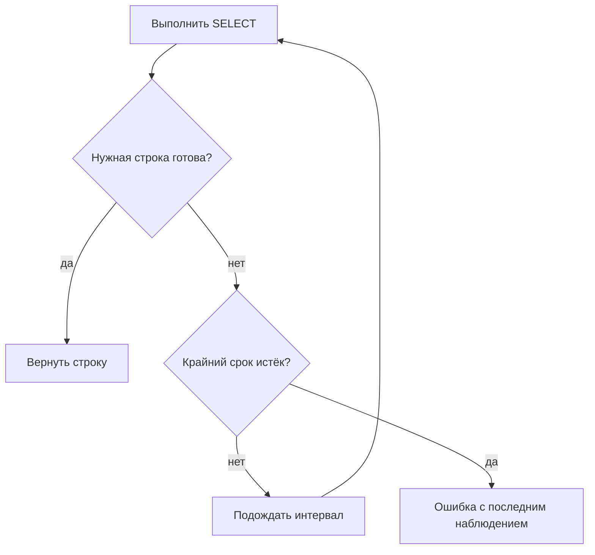

# Eventual consistency и polling

## Связь с предыдущей главой

Глава 212 объяснила видимость данных в транзакции. После завершения внешнего процесса нужная строка может появиться позже, чем API-ответ, поэтому однократный `SELECT` способен увидеть промежуточное состояние.

## Цель главы

Проверять eventual consistency через ограниченный polling с явным условием, интервалом проверки, крайним сроком и полезной диагностикой тайм-аута.

## Главный вопрос

> Как проверять данные, которые появляются асинхронно, без произвольных пауз?

## Мотивация

Фиксированная пауза не адаптируется к реальному моменту готовности: она может оказаться слишком короткой или избыточной. Она не завершает ожидание раньше и плохо объясняет, какое состояние наблюдалось последним.

## Теория

Polling повторяет конкретное чтение до выполнения условия или крайнего срока. Интервал ограничивает частоту запросов. Условие `isReady` проверяет нужную строку и бизнес-поля, а не просто ненулевое количество строк. Первое чтение выполняется сразу, без начальной паузы.

Последнее наблюдаемое значение включается в ошибку таймаута. Это помогает отличить ожидаемую задержку сохранения от ошибки подключения или неправильного идентификатора.

## Внутренний механизм

Каждая итерация выполняет `SELECT`, проверяет результат и при невыполненном условии ждёт не дольше меньшего из интервала и оставшегося времени. Крайний срок ограничивает весь цикл. Ошибку подключения не следует молча превращать в «данные ещё не появились».

Крайний срок и интервал должны быть положительными. Ошибка `read()` распространяется немедленно: polling не скрывает сбой инфраструктуры. Крайний срок ограничивает новые попытки, но сам по себе не отменяет уже выполняющийся SQL-запрос.



## Главная ментальная модель

Polling ждёт условие, а не время. Крайний срок ограничивает ожидание, интервал ограничивает нагрузку.

## Практический пример

```text
examples/03-automation-qa/chapter-213/01-bounded-polling.postgresql.ts
```

Пример проверяет немедленный успех, таймаут с диагностикой, недопустимый интервал и ошибку чтения. Затем управляемый фоновый процесс создаёт строку с задержкой. Его `Promise` и таймер гарантированно завершаются до очистки базы данных.

## Automation QA

Polling оправдан только для процесса с реальной eventual consistency. Немедленную операцию не следует маскировать повторными запросами.

## Компромиссы

Малый интервал повышает нагрузку, большой замедляет обнаружение. Крайний срок должен учитывать ожидаемую систему, но не превращаться в общий тайм-аут всего теста.

## Распространённые ошибки

- Использовать произвольную паузу.
- Считать любую ошибку базы данных временным отсутствием строки.
- Проверять только количество строк.
- Оставлять таймер фонового процесса или подключение открытыми.

## Краткие итоги

- Eventual consistency требует ожидания по явному условию.
- Polling имеет положительный интервал и крайний срок.
- Ошибка должна содержать последнее наблюдаемое состояние.
- Произвольная пауза не доказывает готовность данных.

## Практика

Практика встроена из соответствующего файла главы.

## Переход к следующей главе

Полученную строку часто нужно сравнить с REST- или gRPC-моделью. Глава 214 введёт явное сопоставление и нормализацию.
