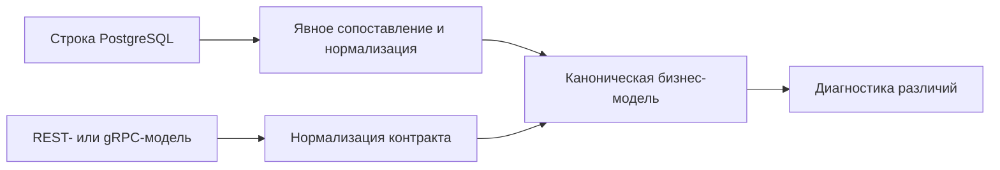

# Сверка данных PostgreSQL с API и gRPC

## Связь с предыдущей главой

Глава 213 научила надёжно дождаться нужного состояния базы данных. Транспортный контракт и хранилище используют разные формы данных, поэтому прямое `toEqual()` без нормализации создаёт ложные различия.

## Цель главы

Сопоставлять строку базы данных с API- или gRPC-моделью через устойчивый идентификатор, явное сопоставление типов и диагностику различий бизнес-полей.

## Главный вопрос

> Как корректно сравнить строку базы данных с моделью API или gRPC?

## Мотивация

PostgreSQL может вернуть `numeric` как строку, `timestamptz` как `Date`, `NULL` как `null` и имена полей в `snake_case`. Транспортная модель может использовать `number`, ISO-строку и `camelCase`. Сравнивать нужно нормализованные значения.

## Теория

### Почему нельзя сравнивать сырые объекты

Строка из PostgreSQL и модель, пришедшая по REST или gRPC, описывают один бизнес-факт, но выглядят по-разному: имена в `snake_case` против `camelCase`, числа строками, время в разных представлениях.

Поэтому сравнение идёт не напрямую, а через общую линейку — каноническую бизнес-модель:



Обе стороны приводятся к одной форме, и только потом сравниваются. Попытка сравнить сырые объекты даёт расхождения там, где их нет, и скрывает настоящие.

### Что именно нормализуется

Явное сопоставление переводит представление базы данных в общую модель сравнения. Четыре типичных преобразования:

| Источник расхождения | Правило нормализации |
| --- | --- |
| `numeric`, `bigint` | преобразуются только после проверки допустимого диапазона и точности |
| время | нормализуется в UTC |
| `null` | не заменяется отсутствующим свойством без договорённости контракта |
| статусы и enum | требуют явного правила сопоставления |

Первая строка — не перестраховка. Драйвер отдаёт `numeric` строкой именно потому, что не всякое его значение представимо числом JavaScript без потери точности, а `bigint` может выйти за безопасный диапазон. Преобразование без проверки диапазона превращает точное значение в приблизительное — и расхождение всплывёт позже, на сравнении сумм.

Третья строка про несимметричность: в базе `NULL` — это значение, в JSON поля может не быть вовсе. Считать их одинаковыми можно только если так сказано в контракте.

### Идентификатор связывает слои

Устойчивый идентификатор связывает одну бизнес-сущность между слоями. Это то же правило, что в главе 196: единственная надёжная связь — явный ID, а не совпадение названия или «последняя созданная запись».

При межслойном сравнении оно строже: если идентификатор выбран неверно, тест сравнит две **разные** сущности и сообщит о расхождении данных там, где расходятся объекты.

### Что сравнивать, а что нет

Проверки выбирают бизнес-поля; колонки, нужные только для хранения, не включаются автоматически.

Межслойная проверка не должна копировать всю схему и превращать любое внутреннее изменение в нарушение контракта. Добавление служебной колонки — обычное дело; тест, сравнивающий всё подряд, воспримет это как дефект.

Разумный отбор:

- поля, которые видит пользователь или потребитель API;
- значения, на которых держится проверяемое бизнес-правило;
- идентификаторы связей, если сценарий их проверяет.

Вне отбора остаются колонки аудита, внутренние счётчики версий, технические метки времени и всё, что существует ради хранения.

### Обе стороны проверяются во время выполнения

Строка базы данных и транспортная модель независимо проверяются во время выполнения и преобразуются в каноническую форму.

Здесь действует то же ограничение, что в главах 195 и 210: тип не проверяет данные. `row.estimated_hours` объявленного типа `number` может оказаться строкой, а поле ответа API — отсутствовать. Небезопасное приведение короче, однако скрывает представление во время выполнения и ошибки точности — и именно в межслойном сравнении это дороже всего, потому что расхождение выглядит как дефект системы, а не как дефект теста.

### Асинхронность перед сравнением

Если данные появляются асинхронно, перед сравнением применяется ограниченный polling из главы 213.

Без него межслойный тест получает характерную нестабильность: API уже ответил, а запись в базе ещё не появилась. Тест сообщит, что «слой данных потерял запись», хотя речь о нескольких сотнях миллисекунд обработки.

Условие ожидания при этом формулируется на стороне, которая отстаёт, и по устойчивому идентификатору — а не «пока количество строк не изменится».

### Что даёт хорошая диагностика различий

При расхождении тест сообщает ожидаемое и фактическое представление — обе канонические формы, а не сырые объекты.

Это существенно для расследования: увидев, что в базе `estimatedHours: 2.5`, а в ответе API `2.50`, инженер сразу понимает, что расходятся не данные, а нормализация. Сравнение сырых структур на том же месте показало бы гору несовпадающих ключей, среди которых настоящую причину пришлось бы искать вручную.

Каноническая модель уменьшает шум сравнения, но добавляет код преобразования — это её честная цена. Межслойная проверка оправданна, когда сценарий действительно проверяет сохранение данных, а не как способ «на всякий случай» подтвердить то, что уже проверено на своём слое.

## Внутренний механизм

Строка базы данных и транспортная модель независимо проверяются во время выполнения и преобразуются в каноническую форму. Затем тест сравнивает поля и при расхождении сообщает ожидаемое и фактическое представление. Если данные появляются асинхронно, перед сравнением применяется ограниченный polling из главы 213.


## Главная ментальная модель

Слои сравниваются не сырыми объектами, а через общую линейку — каноническую бизнес-модель.

## Практический пример

```text
examples/03-automation-qa/chapter-214/01-database-transport-mapping.postgresql.ts
```

Репозиторий преобразует `numeric` в `number`, `timestamptz` в ISO-строку UTC и имена базы данных в имена приложения. Тест сравнивает устойчивые бизнес-поля.

## Automation QA

Межслойная проверка оправданна, когда сценарий действительно проверяет сохранение данных. Она не должна копировать всю схему и превращать любое внутреннее изменение в нарушение контракта.

## Компромиссы

Каноническая модель уменьшает шум сравнения, но добавляет код преобразования. Небезопасное приведение короче, однако скрывает представление во время выполнения и ошибки точности.

## Распространённые мифы

**Миф: объекты из базы и из API можно сравнить напрямую.**
У них разные имена, типы и представление времени. Сравнение идёт через каноническую модель.

**Миф: `numeric` достаточно привести через `Number()`.**
Без проверки диапазона и точности это теряет значение. Драйвер отдаёт его строкой не случайно.

**Миф: `NULL` в базе и отсутствующее поле в JSON — одно и то же.**
Только если так сказано в контракте. По умолчанию это разные факты.

**Миф: чем больше полей сравнивается, тем надёжнее проверка.**
Сравнение всей схемы превращает добавление служебной колонки в «нарушение контракта».

**Миф: расхождение между слоями всегда означает дефект системы.**
Чаще это разная нормализация — `2.5` против `"2.50"`. Диагностика должна показывать канонические формы.

## Частые вопросы

**Как связать сущность между слоями?**
Устойчивым идентификатором. Совпадение названия или «последняя запись» связывают разные объекты.

**Какие поля включать в сравнение?**
Те, что видны потребителю и участвуют в проверяемом правиле. Колонки аудита и версий — нет.

**Что делать, если запись появляется с задержкой?**
Применить ограниченный polling к отстающей стороне до сравнения.

**Почему приведение типом опаснее здесь, чем в обычном тесте?**
Ошибка представления выглядит как расхождение слоёв, то есть как дефект системы, а не теста.

**Нужно ли сравнивать слои в каждом тесте?**
Нет. Только там, где сохранение данных и есть предмет проверки.

## Проверьте себя

1. Почему сравнение сырых объектов даёт ложные расхождения?
2. Какие четыре вида значений требуют явной нормализации?
3. Почему `numeric` нельзя преобразовывать без проверки диапазона?
4. Что связывает одну сущность между слоями?
5. Какие колонки не включаются в сравнение автоматически?

## Распространённые ошибки

- Сравнивать строку `numeric` с `number` через нестрогое равенство.
- Игнорировать часовой пояс.
- Путать `null` и отсутствующее свойство.
- Сравнивать случайные временные метки без нормализации.

## Краткие итоги

- Типы базы данных и транспорта требуют явного преобразования.
- Стабильный идентификатор связывает одну сущность.
- Сравниваются бизнес-поля.
- Тип TypeScript не проверяет строку базы данных во время выполнения.

## Практика

Практика встроена из соответствующего файла главы.

## Переход к следующей главе

Даже правильное сопоставление не спасает от двух тестов, меняющих одну строку. Глава 215 завершит модуль моделью владения данными и уникальными пространствами имён.
