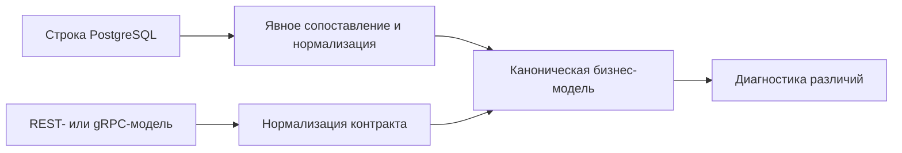

# Сверка данных PostgreSQL с API и gRPC

## Связь с предыдущей главой

Глава 213 научила надёжно дождаться нужного состояния базы данных. Транспортный контракт и хранилище используют разные формы данных, поэтому прямое `toEqual()` без нормализации создаёт ложные различия.

## Цель главы

Сопоставлять строку базы данных с API- или gRPC-моделью через устойчивый идентификатор, явное сопоставление типов и диагностику различий бизнес-полей.

## Главный вопрос

> Как корректно сравнить строку базы данных с моделью API или gRPC?

## Мотивация

PostgreSQL может вернуть `numeric` как строку, `timestamptz` как `Date`, `NULL` как `null` и имена полей в `snake_case`. Транспортная модель может использовать `number`, ISO-строку и `camelCase`. Сравнивать нужно нормализованные значения.

## Теория

Явное сопоставление переводит представление базы данных в общую модель сравнения. `numeric` и `bigint` преобразуются только после проверки допустимого диапазона и точности. Время нормализуется в UTC. `null` не заменяется отсутствующим свойством без договорённости контракта.

Устойчивый идентификатор связывает одну бизнес-сущность между слоями. Проверки выбирают бизнес-поля; колонки, нужные только для хранения, не включаются автоматически. Статусы и enum-значения также требуют явного правила сопоставления.

## Внутренний механизм

Строка базы данных и транспортная модель независимо проверяются во время выполнения и преобразуются в каноническую форму. Затем тест сравнивает поля и при расхождении сообщает ожидаемое и фактическое представление. Если данные появляются асинхронно, перед сравнением применяется ограниченный polling из главы 213.



## Главная ментальная модель

Слои сравниваются не сырыми объектами, а через общую линейку — каноническую бизнес-модель.

## Практический пример

```text
examples/03-automation-qa/chapter-214/01-database-transport-mapping.postgresql.ts
```

Репозиторий преобразует `numeric` в `number`, `timestamptz` в ISO-строку UTC и имена базы данных в имена приложения. Тест сравнивает устойчивые бизнес-поля.

## Automation QA

Межслойная проверка оправданна, когда сценарий действительно проверяет сохранение данных. Она не должна копировать всю схему и превращать любое внутреннее изменение в нарушение контракта.

## Компромиссы

Каноническая модель уменьшает шум сравнения, но добавляет код преобразования. Небезопасное приведение короче, однако скрывает представление во время выполнения и ошибки точности.

## Распространённые ошибки

- Сравнивать строку `numeric` с `number` через нестрогое равенство.
- Игнорировать часовой пояс.
- Путать `null` и отсутствующее свойство.
- Сравнивать случайные временные метки без нормализации.

## Краткие итоги

- Типы базы данных и транспорта требуют явного преобразования.
- Стабильный идентификатор связывает одну сущность.
- Сравниваются бизнес-поля.
- Тип TypeScript не проверяет строку базы данных во время выполнения.

## Практика

Практика встроена из соответствующего файла главы.

## Переход к следующей главе

Даже правильное сопоставление не спасает от двух тестов, меняющих одну строку. Глава 215 завершит модуль моделью владения данными и уникальными пространствами имён.
