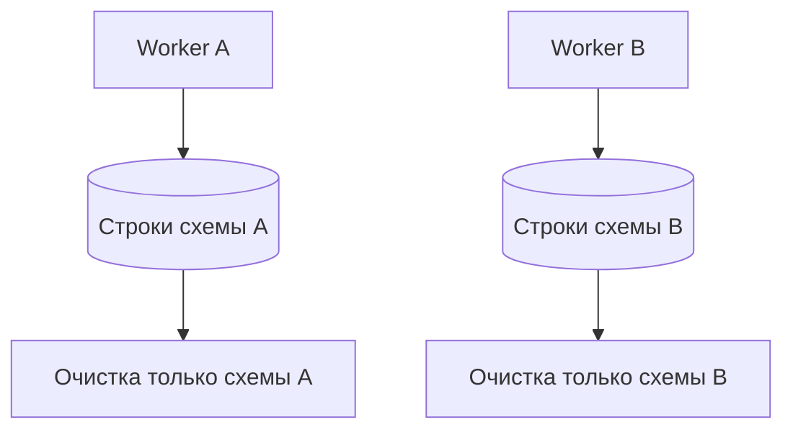

# Конфликты данных и параллельные тесты

## Связь с предыдущей главой

Глава 214 связала бизнес-сущность между PostgreSQL и транспортными слоями. Если два сценария используют один идентификатор, их корректные операции становятся взаимными помехами ещё при последовательных повторных запусках.

## Цель главы

Предотвращать конфликты общих строк через уникальное пространство имён, идентификатор worker, явное владение данными и очистку, устойчивую к конкурентным сценариям.

## Главный вопрос

> Почему общие строки базы данных создают нестабильность ещё до параллельного выполнения?

## Мотивация

Повторный запуск может встретить оставшуюся строку от упавшего теста. При параллельном выполнении два worker одновременно создают, обновляют или удаляют одну запись. Повтор только меняет порядок конфликта.

## Теория

### Подписанная область данных

Уникальное пространство имён включает признак сценария или worker в безопасный для бизнеса идентификатор.

«Безопасный для бизнеса» означает, что признак не ломает смысл данных: суффикс в названии задачи допустим, а подмена статуса или суммы ради уникальности — нет. Идентификатор должен оставаться и уникальным, и правдоподобным для системы.



Владение запрещает одному тесту очищать данные другого. Очистка использует точные ключи и не опирается на «последнюю созданную строку»: при параллельном запуске последней окажется чужая.

### Два уровня разделения

Общая схема может быть безопасной только при независимых пространствах имён и ограничениях целостности.

В примерах модуля применяется более сильный вариант: каждый тест дополнительно получает **уникальную схему**, а строки внутри неё имеют явные идентификаторы.

| Уровень | Что разделяет | Когда достаточно |
| --- | --- | --- |
| уникальные идентификаторы в общей схеме | строки | простые случаи, есть ограничения целостности |
| отдельная схема на тест | таблицы целиком | параллельный запуск, DDL, полная независимость |

Схема на тест дороже в подготовке, но снимает целый класс вопросов: чужие строки физически не попадают в выборку, а очистка сводится к удалению схемы.

### Конфликт данных — не повод для повтора

Ограничения уникальности превращают коллизию в детерминированный конфликт данных, например SQLSTATE `23505`.

Это полезное свойство, а не помеха: без ограничения два теста молча испортили бы данные друг друга, и расследование началось бы с загадочного падения третьего теста.

Конфликт нужно отличать от сбоя инфраструктуры: тест должен исправить владение данными, а не добавлять повтор. Retry на `23505` маскирует дефект изоляции и делает набор медленнее — при следующем запуске конфликт повторится.

Соответственно, `23505` в отчёте читается как сообщение: «два сценария претендуют на один идентификатор», и чинится в подготовке данных.

### Изоляция данных и изоляция транзакций — разное

Изоляция пространств имён разделяет наборы данных, а транзакционная изоляция управляет их конкурентной видимостью; эти механизмы не заменяют друг друга.

Формулировка важна, потому что путаница здесь встречается постоянно. Уровень изоляции транзакции не сделает данные двух тестов независимыми: он лишь определит, увидит ли один незавершённые изменения другого. А уникальные пространства имён не решают вопрос видимости внутри одной транзакции.

Для параллельного запуска нужен первый механизм. Второй относится к поведению самой системы и проверяется отдельно.

### Предсказуемость выборки

`ORDER BY` делает проверку нескольких пространств имён предсказуемой.

При параллельном запуске в таблице оказываются строки разных тестов, и порядок без сортировки перестаёт быть стабильным сильнее, чем обычно: он зависит от того, в каком порядке параллельные сценарии успели вставить данные. Тест, сравнивающий `rows[0]`, начинает зависеть от расписания.

Это тот же пункт, что в главе 209, но при параллельном запуске он перестаёт быть теоретическим.

### Параллельность начинается с данных

Подготовка к параллельному выполнению начинается с данных, а не с `workers`.

Один worker может уменьшить конкуренцию во время одного запуска, но не решает проблему владения данными. Набор, который держится на единственном worker, сломается при первом же увеличении параллельности — и, что хуже, будет нестабильным и до этого: повторный запуск отдельного теста, падение предыдущего, оставшиеся данные дают те же конфликты последовательно.

Практическая проверка независимости — три запуска: отдельно, в изменённом порядке и после предыдущего падения. Сценарий должен проходить во всех трёх случаях.

### Цена изоляции

Уникальные пространства имён усложняют поиск тестовых данных, поэтому идентификатор должен оставаться пригодным для диагностики.

Компромисс тот же, что в главе 211: `order-3f2a1b` уникален и бесполезен при расследовании, `order-w3-оплата-3f2a` уникален и сообщает, кто его создал.

Общие fixtures дешевле, но требуют неизменяемости или строгого жизненного цикла. Как только общий объект становится изменяемым, тесты снова связываются между собой — и параллельный запуск возвращает все проблемы, ради решения которых вводилась изоляция.

## Внутренний механизм

Ограничения уникальности превращают коллизию в детерминированный конфликт данных, например SQLSTATE `23505`. Его нужно отличать от сбоя инфраструктуры: тест должен исправить владение данными, а не добавлять повтор. `ORDER BY` делает проверку нескольких пространств имён предсказуемой. Изоляция пространств имён разделяет наборы данных, а транзакционная изоляция управляет их конкурентной видимостью; эти механизмы не заменяют друг друга.


## Главная ментальная модель

Каждый worker получает собственную подписанную область данных и убирает только её.

## Практический пример

```text
examples/03-automation-qa/chapter-215/01-unique-test-namespace.postgresql.ts
```

Два сценария одновременно создают одинаковый логический идентификатор в разных уникальных схемах. Оба проходят без коллизии, а вспомогательная функция удаляет только схему соответствующего сценария. После очистки пример также подтверждает отсутствие обеих схем и чистоту новой схемы.

## Automation QA

Подготовка к параллельному выполнению начинается с данных, а не с `workers`. Один worker может уменьшить конкуренцию во время одного запуска, но не решает проблему владения данными. Сценарий должен проходить при изменении порядка и после предыдущего падения.

## Компромиссы

Уникальные пространства имён усложняют поиск тестовых данных, поэтому идентификатор должен оставаться пригодным для диагностики. Общие fixtures дешевле, но требуют неизменяемости или строгого жизненного цикла.

## Распространённые мифы

**Миф: уровень изоляции транзакций сделает тесты независимыми.**
Он управляет видимостью изменений. Разделение данных обеспечивают уникальные пространства имён.

**Миф: конфликт `23505` лечится повтором.**
Повтор маскирует дефект владения данными, и при следующем запуске конфликт вернётся.

**Миф: запуск в один worker решает проблему конкуренции.**
Он лишь откладывает её. Те же конфликты возникнут при повторном запуске и после падения.

**Миф: можно очищать «последнюю созданную строку».**
При параллельном запуске последней окажется чужая. Очистка идёт по точным ключам.

**Миф: уникальный идентификатор достаточно сделать случайным.**
Он должен ещё и сообщать, кто его создал, иначе расследование упирается в бессмысленную строку.

## Частые вопросы

**Что выбрать — уникальные идентификаторы или схему на тест?**
Идентификаторов достаточно в простых случаях. Схема на тест нужна при параллельном запуске, DDL и полной независимости.

**Как понять, что тест не готов к параллельному запуску?**
Он падает при изменении порядка, при одиночном повторе или после падения соседа.

**Почему ограничение уникальности — это хорошо?**
Оно превращает скрытую порчу данных в детерминированную ошибку с понятным кодом.

**Зачем `ORDER BY`, если тест создал всего две строки?**
При параллельном запуске в таблице окажутся и чужие строки, а порядок станет зависеть от расписания.

**Можно ли использовать общие fixtures?**
Да, если они неизменяемы или имеют строгий жизненный цикл. Изменяемый общий объект возвращает связанность тестов.

## Проверьте себя

1. Что означает «безопасный для бизнеса» уникальный идентификатор?
2. Чем изоляция пространств имён отличается от транзакционной изоляции?
3. Почему `23505` не лечится повтором?
4. Из каких трёх запусков состоит проверка готовности к параллельному выполнению?
5. Почему при параллельном запуске `ORDER BY` становится обязательным?

## Распространённые ошибки

- Использовать общую изменяемую запись пользователя или задачи.
- Удалять строки по широкому префиксу без учёта владельца.
- Пытаться исправить конфликт уникальности повтором.
- Полагаться на порядок запуска тестов.

## Краткие итоги

- Общие строки являются источником нестабильных тестов.
- Пространство имён и владение разделяют сценарии.
- Гонка при очистке предотвращается точными идентификаторами.
- Изоляция данных предшествует увеличению числа worker.

## Практика

Практика встроена из соответствующего файла главы.

## Переход к следующей главе

Модуль PostgreSQL завершён. Глава 216 начнёт отдельный раздел о конфигурации Playwright и execution projects; здесь важно лишь понимать, что готовность данных предшествует настройке параллельного запуска.
