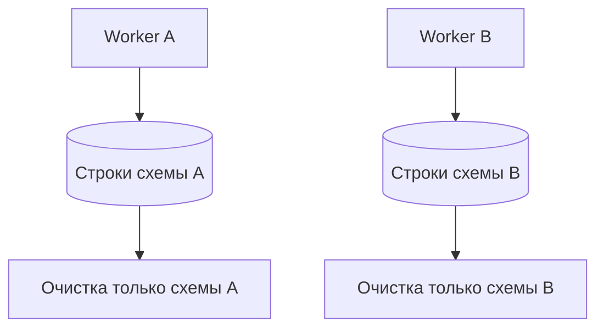

# Конфликты данных и параллельные тесты

## Связь с предыдущей главой

Глава 214 связала бизнес-сущность между PostgreSQL и транспортными слоями. Если два сценария используют один идентификатор, их корректные операции становятся взаимными помехами ещё при последовательных повторных запусках.

## Цель главы

Предотвращать конфликты общих строк через уникальное пространство имён, идентификатор worker, явное владение данными и очистку, устойчивую к конкурентным сценариям.

## Главный вопрос

> Почему общие строки базы данных создают нестабильность ещё до параллельного выполнения?

## Мотивация

Повторный запуск может встретить оставшуюся строку от упавшего теста. При параллельном выполнении два worker одновременно создают, обновляют или удаляют одну запись. Повтор только меняет порядок конфликта.

## Теория

Уникальное пространство имён включает признак сценария или worker в безопасный для бизнеса идентификатор. Владение запрещает одному тесту очищать данные другого. Очистка использует точные ключи и не опирается на «последнюю созданную строку».

Общая схема может быть безопасной только при независимых пространствах имён и ограничениях целостности. В примерах модуля каждый тест дополнительно получает уникальную схему, а строки внутри неё имеют явные идентификаторы.

## Внутренний механизм

Ограничения уникальности превращают коллизию в детерминированный конфликт данных, например SQLSTATE `23505`. Его нужно отличать от сбоя инфраструктуры: тест должен исправить владение данными, а не добавлять повтор. `ORDER BY` делает проверку нескольких пространств имён предсказуемой. Изоляция пространств имён разделяет наборы данных, а транзакционная изоляция управляет их конкурентной видимостью; эти механизмы не заменяют друг друга.



## Главная ментальная модель

Каждый worker получает собственную подписанную область данных и убирает только её.

## Практический пример

```text
examples/03-automation-qa/chapter-215/01-unique-test-namespace.postgresql.ts
```

Два сценария одновременно создают одинаковый логический идентификатор в разных уникальных схемах. Оба проходят без коллизии, а вспомогательная функция удаляет только схему соответствующего сценария. После очистки пример также подтверждает отсутствие обеих схем и чистоту новой схемы.

## Automation QA

Подготовка к параллельному выполнению начинается с данных, а не с `workers`. Один worker может уменьшить конкуренцию во время одного запуска, но не решает проблему владения данными. Сценарий должен проходить при изменении порядка и после предыдущего падения.

## Компромиссы

Уникальные пространства имён усложняют поиск тестовых данных, поэтому идентификатор должен оставаться пригодным для диагностики. Общие fixtures дешевле, но требуют неизменяемости или строгого жизненного цикла.

## Распространённые ошибки

- Использовать общую изменяемую запись пользователя или задачи.
- Удалять строки по широкому префиксу без учёта владельца.
- Пытаться исправить конфликт уникальности повтором.
- Полагаться на порядок запуска тестов.

## Краткие итоги

- Общие строки являются источником нестабильных тестов.
- Пространство имён и владение разделяют сценарии.
- Гонка при очистке предотвращается точными идентификаторами.
- Изоляция данных предшествует увеличению числа worker.

## Практика

Практика встроена из соответствующего файла главы.

## Переход к следующей главе

Модуль PostgreSQL завершён. Глава 216 начнёт отдельный раздел о конфигурации Playwright и execution projects; здесь важно лишь понимать, что готовность данных предшествует настройке параллельного запуска.
