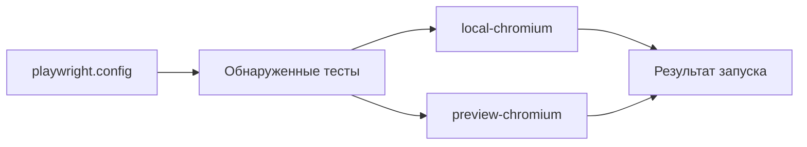

# Конфигурация Playwright и execution projects

## Связь с предыдущей главой

Глава 215 подготовила тестовые данные к независимому выполнению. Теперь нужно определить, какие тесты запускаются, с какими настройками и в каком профиле выполнения.

## Цель главы

Связать `playwright.config`, проекты Playwright, параметры `use`, `baseURL`, reporter и режим запуска в одну предсказуемую модель.

## Главный вопрос

> Как связать настройки Playwright Test с браузерами, окружениями и режимами запуска?

## Мотивация

Одна команда может случайно запустить не тот набор файлов или направить тесты в неверное окружение. Разрозненные флаги скрывают фактическую конфигурацию запуска и затрудняют воспроизведение падения.

## Теория

### Конфигурация выбирает тесты, проект создаёт вариант запуска

`defineConfig()` описывает границу обнаружения тестов и общие настройки запуска. `testDir`, `testMatch` и `testIgnore` определяют кандидатов.

`projects` создаёт именованные варианты конфигурации; один найденный тест выполняется один раз для каждого выбранного проекта.



Playwright сначала читает конфигурацию, затем обнаруживает тесты и создаёт отдельное выполнение для каждого выбранного проекта.

### Умножение выполнений видно сразу

Два теста в двух проектах дают четыре выполнения — это видно уже в списке, до запуска:

```text
  [local-chromium] › demo.spec.ts:6:1 › первый
  [local-chromium] › demo.spec.ts:7:1 › второй
  [preview-chromium] › demo.spec.ts:6:1 › первый
  [preview-chromium] › demo.spec.ts:7:1 › второй
Total: 4 tests in 1 file
```

Файл при этом один и обнаружен один раз. Десять логических тестов в двух проектах дают двадцать выполнений: это ожидаемое умножение, а не повторное обнаружение файлов.

Отсюда практическое следствие для времени запуска: добавление проекта удваивает не только покрытие, но и длительность прогона и объём диагностики при разборе падений.

### Настройки проекта перекрывают общие

Проект может переопределить параметры `use`, например `browserName` и `baseURL`. Приоритет простой: что задано в проекте — выигрывает, чего нет — наследуется сверху.

Проверено на конфигурации с общим `baseURL: http://common.test`:

| Проект | `use.baseURL` в проекте | Что получает тест |
| --- | --- | --- |
| `local-chromium` | `http://local.test` | `http://local.test` |
| `preview-chromium` | не задан | `http://common.test` |

Тест может прочитать применённые настройки через `test.info().project` — там же доступны `name` и `metadata`. Это удобный способ убедиться, что профиль выбран верно, не делая ни одного сетевого запроса.

### Две оси, которые не стоит путать

Браузерная ось отвечает на вопрос «в каком браузере», а ось окружения — «против какого окружения».

Их можно совместить в одном имени — `preview-chromium` читается как «preview в chromium», — но это разные настройки с разными причинами изменения. Браузер меняется, когда расширяется матрица совместимости; окружение — когда появляется новый стенд. Смешав их в одном непрозрачном имени вроде `project-2`, вы теряете возможность понять, что именно проверяет запуск.

Имена проектов должны описывать назначение запуска: `local-chromium` понятнее, чем `project-1`.

### CLI выбирает, а не меняет конфигурацию

`--project` сужает набор проектов, а `--config` выбирает файл конфигурации. Эти параметры CLI меняют запуск, не изменяя исходную конфигурацию.

Два приёма, которые стоит знать:

- `--list` показывает обнаруженные тесты **до** выполнения — быстрый способ проверить, что `testMatch` находит то, что нужно;
- `--project=local-chromium` воспроизводит один профиль, когда в CI упал конкретный вариант.

Вместе они закрывают типичный вопрос «почему тест не запустился»: если его нет в `--list`, дело в границах обнаружения, а не в самом тесте.

### Чем проект не является

Три ограничения, о которых забывают.

**Reporter выбирает представление результата и не меняет смысл теста.** Смена reporter не делает набор надёжнее и не влияет на то, что проверяется.

**Профиль выполнения — это согласованный набор настроек и команда выбора, а не новый вид теста.** Один и тот же тест в двух проектах остаётся одним тестом.

**Проект Playwright не является worker и сам по себе не изолирует тестовые данные.** Два проекта, работающие против одного стенда, столкнутся ровно с теми же конфликтами данных, о которых шла речь в главе 215. Изоляцию дают уникальные пространства имён, а не разделение на проекты.

### Когда проектов достаточно одного

Много проектов расширяет покрытие, но умножает время выполнения и объём диагностики. Один проект проще, если различий между запусками нет.

Признак избыточности: проекты отличаются только именем, а их `use` совпадает. Такой набор удваивает время прогона, не проверяя ничего нового. Если варианты запуска не различаются, репозиторию может быть достаточно одного проекта.

## Внутренний механизм

Playwright сначала читает конфигурацию, затем обнаруживает тесты и создаёт отдельное выполнение для каждого выбранного проекта.


`--project` сужает набор проектов, а `--config` выбирает файл конфигурации. Эти параметры CLI меняют запуск, не изменяя исходную конфигурацию. Например, 10 логических тестов в двух проектах дают 20 выполнений: это ожидаемое умножение, а не повторное обнаружение файлов.

## Главная ментальная модель

Конфигурация выбирает тесты, проект Playwright создаёт вариант выполнения, а CLI выбирает нужную часть этой модели.

## Практический пример

```text
examples/03-automation-qa/chapter-216/01-execution-projects.execution.ts
```

Изолированная конфигурация создаёт два проекта с разными `baseURL` и `metadata`. Пример проверяет, что тест получает настройки выбранного проекта, не запрашивая browser fixture и не выполняя сетевой запрос.

## Automation QA

Имена проектов должны описывать назначение запуска: `local-chromium` понятнее, чем `project-1`. Команда `--list` позволяет проверить обнаружение тестов до выполнения, а `--project=local-chromium` — воспроизвести один профиль. Если варианты запуска не различаются, репозиторию может быть достаточно одного проекта.

## Компромиссы

Много проектов расширяет покрытие, но умножает время выполнения и объём диагностики. Один проект проще, если различий между запусками нет.

## Распространённые мифы

**Миф: несколько проектов заново обнаруживают файлы.**
Файлы обнаруживаются один раз. Проекты умножают выполнения найденных тестов.

**Миф: проект изолирует тестовые данные.**
Проект — это вариант настроек, а не worker. Изоляцию дают уникальные пространства имён.

**Миф: общий `use` всегда действует.**
Настройка проекта перекрывает общую. Наследуется только то, чего в проекте нет.

**Миф: смена reporter влияет на надёжность набора.**
Reporter меняет представление результата, а не то, что проверяется.

**Миф: больше проектов — лучше покрытие.**
Проекты с одинаковым `use` удваивают время прогона, не проверяя ничего нового.

## Частые вопросы

**Почему мой тест не запустился?**
Проверьте `--list`: если его там нет, дело в `testDir`, `testMatch` или `testIgnore`, а не в самом тесте.

**Как воспроизвести один упавший в CI профиль?**
`--project=<имя>` — он сузит запуск до одного варианта, не меняя конфигурацию.

**Как понять, какие настройки получил тест?**
Через `test.info().project`: там доступны имя, `use` и `metadata` применённого проекта.

**Как называть проекты?**
По назначению запуска: браузер и окружение — разные оси, и имя должно объяснять обе.

**Нужны ли проекты маленькому репозиторию?**
Нет, если варианты запуска не различаются. Одного проекта достаточно.

## Проверьте себя

1. Сколько выполнений дадут 10 тестов в двух проектах и почему файл обнаруживается один раз?
2. Что получит тест, если `baseURL` задан и сверху, и в проекте?
3. Чем браузерная ось отличается от оси окружения?
4. Что показывает `--list` и какой вопрос он закрывает?
5. Почему проект не заменяет изоляцию тестовых данных?

## Распространённые ошибки

- Считать два выполнения одного теста повторным обнаружением, хотя их создали два проекта.
- Смешивать браузер и окружение без явного имени.
- Ожидать, что `baseURL` сам запускает приложение.
- Использовать проект как средство произвольного упорядочивания тестов.

## Краткие итоги

- Конфигурация задаёт обнаружение тестов и общие настройки.
- Проект Playwright является именованным вариантом конфигурации.
- Один тест может выполняться в нескольких проектах.
- Reporter представляет результат, но не меняет поведение теста.

## Практика

Практика встроена из соответствующего файла главы.

## Переход к следующей главе

Конфигурация может выбрать профиль выполнения, но значения окружения и секреты приходят извне. Глава 217 определит безопасную границу этих данных.
