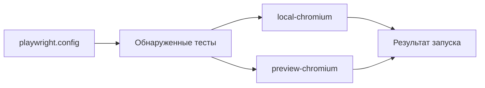

# Конфигурация Playwright и execution projects

## Связь с предыдущей главой

Глава 215 подготовила тестовые данные к независимому выполнению. Теперь нужно определить, какие тесты запускаются, с какими настройками и в каком профиле выполнения.

## Цель главы

Связать `playwright.config`, проекты Playwright, параметры `use`, `baseURL`, reporter и режим запуска в одну предсказуемую модель.

## Главный вопрос

> Как связать настройки Playwright Test с браузерами, окружениями и режимами запуска?

## Мотивация

Одна команда может случайно запустить не тот набор файлов или направить тесты в неверное окружение. Разрозненные флаги скрывают фактическую конфигурацию запуска и затрудняют воспроизведение падения.

## Теория

`defineConfig()` описывает границу обнаружения тестов и общие настройки запуска. `testDir`, `testMatch` и `testIgnore` определяют кандидатов. `projects` создаёт именованные варианты конфигурации; один найденный тест выполняется один раз для каждого выбранного проекта.

Проект может переопределить параметры `use`, например `browserName` и `baseURL`. Браузерная ось отвечает на вопрос «в каком браузере», а ось окружения — «против какого окружения». Их можно совместить в одном имени, но это разные настройки.

Reporter выбирает представление результата и не меняет смысл теста. Профиль выполнения — это согласованный набор настроек и команда выбора, а не новый вид теста. Проект Playwright не является worker и сам по себе не изолирует тестовые данные.

## Внутренний механизм

Playwright сначала читает конфигурацию, затем обнаруживает тесты и создаёт отдельное выполнение для каждого выбранного проекта.



`--project` сужает набор проектов, а `--config` выбирает файл конфигурации. Эти параметры CLI меняют запуск, не изменяя исходную конфигурацию. Например, 10 логических тестов в двух проектах дают 20 выполнений: это ожидаемое умножение, а не повторное обнаружение файлов.

## Главная ментальная модель

Конфигурация выбирает тесты, проект Playwright создаёт вариант выполнения, а CLI выбирает нужную часть этой модели.

## Практический пример

```text
examples/03-automation-qa/chapter-216/01-execution-projects.execution.ts
```

Изолированная конфигурация создаёт два проекта с разными `baseURL` и `metadata`. Пример проверяет, что тест получает настройки выбранного проекта, не запрашивая browser fixture и не выполняя сетевой запрос.

## Automation QA

Имена проектов должны описывать назначение запуска: `local-chromium` понятнее, чем `project-1`. Команда `--list` позволяет проверить обнаружение тестов до выполнения, а `--project=local-chromium` — воспроизвести один профиль. Если варианты запуска не различаются, репозиторию может быть достаточно одного проекта.

## Компромиссы

Много проектов расширяет покрытие, но умножает время выполнения и объём диагностики. Один проект проще, если различий между запусками нет.

## Распространённые ошибки

- Считать два выполнения одного теста повторным обнаружением, хотя их создали два проекта.
- Смешивать браузер и окружение без явного имени.
- Ожидать, что `baseURL` сам запускает приложение.
- Использовать проект как средство произвольного упорядочивания тестов.

## Краткие итоги

- Конфигурация задаёт обнаружение тестов и общие настройки.
- Проект Playwright является именованным вариантом конфигурации.
- Один тест может выполняться в нескольких проектах.
- Reporter представляет результат, но не меняет поведение теста.

## Практика

Практика встроена из соответствующего файла главы.

## Переход к следующей главе

Конфигурация может выбрать профиль выполнения, но значения окружения и секреты приходят извне. Глава 217 определит безопасную границу этих данных.
