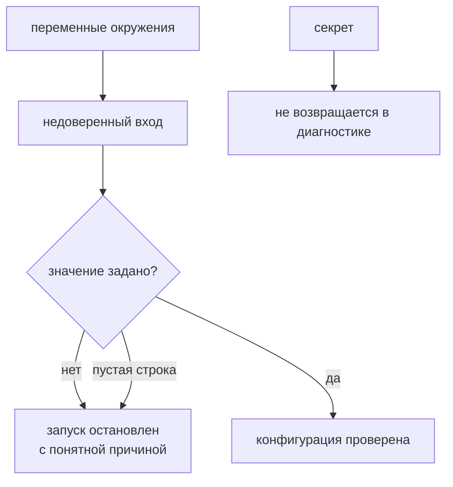

# Окружения, переменные и секреты

## Связь с предыдущей главой

Глава 216 связала тестовые файлы с именованными проектами Playwright. Теперь каждому запуску нужны внешние адреса, режимы и чувствительные значения.

## Цель главы

Разделить настройки окружения, секреты и исходный код, сохранив явные обязательные и необязательные значения и безопасную диагностику.

## Главный вопрос

> Как передавать различия окружений и чувствительные данные, не записывая их в код?

## Мотивация

Жёстко заданный адрес или token связывает тест с одной машиной и создаёт риск раскрытия учётных данных. Без явной проверки отсутствующая переменная может незаметно направить запуск в неверное окружение.

## Теория

### Переменные окружения — недоверенный вход

Переменные окружения являются входом процесса. Node.js предоставляет их через `process.env`, и они всегда приходят как `string | undefined`.

Это не условность типов, а фактическое поведение. Любое присвоенное значение приводится к строке:

```ts
process.env.PORT = 8080;        // читается как "8080"
process.env.FLAG = true;        // читается как "true"
process.env.NOTHING = undefined; // читается как "undefined" — строка!
process.env.NIL = null;          // читается как "null"
```

Третья строка — источник особенно неприятных дефектов. Переменная, которой «не присвоили значение», содержит непустую строку `"undefined"`, и проверка `if (process.env.TOKEN)` её пропустит. Дальше по коду в заголовок `Authorization` уйдёт слово `undefined`, а сервис ответит 401 — и причина будет выглядеть как проблема доступа.

Поэтому код обязан отличать обязательные значения от необязательных и не считать наличие строки доказательством её корректности.

### Заданное пустое и незаданное — разные вещи

Вторая ловушка того же рода: пустая строка ложна в условии, но переменная при этом **задана**.

```ts
process.env.BASE_URL = "";
Boolean(process.env.BASE_URL);   // false
"BASE_URL" in process.env;       // true
```

Сообщение «переменная BASE_URL не задана» в этой ситуации вводит в заблуждение: она задана, просто пуста. Различать эти случаи стоит явно — особенно когда значение приходит из CI, где пустая строка обычно означает незаполненный секрет.

Несуществующая переменная, в отличие от них, действительно даёт `undefined`, а не строку.

### Один контракт для всех окружений

Локальное окружение и CI могут передавать значения разными способами, но приложение должно получать один контракт.

Способы доставки различаются: локально — файл окружения или оболочка, в CI — секреты системы сборки, в контейнере — переменные образа. Код об этом знать не должен: он читает те же имена и проверяет те же правила.

В примере разрешены только `local` и `preview`. Ограниченный набор значений важнее, чем кажется: он превращает опечатку `previw` в понятный отказ вместо запуска против неизвестного адреса.

### Отсутствие значения останавливает запуск

Отсутствующее обязательное значение должно завершать запуск с понятной ошибкой; неявный переход на промышленную среду недопустим.

Формулировка жёсткая намеренно. Значение по умолчанию для адреса стенда выглядит удобным ровно до того дня, когда переменная не доедет до CI и набор тестов отработает против боевого окружения — с созданием и удалением данных.

Безопасное умолчание существует только для необязательных настроек, которые ничего не меняют вовне: уровень подробности логов, размер окна браузера.

### Секрет нельзя вернуть в диагностике

Конфигурация проекта описывает режим Playwright, а секрет предоставляет внешняя среда.

Секрет нельзя хранить в репозитории, включать в сообщение об ошибке или выводить целиком. Маскирование заменяет всё чувствительное значение безопасным маркером:

```ts
{ environment: "preview", baseUrl: "http://...", token: "[REDACTED]" }
```

Важна именно полная замена. Частичное маскирование вроде `abcd…wxyz` кажется компромиссом, но раскрывает длину и границы значения, а в отчёте, доступном шире, чем код, этого достаточно для лишних вопросов.

Журналы должны помогать определить окружение без раскрытия учётных данных: имя окружения и адрес стенда — да, токен — никогда.

### Разные владельцы у разных значений

Адрес тестового API, имя окружения и токен имеют разных владельцев.

| Значение | Кто им владеет | Как доставляется |
| --- | --- | --- |
| имя окружения | тот, кто запускает | параметр запуска |
| адрес стенда | команда инфраструктуры | конфигурация окружения |
| токен | система управления секретами | секрет CI |

Их нужно передать перед запуском, а не менять между тестами. Тест, меняющий `process.env` на ходу, создаёт общее изменяемое состояние процесса — со всеми последствиями для параллельного выполнения.

По той же причине тесты загрузчика передают обычный объект и не меняют глобальный `process.env`: снимок входных значений проверяется как обычный аргумент.

### Не выносить наружу лишнее

Большое число переменных окружения делает запуск гибким, но размывает контракт.

Каждая вынесенная настройка — это ещё одна вещь, которую нужно задать правильно в трёх местах, и ещё одна причина, по которой запуск в CI поведёт себя не так, как локально.

Выносить наружу следует только реальные различия окружений, оставляя стабильные значения в коде. Сроки ожидания, имена проектов и пути к данным обычно к различиям окружений не относятся.

Конфигурация проверяется на границе, до запуска:



## Внутренний механизм

Node.js предоставляет переменные через `process.env`. Загрузчик читает снимок входных значений, проверяет обязательные поля и формирует отдельное представление. Тесты загрузчика передают обычный объект и не меняют глобальный `process.env`.

### В окружении всё является строкой

```text
process.env.WORKERS = 4            → "4"
process.env.HEADLESS = false       → "false"   ← истинная строка!
process.env.TOKEN = undefined      → "undefined" ← тоже истинная строка
```

Присваивание приводит значение к строке, и две нижние строки проходят любую
проверку на истинность. Поэтому `if (process.env.TOKEN)` не отличает заданный
токен от явно сброшенного, а `Boolean(process.env.HEADLESS)` истинно всегда.

| Значение | Проверка на истинность | Что обычно имелось в виду |
| --- | --- | --- |
| `"false"` | истина | ложь |
| `"0"` | истина | ложь |
| `""` | ложь | переменная задана, но пуста |
| `"undefined"` | истина | переменная не задана |

Отсюда правило: значения окружения разбираются явно — сравнением со списком
допустимых строк, а не приведением к булеву типу.

### Почему загрузчик принимает объект, а не читает `process.env` сам

```ts
loadConfig({ BASE_URL: "http://127.0.0.1:4310", WORKERS: "2" });
```

`process.env` — глобальное изменяемое состояние рабочего процесса. Тест,
изменивший его, влияет на все последующие тесты процесса, и восстановить его
надёжно сложнее, чем кажется.

Загрузчик, принимающий обычный объект, проверяется без глобальных правок, а
чтение `process.env` остаётся ровно в одном месте — на границе процесса.

## Главная ментальная модель

Переменные окружения — недоверенный внешний запрос к конфигурации; секрет — часть запроса, которую нельзя возвращать в диагностике.

## Практический пример

```text
examples/03-automation-qa/chapter-217/01-environment-and-secrets.execution.ts
```

Пример загружает тестовые значения и проверяет, что токен доступен рабочему коду, но всегда заменяется на `[REDACTED]` в диагностическом объекте.

## Automation QA

Адрес тестового API, имя окружения и токен имеют разных владельцев. Их нужно передать перед запуском, а не менять между тестами. Журналы должны помогать определить окружение без раскрытия учётных данных.

## Компромиссы

Большое число переменных окружения делает запуск гибким, но размывает контракт. Выносить наружу следует только реальные различия окружений, оставляя стабильные значения в коде.

## Распространённые мифы

**Миф: если переменной присвоить `undefined`, она станет пустой.**
Она станет строкой `"undefined"` — непустой и проходящей проверку на истинность.

**Миф: пустое значение означает, что переменная не задана.**
Она задана и пуста. Это разные случаи, особенно для незаполненного секрета в CI.

**Миф: значение по умолчанию для адреса стенда — удобство.**
Это риск запуска против боевого окружения. Обязательное значение должно останавливать запуск.

**Миф: частичное маскирование секрета безопасно.**
Оно раскрывает длину и границы значения. Заменять нужно всё значение целиком.

**Миф: чем больше переменных, тем гибче запуск.**
Каждая размывает контракт и добавляет причину расхождения между локальным запуском и CI.

## Частые вопросы

**Как отличить незаданную переменную от пустой?**
Несуществующая даёт `undefined`, заданная пустая — пустую строку. Проверять нужно оба случая явно.

**Почему сервис отвечает 401, хотя токен «есть»?**
Вероятно, в переменной строка `"undefined"`. Проверка на истинность её пропускает.

**Что можно писать в логи?**
Имя окружения и адрес стенда. Учётные данные — нет, даже частично.

**Можно ли менять `process.env` внутри теста?**
Нежелательно: это общее изменяемое состояние процесса. Значения задаются до запуска.

**Какие значения выносить в переменные окружения?**
Только реальные различия окружений. Сроки ожидания и пути обычно к ним не относятся.

## Проверьте себя

1. Какого типа значения приходят из `process.env` и что произойдёт с присвоенным числом?
2. Почему `process.env.X = undefined` опаснее, чем отсутствие переменной?
3. Чем заданная пустая строка отличается от незаданной переменной?
4. Почему значение по умолчанию для адреса стенда недопустимо?
5. Почему маскировать секрет нужно целиком?

### Ответы

1. Строки или `undefined`. Присвоенное число будет приведено к строке.
2. Присваивание даёт строку `'undefined'`, а не отсутствие переменной. Проверка на отсутствие проходит, и дальше используется бессмысленное значение.
3. Пустая строка означает, что значение задано намеренно пустым. Отсутствие переменной означает, что её не задавали. Различать их важно при выборе значения по умолчанию.
4. Тест молча уйдёт не на тот стенд. Отсутствие адреса должно останавливать прогон, а не подставлять чужое окружение.
5. Частичная маскировка оставляет фрагмент, по которому секрет можно восстановить или узнать. Кроме того, секрет попадает в вывод целиком в других местах — например, в заголовках.

## Распространённые ошибки

- Хранить токен в конфигурационном файле репозитория — он остаётся в истории навсегда и попадает всем, у кого есть доступ к коду.

- Использовать промышленную среду как значение по умолчанию — забытая переменная приведёт прогон к реальным пользователям. По умолчанию выбирают локальный стенд, а промышленную среду задают явно.

- Логировать весь `process.env` — вместе с полезными переменными в отчёт попадают все секреты процесса.

- Менять `process.env` в одном тесте и не восстанавливать его — переменная остаётся на весь рабочий процесс и влияет на следующие тесты. Отдельно стоит помнить: присваивание `undefined` даёт строку `"undefined"`, которая проходит проверку на истинность.

## Краткие итоги

- Переменные окружения являются внешними строками.
- Обязательные и необязательные значения обрабатываются явно.
- Секреты не хранятся и не логируются.
- Выбор проекта и передача секретов решают разные задачи.

## Практика

Практика встроена из соответствующего файла главы.

## Переход к следующей главе

Безопасное получение строк ещё не гарантирует корректную конфигурацию. Глава 218 добавит разбор, нормализацию и проверку во время выполнения.
